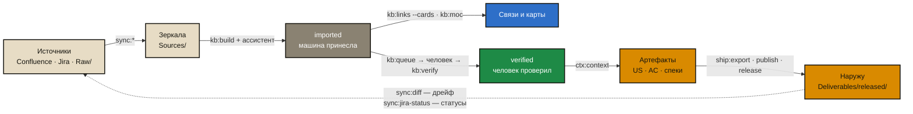

# Aurora Studio

**A git-native working environment for analysts and product owners** — an IDE-like workbench on top of your LLM/editor. Capture interviews, contracts and ТЗ; build a trust-layered knowledge base; generate analytics artifacts (US, AC, specs) from evolving templates; produce requirements traceability; publish to Confluence. Powered by the **Aurora (Аврора)** framework and its `/aurora-vault` agent skill.

Aurora's stance: **git is the source of truth and the team's collaboration layer; Confluence becomes a read-only presentation and feedback surface** (comments at page level, not inline). Everything analysts produce lives here as Obsidian-markdown with trust levels, then syncs to the team via git.

This repository is the **distributable Studio**: deploy it into any new or existing project so the team gets the same folder semantics, card lifecycle, agent rules, generators, lint, and guides.

## What you get

| Piece | Purpose |
|---|---|
| `aurora.py` | **Single entry point**: `new`, `setup`, `update`, plus maintenance (`doctor`, `stats`, `lint`, `fix`, `queue`, `audit`, `hooks`) |
| `scripts/aurora_setup.py` | **Interactive, re-runnable** project setup (Confluence roots, Jira JQL, …) |
| `scripts/install_aurora.py` | Scaffolder: lays out the trust-layer folders and engine |
| `skills/aurora-vault/` | Full skill + procedures (build, verify, garden, spec, trace, repair, queue, …) |
| `scripts/kb_lint.py`, `kb_fix.py`, `aurora_stats.py --queue` | Find / repair / prioritise: linter, deterministic repair (links, homoglyphs, dupes), verification queue by real usage |
| `scripts/sync_audit.py`, `aurora_stats.py`, `aurora_hooks.py` | Mirror integrity, health dashboard & metrics, ratchet pre-commit hook |
| `scripts/kb_trace.py`, `scripts/aurora_doctor.py` | Traceability generator, readiness + fixed-structure check |
| `structure_dirs.txt` | **Fixed folder schema** — identical in every Aurora project; deployed into projects and enforced by `doctor --structure` |
| `templates/`, `scaffold/` | Config/AGENTS templates, US/AC/DR/spec/meeting recipes |
| `skills/*-sync-template/` | Confluence / Jira sync skill scaffolds (config-driven) |
| `docs/readme/` | Документация для людей: обзор, лёгкий старт, регламент, практика, уход за базой, спецификации |
| `cockpit/` | Панель управления: все проекты машины, здоровье баз, запуск команд, справка |

## The cycle

One turn: source → mirror → knowledge → trust → artifact → outward → feedback. Every arrow
is an engine command, not a wish. Diagram (renders on GitHub) — [docs/lifecycle.md](docs/lifecycle.md);
the full path of a single card, step by step, with the condition for each next step —
[docs/card-path.md](docs/card-path.md); visual style for the banner —
[docs/aurora-comix-style.md](docs/aurora-comix-style.md).



## Quick start — deploy Aurora into a project

```bash
# 1. clone Aurora Studio
git clone https://github.com/<org>/aurora-studio.git
cd aurora-studio

# 2. deploy into a new or existing project folder, then answer the setup questions
python3 aurora.py new /path/to/your-project
```

`aurora.py new` scaffolds the trust-layer structure, copies the engine, and launches an
**interactive setup** that asks for everything project-specific:

- project **name / slug** (slug names the sync skills),
- Confluence **base URL, space**, and **root pages to sync** (page IDs),
- Jira **base URL, project key**, and **default JQL** for issue export,
- bootstrap threshold and more.

### Change settings any time — from the project itself

The setup is copied into the project, so anyone can re-run it later to fix or complete
settings (it pre-fills current values; Enter keeps them):

```bash
cd /path/to/your-project
python3 .opencode/scripts/aurora_setup.py
```

Then verify readiness:

```bash
python3 .opencode/scripts/aurora_doctor.py --structure
python3 .opencode/scripts/kb_lint.py --summary
```

### Keep a working base healthy

The engine ships deterministic tools for everything mechanical — an agent must run these
instead of walking thousands of files itself:

```bash
python3 .opencode/scripts/aurora_stats.py        # health dashboard (statuses, risks, metrics)
python3 .opencode/scripts/kb_fix.py --all        # repair links / homoglyph names / legacy frontmatter (dry-run)
python3 .opencode/scripts/aurora_stats.py --queue            # what to verify first, ranked by real usage
python3 .opencode/scripts/sync_audit.py          # mirror integrity: missing / orphan / collision
python3 .opencode/scripts/aurora_hooks.py --install   # pre-commit ratchet: error count may only go down
```

### Fixed folder structure (not per-project)

The folder schema in [`structure_dirs.txt`](structure_dirs.txt) is **identical in every
Aurora project** — top-level trust layers, knowledge sections and artifact types. Projects
do not invent their own artifact types: `create <unknown type>` refuses, and anything
non-standard (drafts, experiments, side materials, images) belongs in `Workspaces/<task>/`.
A genuinely new type is a kit change (PR to `structure_dirs.txt` + the tables in
`SKILL.md` / `conventions.md` + CHANGELOG), so every project gets it at once. Rationale
and roadmap: [docs/roadmap.md](docs/roadmap.md).

### Update the engine in a working project

When Aurora Studio ships a new version, pull just the **engine** into an existing project —
never its knowledge/config. Dry-run first (shows exactly what changes), then apply:

```bash
python3 /path/to/aurora-studio/aurora.py update /path/to/your-project          # preview
python3 /path/to/aurora-studio/aurora.py update /path/to/your-project --apply   # write
git -C /path/to/your-project add -A && git -C /path/to/your-project commit -m "Update Aurora engine"
```

Only files in `engine_manifest.txt` are touched (skill, references, scripts, sync-skill
bodies, AGENTS.md). Config, `AuroraKnowledgeDB/**`, `Raw/`, `Sources/`, `Deliverables/`,
`Artifacts/`, `Workspaces/` are never modified. Your `Templates/`/`Prompts/` are left as-is;
changed kit versions land beside them as `*.new` for you to compare. The project's engine
version is stamped in `AuroraKnowledgeDB/meta/aurora_version.txt`. Version history: [CHANGELOG.md](CHANGELOG.md).

> **Symlinked engines:** if a project symlinks the skill to a shared location (e.g.
> `~/.claude/skills/aurora-vault`), `update` detects it and **warns** that the write hits the
> shared target — updating one project updates every project that shares it. Intentional for a
> single-shared-engine setup; a surprise otherwise.

Full steps: [docs/INSTALL.md](docs/INSTALL.md) · Migration of an existing pile of docs:
`skills/aurora-vault/references/migration.md` · Implementation playbook: [docs/IMPLEMENTATION.md](docs/IMPLEMENTATION.md)

### Документация

Полный набор для людей — [`docs/readme/`](docs/readme/README.md):

| Документ | О чём |
|---|---|
| [Обзор](docs/readme/01-overview.md) | зачем, три принципа, слои доверия, круговорот знаний |
| [Лёгкий старт](docs/readme/02-quickstart.md) | пять правил, три команды, одна привычка |
| [Регламент](docs/readme/03-team-rules.md) | роли, ритуалы, правила решений, чеклист качества |
| [Практика](docs/readme/04-practice.md) | ситуация → команда → результат |
| [Уход за базой](docs/readme/05-gardening.md) | как знания зреют и как их пропалывать |
| [Spec-Driven Development](docs/readme/06-sdd.md) | спека как исполняемый контракт |

Справочник всех команд с модификаторами: [`docs/commands.md`](docs/commands.md) или
`python3 aurora.py list <project>`. То же самое в панели: `python3 aurora.py cockpit`.

## Trust layers (target project)

```
Sources/          # sync mirrors (Confluence, Jira) — agents don't invent here
Raw/              # immutable evidence (contract, laws, meetings, customer)
AuroraKnowledgeDB/      # knowledge cards with status = trust level (incl. Questions/ — open questions to the customer)
Artifacts/        # AI+analyst products (US, AC, acceptance, reports) — not knowledge
Deliverables/     # customer-facing docs (work/ + immutable released/)
Workspaces/       # large-task sandboxes
Templates/ Prompts/
```

Card statuses: `imported → draft → in-review → verified` (or `deprecated`).
Card schema is versioned (`schema_version`); migrations run via `kb:schema`.

## Agent usage

Point Cursor / Claude Code / OpenCode at the **target project** root. Agents read `AGENTS.md` and `.opencode/skills/aurora-vault/SKILL.md`. Commands look like:

```
/aurora-vault build
/aurora-vault verify
/aurora-vault garden
/aurora-vault context <topic>
/aurora-vault ask <question>
```

Commands are grouped into namespaces — `kit:` (engine), `sync:` (mirrors), `kb:`
(knowledge), `ctx:` (context & answers), `make:` (artifacts), `ship:` (outward), `ops:`
(management). Short legacy names keep working: `build` ≡ `kb:build`.

## Control panel

```bash
python3 aurora.py cockpit
```

Local web panel (127.0.0.1, session token, whitelisted commands only): every Aurora
project on the machine, knowledge-base health, command registry with preview-then-apply,
mirrors, install advisor, engine version, docs. Vanilla HTML/CSS/JS, no CDN, no build.

## Requirements

- Python 3.9+ (standard library only — the engine has no runtime dependencies)
- Git
- Optional: `pandoc` — `ship:export` (markdown → docx/pdf)
- Optional: `beautifulsoup4`, `markdownify`, `lxml` — `sync:confluence`
- Optional: `markitdown`, `openpyxl`, `pypdf` — `kb:ingest-office`
- Optional: Atlassian MCP in your editor; the sync scripts use their own token
  (`.env.aurora.local`, see `aurora.env.local.example`)
- Optional: Obsidian (for wiki-link navigation)

Check what's missing on your machine: `python3 aurora.py doctor <project>` or the
Install advisor in the cockpit.

## License

Apache-2.0 (see [LICENSE](LICENSE)) — use freely in commercial and internal projects.

## Contributing

See [docs/CONTRIBUTING.md](docs/CONTRIBUTING.md). Keep the kit **project-agnostic**: no hard-coded client names in skills or install defaults.
