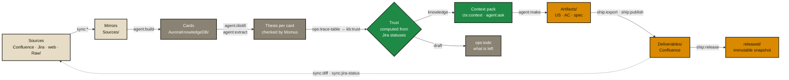

# Aurora Studio

**English** · [Русский](README.ru.md)

**A git-native workbench for system analysts.** Aurora turns the pile of documents a project
accumulates — Confluence pages, Jira issues, contracts, meeting transcripts — into a
*knowledge base of Markdown cards* where every card says how far it can be trusted, and then
uses that base to produce analyst artifacts (user stories, acceptance criteria, specs,
deliverables) without letting the model invent facts.

This repository is the **kit**: the engine, the skills, the templates and the control panel.
You deploy it into a project; the project then carries its own copy of the engine and its own
knowledge.

## What problem it solves

| Without a trust model | With Aurora |
|---|---|
| The assistant treats a draft story and a signed contract alike | Every card carries a trust status and the *reason* for it |
| A model-written draft gets re-read as a fact and nobody finds the error | An artifact is never knowledge; only cards are |
| Old knowledge rots silently | A card's trust follows the status of its Jira issues and drops by itself |
| Mass edits over thousands of files are done by a model — slow, expensive, wrong | Every bulk operation is a deterministic script; the model only judges |
| Why was option B rejected? Nobody remembers | Decision Records are append-only and keep rejected options |

## How it works in one picture


```mermaid
flowchart LR
  SRC["Sources<br>Confluence · Jira · web · Raw/"] -->|"sync:*"| MIR["Mirrors<br>Sources/"]
  MIR -->|"agent:build"| CARD["Cards<br>AuroraKnowledgeDB/"]
  CARD -->|"agent:distill<br>agent:extract"| THESIS["Thesis per card<br>checked by Momus"]
  THESIS -->|"ops:trace-table → kb:trust"| TRUST{"Trust<br>computed from<br>Jira statuses"}
  TRUST -->|"knowledge"| PACK["Context pack<br>ctx:context · agent:ask"]
  TRUST -->|"draft"| TODO["ops:todo<br>what is left"]
  PACK -->|"agent:make"| ART["Artifacts/<br>US · AC · spec"]
  ART -->|"ship:export · ship:publish"| OUT["Deliverables/<br>Confluence"]
  OUT -->|"ship:release"| REL["released/<br>immutable snapshot"]
  OUT -.->|"sync:diff · sync:jira-status"| SRC

  classDef src fill:#E7DCC5,stroke:#16150F,stroke-width:2px,color:#16150F
  classDef kb fill:#8A8272,stroke:#16150F,stroke-width:2px,color:#FFFFFF
  classDef ok fill:#1E8A46,stroke:#16150F,stroke-width:2px,color:#FFFFFF
  classDef out fill:#D98A00,stroke:#16150F,stroke-width:2px,color:#16150F
  class SRC,MIR src
  class CARD,THESIS,TODO kb
  class TRUST,PACK ok
  class ART,OUT,REL out
```

Every arrow is a named engine command, not a wish. The full cycle and the path of a single
card are described in [docs/en/lifecycle.md](docs/en/lifecycle.md).

## Four ideas to remember

1. **Trust is computed, never assigned.** A card is `knowledge` only when every Jira issue
   linked to its source is in a trusted status (or the source is a signed document in `Raw/`).
   An issue goes back to work — the card becomes `draft` on the next `kb:trust`. Nobody
   "approves" cards. → [Knowledge rules](docs/en/knowledge-rules.md)
2. **A card is an entity, not a summary of a document.** Five documents about one subject
   feed one card; a side explanation inside a card is moved out into its own card and left as a
   link. → [Knowledge rules](docs/en/knowledge-rules.md)
3. **Script first, model second.** Mass operations (lint, repair, dedupe, sync, trust, links)
   are Python scripts with a dry-run. The built-in agent writes only through whitelisted
   engine commands, and a second model — **Momus** — checks every claim of its output against
   the source. → [Architecture](docs/en/architecture.md)
4. **The folder layout is fixed.** Every Aurora project has the same folders, so skills,
   prompts, templates and `update` work everywhere. Anything non-standard lives in
   `Workspaces/<task>/`. → [Architecture](docs/en/architecture.md)

## Quick start

Requirements: Python 3.9+ and git. The engine has no runtime dependencies.

```bash
git clone https://github.com/<org>/aurora-studio.git
cd aurora-studio

# deploy into a new or existing project folder; answer the setup questions
python3 aurora.py new /path/to/your-project

# open the control panel (all projects on this machine)
python3 aurora.py cockpit
```

No terminal at hand? Double-click `start-aurora.command` (macOS) or `start-aurora.bat`
(Windows): it checks Python and git, offers to install what is missing and opens the panel.

Then, in the panel, open the project and press **Update the base** (the `update` route): it
syncs the mirrors, builds cards in batches, writes theses, links, computes trust and commits
every lap to git. You can stop it at any time — what is done stays valid.

Step-by-step: [docs/en/readme/02-quickstart.md](docs/en/readme/02-quickstart.md) ·
installation, configuration and updates: [docs/en/INSTALL.md](docs/en/INSTALL.md).

## What is in the kit

| Path | What it is |
|---|---|
| `aurora.py` | The single entry point: `new`, `setup`, `update`, `cockpit` and about thirty maintenance verbs (`doctor`, `lint`, `fix`, `audit`, …) |
| `scripts/` | The engine: 60 stdlib-only Python scripts (`kb_*`, `sync_*`, `agent_*`, `aurora_*`) |
| `skills/` | Agent skills: `aurora-vault` (the framework), `aurora-grill` (planning interview), `aurora-dev` (engine QA) |
| `connectors/` | Pluggable source modules: `confluence-dc`, `jira-dc`, `web` |
| `cockpit/` | The local control panel: web server, UI, section modules, skins |
| `templates/`, `scaffold/` | Config / AGENTS templates, document templates and prompts laid into new projects |
| `reports/analyst/` | The analyst-efficiency dashboard (`ops:report`) |
| `structure_dirs.txt` | The fixed folder schema |
| `engine_manifest.txt` | The whitelist of files `update` is allowed to overwrite in a project |
| `commands.txt` | The command registry — the single source of truth for what commands exist |
| `tests/` | Regression suite, golden corpus, live-base smoke |
| `docs/` | This documentation |

## A project after deployment

```text
your-project/
├── aurora.config.yaml        project settings (committed)
├── .env.aurora.local         your tokens and LLM keys (git-ignored)
├── AGENTS.md                 rules for any agent that opens the folder
├── Sources/                  mirrors of Confluence, Jira, web — written only by sync
├── Raw/                      immutable evidence: contract, laws, meetings, customer, corrections
├── AuroraKnowledgeDB/        the knowledge cards (+ Requirements, Specs, Questions, Decisions, MOC, meta)
├── Artifacts/                what analysts and the agent produce: us, ac, algorithms, reviews, reports…
├── Deliverables/             work/ (drafts) · released/ (frozen) · _archive/
├── Workspaces/               sandboxes for large tasks
├── Templates/ · TemplatesCommon/ · Prompts/ · Settings/
└── .opencode/                the engine copy: scripts, skills, schema, kit_path.txt
```

## Documentation

| For | Read |
|---|---|
| Everyone, first | [Overview](docs/en/readme/01-overview.md) → [Quick start](docs/en/readme/02-quickstart.md) |
| Daily work | [Practice: situation → command](docs/en/readme/04-practice.md) · [Command reference](docs/en/commands.md) |
| The team | [Team rules](docs/en/readme/03-team-rules.md) · [Looking after the base](docs/en/readme/05-gardening.md) |
| Requirements & contractors | [Spec-Driven Development](docs/en/readme/06-sdd.md) |
| How trust and cards work | [Knowledge rules](docs/en/knowledge-rules.md) · [One-page summary](docs/en/knowledge-rules-tldr.md) |
| The cycle | [Lifecycle and the path of a card](docs/en/lifecycle.md) |
| Installing and operating | [Install](docs/en/INSTALL.md) · [Control panel](docs/en/control-panel.md) · [Source modules](docs/en/connectors.md) |
| How it is built | [Architecture](docs/en/architecture.md) · [Design decisions and roadmap](docs/en/roadmap.md) |
| Contributing | [CONTRIBUTING](docs/en/CONTRIBUTING.md) |
| History | [CHANGELOG](CHANGELOG.md) (in Russian) |

Full index with both languages: [docs/README.md](docs/README.md).

## Requirements

- **Required:** Python 3.9+, git.
- **Optional:** `pandoc` (`ship:export` → docx/pdf); `beautifulsoup4`, `markdownify`, `lxml`
  (`sync:confluence`); `markitdown`, `openpyxl`, `pypdf` (`kb:ingest-office`); Obsidian
  (wiki-link navigation); an Atlassian MCP in your editor.
- **Optional engine add-ons**, each in its own venv under `~/.aurora/`, installed and updated
  from the panel (Install → Engine add-ons): **Pydantic AI** — every model call goes through
  it; **graphify** — graph themes, an MCP server over the knowledge graph, HTML/Neo4j exports.
  The core works without both.
- **For the built-in agent:** any OpenAI-compatible LLM gateway (see
  [INSTALL](docs/en/INSTALL.md#the-built-in-agent)). Without it every script still works; only
  `agent:*` commands and semantic search need a model.

Check what is missing: `python3 aurora.py doctor <project>` or the Install section of the panel.

## License

Apache-2.0 — see [LICENSE](LICENSE). Keep the kit project-agnostic: no client names in skills,
templates or defaults ([CONTRIBUTING](docs/en/CONTRIBUTING.md)).
