# Aurora Studio

[English](README.md) · **Русский**

**Рабочее место системного аналитика на git.** Аврора превращает груду документов, которую
накапливает проект — страницы Confluence, задачи Jira, договоры, расшифровки встреч, — в
*базу знаний из markdown-карточек*, где каждая карточка говорит, насколько ей можно верить.
Из этой базы она производит артефакты аналитика (истории, критерии приёмки, спецификации,
поставляемые документы), не давая модели выдумывать факты.

Этот репозиторий — **кит**: движок, навыки, шаблоны и панель управления. Его разворачивают в
проект; проект получает собственную копию движка и собственные знания.

## Какую проблему это решает

| Без модели доверия | С Авророй |
|---|---|
| Ассистент одинаково верит черновику истории и подписанному договору | У каждой карточки есть статус доверия и **причина** этого статуса |
| Написанный моделью черновик перечитывают как факт, и ошибку никто не находит | Артефакт никогда не знание: знанием бывают только карточки |
| Знание тихо протухает | Доверие карточки следует за статусом задач Jira и снижается само |
| Массовые правки тысяч файлов делает модель — долго, дорого, с ошибками | Каждая массовая операция — детерминированный скрипт; модель только судит |
| Почему отказались от варианта Б — никто не помнит | Журнал решений неизменяем и хранит отклонённые варианты |

## Как это устроено — одной картинкой

```mermaid
flowchart LR
  SRC["Источники<br>Confluence · Jira · сайты · Raw/"] -->|"sync:*"| MIR["Зеркала<br>Sources/"]
  MIR -->|"agent:build"| CARD["Карточки<br>AuroraKnowledgeDB/"]
  CARD -->|"agent:distill<br>agent:extract"| THESIS["Тезис в карточке<br>проверен Момусом"]
  THESIS -->|"ops:trace-table → kb:trust"| TRUST{"Доверие<br>считается по<br>статусам Jira"}
  TRUST -->|"knowledge"| PACK["Пакет контекста<br>ctx:context · agent:ask"]
  TRUST -->|"draft"| TODO["ops:todo<br>что осталось"]
  PACK -->|"agent:make"| ART["Artifacts/<br>US · AC · спеки"]
  ART -->|"ship:export · ship:publish"| OUT["Deliverables/<br>Confluence"]
  OUT -->|"ship:release"| REL["released/<br>неизменяемый снимок"]
  OUT -.->|"sync:diff · sync:jira-status"| SRC

  classDef src fill:#E7DCC5,stroke:#16150F,stroke-width:2px,color:#16150F
  classDef kb fill:#8A8272,stroke:#16150F,stroke-width:2px,color:#FFFFFF
  classDef ok fill:#1E8A46,stroke:#16150F,stroke-width:2px,color:#FFFFFF
  classDef out fill:#D98A00,stroke:#16150F,stroke-width:2px,color:#16150F
  class SRC,MIR src
  class CARD,THESIS,TODO kb
  class TRUST,PACK ok
  class ART,OUT,REL out
```



Каждая стрелка — именованная команда движка, а не пожелание. Полный цикл и путь одной
карточки — в [docs/lifecycle.md](docs/lifecycle.md).

## Четыре идеи, которые стоит запомнить

1. **Доверие вычисляется, а не присваивается.** Карточка — `knowledge`, только если все
   задачи Jira, связанные с её источником, в доверенных статусах (или источник — подписанный
   документ из `Raw/`). Задача вернулась в работу — на ближайшем `kb:trust` карточка стала
   `draft`. «Принять» карточку нельзя. → [Правила базы знаний](docs/knowledge-rules.md)
2. **Карточка — сущность, а не пересказ документа.** Пять документов об одном предмете
   питают одну карточку; чужое определение, объяснённое попутно, выносится в свою карточку, а
   на его месте остаётся ссылка. → [Правила базы знаний](docs/knowledge-rules.md)
3. **Сначала скрипт, потом модель.** Массовые операции (линтер, ремонт, дубли, синк, доверие,
   связи) — Python-скрипты с предпросмотром. Встроенный агент пишет только через команды
   движка из белого списка, а вторая модель — **Момус** — сверяет с источником каждое
   утверждение его ответа. → [Архитектура](docs/architecture.md)
4. **Структура папок фиксирована.** Во всех проектах Авроры одни и те же папки, поэтому
   навыки, промпты, шаблоны и `update` работают везде. Всё нестандартное живёт в
   `Workspaces/<задача>/`. → [Архитектура](docs/architecture.md)

## Быстрый старт

Нужны: Python 3.9+ и git. У движка нет зависимостей времени выполнения.

```bash
git clone https://github.com/<org>/aurora-studio.git
cd aurora-studio

# развернуть в новую или существующую папку проекта и ответить на вопросы настройки
python3 aurora.py new /path/to/your-project

# открыть панель управления (все проекты на машине)
python3 aurora.py cockpit
```

Терминала под рукой нет? Дважды щёлкните `start-aurora.command` (macOS) или
`start-aurora.bat` (Windows): файл проверит Python и git, предложит поставить недостающее и
откроет панель.

Дальше в панели откройте проект и нажмите **«Обновить базу»** (маршрут `update`): он заберёт
зеркала, разберёт источники партиями, напишет тезисы, расставит связи, посчитает доверие и
зафиксирует каждый оборот в git. Остановить можно в любой момент — сделанное остаётся годным.

По шагам — [docs/readme/02-quickstart.md](docs/readme/02-quickstart.md); установка,
настройка и обновление — [docs/INSTALL.md](docs/INSTALL.md).

## Что лежит в ките

| Путь | Что это |
|---|---|
| `aurora.py` | Единая точка входа: `new`, `setup`, `update`, `cockpit` и около тридцати команд обслуживания (`doctor`, `lint`, `fix`, `audit`, …) |
| `scripts/` | Движок: 60 скриптов на стандартной библиотеке (`kb_*`, `sync_*`, `agent_*`, `aurora_*`) |
| `skills/` | Навыки агента: `aurora-vault` (фреймворк), `aurora-grill` (интервью для планирования), `aurora-dev` (QA движка) |
| `connectors/` | Подключаемые модули источников: `confluence-dc`, `jira-dc`, `web` |
| `cockpit/` | Локальная панель управления: сервер, интерфейс, разделы-модули, скины |
| `templates/`, `scaffold/` | Шаблоны конфига и AGENTS, шаблоны документов и промпты, которые кладутся в новый проект |
| `reports/analyst/` | Дашборд эффективности аналитиков (`ops:report`) |
| `structure_dirs.txt` | Фиксированная схема папок |
| `engine_manifest.txt` | Белый список файлов, которые `update` вправе перезаписать в проекте |
| `commands.txt` | Реестр команд — единственный источник правды о том, какие команды есть |
| `tests/` | Регрессионные тесты, золотой корпус, проверка живой базы |
| `docs/` | Эта документация |

## Проект после развёртывания

```text
your-project/
├── aurora.config.yaml        настройки проекта (в git)
├── .env.aurora.local         ваши токены и ключи LLM (вне git)
├── AGENTS.md                 правила для любого агента, открывшего папку
├── Sources/                  зеркала Confluence, Jira, сайтов — пишет только синк
├── Raw/                      неизменяемые первоисточники: contract, laws, meetings, customer, corrections
├── AuroraKnowledgeDB/        карточки знаний (+ Requirements, Specs, Questions, Decisions, MOC, meta)
├── Artifacts/                продукты аналитика и агента: us, ac, algorithms, reviews, reports…
├── Deliverables/             work/ (черновики) · released/ (заморожено) · _archive/
├── Workspaces/               песочницы больших задач
├── Templates/ · TemplatesCommon/ · Prompts/ · Settings/
└── .opencode/                копия движка: скрипты, навыки, схема, kit_path.txt
```

## Документация

Короткие ответы, по вопросу на страницу, — в **[wiki](wiki/ru/README.md)** ([English](wiki/README.md)): её можно
читать прямо здесь, на GitHub. Полные документы:

| Кому | Что читать |
|---|---|
| Всем, сначала | [Обзор](docs/readme/01-overview.md) → [Лёгкий старт](docs/readme/02-quickstart.md) |
| Ежедневная работа | [Практика: ситуация → команда](docs/readme/04-practice.md) · [Справочник команд](docs/commands.md) |
| Команде | [Регламент](docs/readme/03-team-rules.md) · [Уход за базой](docs/readme/05-gardening.md) |
| Требования и подрядчики | [Spec-Driven Development](docs/readme/06-sdd.md) |
| Как работают доверие и карточки | [Правила базы знаний](docs/knowledge-rules.md) · [На одну страницу](docs/knowledge-rules-tldr.md) |
| Цикл | [Цикл и путь карточки](docs/lifecycle.md) |
| Установка и эксплуатация | [Установка](docs/INSTALL.md) · [Панель управления](docs/control-panel-ui-requirements.md) · [Модули источников](docs/connectors.md) |
| Как это устроено | [Архитектура](docs/architecture.md) · [Решения и дорожная карта](docs/roadmap.md) |
| Участие в разработке | [CONTRIBUTING](docs/CONTRIBUTING.md) |
| История и выпуски | [CHANGELOG](CHANGELOG.md) · [как выпускают версии](docs/CONTRIBUTING.md#версии-и-выпуски) |

Полный указатель на двух языках: [docs/README.md](docs/README.md).

## Требования

- **Обязательно:** Python 3.9+, git.
- **По желанию:** `pandoc` (`ship:export` → docx/pdf); `beautifulsoup4`, `markdownify`, `lxml`
  (`sync:confluence`); `markitdown`, `openpyxl`, `pypdf` (`kb:ingest-office`); Obsidian
  (навигация по вики-ссылкам); Atlassian MCP в редакторе.
- **Надстройки движка по желанию** — каждая в своём venv под `~/.aurora/`, ставятся и
  обновляются из панели («Установка» → «Надстройки движка»): **Pydantic AI** — через него идёт
  каждый вызов модели; **graphify** — темы графа, MCP-сервер по графу знаний, выгрузки в
  HTML/Neo4j. Ядро работает и без них.
- **Для встроенного агента:** любой OpenAI-совместимый шлюз LLM (см.
  [INSTALL](docs/INSTALL.md#встроенный-агент)). Без него работают все скрипты; модель нужна
  только командам `agent:*` и семантическому поиску.

Что не хватает на машине: `python3 aurora.py doctor <проект>` или раздел «Установка» в панели.

## Лицензия

Apache-2.0 — см. [LICENSE](LICENSE). Кит остаётся независимым от проектов: ни имён клиентов в
навыках, шаблонах и значениях по умолчанию ([CONTRIBUTING](docs/CONTRIBUTING.md)).
