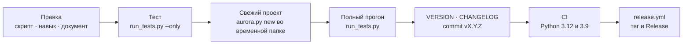

# Участие в разработке

Как вносить изменения в кит: что можно, чего нельзя, как устроен цикл разработки, как добавлять
команды, модули источников, разделы панели и скины и как выпускать версии. English version:
[en/CONTRIBUTING.md](en/CONTRIBUTING.md).

## Главное правило

**Кит — независимый установщик и движок, а не база знаний клиента.** Он уезжает в открытый git,
поэтому:

- в навыках, шаблонах, значениях по умолчанию и документации нет имён клиентов, адресов контуров,
  ключей пространств и проектов;
- примеры и числа в документах — обезличенные; живые данные и приватные имена остаются в `local/` и
  `Development/` (оба закрыты `.gitignore`);
- хук `commit-msg`, который ставит `kit:hooks` в самом ките, сверяет сообщение коммита со списком
  `local/private_terms.txt` и не даёт внутренним названиям попасть в историю. Его не обходят —
  `--no-verify` для этого не годится.

## Что приветствуется

- улучшения процедур `skills/aurora-vault/` и ясности схемы карточки;
- укрепление установщика, обновления и линтера;
- новые общие шаблоны и промпты (`scaffold/`);
- модули источников, разделы панели, скины, переводы интерфейса;
- уроки миграции, записанные обезличенно, — в документацию.

## Чего не делают

- не коммитят материалы клиентов, выгрузки Jira и закрытые страницы Confluence;
- не зашивают в умолчания пространство или проект одной компании;
- не ломают безопасность установщика («существующие файлы не перезаписываются») без пути `--force`;
- не добавляют зависимости времени выполнения: движок работает на стандартной библиотеке;
- не заводят в проекте свои типы артефактов и папки верхнего уровня — это изменение кита целиком
  ([решения](roadmap.md#почему-структура-папок-фиксирована)).

## Обратная связь и доска задач

Баги и идеи принимаются через issues: **New issue** → «Баг» или «Предложение» (формы лежат в
`.github/ISSUE_TEMPLATE/`, пустые issues отключены). Формы просят версию кита, ОС, шаги воспроизведения и
напоминают не публиковать данные клиентов — то же правило, что и для коммитов.

В обеих формах обязательны операционная система (Windows, macOS, Linux) и версия кита: пять последних
версий из `CHANGELOG.md` и пункт `old` для всех, что старше. GitHub не умеет подтягивать варианты списка сам,
поэтому после изменения `CHANGELOG.md` в `master` список переписывает workflow `issue-form-versions`
(скрипт — `.github/scripts/issue_form_versions.py`). Строки между `# versions:begin` и `# versions:end`
в формах руками не правят.

Из панели форма открывается уже заполненной: кнопка **🐞 Баг** в шапке любой страницы и
«Сообщить об ошибке» / «Предложить улучшение» в разделе «О проекте». Панель подставляет версию кита
и панели, ОС, Python и раздел, откуда нажали; имён проектов и путей в форме нет. Форк кита ведёт в
свой репозиторий — по адресу `origin` или `AURORA_KIT_REPO`. Версию старше пяти в списке форма не выберет —
останется отметить `old`.

Все issues собираются на канбан-доске проекта (GitHub Projects), поле **Status**:

| Колонка | Что значит |
|---|---|
| New | пришло, ещё не разобрано |
| Needs details | у автора запросили воспроизведение или контекст |
| Accepted | подтверждено и будет сделано; порядок внутри колонки — очередь |
| In progress | есть ветка или pull request |
| Done | исправлено и выпущено либо закрыто с причиной (`not planned`, `duplicate`) |

Дубль закрывают со ссылкой на исходный issue, отклонённую идею — с объяснением причины: автору важнее
понять «почему нет», чем увидеть молчание.

## Цикл разработки



```bash
# локальная проверка на свежем проекте
python3 aurora.py new /tmp/aurora-demo --non-interactive
cd /tmp/aurora-demo
python3 .aurora/scripts/aurora_doctor.py --structure
python3 .aurora/scripts/kb_lint.py --summary

# тесты кита (из корня кита)
python3 tests/run_tests.py --smoke          # инварианты по исходникам, быстро
python3 tests/run_tests.py --only <часть имени>   # одна проверка
python3 tests/run_tests.py                  # всё: сотни проверок на синтетических проектах
python3 scripts/kit_commands.py --check     # реестр против движка
python3 scripts/kit_i18n.py --check         # полнота переводов панели
```

### Три уровня проверок

| Уровень | Чем | Что ловит |
|---|---|---|
| Фикстуры | `python3 tests/run_tests.py` | «скрипт делает то, что задумано»: каждый тест строит проект с нуля во временной папке |
| Золотой корпус | тот же прогон, данные `tests/corpus/` | «движок видит реальные формы так же, как вчера»: гомоглифы, двойники, легаси-шапки, ПДн рядом с реквизитами, NFD-имена, артефакты в знаниях; числа зафиксированы в `EXPECTED.json` |
| Живая база | `python3 tests/smoke_live.py <проект>` | «на этом проекте ничего не поехало»: снимок чисел и имён в `meta/smoke_snapshot.json` самого проекта (`--update` после осознанной правки) |

Корпус пересобирается `python3 tests/make_corpus.py` и лежит в git. Нашли новую патологию в бою —
допишите её в корпус, иначе она вернётся. Ошибка, найденная руками, закрывается проверкой, которая
падает **без** вашей правки; причину сначала устанавливают, а не угадывают по симптому.

CI (`.github/workflows/test.yml`): `--smoke` и полный прогон на Python 3.12, а также компиляция и
`--smoke` на Python 3.9 — минимальной поддерживаемой. Не пишите синтаксис, понятный только новым версиям
(например, кавычки того же вида внутри f-строки).

## Правила кода движка

- **Стандартная библиотека.** Опциональные пакеты (`bs4`, `markdownify`, `pypdf`…) подключаются
  лениво и с понятным отказом, если их нет.
- **Скрипт, который пишет, по умолчанию делает предпросмотр**, а запись включает `--apply`. Массовая
  запись идёт через git-guard и отказывает по грязному дереву (`--allow-dirty` — осознанно).
- **Общие примитивы — в `aurora_common.py`:** разбор имени карточки (`card_stem`), шкала статусов,
  чтение конфига, время в UTC. Своя копия `os.path.splitext` в скрипте — повод для ошибки.
- **Имена файлов** проходят правила Windows, macOS и Linux ([правила базы, раздел 11](knowledge-rules.md)).
- **Агент пишет только командами из белого списка** (`ALLOWED_WRITES` в `agent_core.py`); новая
  запись модели — новая команда с предпросмотром, а не прямая правка файла.
- **Модель не принимает решения о доверии и не отвечает без опоры.** Утверждение без опоры не
  переносится в артефакт.
- **Имя команды — одно на панель, реестр и отчёты.** В отчётах человеку называют `kb:dedupe`, а не
  путь к скрипту.

## Как добавить команду

1. Скрипт в `scripts/`; в docstring строка `Панель: \`<набор>:<команда>\`` — тест сверяет её с реестром.
2. Строка в `commands.txt`: `набор | команда | алиасы | исполнитель | реализация | с версии | описание`.
   Исполнитель — `скрипт`, `модель` или `скрипт+модель`.
3. Файл в `engine_manifest.txt` (`scripts/x.py => .aurora/scripts/x.py`), иначе он не доедет до
   проектов.
4. Строка в таблице `skills/aurora-vault/SKILL.md` и, если это процедура, в `references/`.
5. Перегенерировать справочник: `python3 scripts/kit_commands.py --md docs/commands.md` (вручную файл
   не правят). Английское описание команды и пояснения её новых флагов — в
   `cockpit/i18n/data/en.json` (разделы `commands`, `flags`); затем
   `python3 scripts/kit_commands.py --en-md docs/en/commands.md`. Без перевода `kit_i18n.py --check`
   красный.
6. Тест; запись в CHANGELOG.

Команда, которой нужна кнопка в маршруте, добавляется строкой в `cockpit/scenarios.txt`; пояснение шага
переводится в `cockpit/i18n/data/en.json` (раздел `scenarios`, ключ — русский текст).

## Как добавить модуль источника, раздел панели, скин

| Что | Где | Контракт |
|---|---|---|
| Модуль источника | папка `connectors/<id>/` с `connector.json`, `SKILL.md` и скриптом | [connectors.md](connectors.md) |
| Раздел панели | папка `cockpit/modules/<id>/` | [cockpit/modules/README.md](../cockpit/modules/README.md): манифест, `mount`/`refresh`, строки через `t()`, ключи с префиксом раздела |
| Скин | файл `cockpit/skins/<имя>.css` | [cockpit/skins/README.md](../cockpit/skins/README.md): только токены, оба состояния темы |
| Язык интерфейса | `cockpit/i18n/<код>.json`, `modules/*/i18n/<код>.json` и `cockpit/i18n/data/<код>.json` | `python3 scripts/kit_i18n.py --new <код> "<название>"`, затем `--check`; в `data/` — перевод того, что отдаёт сервер: команды, флаги, маршруты, скины, коннекторы, сообщения об ошибках |
| Тип артефакта или папка схемы | `structure_dirs.txt` + таблицы в `SKILL.md` и `templates/meta/conventions.md` + CHANGELOG | изменение кита: приезжает во все проекты одним `update` |

Сторонние библиотеки панели (`cockpit/vendor/`) не правятся — только заменяются целиком (см.
`cockpit/vendor/README.md`).

## Версии и выпуски

- Версия — semver в файле `VERSION`; её же читает панель и записывает `update` в
  `AuroraKnowledgeDB/meta/aurora_version.txt` проекта.
- Каждый выпуск — запись в `CHANGELOG.md` (русский текст): `## X.Y.Z — суть выпуска`, ниже что и почему
  изменилось. Ломающее изменение схемы помечается **BREAKING** с шагом миграции.
- Сообщение коммита начинается с версии: `vX.Y.Z: суть`.
- **Как выпустить, коротко:** 1) поднять `VERSION`; 2) добавить в `CHANGELOG.md` запись `## X.Y.Z — суть`;
  3) если менялась версия панели — поднять `UI_VERSION` в `cockpit/ui/panel.js` (тест сверяет); 4) влить в
  `master`. Дальше выпуск делает CI (см. ниже).
- **Тег и GitHub Release создаёт CI** — `.github/workflows/release.yml`. После зелёного `engine-tests` на
  `master` он смотрит в `VERSION`: если Release этой версии ещё нет, ставит тег `vX.Y.Z` на коммит, который
  поднял `VERSION` (как и прежние теги), и публикует Release. Заголовок `vX.Y.Z — суть` и текст берутся из
  записи этой версии в `CHANGELOG.md`; записи нет — выпуск не создаётся, workflow падает с понятной ошибкой.
  Руками тег ставить не нужно; если поставили, Release всё равно ляжет на него. Готовый тег и Release
  workflow не перезаписывает, поэтому повторный запуск безопасен. Повторить выпуск вручную — Actions →
  release → Run workflow на `master`; отключить — удалить файл или выключить workflow во вкладке Actions.
- Перед выпуском зелёные: `tests/run_tests.py`, `kit_commands.py --check`, `kit_i18n.py --check`.
- Папка `Development/` (QA-кухня: кейсы, сценарии, журналы прогонов) в git кита не едет; она
  смонтирована как worktree ветки `development`: `git worktree add Development development`.

## Документация

Документация двуязычная: русская лежит в `docs/` (так её открывает панель), английская — зеркалом в
`docs/en/`; корень репозитория — `README.md` (English) и `README.ru.md`. Правила:

- **Правите русский документ — правьте английский.** Структура файлов и заголовков совпадает.
- Справочник команд `docs/commands.md` **генерируется**; детальные процедуры для ассистента живут в
  `skills/aurora-vault/references/` и в человеческие документы не копируются — на них ссылаются.
- `docs/knowledge-rules.md`, `knowledge-rules-tldr.md` и `накопление-знания.md` едут в проекты вместе
  с движком (`engine_manifest.txt`) и закреплены тестами: меняя их, прогоните тесты.
- **Wiki** — страницы-ответы в `wiki/` (английские) и `wiki/ru/` (русские), набор один и тот же; новая страница —
  это пара файлов и ссылка из `README.md` и `_Sidebar.md`. `python3 scripts/wiki_build.py --check` проверяет ссылки,
  якоря, пары и достижимость, тесты делают то же; во вкладку Wiki страницы выкладывает workflow `wiki-sync` — источник
  истины остаётся в репозитории. Меняете поведение — поправьте и страницу в том же pull request.
- Диаграммы — mermaid, чтобы они рендерились на GitHub и правились текстом. Двоеточия внутри
  подписей состояний и узлов без кавычек ломают разбор — берите подпись в кавычки или без двоеточия.
- Числа и версии в документах либо вычисляются (`commands.md`), либо датируются; «сорок команд»
  устаревает быстрее, чем кажется.
- Пути, на которые ссылается код (`docs/readme/*.md`, `docs/commands.md`, `docs/roadmap.md`,
  `docs/control-panel-ui-requirements.md`, `docs/INSTALL.md`, `docs/knowledge-rules*.md`), не
  переименовывают без правки панели и тестов.
