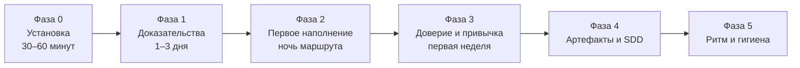

# Внедрение Авроры в проекте

План для лида, системного и бизнес-аналитика, которые вводят фреймворк в команду: фазы, настройка
ассистента, перенос накопленной базы, критерии успеха и антипаттерны. English version:
[en/IMPLEMENTATION.md](en/IMPLEMENTATION.md).

## Зачем

Агент на LLM галлюцинирует, когда весь markdown выглядит одинаково. Аврора разделяет:

1. **Доказательства** (`Raw/`, `Sources/`) — неизменяемые или принадлежащие синку;
2. **Знания** (карточки `AuroraKnowledgeDB/`) — фильтр доверия для промптов; статус считает движок по
   статусам задач и происхождению источника;
3. **Продукты** (`Artifacts/`, `Deliverables/`) — произведённая работа; обратно в промпты как
   «истина» не подаётся.

Инварианты, которые не нарушают никогда, — в `.aurora/skills/aurora-vault/SKILL.md` проекта и в
[правилах базы знаний](knowledge-rules.md).

## Фазы внедрения

### Фаза 0 — установка (30–60 минут)

[INSTALL.md](INSTALL.md): `aurora.py new`, токены, `kit:doctor`, `kit:hooks`. Закоммитьте каркас. Домен
в карточки руками **не вносите**: базу собирает движок.

### Фаза 1 — сначала доказательства (1–3 дня)

Кладите только настоящие материалы:

| Материал | Куда |
|---|---|
| Контракт, ТЗ, допсоглашения | `Raw/contract/` |
| Законы, регламенты | `Raw/laws/` |
| Расшифровки и протоколы встреч | `Raw/meetings/` |
| Материалы заказчика: AS-IS, презентации | `Raw/customer/` |
| Живые заметки проекта, концепты | `Raw/project/` |
| Зеркала Confluence и Jira, страницы сайтов | через sync → `Sources/` |

Укажите в конфиге корни Confluence, JQL, статусы доверия Jira (`trust_statuses` /
`assumption_statuses`), справочные ветки вики и доверенные разделы — от них зависит доля `knowledge`.

### Фаза 2 — первое наполнение

В панели — маршрут «Обновить базу» (сначала «Посмотреть»). На большом проекте это часы: запустите на
ночь, остановить можно в любой момент. Затем `ops:stats` и «Здоровье». Добавьте пять-десять
**golden questions** в `AuroraKnowledgeDB/meta/golden_questions.md`, когда появятся подтверждённые
факты: по ним `ctx:eval` ловит регрессии после синков и миграций.

### Фаза 3 — доверие и привычка (первая неделя)

Доверие считается само, а человеку остаются три вещи: писать то, чего нет в источниках (DR, вопросы,
исправления), разбирать `ops:todo` и нажимать «Обновить» и «Починить». Если доля `knowledge`
низкая, это не авария: либо задачи в работе, либо трассировка не нашла связей. Проверьте
`trust_statuses`, номера историй в заголовках страниц, ключи задач в тексте.

### Фаза 4 — артефакты и SDD

- Истории — `Artifacts/us/`, критерии — `Artifacts/ac/` (`agent:make`, виды объявлены в `artifacts:`
  конфига: шаблон, папка, правила);
- спеки — `AuroraKnowledgeDB/Specs/` (`make:spec`), затем `make:spec-pack` для подрядчика;
- трассировка: ТЗ → REQ → SPEC → Jira → AC → ПМИ → приёмка (`ops:trace`) — [SDD](readme/06-sdd.md).

### Фаза 5 — ритм и гигиена

Еженедельно: «Починить базу», `ops:todo`, `kb:garden`. Раз в месяц: `ops:stats --append-metrics`,
`ops:search-quality`. После крупных синков: `ctx:eval` по golden questions. Раз в релиз: `kb:schema`,
`tests/smoke_live.py <проект>`.

## Настройка ассистента

1. Откройте **проект** (не кит) корнем рабочей области IDE.
2. Убедитесь, что `AGENTS.md` подхвачен как инструкция проекта.
3. Навыки лежат в `.aurora/skills/`; `kit:skills --apply` кладёт их в общий каталог агента
   (`~/.claude/skills`) — тогда `/aurora-vault` находится в любом диалоге.
4. По желанию подключите Atlassian MCP для sync-навыков и **базу знаний как MCP** (`kit:mcp`:
   готовая строка для Claude Code, Cursor, OpenCode; сервер только читает).

| Инструмент | Что настроить |
|---|---|
| Cursor | открыть корень проекта: `AGENTS.md` и навыки `.claude/skills/` он читает сам |
| Claude Code, OpenCode | навыки кита ставит `kit:skills` в `~/.claude/skills/`; навыки проекта — `.claude/skills/`; команды `/aurora-vault <команда>` |
| Любой | `kit:mcp` → запись `mcpServers` с именем `aurora-<slug>` |

## Перенос накопленной базы

Подробно — `skills/aurora-vault/references/migration.md`. Коротко:

1. Разверните Аврору **без** `--force`.
2. Разложите старое:

| Было | Стало |
|---|---|
| `Laws/`, `docs/legal/` | `Raw/laws/` |
| `Transcripts/`, `meetings/` | `Raw/meetings/` |
| корневой `JIRA/` | `Sources/JIRA/` (через `sync:jira` или `kit:remap-sources`) |
| плоский `AuroraKnowledgeDB/ZK-*.md` | разделы `AuroraKnowledgeDB/…` + апгрейд шапок (`kb:repair`, `kb:schema`) |
| рабочие BPMN и черновики | `Workspaces/<задача>/` |
| принятые решения | `Decisions/DR-NNNN-…` со `status: accepted` |

3. Статусы не переносите: `fact`, `confirmed`, `verified` в новой модели ничего не значат — доверие
   посчитает `kb:trust` по задачам и источникам. Старые `verified` и `imported` движок читает и
   переводит на новую шкалу за один прогон.
4. Прежние идентификаторы оставьте в `aliases:`, чтобы вики-ссылки продолжали работать.
5. Пересоберите `manifest.json` обычным разбором («Обновить базу»).
6. Прогоните «Починить базу».

## Критерии успеха

- [ ] `kb:lint`: ошибок 0;
- [ ] `AGENTS.md` соответствует реальному дереву папок;
- [ ] `kit:doctor --structure` без блокеров;
- [ ] доля `knowledge` растёт вместе с движением задач, а не из-за правки шапок;
- [ ] golden questions проходят `ctx:eval`;
- [ ] артефакты, произведённые по пакетам контекста, называют карточки в `based_on`;
- [ ] `ops:todo` разбирается раз в неделю и не растёт.

## Антипаттерны

- Поднимать долю `knowledge` правкой шапок: доверие считается, а не присваивается.
- Править карточки руками — следующая сборка сотрёт правку; неверное исправляют через `kb:correct`.
- Класть произведённые ИИ черновики в `AuroraKnowledgeDB/`.
- Редактировать `Deliverables/released/` или `Raw/contract/`.
- Скармливать `Artifacts/` обратно в промпты как истину.
- Удалять карточки вместо `kb:supersede`.
- Писать мимо `Sources/` в зеркала или хранить там чужое.
- Заводить свои папки верхнего уровня: нестандартному место в `Workspaces/`.
- Коммитить `.env.aurora.local`.
