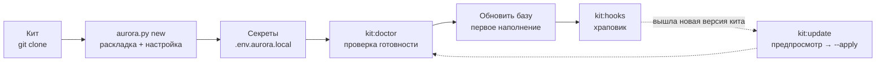

# Установка, настройка и обновление

Как развернуть Аврору в проекте, что при этом появляется, как устроены настройки и секреты,
как подключить модели и как обновлять движок. English version: [en/INSTALL.md](en/INSTALL.md).



## Требования

- Python 3.9+ и git; запись в папку проекта; кит, клонированный локально
  (`git clone https://github.com/<org>/aurora-studio.git`).
- Движок работает на стандартной библиотеке. Остальное нужно только отдельным командам:

| Что | Для чего | Как поставить |
|---|---|---|
| `pandoc` | `ship:export` (markdown → docx/pdf) | пакетный менеджер системы |
| `beautifulsoup4`, `markdownify`, `lxml` | `sync:confluence` | `pip install` или «Установка» в панели |
| `markitdown`, `openpyxl`, `pypdf` | `kb:ingest-office` | `pip install` или «Установка» |
| Pydantic AI | каждый вызов модели идёт через него | «Установка» → «Надстройки движка» (venv в `~/.aurora/`) |
| graphify | темы графа, MCP-сервер по графу, выгрузки HTML/Neo4j | то же |
| Obsidian | навигация по вики-ссылкам | по желанию: формат совместим |

Что не хватает на машине и в проекте: `python3 aurora.py doctor <проект>` или раздел «Установка»
в панели — он называет, какие команды без этого не работают.

## 1. Развернуть проект

Из корня кита:

```bash
python3 aurora.py new /absolute/path/to/your-project
```

На Windows вместо `python3` пишут `py -3` (или `python`): Python с python.org и из winget не
ставит команду `python3`, а та, что лежит в WindowsApps, — заглушка магазина. Пусковой файл
`start-aurora.bat` и хуки git выбирают интерпретатор сами.

Команда делает четыре шага:

1. **Раскладка** (`install_aurora.py`): папки по `structure_dirs.txt`, копия движка в `.opencode/`,
   `aurora.config.yaml`, образец секретов, `AGENTS.md`, служебные файлы `AuroraKnowledgeDB/meta/`,
   шаблоны и промпты, sync-навыки, правила `.gitignore`.
2. **Настройка** (`aurora_setup.py`): интерактивные вопросы — имя и slug проекта (slug попадает в
   имена sync-навыков), Confluence (адрес, пространство, корневые страницы по `page_id` из адреса
   `…pageId=NNN`), Jira (адрес, ключ проекта, JQL по умолчанию), статусы доверия, список
   веб-страниц, порог bootstrap.
3. **Приведение движка к настройкам** (`aurora_update.py --apply`): `AGENTS.md` и тела sync-навыков
   подставляются из конфига, версия движка записывается в `AuroraKnowledgeDB/meta/aurora_version.txt`.
4. **Навыки** (`install_skills.py`): `aurora-vault`, `aurora-grill`, `aurora-dev` копируются в общий
   каталог агента (`~/.claude/skills`), чтобы `/aurora-vault` находился в любом диалоге.

Если терминала нет (запуск из панели, скрипта, CI), вопросы не задаются: берутся значения по
умолчанию, а конфиг заполняют позже — `python3 aurora.py setup <проект>`. По умолчанию установка
**не перезаписывает** существующие файлы; повторный запуск безопасен.

То же делает панель: «Настройка кита» → «Подключить новый проект».

### Без вопросов (скрипты, CI)

```bash
python3 scripts/install_aurora.py \
  --target /absolute/path/to/your-project \
  --name "Project Display Name" --jira-key PROJ --confluence-space SPACE
```

| Флаг | Значение |
|---|---|
| `--target` | корень проекта (создаётся, если нет) |
| `--name` | человеческое имя → `AGENTS.md`, отчёты, slug sync-навыков |
| `--slug` | короткий идентификатор (по умолчанию из имени) |
| `--jira-key` | ключ проекта Jira |
| `--confluence-space` | ключ пространства Confluence |
| `--dry-run` | только показать действия |
| `--force` | перезаписать существующие файлы (опасно) |

### Менять настройки можно в любой момент

Настройка копируется в проект, и любой может её перезапустить — текущие значения подставляются, Enter
оставляет как есть:

```bash
cd /path/to/your-project
python3 .opencode/scripts/aurora_setup.py
```

В панели: «Настройки проекта». Форма там спрашивает то же и пишет тем же скриптом; ниже — весь
конфиг текстом для того, чего в форме нет.

## 2. Что появляется в проекте

```text
AGENTS.md                     правила для любого агента, открывшего папку
aurora.config.yaml            настройки проекта (в git)
aurora.env.local.example      образец → .env.aurora.local (вне git)
.gitignore                    правила движка дописываются построчно, чужие строки не трогаются
.cursor/rules/atlassian.mdc   ссылка на aurora.config.yaml для Cursor
.opencode/
  scripts/                    движок (копия из кита)
  skills/aurora-vault/        навык и справочники процедур
  skills/aurora-grill/        навык интервью для планирования
  skills/confluence-sync-<Slug>/ · jira-export-<Slug>/   sync-навыки проекта
  connectors/                 манифесты подключённых модулей источников
  docs/                       правила базы знаний (едут с движком)
  reports/analyst/            дашборд эффективности аналитиков
  vendor/                     библиотека графа без сети
  structure_dirs.txt · commands.txt · moc_groups.txt · kit_path.txt
  update_ignore.txt           по желанию: пути, которые проект ведёт сам (glob)
Sources/                      зеркала подключённых модулей: Confluence, JIRA, Web
Raw/{laws,contract,customer,project,meetings,examples,corrections}/
AuroraKnowledgeDB/            Concepts, Processes, Glossary, Systems, Roles, Statuses, Reference,
                              Requirements, Specs, Questions, Decisions, MOC, _archive, _assets,
                              _inbox, meta
Artifacts/{us,ac,algorithms,dictionaries,screens,contracts,mappings,role-model,diagrams,
           acceptance,tests,reviews,reports,drafts,meetings}/
Deliverables/{work,work/spec-packs,released,_archive}/
Workspaces/_archive/
Templates/ · TemplatesCommon/ · Prompts/ · Settings/
start-aurora.command · start-aurora.bat      пусковые файлы
```

Список папок **фиксирован движком** (`structure_dirs.txt`) и одинаков во всех проектах Авроры;
нестандартное лежит в `Workspaces/<задача>/`. Папка, нужная только этому проекту (наследие прежней
базы, вложения), объявляется в `aurora.config.yaml` → `paths.extra_structure_dirs`: `doctor`
принимает её там и нигде больше. `Deliverables/_archive/` — хранение пакетов поставок и снятых с
работы версий: это не рабочая версия и не сданная.

## 3. Настройки: `aurora.config.yaml`

Файл в git; **секреты сюда не кладут**. Адреса, пространства, ключи и JQL живут только здесь —
скиллы и скрипты читают их отсюда, а не из своих тел.

| Секция | Что настраивает |
|---|---|
| `project` | `name`, `slug` |
| `skills` | какие навыки обязательны и рекомендованы |
| `sources` | подключённые модули источников: `id` (имя папки в `Sources/`), `module`, `path`. Секции нет — работают встроенные Confluence и Jira |
| `atlassian.confluence` | `base_url`, `space`, `sync_roots` (список корней: `page_id`, `title`, `trusted`) |
| `atlassian.jira` | `base_url`, `project_key`, `default_jql`, `done_statuses`, `cancelled_statuses`, **`trust_statuses`**, **`assumption_statuses`** |
| `web` | `pages` (список `url` + `trusted`), `depth`, `assets`, `max_pages` — для модуля `web` |
| `paths` | пути базы и зеркал, `extra_structure_dirs` |
| `verify` | `trusted_sources` (папки и файлы доверены по пути), `trusted_branches` (справочные ветки вики по названию) |
| `privacy` | `scrub`: `off` · `report` (по умолчанию) · `mask`; `mask_contacts`, `include_raw` |
| `reports.analyst` | год, ростер, события, папка выгрузок и итоговый файл дашборда |
| `artifacts` | реестр видов артефактов проекта: `title`, `template`, `out`, промпт, `tech_agnostic` (`make:kinds`) |
| `graphify` | `code_dirs` — папки с кодом для `kb:code-graph` |
| `bootstrap` | порог доли `knowledge`, до которого в пакеты допускаются черновики с громкой шапкой |

**Как доверие зависит от конфига.** Статусы задач из `trust_statuses` делают связанную карточку
`knowledge`; из `assumption_statuses` — `draft`. Пустой список означает значения по умолчанию
(`aurora_common.TRUST_DEFAULTS`). Раздел Confluence с `trusted: true` у корня доверен целиком, веб-ссылка
— по своей галочке `trusted`. Все правила — [knowledge-rules.md](knowledge-rules.md).

## 4. Секреты: `.env.aurora.local`

Скопируйте `aurora.env.local.example` в `.env.aurora.local` рядом с `aurora.config.yaml`. Файл
закрыт `.gitignore`; в git секреты не попадают никогда.

Зачем отдельный файл, если Atlassian уже настроен в Cursor: MCP живёт внутри редактора и свои
учётные данные не отдаёт, а скрипты синка ходят в Confluence и Jira напрямую по REST.

| Переменная | Для чего |
|---|---|
| `CONFLUENCE_PERSONAL_TOKEN` (или `CONFLUENCE_PAT`) | токен Confluence Data Center 7.9+ / Server |
| `CONFLUENCE_USER` + `CONFLUENCE_PASSWORD` | запасной вариант, если токены недоступны |
| `JIRA_PERSONAL_TOKEN` (или `JIRA_PAT`) | токен Jira Server / Data Center |
| `JIRA_USER` + `JIRA_PASSWORD` | запасной вариант |

Проверить принятие токена: `python3 .opencode/scripts/jira_export.py --limit 1`.

Настройки агента читаются тем же механизмом из двух слоёв: файл в папке кита (общий) и файл проекта
(переопределяет). Приоритет: **переменные окружения > проект > кит**.

## Встроенный агент

Нужен командам `agent:*`, семантическому поиску (`kb:embed`) и распознаванию сканов. Без него
остальное работает.

### Шлюзы LLM

Бэкенд — любой OpenAI-совместимый шлюз (корпоративный, облачный, локальный `llama.cpp`/vLLM).
Объявляются по номерам, **кольцом**: вызов идёт с первого, недоступный или занятый пропускается,
восстановившийся подхватывается на следующем запросе.

```bash
# .env.aurora.local
AURORA_AGENT_BACKEND_1_URL=https://llm.example.com/v1
AURORA_AGENT_BACKEND_1_KEY=<ключ, если шлюз его требует>
AURORA_AGENT_BACKEND_1_MODEL_WORKER=<модель для рутинных шагов>
AURORA_AGENT_BACKEND_1_MODEL_PLANNER=<модель-планировщик>
AURORA_AGENT_BACKEND_1_MODEL_CRITIC=<модель-критик>
AURORA_AGENT_BACKEND_1_MODEL_QA=<модель Момуса>

AURORA_AGENT_BACKEND_2_URL=http://<локальный-сервер>:8081/v1
AURORA_AGENT_BACKEND_2_MODEL=<одна модель на все роли>
```

| Переменная | Что значит |
|---|---|
| `AURORA_AGENT_BACKEND_<n>_URL`, `_KEY` | адрес и ключ шлюза №n (до 16) |
| `…_MODEL_WORKER`, `_PLANNER`, `_CRITIC`, `_QA` | модель на роль; `…_MODEL` — одна модель на все роли |
| `…_CONTEXT` | окно контекста модели на этом шлюзе: заведомо большой запрос уходит модели с окном пошире |
| `…_PARALLEL`, `…_FALLBACK` | роль шлюза: держит поток заданий / запасной. Первый шлюз всегда и то, и другое |
| `…_WIDTH` | сколько одновременных запросов держит этот шлюз (меряет `agent:width`) |
| `…_TEMPLATE_KWARGS` | поля chat-шаблона модели (JSON), например `{"reasoning_effort": "xhigh"}` |
| `AURORA_AGENT_ADAPTER` | `pydantic_ai` (если установлен) или `openai_compat` — прямой HTTP |
| `AURORA_AGENT_PARALLEL` | потолок одновременных запросов на весь прогон |
| `AURORA_AGENT_THINKING`, `AURORA_AGENT_THINKING_<РОЛЬ>` | рассуждения: общий переключатель и по ролям (`=0` выключает; у `qa` и критика не выключают) |
| `AURORA_AGENT_MAX_STEPS`, `AURORA_AGENT_BUDGET_MIN`, `AURORA_AGENT_REQUEST_TIMEOUT` | шаги, бюджет в минутах, срок запроса |

Роли: `worker` — рутинные шаги, `planner` — границы, `critic` — проверка до записи, `qa` — Момус.
Сбой на одной карточке прогон не роняет; три сбоя подряд останавливают его — это шлюз, а не
карточки.

### Векторы и сканы — свои кольца

```bash
# семантический индекс (kb:embed): пусто — считает то же кольцо, что и чат
AURORA_EMBED_MODEL=bge-m3
AURORA_EMBED_URL=http://vectors.example.com/v1
AURORA_AGENT_BACKEND_4_EMBED_MODEL=bge-m3     # или на шлюзе: он войдёт в кольцо векторов

# распознавание сканов (kb:ingest-office): модель не названа — путь выключен
AURORA_OCR_MODEL=glm-ocr
AURORA_OCR_DPI=130
AURORA_OCR_MAX_PAGES=60
```

Кольца чата, векторов и распознавания **независимы**: шлюз без чат-модели в чатовое кольцо не
попадает. Номера могут идти с пропусками. Для сканов по умолчанию нет умолчаний: угаданное имя
модели даёт не отказ, а связную выдумку в транскрипте первоисточника.

### Проверка

| Команда | Что показывает |
|---|---|
| `agent:ping` | каждый бэкенд живым запросом: роли, скорость; пустой ответ считается отказом |
| `agent:probe` | «нет связи», «ключ не тот» или «нет такой модели»; список моделей шлюза; `--why` — какой слой запроса шлюз не принимает |
| `agent:width` | сколько одновременных запросов держит каждый шлюз |
| `agent:pydantic` | что уходит в шлюз через Pydantic AI по каждой роли и прошла ли версия проверку совместимости |

Все тексты уходят на тот же шлюз, что и агент: если контур запрещает отправлять материалы
наружу, не включайте семантику и сканы — всё остальное работает без них.

## 5. Проверить готовность

```bash
cd /path/to/your-project
python3 .opencode/scripts/aurora_doctor.py --structure
python3 .opencode/scripts/kb_lint.py --summary
python3 .opencode/scripts/aurora_hooks.py --install    # храповик pre-commit
```

Ожидаемо: `doctor` — OK или только предупреждения (он проверяет конфиг, навыки, секреты в git, версию
движка, структуру папок и переносимость имён файлов); `kb_lint` — ошибок 0 (пустая база нормальна);
хук запоминает текущее число ошибок как базовую линию, которая может только снижаться.

Сделайте первый коммит: `git init && git add -A && git commit -m "Bootstrap Aurora"`. Файл
`.env.aurora.local` не коммитят.

## 6. Первая неделя

1. [ ] Перезапустить `aurora_setup.py`, если какая-то настройка была пропущена.
2. [ ] Заполнить `.env.aurora.local` (токены Confluence и Jira, шлюзы LLM) и проверить `kit:doctor`, `agent:ping`.
3. [ ] Прочитать `AGENTS.md` и `.opencode/skills/aurora-vault/SKILL.md`.
4. [ ] Положить доказательства в `Raw/` (договор, ТЗ, расшифровки встреч).
5. [ ] В панели запустить маршрут «Обновить базу» (сначала «Посмотреть»).
6. [ ] Подключить базу ассистенту: `kit:mcp` печатает готовую строку для Claude Code, Cursor, OpenCode.
7. [ ] Поставить `kit:hooks` и зафиксировать результат в git.

## 7. Обновить движок

Когда кит выпустил новую версию, в проект доезжает **только движок**:

```bash
python3 /path/to/aurora-studio/aurora.py update /path/to/your-project           # предпросмотр
python3 /path/to/aurora-studio/aurora.py update /path/to/your-project --apply   # запись
git -C /path/to/your-project add -A && git -C /path/to/your-project commit -m "Update Aurora engine"
```

Трогаются только файлы из `engine_manifest.txt`; конфиг, знания, `Raw/`, `Sources/`, `Artifacts/`,
`Workspaces/` — никогда. Шаблоны проекта остаются как есть, а изменившиеся версии кита ложатся
рядом как `*.new` для сравнения. `--structure-only` создаёт только недостающие папки схемы. Версия
движка проекта — в `AuroraKnowledgeDB/meta/aurora_version.txt`; панель предупреждает, когда проект
отстал.

Сам кит обновляется из репозитория: `git pull` в папке кита или кнопка в «О проекте» (только
перемотка вперёд, при незакоммиченных правках отказывает).

> **Общие навыки.** Если навык проекта — символическая ссылка на общее место (например,
> `~/.claude/skills/aurora-vault`), `update` предупредит: запись попадёт в общую цель и обновит
> каждый проект, который её делит.

Выведенные из состава движка файлы `update` удаляет сам (список ведётся в манифесте). Свои пути
можно оградить в `.opencode/update_ignore.txt`.

## 8. Проект уже накопил кучу документов

Подробно — `skills/aurora-vault/references/migration.md`. Коротко:

1. Разверните Аврору **без** `--force`: файлы проекта сохраняются.
2. Разложите доказательства по `Raw/`, зеркала — по `Sources/`, рабочие материалы — по
   `Workspaces/`.
3. Если уже есть зеркало Confluence — подключите детерминированный синк и перенацельте
   карточки: `kit:remap-sources`.
4. Запустите «Обновить базу». Доверие посчитает движок — по задачам Jira и источникам.
5. Прогоните «Починить базу»: ссылки, двойники, имена файлов, схема.
6. Старая база с `verified` и `imported`: `kb:trust` переведёт её на новую шкалу.

## Устранение неполадок

| Симптом | Что делать |
|---|---|
| `kb_lint: нет папки AuroraKnowledgeDB/` | запускайте из корня проекта, а не кита |
| Агент не видит `AGENTS.md` | откройте **папку проекта** как корень рабочей области |
| Sync-навык смотрит не в то пространство или JQL | перезапустите `aurora_setup.py` или поправьте `aurora.config.yaml` (не тело навыка) |
| Имя папки sync-навыка ≠ slug | `aurora_setup.py` приведёт имена папок к slug |
| `doctor`: секрет в git | уберите токен; только `.env.aurora.local` |
| `/aurora-vault` не находится в диалоге | `kit:skills --apply` положит навыки в `~/.claude/skills` |
| Скрипт отказывается работать: «незакоммиченные файлы» | зафиксируйте работу или `--allow-dirty` |
| Имя файла не проходит на Windows/macOS | `kb:names` (предпросмотр, затем `--apply`) |
| Переименование `raw` → `Raw` на macOS | в два шага: `mv raw tmp && mv tmp Raw` |
| `agent:ping` — «не отвечал» | `agent:probe`: различит связь, ключ и имя модели |
| macOS блокирует `start-aurora.command` | правой кнопкой → «Открыть» |
