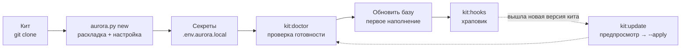

# Установка, настройка и обновление

Как развернуть Аврору в проекте, что при этом появляется, как устроены настройки и секреты,
как подключить модели и как обновлять движок. English version: [en/INSTALL.md](en/INSTALL.md).



## Требования

- Python 3.9+ и git; запись в папку проекта; кит, клонированный локально
  (`git clone https://github.com/<org>/aurora-studio.git`).
- Движок работает на стандартной библиотеке. Остальное нужно только отдельным командам:

| Что | Для чего | Как поставить |
|---|---|---|
| `pandoc` | `ship:export` (markdown → docx/pdf) | пакетный менеджер системы |
| `beautifulsoup4`, `markdownify`, `lxml` | `sync:confluence` | `pip install` или «Установка» в панели |
| `markitdown`, `openpyxl`, `pypdf` | `kb:ingest-office` | `pip install` или «Установка» |
| Pydantic AI | каждый вызов модели идёт через него | «Установка» → «Надстройки движка» (venv в `~/.aurora/`) |
| graphify | темы графа, MCP-сервер по графу, выгрузки HTML/Neo4j | то же |
| Obsidian | навигация по вики-ссылкам | по желанию: формат совместим |

Что не хватает на машине и в проекте: `python3 aurora.py doctor <проект>` или раздел «Установка»
в панели — он называет, какие команды без этого не работают.

## 1. Развернуть проект

Из корня кита:

```bash
python3 aurora.py new /absolute/path/to/your-project
```

На Windows вместо `python3` пишут `py -3` (или `python`): Python с python.org и из winget не
ставит команду `python3`, а та, что лежит в WindowsApps, — заглушка магазина. Пусковой файл
`start-aurora.bat` и хуки git выбирают интерпретатор сами.

Команда делает четыре шага:

1. **Раскладка** (`install_aurora.py`): папки по `structure_dirs.txt`, копия движка в `.aurora/`,
   `aurora.config.yaml`, образец секретов, `AGENTS.md`, служебные файлы `AuroraKnowledgeDB/meta/`,
   шаблоны и промпты, sync-навыки, правила `.gitignore`.
2. **Настройка** (`aurora_setup.py`): интерактивные вопросы — имя и slug проекта (slug попадает в
   имена sync-навыков), Confluence (адрес, пространство, корневые страницы по `page_id` из адреса
   `…pageId=NNN`), Jira (адрес, ключ проекта, JQL по умолчанию), статусы доверия, список
   веб-страниц, порог bootstrap.
3. **Приведение движка к настройкам** (`aurora_update.py --apply`): `AGENTS.md` и тела sync-навыков
   подставляются из конфига, версия движка записывается в `AuroraKnowledgeDB/meta/aurora_version.txt`.
4. **Навыки** (`install_skills.py`): `aurora-vault`, `aurora-grill`, `aurora-dev` копируются в общий
   каталог агента (`~/.claude/skills`), чтобы `/aurora-vault` находился в любом диалоге.

Если терминала нет (запуск из панели, скрипта, CI), вопросы не задаются: берутся значения по
умолчанию, а конфиг заполняют позже — `python3 aurora.py setup <проект>`. По умолчанию установка
**не перезаписывает** существующие файлы; повторный запуск безопасен.

То же делает панель: «Настройка кита» → «Подключить новый проект».

### Без вопросов (скрипты, CI)

```bash
python3 scripts/install_aurora.py \
  --target /absolute/path/to/your-project \
  --name "Project Display Name" --jira-key PROJ --confluence-space SPACE
```

| Флаг | Значение |
|---|---|
| `--target` | корень проекта (создаётся, если нет) |
| `--name` | человеческое имя → `AGENTS.md`, отчёты, slug sync-навыков |
| `--slug` | короткий идентификатор (по умолчанию из имени) |
| `--jira-key` | ключ проекта Jira |
| `--confluence-space` | ключ пространства Confluence |
| `--dry-run` | только показать действия |
| `--force` | перезаписать существующие файлы (опасно) |

### Менять настройки можно в любой момент

Настройка копируется в проект, и любой может её перезапустить — текущие значения подставляются, Enter
оставляет как есть:

```bash
cd /path/to/your-project
python3 .aurora/scripts/aurora_setup.py
```

В панели: «Настройки проекта». Форма там спрашивает то же и пишет тем же скриптом; ниже — весь
конфиг текстом для того, чего в форме нет.

## 2. Что появляется в проекте

```text
AGENTS.md                     правила для любого агента, открывшего папку
aurora.config.yaml            настройки проекта (в git)
aurora.update_ignore.txt      по желанию: пути, которые проект ведёт сам — update их не трогает (glob)
aurora.env.local.example      образец → .env.aurora.local (вне git)
.gitignore                    правила движка дописываются построчно, чужие строки не трогаются
.aurora/                      движок — копия кита, вне git (ставит и обновляет `aurora.py update`)
  scripts/                    скрипты движка
  skills/aurora-vault/ · aurora-grill/    навыки кита и справочники процедур
  connectors/                 манифесты подключённых модулей источников
  docs/                       правила базы знаний (едут с движком)
  reports/analyst/            дашборд эффективности аналитиков
  vendor/                     библиотека графа без сети
  state/ · runs/ · context/ · cache/      состояние, прогоны, вложения, кэш
  structure_dirs.txt · commands.txt · moc_groups.txt · kit_path.txt
.claude/skills/               навыки проекта — общие, в git: sync-навыки confluence-sync-<Slug>,
                              jira-export-<Slug> и ваши
Sources/                      зеркала подключённых модулей: Confluence, JIRA, Web
Raw/{laws,contract,customer,project,meetings,examples,corrections}/
AuroraKnowledgeDB/            Concepts, Processes, Glossary, Systems, Roles, Statuses, Reference,
                              Requirements, Specs, Questions, Decisions, MOC, _archive, _assets,
                              _inbox, meta (там же run_log.md — журнал запусков)
Artifacts/{us,ac,algorithms,dictionaries,screens,contracts,mappings,role-model,diagrams,
           acceptance,tests,reviews,reports,drafts,meetings}/
Deliverables/{work,work/spec-packs,released,_archive}/
Workspaces/_archive/
Scripts/                      скрипты проекта (свои обработчики, разовые миграции)
bots/                         боты проекта: промпт, MCP, навыки, вложения, расписание (раздел «Боты»)
Templates/ · TemplatesCommon/ · Prompts/ · Settings/
start-aurora.command · start-aurora.bat      пусковые файлы
```

В каждой папке схемы лежит **`README.md`** — короткое описание: для чего папка, что сюда класть
и чего нет, кто пишет и можно ли заводить вложенные папки, не нарушая правил кита. Текст ведёт кит
(блок между метками обновляется с движком), свои заметки пишут ниже метки конца. Движок такие файлы
содержимым не считает: это не источник, не шаблон, не артефакт и не карточка.

**Папки харнессов — у каждого свои.** `.cursor/`, `.opencode/`, `.codex/`, `.gemini/`, `.windsurf/`
и `.claude/` (кроме `.claude/skills/`) закрыты `.gitignore`, и обновление кита в них не пишет:
настройки, планы и кэш агента у каждого локальные. Общие у проекта — навыки в `.claude/skills/`.
До 1.158.0 движок жил в `.opencode/` и ездил по git; `aurora.py update` переносит его в `.aurora/`
сам: данные движка — туда же, журнал запусков — в `AuroraKnowledgeDB/meta/`, навыки проекта — в
`.claude/skills/`, свои скрипты проекта — в `Scripts/`, файлы самого OpenCode остаются на месте.
После переезда новому участнику достаточно склонировать проект и запустить
`aurora.py update <проект> --apply` — движок встанет из кита.

Список папок **фиксирован движком** (`structure_dirs.txt`) и одинаков во всех проектах Авроры;
нестандартное лежит в `Workspaces/<задача>/`. Папка, нужная только этому проекту (наследие прежней
базы, вложения), объявляется в `aurora.config.yaml` → `paths.extra_structure_dirs`: `doctor`
принимает её там и нигде больше. `Deliverables/_archive/` — хранение пакетов поставок и снятых с
работы версий: это не рабочая версия и не сданная.

## 3. Настройки: `aurora.config.yaml`

Файл в git; **секреты сюда не кладут**. Адреса, пространства, ключи и JQL живут только здесь —
скиллы и скрипты читают их отсюда, а не из своих тел.

| Секция | Что настраивает |
|---|---|
| `project` | `name`, `slug` |
| `skills` | какие навыки обязательны и рекомендованы |
| `sources` | подключённые модули источников: `id` (имя папки в `Sources/`), `module`, `path`. Секции нет — работают встроенные Confluence и Jira |
| `atlassian.confluence` | `base_url`, `space`, `sync_roots` (список корней: `page_id`, `title`, `trusted`) |
| `atlassian.jira` | `base_url`, `project_key`, `default_jql`, `done_statuses`, `cancelled_statuses`, **`trust_statuses`**, **`assumption_statuses`** |
| `web` | `pages` (список `url` + `trusted`), `depth`, `assets`, `max_pages` — для модуля `web` |
| `paths` | пути базы и зеркал, `extra_structure_dirs` |
| `verify` | `trusted_sources` (папки и файлы доверены по пути), `trusted_branches` (справочные ветки вики по названию) |
| `privacy` | `scrub`: `off` · `report` (по умолчанию) · `mask`; `mask_contacts`, `include_raw` |
| `reports.analyst` | год, ростер, события, папка выгрузок и итоговый файл дашборда |
| `artifacts` | реестр видов артефактов проекта: `title`, `template`, `out`, промпт, `tech_agnostic` (`make:kinds`) |
| `graphify` | `code_dirs` — папки с кодом для `kb:code-graph` |
| `bootstrap` | порог доли `knowledge`, до которого в пакеты допускаются черновики с громкой шапкой |

**Как доверие зависит от конфига.** Статусы задач из `trust_statuses` делают связанную карточку
`knowledge`; из `assumption_statuses` — `draft`. Пустой список означает значения по умолчанию
(`aurora_common.TRUST_DEFAULTS`). Раздел Confluence с `trusted: true` у корня доверен целиком, веб-ссылка
— по своей галочке `trusted`. Все правила — [knowledge-rules.md](knowledge-rules.md).

## 4. Секреты: `.env.aurora.local`

Скопируйте `aurora.env.local.example` в `.env.aurora.local` рядом с `aurora.config.yaml`. Файл
закрыт `.gitignore`; в git секреты не попадают никогда.

Зачем отдельный файл, если Atlassian уже настроен в Cursor: MCP живёт внутри редактора и свои
учётные данные не отдаёт, а скрипты синка ходят в Confluence и Jira напрямую по REST.

| Переменная | Для чего |
|---|---|
| `CONFLUENCE_PERSONAL_TOKEN` (или `CONFLUENCE_PAT`) | токен Confluence Data Center 7.9+ / Server |
| `CONFLUENCE_USER` + `CONFLUENCE_PASSWORD` | запасной вариант, если токены недоступны |
| `JIRA_PERSONAL_TOKEN` (или `JIRA_PAT`) | токен Jira Server / Data Center |
| `JIRA_USER` + `JIRA_PASSWORD` | запасной вариант |

Проверить принятие токена: `python3 .aurora/scripts/jira_export.py --limit 1`.

## Встроенный агент

Нужен командам `agent:*`, семантическому поиску (`kb:embed`) и распознаванию сканов. Без него
остальное работает.

### Модели — одна настройка на кит

Модели настраиваются **один раз на кит** и действуют во всех его проектах: раздел «Модели» панели,
файл `<кит>/local/models.json` (вне git, права 600). Своей настройки моделей у проекта нет.
Порядок — по нужде:

1. **Провайдеры** — подключения: имя, тип (`openai`, `llama.cpp`, `vllm`, `sglang`, `ollama`,
   `tei`), адрес OpenAI-совместимого API, ключ, ширина (сколько запросов держит одновременно —
   меряет «Замерить шлюзы»), «в параллель» и поля шаблона модели (JSON, например
   `{"reasoning_effort": "xhigh"}`). Рабочий шлюз и домашний сервер живут рядом.
2. **LLM, OCR, эмбеддинги** — три вкладки, устроены одинаково. В каждой — **роли**: у LLM
   `worker` (рутинные шаги), `planner` (границы), `critic` (проверка до записи), `qa` (Момус),
   у OCR `document`, у эмбеддингов `index`; можно добавить свою. Роли движка не удаляются; пустая
   роль LLM идёт по цепочке `worker`.
3. **Бэкенд** — «провайдер + модель» в роли. Первый — основной, кнопка «+» добавляет запасной.
   Цепочку можно перетащить, запасной — выключить, не удаляя. Провайдера можно завести прямо из
   выпадающего списка бэкенда, модель — выбрать из списка, который вернул сам провайдер.

Не ответил основной — вызов идёт следующему по цепочке, со своей моделью; недоступный провайдер
15 минут не трогается. У запасного эмбеддингов модель та же, что у основного: векторы разных
моделей несравнимы. У OCR запасной может быть другой моделью. Для сканов умолчаний нет:
угаданное имя модели даёт не отказ, а связную выдумку в транскрипте первоисточника.

Общие для всех ролей: потолок одновременных запросов («авто» — сумма ширин провайдеров), срок
запроса, шаги и бюджет агента, способ вызова (`pydantic_ai` или прямой HTTP). Сбой на одной
карточке прогон не роняет; три сбоя подряд останавливают его — это провайдер, а не карточки.

**Мимо Pydantic AI — видно сразу.** Выбран `pydantic_ai`, а вызов пришёл прямым HTTP (venv не
стоит, процесс адаптера упал, новая версия не прошла проверку совместимости) — это видно в трёх
местах: строкой `⛔` в выводе команды, красной полосой в панели поверх любого раздела (что, где,
когда и почему) и первой строкой итога прогона. Вызов с инструментами или MCP без адаптера не
принимается вовсе: ответ «без инструментов» на вопрос, где они нужны, — не ответ. Полоса уходит
сама, когда тот же путь (задача агента, бот) снова пройдёт через адаптер.

**Журнал сбоев.** Каждый сбой шага агента — запись в `failures.jsonl` папки прогона
(`.aurora/runs/<прогон>/`; из терминала — `.aurora/state/failures.jsonl`): причина, ход вызова
по шлюзам, размер запроса, срок, число попыток, а если ответ пришёл, но не разобран, — сам ответ
и хвост рассуждений. Итог прогона называет число записей и путь.

Прежние переменные `AURORA_AGENT_*`, `AURORA_EMBED_*`, `AURORA_OCR_*` из `.env.aurora.local`
кита переносятся в `models.json` сами, один раз (или `python3 scripts/model_config.py --migrate`);
файл при этом не меняется. В `.env` проекта они больше не действуют — `doctor` их назовёт.

### Проверка

| Команда | Что показывает |
|---|---|
| `agent:ping` | каждый бэкенд цепочек LLM живым запросом: роли, скорость; пустой ответ считается отказом |
| `agent:probe` | «нет связи», «ключ не тот» или «нет такой модели»; список моделей шлюза; `--why` — какой слой запроса шлюз не принимает |
| `agent:width` | сколько одновременных запросов держит каждый шлюз |
| `agent:pydantic` | что уходит в шлюз через Pydantic AI по каждой роли и прошла ли версия проверку совместимости |

Все тексты уходят провайдерам из настройки моделей: если контур запрещает отправлять материалы
наружу, не включайте семантику и сканы — всё остальное работает без них.

## Поиск Авроры для других агентов (MCP)

Тот же поиск, что в «Спросить» и «Продуктивности» (слова и смысл по индексу `kb:embed`), доступен
любому агенту как MCP-сервер: OpenCode, Claude Code, Cursor. Один сервер на все проекты машины —
`aurora_mcp.py --all` из кита; каждый инструмент требует `project` — слаг проекта, базы не
смешиваются. `kb_projects` называет проекты, `kb_search` ищет, `kb_card` читает карточку,
`kb_context` собирает контекст-пак, `kb_index` даёт оглавление, `artifact_spec` — как делать
артефакт проекта, `kb_ask` спрашивает базу.

С 1.162.0 там же — всё, что нужно боту по расписанию и любому ассистенту для работы с проектом.
Механику делает движок, модель тратит токены только на суждения:

| Инструмент | Что делает |
|---|---|
| `time_now` | текущее время, UTC и местное: своих часов у модели нет |
| `state_get` / `state_put` / `state_list` / `state_delete` | память между прогонами: ключ → значение в своём пространстве (`.aurora/state/mcp/`, вне git) |
| `lock_acquire` / `lock_release` | замок на дело: второй прогон того же дела не начнётся |
| `review_checklist` | чек-лист ревью истории или алгоритма (`review_v2.0`) |
| `review_page` | ревью страницы движком целиком: связанные страницы, чек-лист несколькими прогонами, оценка и вердикт кодом; отчёт — файлом `.aurora/state/reviews/` |
| `review_score` | оценка готовых ответов на чек-лист по формуле шаблона |
| `atlassian_check` | доступны ли Jira и Confluence проекта, под кем, разрешена ли запись |
| `jira_search` / `jira_issue` | задачи одним запросом: родитель, метки, имена вложений |
| `jira_publish` | вложение → комментарий → метки по шагам; метки — только если вложение легло; повтор не грузит то же вложение; `dry_run` — пробный прогон |
| `confluence_find` / `confluence_page` | страница по номеру или словам; её текст и ссылки |

Писать в базу знаний через MCP нельзя. Писать в Jira можно, только если проект разрешил
(`aurora.config.yaml`):

```yaml
mcp:
  jira_write: true
```

Пробный прогон публикации работает всегда. Инструменты работают ключами проекта — теми же,
что синк (`JIRA_PAT`, `CONFLUENCE_PAT` в `.env.aurora.local`).

**Подключить к ассистентам** — «Установка» → «Aurora MCP в ассистентах». Кнопка находит
ассистентов машины по каталогу кита (`scripts/harnesses.json`). В каталоге:

- Claude Code, Claude Desktop, Cursor, Windsurf, VS Code;
- Cline, Roo Code, Kilo Code, Kilo CLI;
- OpenCode, Codex, Gemini CLI, Qwen Code, Continue, Zed;
- jcode, Hermes Agent, Goose, Crush, pi, DeepSeek TUI;
- Kiro, Amp, LM Studio, Junie.

У каждого найденного видны версия, файл настройки и подключена ли Аврора. Кнопка
«Подключить» копирует файл ассистента в `~/.aurora/harness-backups/` и вставляет запись
правкой текста: комментарии и порядок полей человека остаются. Потом проверяет файл; не
разобрался — возвращает копию. «Вернуть из копии» — в той же строке. Правку делает код, а не
модель: в этих файлах лежат ключи других серверов. Каталог обновляется с китом. Из терминала:
`python3 <кит>/scripts/harness_mcp.py --list | --add ID | --restore ID`.

## Git проекта

У каждого проекта свой сервер и свой вход — раздел панели **«Git»** (группа проекта). Настройка
лежит в `.git/aurora/git.json` проекта: в историю она не попадает и живёт вместе с клоном. Токены
и пароли лежат вне проекта, в `~/.aurora/git/credentials.json` (на macOS и Linux — права 600, на Windows — в профиле пользователя); вставленный SSH-ключ —
в `~/.aurora/git/keys/`. Токен не пишется ни в адрес сервера, ни в командную строку git: git
получает его из переменной окружения через свой механизм учётных данных.

| Поле | Что значит |
|---|---|
| Провайдер | GitHub, GitLab, Bitbucket, Gitea или другой git-сервер (без модуля) |
| Адрес сервера | свой сервер с портом: `https://git.example.com:3000` |
| Репозиторий | `владелец/имя` (у GitLab — с подгруппами, у Bitbucket — `КЛЮЧ/репозиторий`) или полный адрес: `https://…`, `git@…`, сетевая папка |
| Как входить | как настроено в git на этой машине (связка ключей, ssh-agent) · токен доступа · логин и пароль · SSH-ключ |
| Ветка, имя сервера | ветка проекта (пусто — открытая сейчас) и имя удалённого репозитория (обычно `origin`) |
| Автор, шаблон сообщения | имя и почта автора фиксаций; подстановки `{project} {date} {time} {branch} {count} {files} {trigger}` |
| Как обновлять | только перемотка (по умолчанию, безопаснее всего), слияние или свои поверх серверных |
| Сертификат | проверка включена; у своего сервера с собственным сертификатом — «Доверять» по отпечатку SHA-256: сохраняется именно этот сертификат, проверка остаётся включённой |

**Подключить по строке git clone** — первая карточка настройки. Скопируйте строку клонирования
со страницы репозитория (кнопка Clone) и вставьте целиком: провайдер, сервер, репозиторий, ветка
(`-b`) и логин разберутся сами — у своего Bitbucket и путь `/scm/…`, и SSH на порту 7999. Дальше —
способ входа (логин и пароль, токен, SSH-ключ или как в системе), пароль и «Проверить и
подключить»: проверка идёт тем же входом, затем сервер сохраняется основным (`origin`) или
дополнительным, и кнопка «Отправить проект на этот сервер» отправляет его сразу. Пароль из
строки в адрес не пишется — он уходит в поле пароля.

**bitbucket.org:** пароль от аккаунта для git не действует. Логин — имя пользователя Bitbucket
(не e-mail, регистр важен; оно стоит в строке git clone), вместо пароля — API-токен: аватар →
Account settings → Security → Create and manage API tokens → Create API token with scopes →
Bitbucket, права `read:repository` и `write:repository`. API bitbucket.org ждёт с тем же токеном
e-mail, поэтому проверка API может не принять вход, — если git его принял, подключение работает.
У своего Bitbucket (Server / Data Center) работают и логин с паролем, и HTTP access token.

Поля проверяются сразу, при вводе; «Проверить подключение» спрашивает API провайдера и сам git и
предлагает подставить найденное: логин, ветку по умолчанию, провайдера по ответу сервера.

**Серверов может быть несколько.** Основной (`origin`) — рабочий: с него обновление, на него
отправка. Дополнительные — например, свой `gitea` рядом с рабочим GitLab или Bitbucket: у каждого
свой адрес и вход, отправка идёт на основной и на дополнительные, отмеченные «вместе с основным»
(или кнопкой «Отправить на …» отдельно). Действие «Сделать origin дополнительным сервером» —
это `git remote rename origin gitea` вместе с настройкой и входом; пока рабочий сервер не указан,
отправка идёт только на дополнительные. Отказ одного сервера называется по имени и не отменяет
отправку на остальные.

**Действия** — кнопки раздела и команды `git:status`, `git:update`, `git:push`, `git:commit`,
`git:fix`, `git:check`. Они идут заданиями панели и видны в «Консоли» и в истории запусков.
Отправка сначала фиксирует незафиксированное по шаблону и сама связывает ветку с сервером.
Кнопка «.gitignore» открывает правила «что git не берёт в проект» в «Файлах» (нет файла — заводит его).

**Автоматика** у каждого проекта своя:
- обновлять — при открытии проекта, по расписанию, перед маршрутом;
- отправлять — после успешного маршрута, после фиксации (когда фиксации перестали идти две
  минуты), по расписанию.

Работает, пока запущена панель; проект, в котором идёт маршрут, команда или агент, не трогает.
Итог каждого запуска — в журнале раздела и в «Консоли»; отказ отмечается на пункте меню «Git»,
пока следующий запуск не пройдёт. Упавшая автоматика повторяется не чаще раза в 15 минут.

**Неудачи** называются словами, с советом и кнопкой:
- вход не принят → проверить токен;
- ветка не связана с сервером → связать;
- сервер ушёл вперёд → обновить и отправить;
- изменения разошлись → слиянием или своими поверх серверных;
- конфликт → список файлов и выбор версии («оставить мою», «взять с сервера», поправить
  вручную), затем завершить или отменить обновление;
- чужой сертификат → довериться по отпечатку;
- пароль в адресе сервера → перенести в защищённое хранилище;
- модуль провайдера устарел → обновить.

Сырой вывод git показывается ниже, раскрытием.

**Модули провайдеров** (GitHub и GitHub Enterprise, GitLab, Bitbucket, Gitea) проверяют вход, права и репозиторий через API
сервера и знают ветку по умолчанию и адреса клонирования (у Bitbucket — `/scm/` и SSH-порт 7999).
Ставятся и обновляются на странице «Установка», рядом с надстройками движка, в
`~/.aurora/git-providers/`. Без модуля обновление и отправка работают с любым git-сервером самим
git — этот путь встроен в движок и обновляется вместе с китом.

## Боты проекта

Бот — повторяемое задание модели: промпт, MCP-серверы, навыки и файлы проекта, вручную или по
расписанию. Каждый бот — файл `bots/<имя>.md` в корне проекта (его видно в «Файлах» и в git):

```markdown
---
name: Jira label analyzer
description: Задачи Jira с меткой — оценка по шаблону, файл и комментарий в задаче
mcp:
  - jira-mcp
  - confluence-mcp
skills:
  - evaluation-skill
attachments:
  - templates/evaluation-template.md
cron: "0 9 * * 1-5"
enabled: true
---
Найди все задачи Jira с меткой `X`… Оцени по [шаблону](../templates/evaluation-template.md)…
```

| Поле | Что значит |
|---|---|
| `mcp` | MCP-серверы бота — из «Настройка кита» → MCP-серверы машины и `mcp.json` проекта. Подключаются сразу; других бот не видит |
| `skills` | навыки (SKILL.md): проекта, кита или `~/.claude/skills` — их метод идёт в задание |
| `attachments` | файлы и папки проекта, пути от корня. Ссылки, не копии: при запуске их текст идёт боту, читать целиком он может сам. Секреты и служебные папки не отдаются |
| `cron` | пять полей cron (минута час день месяц день-недели) или `@hourly`, `@daily`, `@weekly`, `@monthly` |
| `enabled` | расписание включено: бот сам стоит в разделе «Cron» |

Раздел панели **«Боты»** (группа проекта): слева — список с расписанием и итогом последнего
прогона, справа — промпт тем же редактором, что в «Файлах», и настройка: MCP-серверы и навыки
галочками, вложения — подбором файлов и папок проекта (кнопка «Вставить ссылку» кладёт ссылку в
промпт), расписание — выражением или готовым («по будням в 9:00»), с ближайшими запусками.
Поля проверяются при вводе; «Добавить в cron» включает расписание одним нажатием. «Пример:
анализ задач Jira» создаёт бота из задания вместе с шаблоном оценки.

При запуске (`bot:run` — кнопкой или по расписанию) бот получает промпт, метод навыков, текст
вложений, свои MCP-серверы и инструменты чтения проекта; файлы результата он пишет
инструментом `save_output` в `Workspaces/bots/<бот>/<прогон>/` и может передать их путь
MCP-серверу (например, приложить к задаче Jira). Там же — `report.md` с ответом бота.
Неудача называется словами с советом: сервер или навык не настроен, вложения нет, нет
Pydantic AI, модели не настроены, бот не уложился в срок или исчерпал вызовы инструментов.
MCP-серверам и инструментам нужен Pydantic AI («Установка»).

**Модель бота** — роль из раздела «Модели» (цепочка «провайдер → модель» по порядку с запасными;
по умолчанию «Писатель») или конкретная модель провайдера — поле `model: провайдер/модель`, ровно
она, без запасных. MCP-серверы бота подключаются сразу. Скриптов, командной строки и переменных
окружения у бота нет: промпт пишут под его инструменты — MCP, файлы проекта, база знаний,
`save_output`; прошлые прогоны он читает из `Workspaces/bots/<бот>/`. Всё, что раньше делали
скрипты, — очередь Jira, страница истории, ревью, публикация, память между прогонами, замок, время —
даёт сервер `aurora` (MCP Авроры, см. выше): выберите его в карточке «MCP» бота. Прогон без инструментов — не успех: если вызов прошёл мимо Pydantic
AI или модель не вызвала ни одного инструмента при своих MCP, прогон записывается неудачей с
причиной, а отчёт называет роль, модель и все вызовы инструментов.

## 5. Проверить готовность

```bash
cd /path/to/your-project
python3 .aurora/scripts/aurora_doctor.py --structure
python3 .aurora/scripts/kb_lint.py --summary
python3 .aurora/scripts/aurora_hooks.py --install    # храповик pre-commit
```

Ожидаемо: `doctor` — OK или только предупреждения (он проверяет конфиг, навыки, секреты в git, версию
движка, структуру папок и переносимость имён файлов); `kb_lint` — ошибок 0 (пустая база нормальна);
хук запоминает текущее число ошибок как базовую линию, которая может только снижаться.

Сделайте первый коммит: `git init && git add -A && git commit -m "Bootstrap Aurora"`. Файл
`.env.aurora.local` не коммитят.

## 6. Первая неделя

1. [ ] Перезапустить `aurora_setup.py`, если какая-то настройка была пропущена.
2. [ ] Заполнить `.env.aurora.local` (токены Confluence и Jira), завести провайдеров и роли в разделе «Модели» и проверить `kit:doctor`, `agent:ping`.
3. [ ] Прочитать `AGENTS.md` и `.aurora/skills/aurora-vault/SKILL.md`.
4. [ ] Положить доказательства в `Raw/` (договор, ТЗ, расшифровки встреч).
5. [ ] В панели запустить маршрут «Обновить базу» (сначала «Посмотреть»).
6. [ ] Подключить базу ассистенту: `kit:mcp` печатает готовую строку для Claude Code, Cursor, OpenCode.
7. [ ] Поставить `kit:hooks` и зафиксировать результат в git.

## 7. Обновить движок

Когда кит выпустил новую версию, в проект доезжает **только движок**:

```bash
python3 /path/to/aurora-studio/aurora.py update /path/to/your-project           # предпросмотр
python3 /path/to/aurora-studio/aurora.py update /path/to/your-project --apply   # запись
git -C /path/to/your-project add -A && git -C /path/to/your-project commit -m "Update Aurora engine"
```

Трогаются только файлы из `engine_manifest.txt`; конфиг, знания, `Raw/`, `Sources/`, `Artifacts/`,
`Workspaces/` — никогда. Шаблоны проекта остаются как есть, а изменившиеся версии кита ложатся
рядом как `*.new` для сравнения. `--structure-only` создаёт только недостающие папки схемы. Версия
движка проекта — в `AuroraKnowledgeDB/meta/aurora_version.txt`; панель предупреждает, когда проект
отстал.

Сам кит обновляется из репозитория: `git pull` в папке кита или кнопка в «О проекте» (только
перемотка вперёд, при незакоммиченных правках отказывает).

> **Общие навыки.** Если навык проекта — символическая ссылка на общее место (например,
> `~/.claude/skills/aurora-vault`), `update` предупредит: запись попадёт в общую цель и обновит
> каждый проект, который её делит.

Выведенные из состава движка файлы `update` удаляет сам (список ведётся в манифесте). Свои пути
можно оградить в `aurora.update_ignore.txt` в корне проекта.

## 8. Проект уже накопил кучу документов

Подробно — `skills/aurora-vault/references/migration.md`. Коротко:

1. Разверните Аврору **без** `--force`: файлы проекта сохраняются.
2. Разложите доказательства по `Raw/`, зеркала — по `Sources/`, рабочие материалы — по
   `Workspaces/`.
3. Если уже есть зеркало Confluence — подключите детерминированный синк и перенацельте
   карточки: `kit:remap-sources`.
4. Запустите «Обновить базу». Доверие посчитает движок — по задачам Jira и источникам.
5. Прогоните «Починить базу»: ссылки, двойники, имена файлов, схема.
6. Старая база с `verified` и `imported`: `kb:trust` переведёт её на новую шкалу.

## Устранение неполадок

| Симптом | Что делать |
|---|---|
| `kb_lint: нет папки AuroraKnowledgeDB/` | запускайте из корня проекта, а не кита |
| Агент не видит `AGENTS.md` | откройте **папку проекта** как корень рабочей области |
| Sync-навык смотрит не в то пространство или JQL | перезапустите `aurora_setup.py` или поправьте `aurora.config.yaml` (не тело навыка) |
| Имя папки sync-навыка ≠ slug | `aurora_setup.py` приведёт имена папок к slug |
| `doctor`: секрет в git | уберите токен; только `.env.aurora.local` |
| `/aurora-vault` не находится в диалоге | `kit:skills --apply` положит навыки в `~/.claude/skills` |
| Скрипт отказывается работать: «незакоммиченные файлы» | зафиксируйте работу или `--allow-dirty` |
| Имя файла не проходит на Windows/macOS | `kb:names` (предпросмотр, затем `--apply`) |
| Переименование `raw` → `Raw` на macOS | в два шага: `mv raw tmp && mv tmp Raw` |
| `agent:ping` — «не отвечал» | `agent:probe`: различит связь, ключ и имя модели |
| macOS блокирует `start-aurora.command` | правой кнопкой → «Открыть» |
