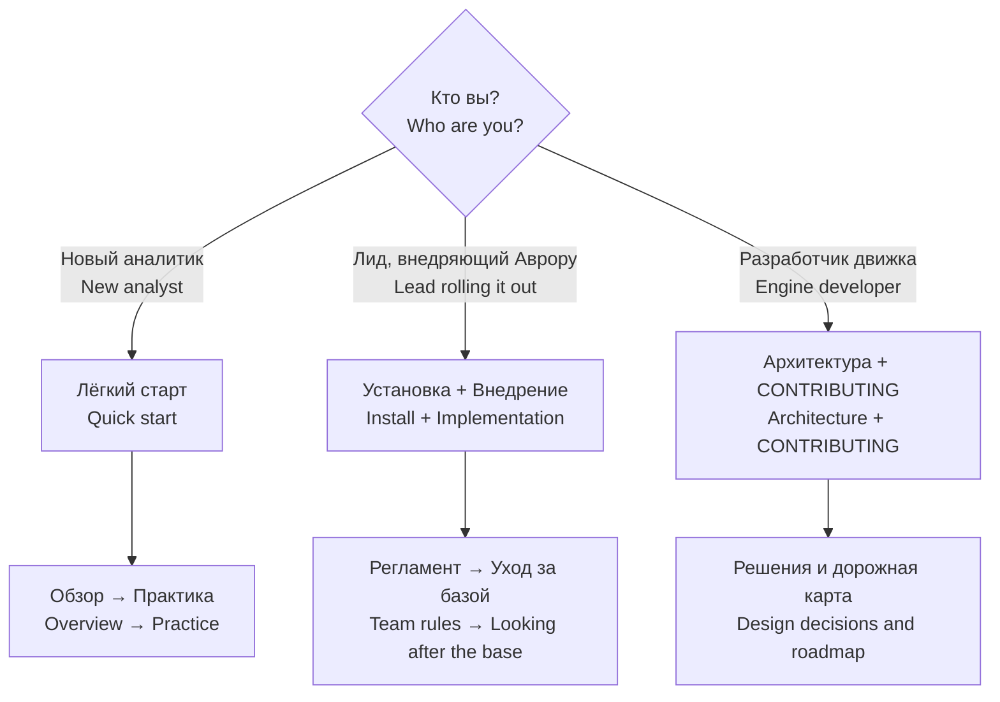

# Документация Aurora Studio · Documentation

Документация двуязычная. Русская версия лежит в этой папке (её открывает и панель управления),
английская — зеркалом в [`en/`](en/). Корень репозитория: [README.md](../README.md) (English) и
[README.ru.md](../README.ru.md).

This documentation is bilingual. The Russian version lives in this folder (the control panel opens
it too); the English version mirrors it in [`en/`](en/).

## С чего начать · Where to start

## Для людей · For people

| № | Русский | English | О чём · What |
|---|---|---|---|
| 0 | [Указатель](readme/README.md) | [Index](en/readme/README.md) | порядок чтения · reading order |
| 1 | [Обзор](readme/01-overview.md) | [Overview](en/readme/01-overview.md) | принципы, слои доверия, карточка · principles, trust layers, the card |
| 2 | [Лёгкий старт](readme/02-quickstart.md) | [Quick start](en/readme/02-quickstart.md) | первый день · day one |
| 3 | [Регламент](readme/03-team-rules.md) | [Team rules](en/readme/03-team-rules.md) | роли, ритуалы, правила · roles, rituals, rules |
| 4 | [Практика](readme/04-practice.md) | [Practice](en/readme/04-practice.md) | ситуация → команда · situation → command |
| 5 | [Уход за базой](readme/05-gardening.md) | [Looking after the base](en/readme/05-gardening.md) | как знание зреет, что остаётся человеку · how knowledge matures, what is left for a human |
| 6 | [Spec-Driven Development](readme/06-sdd.md) | [Spec-Driven Development](en/readme/06-sdd.md) | требования → спека → приёмка · requirements → spec → acceptance |

## Модель знания · The knowledge model

| Русский | English | О чём · What |
|---|---|---|
| [Правила базы знаний](knowledge-rules.md) | [Knowledge rules](en/knowledge-rules.md) | доверие, связи, типы, устройство карточки · trust, links, kinds, the card |
| [На одну страницу](knowledge-rules-tldr.md) | [One-page summary](en/knowledge-rules-tldr.md) | то, что нужно помнить каждый день · what to remember daily |
| [Накопление знания](накопление-знания.md) | [Knowledge accumulation](en/knowledge-accumulation.md) | единица базы — сущность · the unit of the base is an entity |
| [Цикл и путь карточки](lifecycle.md) | [Lifecycle](en/lifecycle.md) | от источника до сданного документа · from source to delivered document |

## Установка и эксплуатация · Install and operate

| Русский | English | О чём · What |
|---|---|---|
| [Установка](INSTALL.md) | [Install](en/INSTALL.md) | развернуть, настроить, обновить · deploy, configure, update |
| [Внедрение](IMPLEMENTATION.md) | [Implementation](en/IMPLEMENTATION.md) | план для лида · a lead's rollout plan |
| [Панель управления](control-panel-ui-requirements.md) | [Control panel](en/control-panel.md) | разделы, безопасность, оформление · sections, safety, look |
| [Модули источников](connectors.md) | [Source modules](en/connectors.md) | как подключить источник · how to plug in a source |
| [Справочник команд](commands.md) | [Command reference](en/commands.md) | все команды · every command |

## Устройство и разработка · Internals

| Русский | English | О чём · What |
|---|---|---|
| [Архитектура](architecture.md) | [Architecture](en/architecture.md) | кит и проект, агент, MCP, предохранители · kit and project, agent, MCP, safeguards |
| [Решения и дорожная карта](roadmap.md) | [Design decisions and roadmap](en/roadmap.md) | почему так и что не сделано · why it is so, and what is not done |
| [CONTRIBUTING](CONTRIBUTING.md) | [CONTRIBUTING](en/CONTRIBUTING.md) | как вносить изменения · how to contribute |
| [Скин «Зин»](skin-zine-requirements.md) | — | требования к оформлению по умолчанию (только по-русски) · default skin spec (Russian only) |

Контракты внутри кода — разделы панели ([cockpit/modules/README.md](../cockpit/modules/README.md)),
скины ([cockpit/skins/README.md](../cockpit/skins/README.md)), отчёт аналитиков
([reports/analyst/README.md](../reports/analyst/README.md)) — остаются русскими рядом с кодом.
Процедуры ассистента — `skills/aurora-vault/references/`. История выпусков —
[CHANGELOG.md](../CHANGELOG.md) (по-русски).
