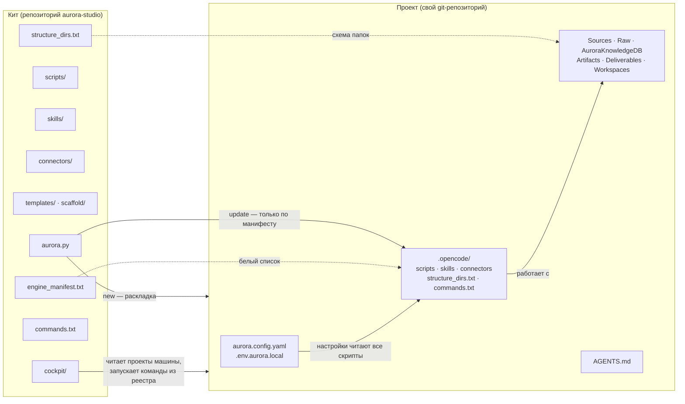
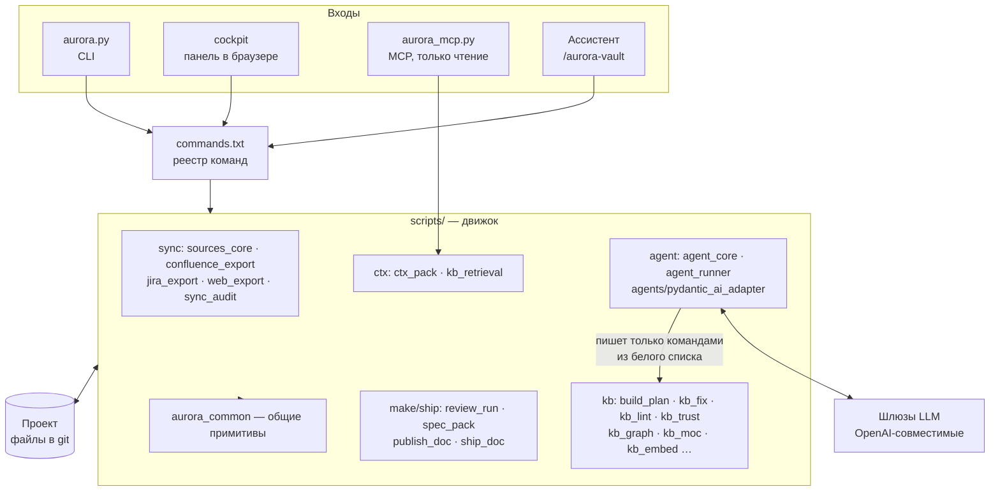
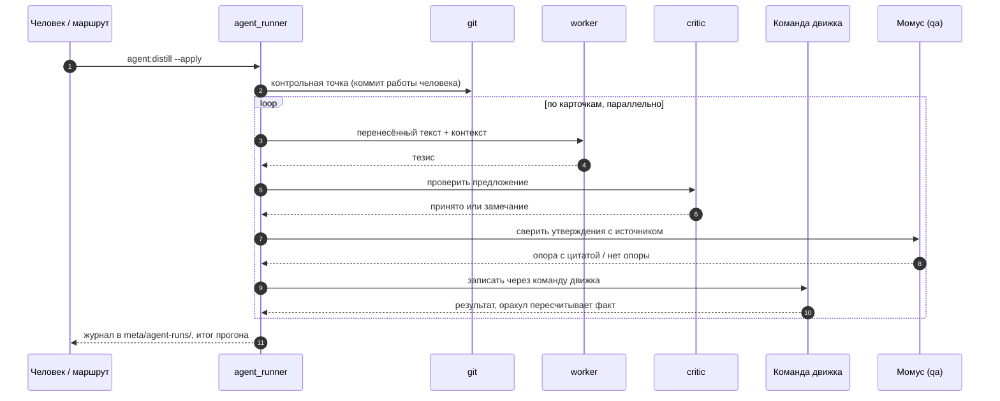

# Архитектура

Как устроена Аврора изнутри: из чего состоит кит, что попадает в проект, как работают
встроенный агент, панель и MCP-сервер и какими предохранителями защищена база. Документ для
тех, кто разворачивает, обслуживает или дорабатывает движок. Пользователю достаточно
[обзора](readme/01-overview.md).

## 1. Кит и проект

Есть две вещи, и их нельзя путать.

- **Кит** (этот репозиторий) — движок, навыки, шаблоны, панель. Ставится один раз на машину,
  обновляется `git pull` или кнопкой в панели.
- **Проект** — отдельный git-репозиторий с базой знаний. Он **получает копию движка** в
  `.opencode/` и живёт дальше сам: может отстать от кита, может обновиться по команде.



Что из этого следует:

- **`update` перезаписывает только пути из `engine_manifest.txt`.** Конфиг, знания, `Raw/`,
  `Sources/`, `Deliverables/`, `Artifacts/`, `Workspaces/` не трогаются никогда.
- Шаблоны (`Templates/`, `Prompts/`, `TemplatesCommon/`) идут правилом **seed**: файл проекта не
  затирается, новая версия кита ложится рядом как `<файл>.new` для ручного сравнения.
- Отказаться от обновления отдельных путей можно в `.opencode/update_ignore.txt` (glob-шаблоны).
- Версия движка в проекте записана в `AuroraKnowledgeDB/meta/aurora_version.txt`; путь к ките —
  в `.opencode/kit_path.txt`. Копия `aurora_update.py` в проекте находит кит по нему.
- Если навык проекта — символическая ссылка на общий каталог, `update` предупредит: запись
  попадёт в общую цель, и обновится каждый проект, который её делит.

### Правила манифеста

| Строка в `engine_manifest.txt` | Что делает `update` |
|---|---|
| `src => dst` | перезаписывает файл 1:1 |
| `(connectors)` | кладёт манифест модуля в `.opencode/connectors/`, скрипт запуска — в `.opencode/scripts/`, тело sync-навыка размножает по навыкам проекта; **тело не перезаписывает** — новая версия рядом как `.new` |
| `(agents) AGENTS.md` | регенерирует из шаблона, подставляя имя, slug и ключи из `aurora.config.yaml` |
| `(seed) dir` | не перезаписывает; новое и изменённое кладёт как `.new` |
| `(launcher)` | пусковые файлы в корне проекта |
| `- путь` | выведено из состава движка: `update` удаляет файл в проекте |

Он же заводит недостающие папки по `structure_dirs.txt` и папки зеркал подключённых модулей:
идемпотентно, `.gitkeep`, ничего не удаляя и не двигая.

## 2. Слои движка



**Реестр `commands.txt` — единственный источник правды о командах.** Из него берут список
`kit:list`, панель и `docs/commands.md`; модификаторы подтягиваются живьём из `--help` самих
скриптов, поэтому список флагов не расходится с кодом. В шапке каждого скрипта есть строка
`Панель: …` с именем команды; тест сверяет её с реестром.

**Команда имеет исполнителя**, и это граница между механикой и смыслом:

| Исполнитель | Смысл | Пример |
|---|---|---|
| `скрипт` | детерминированная механика, результат воспроизводим | `kb:lint`, `sync:confluence`, `kb:trust` |
| `модель` | работа со смыслом, выполняет ассистент по процедуре из `references/` | `kb:decide`, `ctx:retro` |
| `скрипт+модель` | скрипт считает и готовит, модель решает | `agent:build`, `make:review-auto` |

Правило движка: **у каждой массовой операции есть скрипт, и агент обязан сначала запустить
его**, а решения принимать по его отчёту. Обход тысяч файлов моделью дорог и порождает ошибки.

Имена команд — `<набор>:<действие>`; наборов девять.

| Набор | Про что | Примеры |
|---|---|---|
| `kit:` | жизнь движка в проекте | `doctor`, `update`, `hooks`, `mcp`, `skills`, `list` |
| `sync:` | зеркала внешних систем | `confluence`, `jira`, `web`, `audit`, `diff`, `jira-status` |
| `kb:` | извлечение и жизнь знания | `build`, `repair`, `dedupe`, `trust`, `links`, `moc`, `supersede` |
| `ctx:` | использование знаний | `context`, `ask`, `eval`, `retro` |
| `make:` | производство артефактов | `create`, `review`, `review-auto`, `spec`, `spec-pack`, `assemble` |
| `ship:` | наружу | `publish`, `export`, `release`, `acceptance` |
| `ops:` | управление и отчётность | `stats`, `todo`, `trace`, `gaps`, `search-quality`, `report` |
| `agent:` | встроенный агент | `build`, `distill`, `extract`, `twins`, `ask`, `make`, `ping` |
| `dev:` | QA самого движка | `qa-list`, `qa-run`, `qa-cover` |

Короткие имена без префикса (`build`, `lint`, `fix`) — исторические алиасы, они работают всегда.
Справочник всех команд — [commands.md](commands.md).

## 3. Предохранители

Скрипты пишут разом в сотни файлов, поэтому защита встроена в сам движок.

| Предохранитель | Что делает |
|---|---|
| **Предпросмотр по умолчанию** | Пишущая команда без `--apply` показывает, что изменится, и ничего не пишет |
| **git-guard** | Дюжина скриптов отказываются работать по незакоммиченному дереву (`--allow-dirty` снимает отказ); откат — из git |
| **Контрольная точка агента** | Перед прогоном агента работа человека фиксируется отдельным коммитом: всё, что сделает агент, откатывается одной строкой |
| **Белый список записи агента** | Агент пишет в базу только командами движка (`ALLOWED_WRITES`): у них есть предпросмотр, guard и журнал. Прямая правка файлов моделью запрещена конструкцией |
| **Оракул** | Достижение цели проверяет не модель, а команда движка (например, `kb:lint` пересчитывает конфликты) |
| **Храповик pre-commit** | `kit:hooks` ставит хук с линтером: коммит падает, только если ошибок стало больше базовой линии; она сама опускается и не поднимается. Хук судит то, что коммитят, а не всю базу |
| **Проверка сообщений** (только в ките) | Хук `commit-msg` сверяет текст коммита со списком внутренних названий, чтобы они не ушли в открытую историю |
| **Имена файлов** | Одно правило для Windows, macOS и Linux ([правила базы, раздел 11](knowledge-rules.md)); проверяет `kit:doctor`, чинит `kb:names` |
| **Детерминизм зеркал** | `sync:* --verify` делает две выгрузки и сверяет побайтно: одна страница — один файл, git-дифф не врёт |
| **Недоверие к собственной памяти** | Движок не переписывает того, чего не писал: тело словаря и документа, подвал истории и прежний тезис не затираются |
| **Закрытая схема папок** | `kit:doctor --structure` называет всё, чего нет в `structure_dirs.txt` |

## 4. Встроенный агент

Рутинные шаги с моделью выполняет не внешний ассистент, а агент самой Авроры — команды
`agent:*`. Он состоит из двух скриптов и адаптера.

- **`agent_core.py`** — конфигурация, цепочка шлюзов, транспорт, `agent:ping`, замер ширины.
- **`agent_runner.py`** — цикл задач: `build`, `distill`, `extract`, `twins`, `tasks`, `clashes`,
  `relink`, `translit`, `aliases`, `make`, `ask`; журнал, оракул, контрольная точка.
- **`agents/pydantic_ai_adapter.py`** — каждый вызов модели идёт через Pydantic AI: один
  подпроцесс в своём venv на прогон, задания идут в нём параллельно, у каждого свой `id`. Если
  адаптер не смог сам (venv не стоит, процесс упал, ответ не разобран), движок идёт прямым
  HTTP, и причина видна в отчёте прогона. Отказ сервера адаптер возвращает как есть.

### Роли и кольцо шлюзов

Роли — это то, что делает модель; на каждую можно назначить свою модель.

| Роль | Что делает |
|---|---|
| `worker` | рутинные шаги: разбор источника, тезис, предложение по одному конфликту |
| `planner` | выбирает границы там, где их не расставил автор; видит опись абзацев, а не текст |
| `critic` | проверяет предложение до записи (флаг `--critic`) |
| `qa` | **Момус**: читает ответ по утверждениям — у каждого либо опора с цитатой, либо «нет опоры», либо противоречие |

Шлюзы — упорядоченное **кольцо**, а не лестница: каждый вызов идёт с первого; недоступный,
занятый или давший пустой ответ шлюз пропускается, а восстановившийся подхватывается на
следующем запросе. Настройка — в `.env.aurora.local` (кит < проект < окружение), подробности и
имена переменных — в [INSTALL](INSTALL.md#встроенный-агент). Параллельность — свойство шлюза:
у каждого своя ширина, потолок на весь прогон — `AURORA_AGENT_PARALLEL`; `agent:width` измеряет
ширину, а не спрашивает. Сбой на одной карточке прогон не роняет, три подряд — останавливают
(это шлюз, а не карточки).

Кольца эмбеддингов (`kb:embed`) и распознавания сканов (`kb:ingest-office`) независимы от
чатового кольца.

### Как агент делает работу



Утверждение без опоры в артефакт **не переносится**, даже если выглядит разумным. Карточка с
таким утверждением получает метку `unsupported:` и попадает в `ops:todo` — это единственная
работа, которую схема оставляет человеку.

Журналы прогонов — `AuroraKnowledgeDB/meta/agent-runs/` (держится последних тридцати на задачу;
холостые прогоны — одной строкой в общий файл). Разговоры с базой — `meta/ask/`, они уходят в
git вместе с карточками.

### Рассуждения и качество

Рассуждения моделей включаются явно, по ролям (`AURORA_AGENT_THINKING_<РОЛЬ>=0` выключает).
Тезис без рассуждений пишется быстрее на порядок, но приукрашивает, и строгий Момус находит в
нём втрое больше утверждений без опоры; у `qa` и критика рассуждения не выключают никогда.

### Что уходит наружу

Модель получает то, что нужно задаче: фрагменты карточек, заголовки, начало тела для
эмбеддингов. Если контур запрещает отправлять тексты на шлюз, семантику не включают — поиск по
словам работает без неё. MCP-серверу агента с пометкой `outbound` (поиск в интернете) запросы
идут через сторож: четыре слова подряд из задачи или карточек наружу не выходят, сторож закрыт
по умолчанию, журнал — `Workspaces/_outbound.md`.

## 5. MCP-сервер базы

`aurora_mcp.py` отдаёт базу любому ассистенту (Claude Code, OpenCode, Cursor) по JSON-RPC 2.0
через stdio — без SDK и Node. **Один сервер — одна база**: знание одного заказчика не должно
попасть в артефакт другого, поэтому проект задаётся при запуске, а в имени сервера стоит слаг
проекта (`aurora-<slug>`).

| Инструмент | Что делает |
|---|---|
| `kb_search` | найти карточки по смыслу и словам: имя, статус, суть |
| `kb_card` | прочитать карточку целиком |
| `kb_context` | собрать пакет контекста по теме (шапки доверия) |
| `kb_index` | оглавление базы по разделам |
| `artifact_spec` | как делать артефакт этого вида: шаблон, папка, правила, граница чистовика |
| `kb_ask` | спросить базу — отвечает модель проекта, по карточкам и со ссылками |

**Писать в базу через MCP нельзя** — и это не настройка: внешний ассистент не проходит
git-guard. Он читает, правит движок. Готовые строки подключения всех проектов машины печатает
`kit:mcp`.

## 6. Панель управления

`cockpit/aurora_cockpit.py` — сервер на стандартной библиотеке плюс один HTML-файл ядра и
разделы-папки. Он слушает только `127.0.0.1`, требует токен сессии, выполняет **только команды из
реестра** (аргументы списком, без оболочки, незаявленный флаг отклоняется) и не принимает
произвольных путей проекта. Подробно — [Панель управления](control-panel-ui-requirements.md).

## 7. Где что хранится в проекте

| Путь | Что | В git |
|---|---|---|
| `aurora.config.yaml` | настройки проекта | да |
| `.env.aurora.local` | токены, ключи и шлюзы LLM | **нет** |
| `AuroraKnowledgeDB/meta/manifest.json` | учёт разбора: хеш, дата, число карточек на источник | да |
| `AuroraKnowledgeDB/meta/trace/` | таблица «артефакт ↔ задача», на которой считается доверие | да |
| `AuroraKnowledgeDB/meta/ask/`, `agent-runs/` | разговоры с базой и журналы агента | да |
| `AuroraKnowledgeDB/meta/lint_baseline.txt` | базовая линия храповика | да |
| `AuroraKnowledgeDB/meta/graphify/` | граф базы для MCP и выгрузок | нет (производная) |
| `AuroraKnowledgeDB/meta/embeddings.*` | семантический индекс | нет (пересобирается) |
| `Sources/<Зеркало>/sync_state.md`, `update_log.md` | состояние зеркала | да |
| `.opencode/cache/`, `runs/`, `state/`, `context/` | кэши, архив прогонов панели, состояние маршрутов, вложения | нет |

## 8. Тесты

| Уровень | Чем | Что ловит |
|---|---|---|
| Инварианты | `python3 tests/run_tests.py --smoke` | то, что видно по исходникам: реестр, манифест, правила имён, согласованность скиллов |
| Фикстуры | `python3 tests/run_tests.py` | «скрипт делает то, что задумано» — сотни проверок на синтетических проектах во временных папках |
| Золотой корпус | тот же прогон, данные `tests/corpus/` | «движок видит реальные формы так же, как вчера»: гомоглифы, двойники, легаси-шапки |
| Живая база | `python3 tests/smoke_live.py <проект>` | «на этом проекте ничего не поехало»: снимок чисел и имён в самом проекте |

CI (`.github/workflows/test.yml`) гоняет smoke и полный набор на Python 3.12 и компиляцию плюс
smoke на Python 3.9 — минимальной поддерживаемой версии.

## 9. Раскладка репозитория кита

```text
aurora-studio/
├── aurora.py                 точка входа
├── VERSION · CHANGELOG.md    версия движка (semver) и история выпусков
├── engine_manifest.txt       что обновляет update
├── structure_dirs.txt        фиксированная схема папок
├── commands.txt              реестр команд
├── moc_groups.txt            группировки для карт содержания (kb:moc)
├── scripts/                  движок; scripts/agents/ — адаптеры Pydantic AI и graphify
├── skills/                   aurora-vault · aurora-grill · aurora-dev
├── connectors/               confluence-dc · jira-dc · web (connector.json + SKILL.md)
├── cockpit/                  сервер, ui/, modules/, skins/, i18n/, vendor/, scenarios.txt
├── templates/                AGENTS, конфиг, образец .env, пусковые файлы, meta/
├── scaffold/                 Templates · TemplatesCommon · Prompts — стартовое содержимое
├── reports/analyst/          дашборд эффективности аналитиков
├── examples/                 образцы
├── tests/                    run_tests.py · make_corpus.py · smoke_live.py · corpus/
├── docs/                     документация (русская; английская — docs/en/)
├── start-aurora.command · start-aurora.bat
└── aurora.env.local.example
```

Кухня разработчика движка — `Development/` (тест-кейсы, сценарии QA, журналы прогонов) — закрыта
`.gitignore` и в поставку не идёт.
