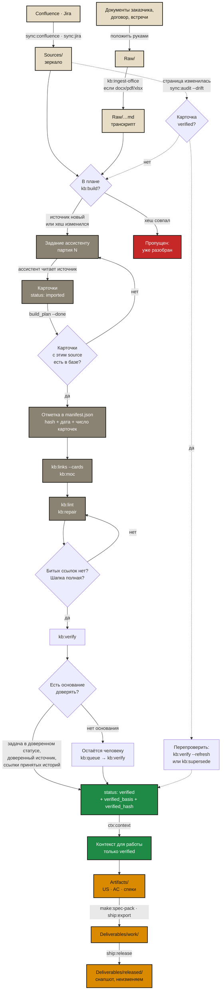
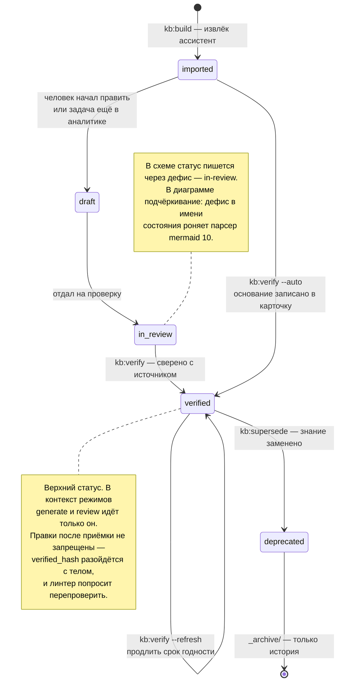

# Путь карточки знания

От файла, который лёг в `Sources/`, до документа, сданного заказчику. Каждый переход —
команда движка и **условие, при котором её пора запускать**. Здесь же сказано, что будет,
если этап пропустить: не все обязательны, но у каждого пропуска своя цена.

Документ описывает механику. Правила извлечения — `skills/aurora-vault/references/build.md`,
поля шапки — `frontmatter.md`, обслуживание — `maintenance.md`.

---

## Карта пути



---

## Этапы: что делает, чем отмечает, когда идти дальше

Колонка «обязателен» отвечает на вопрос «можно ли пропустить»: **да** — без него следующий
шаг не сработает или сработает неверно; **нет** — можно отложить, но в колонке сказано,
чем это отзовётся.

| # | Этап | Команда | Чем отмечается результат | Условие следующего шага | Обязателен |
|---|---|---|---|---|---|
| 1 | Зеркало источника | `sync:confluence`, `sync:jira` | файл в `Sources/`, запись в `sync_state.md` / `update_log.md` | синк закончился без ошибок; `sync:audit` не показывает MISSING | **да** |
| 2 | Свои документы | положить в `Raw/` руками | ничего — `Raw/` неизменяем по договорённости | файл на месте и не будет правиться | **да** для договоров и встреч |
| 3 | Офисные форматы | `kb:ingest-office` | `.md`-транскрипт рядом с оригиналом | транскрипт читаем (таблицы не рассыпались) | да, если исходник не markdown |
| 4 | План разбора | `kb:build` | ничего не пишет: только читает `manifest.json` | в плане есть непустые партии | **да** |
| 5 | Извлечение | задание из `kb:build` → ассистент | карточки со `status: imported`, `source:`, `source_synced:` | файл разобран **целиком** | **да** |
| 6 | Отметка о разборе | `kb:build --done <файл>` | запись в `manifest.json`: хеш, дата, число карточек | отметка принята (иначе ошибка) | **да** |
| 7 | Связи | `kb:links --cards` | поле `related:` в карточках | прогон закончился, связей добавлено ≥ 0 | нет: без него карточки не находятся по смыслу |
| 8 | Карты содержания | `kb:moc --apply` | файлы `MOC/*.md` | брошенных карточек стало меньше | нет: без него часть базы недостижима |
| 9 | Механика | `kb:lint`, `kb:repair --all` | отчёт; правки в карточках | битых ссылок нет, шапки полные | **да** перед приёмкой |
| 10 | Очередь | `kb:queue` | ничего | понятно, что проверять первым | нет |
| 11 | Приёмка | `kb:verify --auto` | `status: verified`, `verified`, `owner`, `review_by`, `verified_basis`, `verified_hash` | доля verified выше порога `bootstrap.verified_threshold_pct` | **да** — иначе знание не попадёт в контекст |
| 12 | Использование | `ctx:context` | `usage.log` | пак собран, шапки доверия на месте | **да** для работы модели |
| 13 | Артефакт | `make:*` | файлы в `Artifacts/` | `based_on` заполнен | **да** |
| 14 | Поставка | `ship:export`, `ship:publish` | docx/pdf, страница Confluence | документ вычитан | **да** |
| 15 | Фиксация | `ship:release --apply` | снапшот в `Deliverables/released/` + коммит базы | документ передан заказчику | **да** — иначе нечем доказать, что сдавали |
| 16 | Обратная связь | `sync:audit --drift`, `sync:jira-status` | отчёт | появился дрейф — вернуться к шагу 11 | **да**, еженедельно |

---

## Три отметки, которые не дают делать работу дважды

Это сердце процесса: каждая отметка отвечает на свой вопрос и живёт в своём файле.

| Отметка | Где живёт | Отвечает на вопрос | Кто ставит |
|---|---|---|---|
| версия страницы / `updated` задачи | `sync_state.md`, `update_log.md` | «скачивать ли заново» | синк, автоматически |
| хеш источника | `AuroraKnowledgeDB/meta/manifest.json` | «разбирать ли заново» | ассистент через `--done`, с проверкой по базе |
| `source_hash` в карточке | шапка карточки | «не изменился ли источник под уже принятым знанием» | `sync:audit --drift --stamp` |

**Первая** работает так: синк спрашивает у Confluence версию страницы и сравнивает с
записанной. Совпало — файл не перезаписывается, в git нет диффа. Плюс вторая сверка, уже
по содержимому: даже под `--force` файл переписывается, только если текст реально
изменился. Поэтому повторный синк не создаёт дублей и не шумит в истории.

**Вторая** решает, попадёт ли источник в задание ассистенту. Хеш совпал — источник не в
плане. Изменился — вернулся в план сам.

**Третья** ловит обратный случай: карточку уже приняли, а страница под ней поехала.

---

## Статусы карточки



Что означает каждый:

- **imported** — машина принесла, человек не смотрел. В контекст идёт только в режиме
  bootstrap (пока доля verified ниже порога) и всегда с пометкой «не считать фактом».
- **draft** — идёт работа, либо `kb:verify --by-jira` понизил карточку: связанная задача
  в статусе из `assumption_statuses`, то есть постановка ещё пишется.
- **in-review** — отдано на проверку человеку. Ступень необязательная, её пропускают.
- **verified** — знание. Обязателен `owner` и `review_by`; в `verified_basis` записано,
  **почему** поверили, в `verified_hash` — отпечаток тела на момент приёмки.
- **deprecated** — заменено, лежит в `_archive/`, отвечает только на вопрос «как было».

---

## Приёмка: пять оснований доверия

`kb:verify --auto` применяет их по очереди. Первое подходящее выигрывает, кроме случая,
когда задача Jira возражает — её вердикт сильнее (ветку объявляют доверенной целиком, а
конкретная страница в ней может ещё писаться).

| Основание | Флаг | Правило | Настройка |
|---|---|---|---|
| статус задачи | `--by-jira` | все связанные задачи в `trust_statuses` → `verified`; в `assumption_statuses` → `draft`; спорят — решает человек | `atlassian.jira.*_statuses` |
| происхождение | `--by-source` | источник начинается с доверенного префикса, либо карточка в доверенном разделе базы | `verify.trusted_sources`, `verify.trusted_sections` |
| заготовки | `--stubs` | карточка-заготовка ничего не утверждает; принимается, если на неё кто-то ссылается | — |
| связи | `--by-links` | на карточку ссылаются **только** принятые истории; повторяется по кругу | — |
| возраст источника | `--source-older-than N` | страница не менялась дольше N месяцев | — |

Карточка **не будет принята**, если у неё нет `source`, есть битые ссылки или статус уже
`deprecated`. Это не придирки: верифицировать сломанное — значит подписаться под тем, чего
не читал.

---

## Где чаще всего рвётся

| Симптом | Что произошло | Чем чинить |
|---|---|---|
| в плане снова файлы, которые вчера разбирали | ассистент не выполнил `--done` | посмотреть двойники: `kb:dedupe` |
| прогресс растёт, карточек не прибавляется | отметка ставилась без разбора (до 1.47.0 это было возможно) | `kb:build --reopen` |
| у источника одна карточка на 60 КБ текста | разбор оборвался на первых разделах | `kb:build --thin` |
| сотни битых ссылок после разбора | ассистент ссылался на карточки, которых нет | `kb:repair --links`, затем `--stubs` |
| один синоним у двух карточек | извлечение раздало алиасы щедро | `kb:repair --aliases` |
| `verified` мало, хотя база большая | не заданы `verify.trusted_sources` / `trust_statuses` | заполнить конфиг, затем `kb:verify --auto` |
| линтер ругается «правили после приёмки» | карточку дописали после `verified` | `kb:verify --refresh` либо понизить статус |
| в контекст лезет непроверенное | доля verified ниже порога — включён bootstrap | принять больше карточек или поднять порог осознанно |

---

## Минимальный цикл, если времени мало

```
sync:confluence → kb:build → [ассистент разбирает партию] → kb:build --done
   → kb:links --cards → kb:lint → kb:verify --auto → ctx:context
```

Всё остальное — `kb:moc`, `kb:queue`, `kb:repair`, `ops:trace` — улучшает качество базы,
но не является условием следующего шага. Единственное, что нельзя пропускать никогда:
**отметку о разборе** (иначе работа повторяется) и **приёмку** (иначе знание не работает).
