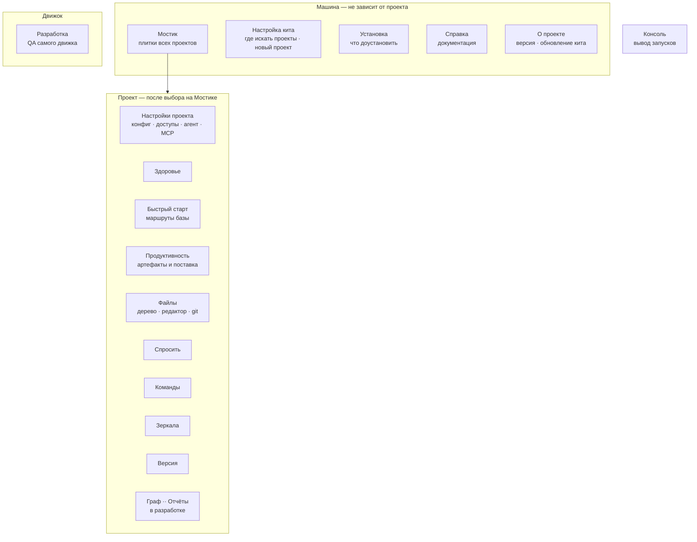
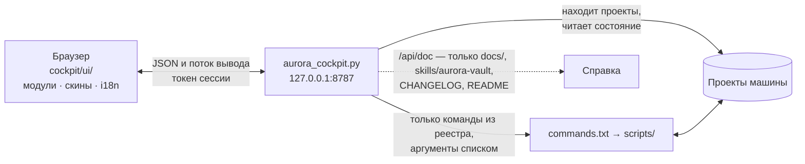

# Панель управления (Aurora Cockpit)

Локальная панель, в которой есть всё для ежедневной работы с Авророй: все проекты машины, здоровье
баз, запуск команд и маршрутов, редактор файлов, граф знаний, вопросы к базе, установка
недостающего, обновление движка и справка. Этот документ описывает, что она умеет, как устроена
и по каким правилам оформлена. English version: [en/control-panel.md](en/control-panel.md).

```bash
python3 aurora.py cockpit
```

Откроется браузер на `http://127.0.0.1:8787/?t=<токен>`.

## 1. Принципы

- **Одно окно.** Справка, команды, отчёты, установка, обновление и обзор проектов — внутри одного
  приложения; переход к проекту — маршрутизация, а не новое окно.
- **Движок — источник правды.** Панель ничего не считает сама: она вызывает команды и показывает
  вывод. Числа приходят от `stats --json`, `lint`, `doctor`, `audit`. Логика остаётся в ките.
- **Наблюдение безопасно, действие — по подтверждению.** Пишущая команда сначала показывается
  предпросмотром (без `--apply`); `--apply` панель сама не подставляет.
- **Никаких секретов в интерфейсе.** Про токены панель знает только «заполнено» или «пусто».
- **Офлайн.** Интерфейс не ходит в сеть: шрифты и библиотеки лежат в `cockpit/vendor/`. Сетевые
  только `sync:*` и `ship:publish`, и без токена их кнопки неактивны с объяснением.
- **Плотность и скорость.** Пользователь один, он же владелец данных, он же нажимает «применить».
  Нужны плотность и ответы на четыре вопроса без терминала: что сломалось и насколько срочно; что
  надо сделать руками, а что сделает скрипт; чего не хватает, чтобы заработало; какая версия движка
  где стоит.

## 2. Запуск и поиск проектов

Кит и проекты не обязаны лежать рядом. Список папок для поиска правится прямо в панели
(«Настройка кита» → «Где панель ищет проекты») и хранится в `~/.aurora/cockpit-roots.txt`; при
первом запуске туда попадает папка рядом с китом. Новый проект можно развернуть в любую папку — её
родитель добавится в список сам.

```bash
python3 cockpit/aurora_cockpit.py --port 9000             # другой порт
python3 cockpit/aurora_cockpit.py --add-root ~/work       # добавить папку в список
python3 cockpit/aurora_cockpit.py --roots ~/work ~/tmp    # только эти папки, разово
```

`⌘K` / `Ctrl+K` — палитра: команды, разделы, проекты. `Esc` — закрыть.

## 3. Разделы

Меню делится на три группы и консоль. Разделы-модули лежат папками в `cockpit/modules/`, остальные
живут в ядре (`cockpit/ui/`: `index.html`, `panel.js`, `panel.css`).



### Машина

| Раздел | Что показывает и делает |
|---|---|
| **Мостик** | Плитки всех проектов на машине: версия движка, доля `knowledge`, блокеры `doctor`, ошибки линтера, ветка и незакоммиченное; видно, где работа идёт, а где встала. Цвет ауры — тяжесть проблем: бирюзовый — порядок, янтарный — стоит посмотреть, красный — блокеры |
| **Настройка кита** | Где панель ищет проекты; подключение нового проекта (форма задаёт те же вопросы, что `aurora_setup.py`, и пишет тем же скриптом); весь конфиг текстом |
| **Установка** | Чего не хватает на машине и в проекте и какие команды без этого не работают; надстройки движка (Pydantic AI, graphify) — текущая версия против последней в git |; «Aurora MCP в ассистентах» — ассистенты машины и подключение к ним сервера Авроры, с копией и возвратом
| **Справка** | Документация с оглавлением: слева что открыть, справа текст. Показывает только файлы из `docs/`, `skills/aurora-vault`, `CHANGELOG.md`, `commands.txt`, `README.md` |
| **О проекте** | Версия, репозиторий, лицензия, последние выпуски и **обновление самого кита из репозитория кнопкой** (только перемотка вперёд; при незакоммиченных правках отказывает). Семь нажатий на пункт «О проекте» открывают режим «Разработка» |

### Проект

| Раздел | Что показывает и делает | Команды |
|---|---|---|
| **Настройки проекта** | Доступы (токены Confluence и Jira — «заполнено / пусто»), конфиг, виды артефактов, шлюзы и роли агента, MCP-серверы проекта и машины (машины видны, но правятся в ките) | `agent:ping`, `agent:probe`, `kit:mcp` |
| **Здоровье** | Блокеры doctor (первая плитка: отчёт «что сломано, почему мешает, как исправить»), состав базы, доверие, связи, ошибки, свежесть зеркал и остаток человеку; каждая плитка кликабельна и ведёт к команде, которая с этим работает. Здесь же «Незаконченные» производства | `kb:lint`, `kb:repair`, `kb:embed`, `kb:kind`, `ops:trace`, `ops:trace-table`, `ops:todo`, `ops:retrieval`, `make:spec-pack`, `sync:jira-status` |
| **Быстрый старт** | Маршруты обслуживания базы: «Обновить базу», «Починить базу», «Пересобрать базу с нуля». Шаги идут сверху вниз; шаги-человек помечены и не запускаются; «Посмотреть» проходит тот же маршрут без записи. Остановленный маршрут встаёт туда, где стоял | — |
| **Продуктивность** | «Написать артефакт» и «Сдать документы». Задача пишется своими словами: понимает `@путь` (файл или папка проекта), `/навык` (метод навыка уходит в задание), `@сервер` (MCP подключается сразу), вложения (живут две недели) | `agent:make`, `ship:publish` |
| **Файлы** | Дерево проекта, редактор markdown с таблицами, mermaid и формулами, «Показать в папке», «Открыть системным», «Зафиксировать» и «Отправить» (git) | — |
| **Спросить** | Вопрос своими словами: движок собирает контекст из карточек, модель отвечает только по ним — ролью по её цепочке или ровно выбранной моделью провайдера; разговоры хранятся в `meta/ask/` и видны всем | `agent:ask` |
| **Команды** | Весь реестр: исполнитель, модификаторы, версия появления, последний запуск. Запускаются команды-скрипты; у команд-процедур открывается описание | реестр |
| **Зеркала** | Состояние Confluence, Jira и сайтов, наличие токенов, цепочка синк → аудит → дрейф, подключение модулей источников | `sync:audit`, `sync:diff`, `sync:jira-status`, `kit:remap-sources` |
| **Версия** | Движок проекта против кита, предпросмотр обновления, миграция чужого проекта | `kit:update`, `kit:doctor` |
| **Граф** *(в разработке)* | Карточки и связи между ними: способ дойти до карточки, а не отчёт. Окрестность названной карточки, клик открывает её в редакторе. Аналитика (сообщества, мосты, острова) — за `kb:map` | `kb:links`, `kb:map` |
| **Отчёты** *(в разработке)* | Дашборды из выгрузок Jira и Confluence, в том числе эффективность аналитиков | `ops:report` |

### Движок и консоль

**Разработка** *(в разработке)* — контур самого движка: прогон сценариев, покрытие изменений,
тест-кейсы (`dev:qa-*`). **Консоль** — потоковый вывод запусков, код возврата, история; цвет строки
приходит от самого движка. Прогон маршрута раскрывается по шагам, в шапке видны модель, бэкенд и
скорость.

Разделы, помеченные `dev: true` в манифесте, скрыты, пока не открыта «Разработка».

## 4. Редактор и фиксация

Документы правятся в панели («Проект» → «Файлы»). Формат остаётся Obsidian-совместимым — кто хочет,
работает там же. Редактор **не правит** то, что нельзя править по правилам Авроры, и каждый запрет
объясняет словами:

- `Deliverables/released/` и доказательную часть `Raw/` (`contract`, `meetings`, `laws`, `customer`);
- зеркала `Sources/`;
- карточки `kind: document` и всю `AuroraKnowledgeDB/`, кроме `Decisions/`, `Questions/` и `meta/`
  (карточка выводится из источников, и правка руками исчезнет при следующей сборке).

Запрет «править нельзя» заканчивается действием: на карточке есть кнопка **«Исправить»** (команда
`kb:correct`). Если файл изменился на диске, пока был открыт (агент дописал, синк принёс чужое),
расхождение не затирается молча — показываются обе версии и выбор.

Двенадцать скриптов движка отказываются работать по незакоммиченному дереву, поэтому «Зафиксировать»
стоит рядом. Храповик pre-commit судит то, что коммитят, а не всю базу; «Зафиксировать всё равно»
снимает только его — проверку внутренних названий не снимает ничто.

Готовый артефакт открывается в редакторе сам; публикация идёт оттуда же и сначала показывает
**чистовик** — тело до маркера `<!-- ниже — производство, в чистовик не идёт -->`.

## 5. Как это устроено



- **Сервер** — `cockpit/aurora_cockpit.py`, только стандартная библиотека. Ядро интерфейса — один
  HTML-файл; разделы — папки `cockpit/modules/<id>/` с манифестом, разметкой, скриптом и своими
  строками. Раздел появляется в меню сам и грузится по требованию. Контракт модулей —
  [cockpit/modules/README.md](../cockpit/modules/README.md).
- **Интерфейс переводится** каталогами `cockpit/i18n/<язык>.json` (ядро) и `modules/<id>/i18n/`
  (разделы): русский и английский. То, что отдаёт сам сервер, — описания команд и их флагов,
  маршруты, названия скинов, описания коннекторов, находки доктора, сообщения об ошибках, —
  переводится по таблице `cockpit/i18n/data/<язык>.json`: страница просит язык (`?lang=en`), сервер
  отвечает на нём. Строка без перевода показывается по-русски, поэтому полноту проверяет
  `kit:i18n --check`; `--new <код> <название>` заводит язык. Вывод самих команд (консоль,
  отчёты линтера) остаётся русским: это язык движка, а не панели.
- **Задания** живут в процессе панели: `/api/jobs` возвращает идущие, поэтому перезагрузка
  страницы не прячет работающую команду и не провоцирует второй маршрут поверх первого. Архив
  последних прогонов — `.aurora/runs/` (вне git).
- **Данные.** Где команда умеет `--json` (`stats`), панель берёт его; остальное разбирает по
  ключевым строкам (`ERROR:`, `WARN:`, `OK:`, «ошибок N», `MISSING`/`ORPHAN`).

## 6. Безопасность

- Сервер слушает **только `127.0.0.1`** и требует токен сессии, выданный при старте. Токен живёт в
  памяти процесса: перезапустили — адрес сменился.
- Выполнить можно **только команды из реестра**; аргументы уходят списком, без оболочки; флаг,
  не объявленный командой, отклоняется.
- Проект выбирается из списка обнаруженных, произвольный путь не принимается.
- Читать документы можно только из `docs/`, `skills/aurora-vault`, `CHANGELOG.md`,
  `commands.txt`, `README.md`.
- Файлы разделов (код, а не данные проекта) отдаются без токена, чтобы работал относительный
  импорт внутри раздела.
- Секреты форма не принимает и не показывает.

## 7. Оформление

Оформление вынесено из разметки в **скины** — файлы `cockpit/skins/*.css`: панель задаёт
структуру, скин — значения. Положили свой `.css` — он в списке; имя, описание и версию ядра
(`for:`) берут из шапки файла. Скин правит только токены, селекторы разметки не трогает; тема
(светлая/тёмная) работает поверх скина. Контракт и список токенов — [cockpit/skins/README.md](../cockpit/skins/README.md).

| Скин | Характер |
|---|---|
| **Зин 2.0** (по умолчанию) | бумага в точку, чернильные рамки, жёсткие тени, заголовки капсом золотом — [требования](skin-zine-requirements.md) |
| **Приборы** | тихая рубка: полуночный фон, волосяные линии, цвет только на статусе; самая плотная |
| **Редакция** | журнальный разворот: тёплая бумага, засечки, воздух; для долгого чтения |
| **Контраст** | чёрный фон, толстые границы, крупный кегль; для проекторов и слабого зрения |
| **Единорог** | карамель и круглые углы; контраст AA держится |

Три слоя токенов: **палитра** (скин) → **смысл** (`--bg`, `--text`, `--tier-*`, шкала кеглей) →
**компонент** (`--btn-*`, `--card-*`, `--chip-*`). Компонент читает только третий слой.

Цвет несёт смысл, а не украшение: статусы карточек (`--tier-*`) должны различаться на глаз в любом
списке, красный — только ошибки и блокеры, «аура» проекта на Мостике — тяжесть проблем. Контраст
текста не ниже WCAG AA, анимации глушатся `prefers-reduced-motion`, на узком экране (от 320 px)
меню превращается в ленту с подписями.

## 8. Нефункциональные требования

- Один HTML и стандартная библиотека на сервере; ничего не нужно собирать (`cockpit/vendor/README.md`
  объясняет, почему сторонние библиотеки лежат готовыми сборками и не правятся).
- Отзывчивость от 320 px до десктопа; таблицы и логи со своим горизонтальным скроллом.
- Тяжёлые команды — асинхронно, с потоком вывода; дашборд из `stats --json` открывается быстро.
- Панели нет в `engine_manifest.txt`: она живёт только в ките и оттуда запускается.
