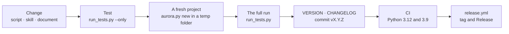

# Contributing

How to make changes to the kit: what is welcome, what is not, how the development loop works, how to add commands, source
modules, panel sections and skins, and how to release versions. Русская версия: [../CONTRIBUTING.md](../CONTRIBUTING.md).

## The main rule

**The kit is an independent installer and engine, not a customer's knowledge base.** It goes to a public git, so:

- skills, templates, defaults and documentation contain no client names, perimeter addresses, space or project keys;
- examples and numbers in documents are anonymised; live data and private names stay in `local/` and `Development/` (both are
  closed by `.gitignore`);
- the `commit-msg` hook installed by `kit:hooks` in the kit itself compares a commit message with the list
  `local/private_terms.txt` and does not let internal names into history. It is never bypassed — `--no-verify` does not suit it.

## What is welcome

- improvements to the `skills/aurora-vault/` procedures and to the clarity of the card schema;
- hardening the installer, the update and the linter;
- new common templates and prompts (`scaffold/`);
- source modules, panel sections, skins, interface translations;
- migration lessons recorded anonymously — into the documentation.

## What is not done

- do not commit customers' materials, Jira exports and private Confluence pages;
- do not hard-code one company's space or project into defaults;
- do not break the installer's safety ("existing files are not overwritten") without a `--force` path;
- do not add runtime dependencies: the engine runs on the standard library;
- do not create your own artifact types and top-level folders in a project — it is a change to the whole kit
  ([decisions](roadmap.md#why-the-folder-structure-is-fixed)).

## The development loop



```bash
# a local check on a fresh project
python3 aurora.py new /tmp/aurora-demo --non-interactive
cd /tmp/aurora-demo
python3 .aurora/scripts/aurora_doctor.py --structure
python3 .aurora/scripts/kb_lint.py --summary

# the kit's tests (from the kit root)
python3 tests/run_tests.py --smoke          # invariants from the sources, fast
python3 tests/run_tests.py --only <part of a name>   # one check
python3 tests/run_tests.py                  # everything: hundreds of checks on synthetic projects
python3 scripts/kit_commands.py --check     # the registry against the engine
python3 scripts/kit_i18n.py --check         # completeness of the panel's translations
```

### Three levels of checks

| Level | By | What it catches |
|---|---|---|
| Fixtures | `python3 tests/run_tests.py` | "a script does what was intended": every test builds a project from scratch in a temp folder |
| The golden corpus | the same run, data in `tests/corpus/` | "the engine sees real shapes as yesterday": homoglyphs, duplicates, legacy headers, personal data next to requisites, NFD names, artifacts in knowledge; the numbers are fixed in `EXPECTED.json` |
| The live base | `python3 tests/smoke_live.py <project>` | "nothing moved on this project": a snapshot of numbers and names in the project's own `meta/smoke_snapshot.json` (`--update` after a deliberate edit) |

The corpus is rebuilt by `python3 tests/make_corpus.py` and lies in git. Found a new pathology in the field — add it to the
corpus, otherwise it will come back. A bug found by hand is closed by a check that fails **without** your fix; the cause is
established first, not guessed from the symptom.

CI (`.github/workflows/test.yml`): `--smoke` and the full run on Python 3.12, and also compilation and `--smoke` on Python
3.9 — the minimum supported. Do not write syntax only newer versions understand (for example quotes of the same kind inside an
f-string).

## Engine code rules

- **The standard library.** Optional packages (`bs4`, `markdownify`, `pypdf`…) are imported lazily, with a clear refusal if
  absent.
- **A script that writes makes a preview by default**, and writing is turned on by `--apply`. A mass write goes through the
  git-guard and refuses on a dirty tree (`--allow-dirty` — deliberately).
- **Shared primitives live in `aurora_common.py`:** parsing a card's name (`card_stem`), the status scale, reading the config,
  UTC time. Your own copy of `os.path.splitext` in a script is an invitation to a bug.
- **File names** pass the Windows, macOS and Linux rules ([knowledge rules, section 11](knowledge-rules.md)).
- **The agent writes only through whitelisted commands** (`ALLOWED_WRITES` in `agent_core.py`); a new write by the model is a
  new command with a preview, not a direct file edit.
- **The model does not decide about trust and does not answer without support.** A claim without support is not carried into
  an artifact.
- **A command's name is one across the panel, the registry and reports.** Reports to a human name `kb:dedupe`, not the path to
  a script.

## How to add a command

1. A script in `scripts/`; in its docstring a line ``Панель: `<set>:<command>` `` ("Panel: …") — a test checks it against the
   registry.
2. A line in `commands.txt`: `set | command | aliases | executor | implementation | since version | description`. The executor
   is `скрипт`, `модель` or `скрипт+модель`.
3. A file in `engine_manifest.txt` (`scripts/x.py => .aurora/scripts/x.py`), otherwise it will not reach projects.
4. A line in the table of `skills/aurora-vault/SKILL.md` and, if it is a procedure, in `references/`.
5. Regenerate the reference: `python3 scripts/kit_commands.py --md docs/commands.md` (the file is not edited by hand). The
   English description of the command and of its new flags goes into `cockpit/i18n/data/en.json` (sections `commands`,
   `flags`); then `python3 scripts/kit_commands.py --en-md docs/en/commands.md`. Without a translation
   `kit_i18n.py --check` is red.
6. A test; a CHANGELOG entry.

A command that needs a button in a route is added with a line to `cockpit/scenarios.txt`; the step's explanation is translated
in `cockpit/i18n/data/en.json` (section `scenarios`, the key is the Russian text).

## How to add a source module, a panel section, a skin

| What | Where | The contract |
|---|---|---|
| A source module | the folder `connectors/<id>/` with `connector.json`, `SKILL.md` and a script | [connectors.md](connectors.md) |
| A panel section | the folder `cockpit/modules/<id>/` | [cockpit/modules/README.md](../../cockpit/modules/README.md): a manifest, `mount`/`refresh`, strings through `t()`, keys prefixed with the section |
| A skin | the file `cockpit/skins/<name>.css` | [cockpit/skins/README.md](../../cockpit/skins/README.md): tokens only, both theme states |
| An interface language | `cockpit/i18n/<code>.json`, `modules/*/i18n/<code>.json` and `cockpit/i18n/data/<code>.json` | `python3 scripts/kit_i18n.py --new <code> "<name>"`, then `--check`; `data/` holds the translation of what the server hands out: commands, flags, routes, skins, connectors, error messages |
| An artifact type or a schema folder | `structure_dirs.txt` + the tables in `SKILL.md` and `templates/meta/conventions.md` + CHANGELOG | a kit change: arrives in all projects with one `update` |

The panel's third-party libraries (`cockpit/vendor/`) are not edited — only replaced whole (see `cockpit/vendor/README.md`).

## Versions and releases

- The version is semver in the `VERSION` file; the panel reads it and `update` writes it into the project's
  `AuroraKnowledgeDB/meta/aurora_version.txt`.
- Every release is an entry in `CHANGELOG.md` (Russian text): `## X.Y.Z — the gist`, below it what and why changed. A breaking
  schema change is marked **BREAKING** with a migration step.
- A commit message starts with the version: `vX.Y.Z: the gist`.
- **How to release, in short:** 1) raise `VERSION`; 2) add a `## X.Y.Z — the gist` entry to `CHANGELOG.md`;
  3) raise `UI_VERSION` in `cockpit/ui/panel.js` (a test checks it); 4) merge to `master`. CI does the rest (see below).
- **CI creates the tag and the GitHub Release** — `.github/workflows/release.yml`. After a green `engine-tests` on
  `master` it looks at `VERSION`: if that version has no Release yet, it puts the tag `vX.Y.Z` on the commit that
  raised `VERSION` (like the earlier tags) and publishes the Release. The title `vX.Y.Z — the gist` and the text come
  from that version's entry in `CHANGELOG.md`; no entry — no release, and the workflow fails with a clear error. You
  do not need to tag by hand; if you did, the Release still lands on your tag. The workflow never overwrites an
  existing tag or Release, so running it again is safe. To repeat a release by hand — Actions → release → Run workflow
  on `master`; to switch it off — delete the file or disable the workflow in the Actions tab.
- Before a release these are green: `tests/run_tests.py`, `kit_commands.py --check`, `kit_i18n.py --check`.
- The `Development/` folder (the QA kitchen: cases, scenarios, run journals) does not ride in the kit's git; it is mounted as a
  worktree of the `development` branch: `git worktree add Development development`.

## Documentation

The documentation is bilingual: the Russian one lies in `docs/` (that is how the panel opens it), the English one mirrors it in
`docs/en/`; the repository root has `README.md` (English) and `README.ru.md`. Rules:

- **Edit a Russian document — edit its English twin.** The file and heading structure match.
- The command reference `docs/commands.md` is **generated**; detailed procedures for the assistant live in
  `skills/aurora-vault/references/` and are not copied into human documents — they are linked.
- `docs/knowledge-rules.md`, `knowledge-rules-tldr.md` and `накопление-знания.md` travel to projects with the engine
  (`engine_manifest.txt`) and are pinned by tests: when changing them, run the tests.
- **The wiki** — answer pages in `wiki/` (English) and `wiki/ru/` (Russian), the same set in both; a new page is a pair of files
  and a link from `README.md` and `_Sidebar.md`. `python3 scripts/wiki_build.py --check` verifies links, anchors, pairs and
  reachability, and the tests do the same; the `wiki-sync` workflow publishes the pages into the Wiki tab — the source of truth
  stays in the repository. When you change behaviour, change the page in the same pull request.
- Diagrams are mermaid, so that they render on GitHub and are edited as text. Colons inside state and node labels without quotes
  break parsing — quote the label or avoid the colon.
- Numbers and versions in documents are either computed (`commands.md`) or dated; "forty commands" goes stale faster than it seems.
- The paths the code refers to (`docs/readme/*.md`, `docs/commands.md`, `docs/roadmap.md`,
  `docs/control-panel-ui-requirements.md`, `docs/INSTALL.md`, `docs/knowledge-rules*.md`) are not renamed without changing the
  panel and the tests.
