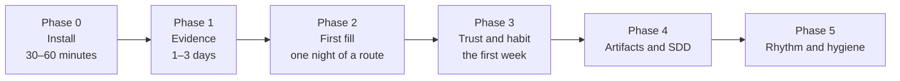

# Rolling Aurora out in a project

A plan for the lead, the system and business analysts who introduce the framework to a team: phases, assistant setup,
migrating an accumulated base, success criteria and anti-patterns. Русская версия:
[../IMPLEMENTATION.md](../IMPLEMENTATION.md).

## Why

An LLM agent hallucinates when all Markdown looks the same. Aurora separates:

1. **Evidence** (`Raw/`, `Sources/`) — immutable or owned by sync;
2. **Knowledge** (the `AuroraKnowledgeDB/` cards) — the trust filter for prompts; the status is computed by the engine
   from issue statuses and the source's origin;
3. **Products** (`Artifacts/`, `Deliverables/`) — produced work; it is not fed back into prompts as "truth".

The invariants that are never broken are in the project's `.opencode/skills/aurora-vault/SKILL.md` and in the
[knowledge rules](knowledge-rules.md).

## Rollout phases

### Phase 0 — install (30–60 minutes)

[INSTALL.md](INSTALL.md): `aurora.py new`, tokens, `kit:doctor`, `kit:hooks`. Commit the scaffold. **Do not** enter domain
cards by hand: the engine builds the base.

### Phase 1 — evidence first (1–3 days)

Lay down only real materials:

| Material | Where |
|---|---|
| Contract, spec, additional agreements | `Raw/contract/` |
| Laws, regulations | `Raw/laws/` |
| Meeting transcripts and minutes | `Raw/meetings/` |
| Customer materials: AS-IS, decks | `Raw/customer/` |
| Living project notes, concepts | `Raw/project/` |
| Confluence and Jira mirrors, site pages | through sync → `Sources/` |

Set in the config the Confluence roots, JQL, Jira trust statuses (`trust_statuses` / `assumption_statuses`), the wiki's
reference branches and trusted sections — the share of `knowledge` depends on them.

### Phase 2 — the first fill

In the panel — the "Update the base" route (Preview first). On a large project it takes hours: start it for the night, you
can stop at any time. Then `ops:stats` and "Health". Add five to ten **golden questions** to
`AuroraKnowledgeDB/meta/golden_questions.md` once confirmed facts exist: `ctx:eval` catches regressions by them after
syncs and migrations.

### Phase 3 — trust and habit (the first week)

Trust is computed by itself, and a human is left with three things: write what the sources lack (DRs, questions,
corrections), work through `ops:todo` and press "Update" and "Fix". If the share of `knowledge` is low, it is not an
emergency: either issues are in progress or tracing found no links. Check `trust_statuses`, story numbers in page
titles, issue keys in the text.

### Phase 4 — artifacts and SDD

- Stories — `Artifacts/us/`, criteria — `Artifacts/ac/` (`agent:make`; kinds are declared in the config's `artifacts:`:
  template, folder, rules);
- specs — `AuroraKnowledgeDB/Specs/` (`make:spec`), then `make:spec-pack` for a contractor;
- tracing: spec → REQ → SPEC → Jira → AC → PMI → acceptance (`ops:trace`) — [SDD](readme/06-sdd.md).

### Phase 5 — rhythm and hygiene

Weekly: "Fix the base", `ops:todo`, `kb:garden`. Monthly: `ops:stats --append-metrics`, `ops:search-quality`. After large
syncs: `ctx:eval` on the golden questions. Once per release: `kb:schema`, `tests/smoke_live.py <project>`.

## Assistant setup

1. Open the **project** (not the kit) as the IDE's workspace root.
2. Make sure `AGENTS.md` is picked up as the project's instruction.
3. Skills lie in `.opencode/skills/`; `kit:skills --apply` puts them in the agent's shared folder (`~/.claude/skills`) —
   then `/aurora-vault` is found in any conversation.
4. Optionally connect the Atlassian MCP for sync skills and **the knowledge base as an MCP** (`kit:mcp`: a ready line for
   Claude Code, Cursor, OpenCode; the server only reads).

| Tool | What to set up |
|---|---|
| Cursor | the rules `.cursor/rules/atlassian.mdc`; open the project root |
| Claude Code, OpenCode | skills from `.opencode/skills/aurora-vault/`; the commands `/aurora-vault <command>` |
| Any | `kit:mcp` → an `mcpServers` entry named `aurora-<slug>` |

## Migrating an accumulated base

In detail — `skills/aurora-vault/references/migration.md` (in Russian). In short:

1. Deploy Aurora **without** `--force`.
2. Lay the old out:

| Was | Becomes |
|---|---|
| `Laws/`, `docs/legal/` | `Raw/laws/` |
| `Transcripts/`, `meetings/` | `Raw/meetings/` |
| a root `JIRA/` | `Sources/JIRA/` (via `sync:jira` or `kit:remap-sources`) |
| a flat `AuroraKnowledgeDB/ZK-*.md` | `AuroraKnowledgeDB/…` sections + a header upgrade (`kb:repair`, `kb:schema`) |
| working BPMN and drafts | `Workspaces/<task>/` |
| accepted decisions | `Decisions/DR-NNNN-…` with `status: accepted` |

3. Do not carry statuses over: `fact`, `confirmed`, `verified` mean nothing in the new model — `kb:trust` computes trust
   from issues and sources. The engine reads old `verified` and `imported` and moves them to the new scale in one run.
4. Keep the old identifiers in `aliases:` so that wiki links keep working.
5. Rebuild `manifest.json` by ordinary parsing ("Update the base").
6. Run "Fix the base".

## Success criteria

- [ ] `kb:lint`: 0 errors;
- [ ] `AGENTS.md` matches the real folder tree;
- [ ] `kit:doctor --structure` has no blockers;
- [ ] the share of `knowledge` grows with issues moving, not from editing headers;
- [ ] the golden questions pass `ctx:eval`;
- [ ] artifacts produced from context packs name the cards in `based_on`;
- [ ] `ops:todo` is worked through weekly and does not grow.

## Anti-patterns

- Raising the share of `knowledge` by editing headers: trust is computed, not assigned.
- Editing cards by hand — the next build erases the edit; what is wrong is corrected with `kb:correct`.
- Putting AI-produced drafts into `AuroraKnowledgeDB/`.
- Editing `Deliverables/released/` or `Raw/contract/`.
- Feeding `Artifacts/` back into prompts as truth.
- Deleting cards instead of `kb:supersede`.
- Writing into mirrors bypassing sync or keeping foreign things in `Sources/`.
- Creating your own top-level folders: non-standard things belong to `Workspaces/`.
- Committing `.env.aurora.local`.
