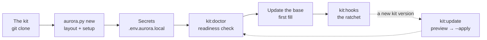

# Installation, configuration and updates

How to deploy Aurora into a project, what appears as a result, how settings and secrets work, how to
connect models and how to update the engine. Русская версия: [../INSTALL.md](../INSTALL.md).



## Requirements

- Python 3.9+ and git; write access to the project folder; the kit cloned locally
  (`git clone https://github.com/<org>/aurora-studio.git`).
- The engine runs on the standard library. The rest is needed only by individual commands:

| What | For | How to install |
|---|---|---|
| `pandoc` | `ship:export` (Markdown → docx/pdf) | your system's package manager |
| `beautifulsoup4`, `markdownify`, `lxml` | `sync:confluence` | `pip install` or "Install" in the panel |
| `markitdown`, `openpyxl`, `pypdf` | `kb:ingest-office` | `pip install` or "Install" |
| Pydantic AI | every model call goes through it | "Install" → "Engine add-ons" (a venv in `~/.aurora/`) |
| graphify | graph themes, an MCP server over the graph, HTML/Neo4j exports | the same |
| Obsidian | wiki-link navigation | optional: the format is compatible |

What is missing on the machine and in the project: `python3 aurora.py doctor <project>` or the "Install"
section of the panel — it names which commands do not work without it.

## 1. Deploy a project

From the kit root:

```bash
python3 aurora.py new /absolute/path/to/your-project
```

On Windows write `py -3` (or `python`) instead of `python3`: Python from python.org or winget does not
install a `python3` command, and the one in WindowsApps is a Store stub. `start-aurora.bat` and the git hooks pick the
interpreter themselves.

The command does four steps:

1. **Layout** (`install_aurora.py`): folders by `structure_dirs.txt`, a copy of the engine into
   `.opencode/`, `aurora.config.yaml`, a sample of secrets, `AGENTS.md`, the service files of
   `AuroraKnowledgeDB/meta/`, templates and prompts, sync skills, `.gitignore` rules.
2. **Setup** (`aurora_setup.py`): interactive questions — project name and slug (the slug goes into the
   sync skills' names), Confluence (URL, space, root pages by `page_id` from the URL `…pageId=NNN`), Jira
   (URL, project key, default JQL), trust statuses, the list of web pages, the bootstrap threshold.
3. **Aligning the engine with the settings** (`aurora_update.py --apply`): `AGENTS.md` and the sync skills'
   bodies are filled from the config, the engine version is written to
   `AuroraKnowledgeDB/meta/aurora_version.txt`.
4. **Skills** (`install_skills.py`): `aurora-vault`, `aurora-grill`, `aurora-dev` are copied into the
   agent's shared folder (`~/.claude/skills`) so that `/aurora-vault` is found in any conversation.

If there is no terminal (a launch from the panel, a script, CI), the questions are not asked: defaults are
taken and the config is filled in later — `python3 aurora.py setup <project>`. By default the installation
**never overwrites** existing files; running it again is safe.

The panel does the same: "The kit's setup" → "Connect a new project".

### Without questions (scripts, CI)

```bash
python3 scripts/install_aurora.py \
  --target /absolute/path/to/your-project \
  --name "Project Display Name" --jira-key PROJ --confluence-space SPACE
```

| Flag | Meaning |
|---|---|
| `--target` | project root (created if missing) |
| `--name` | human name → `AGENTS.md`, reports, the sync skills' slug |
| `--slug` | short identifier (from the name by default) |
| `--jira-key` | Jira project key |
| `--confluence-space` | Confluence space key |
| `--dry-run` | only show the actions |
| `--force` | overwrite existing files (dangerous) |

### Settings can be changed at any time

The setup is copied into the project and anyone can re-run it — current values are pre-filled, Enter keeps
them:

```bash
cd /path/to/your-project
python3 .opencode/scripts/aurora_setup.py
```

In the panel: "The project's settings". The form there asks the same and writes with the same script; below it
is the whole config as text, for what the form lacks.

## 2. What appears in the project

```text
AGENTS.md                     rules for any agent that opens the folder
aurora.config.yaml            project settings (in git)
aurora.env.local.example      a sample → .env.aurora.local (outside git)
.gitignore                    engine rules appended line by line, other lines untouched
.cursor/rules/atlassian.mdc   a pointer to aurora.config.yaml for Cursor
.opencode/
  scripts/                    the engine (a copy from the kit)
  skills/aurora-vault/        the skill and the procedure references
  skills/aurora-grill/        the planning-interview skill
  skills/confluence-sync-<Slug>/ · jira-export-<Slug>/   the project's sync skills
  connectors/                 manifests of connected source modules
  docs/                       the knowledge rules (they travel with the engine)
  reports/analyst/            the analyst-efficiency dashboard
  vendor/                     the offline graph library
  structure_dirs.txt · commands.txt · moc_groups.txt · kit_path.txt
  update_ignore.txt           optional: paths the project keeps itself (glob)
Sources/                      mirrors of connected modules: Confluence, JIRA, Web
Raw/{laws,contract,customer,project,meetings,examples,corrections}/
AuroraKnowledgeDB/            Concepts, Processes, Glossary, Systems, Roles, Statuses, Reference,
                              Requirements, Specs, Questions, Decisions, MOC, _archive, _assets,
                              _inbox, meta
Artifacts/{us,ac,algorithms,dictionaries,screens,contracts,mappings,role-model,diagrams,
           acceptance,tests,reviews,reports,drafts,meetings}/
Deliverables/{work,work/spec-packs,released,_archive}/
Workspaces/_archive/
Templates/ · TemplatesCommon/ · Prompts/ · Settings/
start-aurora.command · start-aurora.bat      launch files
```

The folder list is **fixed by the engine** (`structure_dirs.txt`) and identical in every Aurora project;
anything non-standard lies in `Workspaces/<task>/`. A folder needed only by this project (legacy of an old
base, attachments) is declared in `aurora.config.yaml` → `paths.extra_structure_dirs`: `doctor` accepts it
there and nowhere else. `Deliverables/_archive/` is storage for delivery packages and versions taken off
work: it is neither a working version nor a delivered one.

## 3. Settings: `aurora.config.yaml`

The file is in git; **secrets are not put here**. URLs, spaces, keys and JQL live only here — skills and
scripts read them from here, not from their own bodies.

| Section | What it configures |
|---|---|
| `project` | `name`, `slug` |
| `skills` | which skills are required and recommended |
| `sources` | connected source modules: `id` (the folder name in `Sources/`), `module`, `path`. No section — the built-in Confluence and Jira work |
| `atlassian.confluence` | `base_url`, `space`, `sync_roots` (a list of roots: `page_id`, `title`, `trusted`) |
| `atlassian.jira` | `base_url`, `project_key`, `default_jql`, `done_statuses`, `cancelled_statuses`, **`trust_statuses`**, **`assumption_statuses`** |
| `web` | `pages` (a list of `url` + `trusted`), `depth`, `assets`, `max_pages` — for the `web` module |
| `paths` | base and mirror paths, `extra_structure_dirs` |
| `verify` | `trusted_sources` (folders and files trusted by path), `trusted_branches` (reference wiki branches by name) |
| `privacy` | `scrub`: `off` · `report` (default) · `mask`; `mask_contacts`, `include_raw` |
| `reports.analyst` | the year, roster, events, the folder of exports and the dashboard's output file |
| `artifacts` | the registry of the project's artifact kinds: `title`, `template`, `out`, prompt, `tech_agnostic` (`make:kinds`) |
| `graphify` | `code_dirs` — folders with code for `kb:code-graph` |
| `bootstrap` | the `knowledge` share threshold below which drafts are admitted into packs with a loud header |

**How trust depends on the config.** Issue statuses from `trust_statuses` make a linked card `knowledge`;
from `assumption_statuses` — `draft`. An empty list means the defaults (`aurora_common.TRUST_DEFAULTS`). A
Confluence section with `trusted: true` at its root is trusted whole, a web link — by its own `trusted`
tick. All rules are in [knowledge-rules.md](knowledge-rules.md).

## 4. Secrets: `.env.aurora.local`

Copy `aurora.env.local.example` to `.env.aurora.local` next to `aurora.config.yaml`. The file is
git-ignored; secrets never reach git.

Why a separate file when Atlassian is already set up in Cursor: the MCP lives inside the editor and does not
hand out its credentials, while sync scripts go to Confluence and Jira directly over REST.

| Variable | For |
|---|---|
| `CONFLUENCE_PERSONAL_TOKEN` (or `CONFLUENCE_PAT`) | a token for Confluence Data Center 7.9+ / Server |
| `CONFLUENCE_USER` + `CONFLUENCE_PASSWORD` | a fallback if tokens are unavailable |
| `JIRA_PERSONAL_TOKEN` (or `JIRA_PAT`) | a token for Jira Server / Data Center |
| `JIRA_USER` + `JIRA_PASSWORD` | a fallback |

Check that a token is accepted: `python3 .opencode/scripts/jira_export.py --limit 1`.

## The built-in agent

Needed by the `agent:*` commands, semantic search (`kb:embed`) and scan recognition. Without it everything
else works.

### Models — one setup per kit

Models are set up **once per kit** and apply to all its projects: the "Models" section of the panel, the
file `<kit>/local/models.json` (outside git, mode 600). A project has no model setup of its own. The order
follows the need:

1. **Providers** — connections: a name, a type (`openai`, `llama.cpp`, `vllm`, `sglang`, `ollama`, `tei`),
   the URL of an OpenAI-compatible API, a key, the width (how many requests it holds at once — "Measure
   gateways" measures it), "in parallel" and the model's template fields (JSON, e.g.
   `{"reasoning_effort": "xhigh"}`). A work gateway and a home server live side by side.
2. **LLM, OCR, embeddings** — three tabs built the same way. Each has **roles**: for LLM `worker` (routine
   steps), `planner` (boundaries), `critic` (a check before writing), `qa` (Momus); for OCR `document`; for
   embeddings `index`; you can add your own. Engine roles cannot be deleted; an empty LLM role follows the
   `worker` chain.
3. **A backend** is "provider + model" in a role. The first is the primary, the "+" button adds a fallback.
   The chain can be dragged into order, a fallback switched off without deleting it. A provider can be
   added right from the backend's dropdown, a model picked from the list the provider itself returned.

When the primary does not answer, the call goes to the next in the chain, with its own model; an unavailable
provider is left alone for 15 minutes. An embeddings fallback uses the same model as the primary: vectors of
different models do not compare. An OCR fallback may be another model. Scans have no defaults: a guessed
model name gives not a refusal but a coherent fabrication in the primary source's transcript.

Shared by all roles: the cap of simultaneous requests ("auto" — the sum of provider widths), the request
timeout, the agent's steps and budget, the call method (`pydantic_ai` or direct HTTP). A failure on one card
does not stop the run; three failures in a row do — that is the provider, not the cards.

The old `AURORA_AGENT_*`, `AURORA_EMBED_*`, `AURORA_OCR_*` variables of the kit's `.env.aurora.local` move into
`models.json` by themselves, once (or `python3 scripts/model_config.py --migrate`); the file itself is not
changed. In a project's `.env` they no longer apply — `doctor` names them.

### Checking

| Command | What it shows |
|---|---|
| `agent:ping` | every backend of the LLM chains by a live request: roles, speed; an empty answer counts as a refusal |
| `agent:probe` | "no connection", "wrong key" or "no such model"; the gateway's model list; `--why` — which layer of the request the gateway rejects |
| `agent:width` | how many simultaneous requests each gateway holds |
| `agent:pydantic` | what goes to the gateway through Pydantic AI per role and whether the version passed the compatibility check |

All texts go to the providers of the model setup: if your perimeter forbids sending materials out, do not switch
on semantics and scans — everything else works without them.

## Project Git

Each project has its own server and its own sign-in — the panel's **"Git"** section (project
group). The setup lives in the project's `.git/aurora/git.json`: it never goes into history and
stays with the clone. Tokens and passwords live outside the project, in
`~/.aurora/git/credentials.json` (mode 600 on macOS and Linux, the user profile on Windows); a pasted SSH key goes to `~/.aurora/git/keys/`. The
token is written neither into the server URL nor into git's command line: git takes it from an
environment variable through its own credential mechanism.

| Field | Meaning |
|---|---|
| Provider | Gitea, GitLab, Bitbucket or another git server |
| Server address | your own server with its port: `https://git.example.com:3000` |
| Repository | `owner/name` (GitLab — with subgroups, Bitbucket — `KEY/repository`) or a full address: `https://…`, `git@…`, a network folder |
| How to sign in | as set up in git on this machine (keychain, ssh-agent) · access token · username and password · SSH key |
| Branch, server name | the project branch (empty — the one open now) and the remote's name (usually `origin`) |
| Author, message template | the commit author's name and email; placeholders `{project} {date} {time} {branch} {count} {files} {trigger}` |
| How to update | fast-forward only (the default, the safest), merge, or yours on top of the server's |
| Certificate | verification is on; for your own server with its own certificate — "Trust" by the SHA-256 fingerprint: exactly that certificate is saved, verification stays on |

Fields are checked as you type; "Check connection" asks the provider API and git itself and offers
to fill in what it found: the login, the default branch, the provider by the server's answer.

**Actions** are the section's buttons and the commands `git:status`, `git:update`, `git:push`,
`git:commit`, `git:fix`, `git:check`. They run as panel jobs and show up in the "Console" and the
run history. Sending first commits what is uncommitted by the template and links the branch to the
server by itself.

**Automation** is per project:
- update — when the project is opened, on schedule, before a route;
- send — after a successful route, after a commit (once commits stop for two minutes), on schedule.

It works while the panel runs and leaves alone a project where a route, a command or the agent is
running. Each run's result is in the section's journal and in the "Console"; a failure marks the
"Git" menu item until the next run succeeds. Failed automation is retried at most every 15 minutes.

**Failures** come in words, with advice and a button:
- sign-in refused → check the token;
- the branch is not linked to the server → link it;
- the server moved ahead → update and send;
- the changes diverged → merge, or put yours on top of the server's;
- a conflict → the file list and a version choice ("keep mine", "take the server's", fix by hand),
  then finish or cancel the update;
- an unknown certificate → trust it by fingerprint;
- a password in the server URL → move it to the protected store;
- the provider module is outdated → update it.

The raw git output is shown below, folded.

**Provider modules** (Gitea, GitLab, Bitbucket) check sign-in, rights and the repository through the
server API and know the default branch and the clone URLs (Bitbucket — `/scm/` and SSH port 7999).
They are installed and updated on the "Install" page, next to the engine add-ons, into
`~/.aurora/git-providers/`. Without a module, updating and sending work with any git server.

## 5. Check readiness

```bash
cd /path/to/your-project
python3 .opencode/scripts/aurora_doctor.py --structure
python3 .opencode/scripts/kb_lint.py --summary
python3 .opencode/scripts/aurora_hooks.py --install    # the pre-commit ratchet
```

Expected: `doctor` — OK or warnings only (it checks the config, skills, secrets in git, the engine version,
the folder structure and file-name portability); `kb_lint` — 0 errors (an empty base is normal); the hook
remembers the current error count as a baseline that can only go down.

Make the first commit: `git init && git add -A && git commit -m "Bootstrap Aurora"`. Do not commit
`.env.aurora.local`.

## 6. The first week

1. [ ] Re-run `aurora_setup.py` if any setting was skipped.
2. [ ] Fill in `.env.aurora.local` (Confluence and Jira tokens), add providers and roles in the "Models" section and check `kit:doctor`, `agent:ping`.
3. [ ] Read `AGENTS.md` and `.opencode/skills/aurora-vault/SKILL.md`.
4. [ ] Put evidence into `Raw/` (contract, spec, meeting transcripts).
5. [ ] Run the "Update the base" route in the panel (Preview first).
6. [ ] Connect the base to the assistant: `kit:mcp` prints a ready line for Claude Code, Cursor, OpenCode.
7. [ ] Install `kit:hooks` and commit the result.

## 7. Update the engine

When the kit releases a new version, **only the engine** arrives in the project:

```bash
python3 /path/to/aurora-studio/aurora.py update /path/to/your-project           # preview
python3 /path/to/aurora-studio/aurora.py update /path/to/your-project --apply   # write
git -C /path/to/your-project add -A && git -C /path/to/your-project commit -m "Update Aurora engine"
```

Only files from `engine_manifest.txt` are touched; the config, knowledge, `Raw/`, `Sources/`, `Artifacts/`,
`Workspaces/` — never. The project's templates stay as they are, and changed kit versions land next to them as
`*.new` for comparison. `--structure-only` creates only the missing schema folders. The project's engine version is
in `AuroraKnowledgeDB/meta/aurora_version.txt`; the panel warns when a project has fallen behind.

The kit itself is updated from its repository: `git pull` in the kit folder, or the button in "About" (a
fast-forward only; it refuses on uncommitted edits).

> **Shared skills.** If a project's skill is a symbolic link to a shared place (e.g.
> `~/.claude/skills/aurora-vault`), `update` warns: the write goes to the shared target and updates every project
> that shares it.

Files removed from the engine's composition are deleted by `update` itself (the list is kept in the manifest). Your
own paths can be fenced off in `.opencode/update_ignore.txt`.

## 8. The project has already piled up documents

In detail — `skills/aurora-vault/references/migration.md` (in Russian). In short:

1. Deploy Aurora **without** `--force`: the project's files are kept.
2. Lay evidence out in `Raw/`, mirrors in `Sources/`, working materials in `Workspaces/`.
3. If a Confluence mirror already exists, connect the deterministic sync and retarget the cards:
   `kit:remap-sources`.
4. Run "Update the base". The engine computes trust — from Jira issues and sources.
5. Run "Fix the base": links, duplicates, file names, the schema.
6. An old base with `verified` and `imported`: `kb:trust` moves it to the new scale.

## Troubleshooting

| Symptom | What to do |
|---|---|
| `kb_lint: нет папки AuroraKnowledgeDB/` (no such folder) | run from the project root, not the kit |
| The agent does not see `AGENTS.md` | open the **project folder** as the workspace root |
| A sync skill looks at the wrong space or JQL | re-run `aurora_setup.py` or edit `aurora.config.yaml` (not the skill's body) |
| A sync skill's folder name ≠ the slug | `aurora_setup.py` reconciles folder names to the slug |
| `doctor`: a secret in git | remove the token; only `.env.aurora.local` |
| `/aurora-vault` is not found in a conversation | `kit:skills --apply` puts the skills into `~/.claude/skills` |
| A script refuses: "uncommitted files" | commit your work or use `--allow-dirty` |
| A file name does not pass on Windows/macOS | `kb:names` (preview, then `--apply`) |
| Renaming `raw` → `Raw` on macOS | in two steps: `mv raw tmp && mv tmp Raw` |
| `agent:ping` — "did not answer" | `agent:probe`: distinguishes the connection, the key and the model name |
| macOS blocks `start-aurora.command` | right-click → "Open" |
