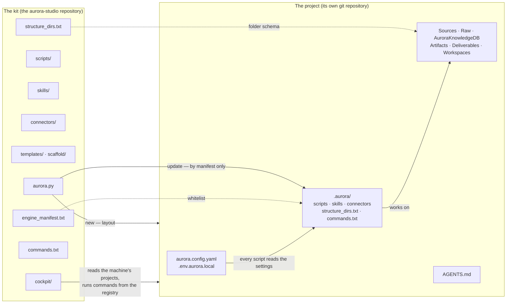
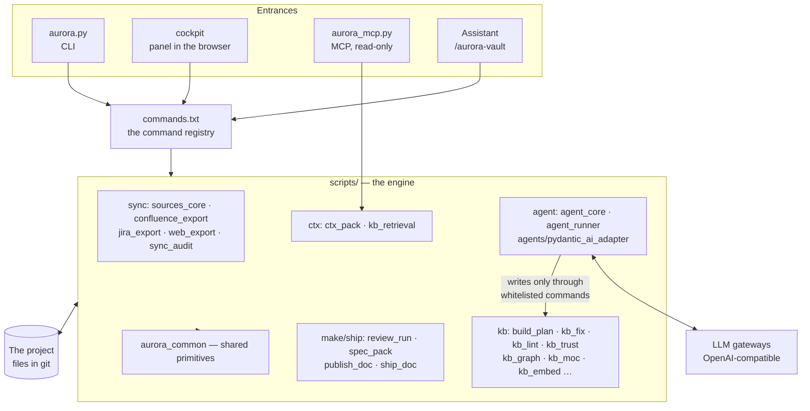
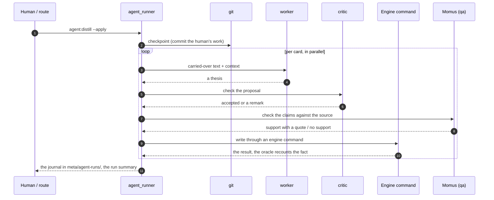

# Architecture

How Aurora is built inside: what the kit consists of, what lands in a project, how the built-in agent, the
panel and the MCP server work and which safeguards protect the base. The document is for those who deploy,
maintain or extend the engine. A user needs only the [overview](readme/01-overview.md). Русская версия:
[../architecture.md](../architecture.md).

## 1. The kit and the project

There are two things, and they must not be confused.

- **The kit** (this repository) — the engine, skills, templates, the panel. Installed once on a machine,
  updated with `git pull` or a button in the panel.
- **The project** — a separate git repository with a knowledge base. It **receives a copy of the engine** in
  `.aurora/` and lives on by itself: it may fall behind the kit and may be updated on command.



What follows from this:

- **`update` overwrites only the paths in `engine_manifest.txt`.** The config, knowledge, `Raw/`, `Sources/`,
  `Deliverables/`, `Artifacts/`, `Workspaces/` are never touched.
- Templates (`Templates/`, `Prompts/`, `TemplatesCommon/`) follow the **seed** rule: the project's file is not
  overwritten, the new kit version lands next to it as `<file>.new` for manual comparison.
- Individual paths can be opted out of updates in `aurora.update_ignore.txt` in the project root (glob patterns).
- The engine version in a project is recorded in `AuroraKnowledgeDB/meta/aurora_version.txt`; the path to the
  kit is in `.aurora/kit_path.txt`. The project's copy of `aurora_update.py` finds the kit through it.
- If a project's skill is a symbolic link to a shared folder, `update` warns: the write goes to the shared
  target and every project that shares it gets updated.

### Manifest rules

| A line in `engine_manifest.txt` | What `update` does |
|---|---|
| `src => dst` | overwrites the file 1:1 |
| `(connectors)` | puts a module's manifest in `.aurora/connectors/`, its launch script in `.aurora/scripts/`, multiplies the sync skill's body across the project's skills; **does not overwrite the body** — the new version lands next to it as `.new` |
| `(agents) AGENTS.md` | regenerates from the template, substituting the name, slug and keys from `aurora.config.yaml` |
| `(seed) dir` | does not overwrite; puts the new and changed as `.new` |
| `(launcher)` | launch files in the project root |
| `- path` | removed from the engine's composition: `update` deletes the file in the project |

It also creates missing folders by `structure_dirs.txt` and the mirror folders of connected modules:
idempotent, `.gitkeep`, deleting and moving nothing.

## 2. Engine layers



**The `commands.txt` registry is the single source of truth about commands.** `kit:list`, the panel and
`docs/commands.md` take their list from it; modifiers are pulled live from the scripts' own `--help`, so the
list of flags cannot drift from the code. Each script's header has a line `Панель: …` ("Panel: …") with the
command's name; a test checks it against the registry.

**A command has an executor**, and this is the border between mechanics and meaning:

| Executor | Meaning | Example |
|---|---|---|
| `скрипт` (script) | deterministic mechanics, the result is reproducible | `kb:lint`, `sync:confluence`, `kb:trust` |
| `модель` (model) | work with meaning, executed by the assistant by a procedure from `references/` | `kb:decide`, `ctx:retro` |
| `скрипт+модель` (both) | a script counts and prepares, the model decides | `agent:build`, `make:review-auto` |

The engine's rule: **every mass operation has a script, and the agent must run it first** and take decisions
from its report. A model walking thousands of files is expensive and produces errors.

Command names are `<set>:<action>`; there are nine sets.

| Set | About | Examples |
|---|---|---|
| `kit:` | the engine's life in a project | `doctor`, `update`, `hooks`, `mcp`, `skills`, `list` |
| `sync:` | mirrors of external systems | `confluence`, `jira`, `web`, `audit`, `diff`, `jira-status` |
| `kb:` | extraction and the life of knowledge | `build`, `repair`, `dedupe`, `trust`, `links`, `moc`, `supersede` |
| `ctx:` | using knowledge | `context`, `ask`, `eval`, `retro` |
| `make:` | producing artifacts | `create`, `review`, `review-auto`, `spec`, `spec-pack`, `assemble` |
| `ship:` | outward | `publish`, `export`, `release`, `acceptance` |
| `ops:` | management and reporting | `stats`, `todo`, `trace`, `gaps`, `search-quality`, `report` |
| `agent:` | the built-in agent | `build`, `distill`, `extract`, `twins`, `ask`, `make`, `ping` |
| `dev:` | QA of the engine itself | `qa-list`, `qa-run`, `qa-cover` |

Short names without a prefix (`build`, `lint`, `fix`) are historical aliases and always work. The reference of
all commands is [commands.md](commands.md).

## 3. Safeguards

Scripts write into hundreds of files at once, so protection is built into the engine itself.

| Safeguard | What it does |
|---|---|
| **Preview by default** | A writing command without `--apply` shows what will change and writes nothing |
| **git-guard** | A dozen scripts refuse to work over an uncommitted tree (`--allow-dirty` lifts the refusal); rollback is from git |
| **The agent's checkpoint** | Before an agent run the human's work is committed separately: whatever the agent does is rolled back with one line |
| **The agent's write whitelist** | The agent writes into the base only through engine commands (`ALLOWED_WRITES`): they have a preview, a guard and a journal. Direct file editing by a model is forbidden by construction |
| **The oracle** | Reaching the goal is checked not by the model but by an engine command (e.g. `kb:lint` recounts the conflicts) |
| **The pre-commit ratchet** | `kit:hooks` installs a hook with the linter: a commit fails only if errors became more than the baseline; the baseline lowers itself and never rises. The hook judges what is committed, not the whole base |
| **Message check** (kit only) | The `commit-msg` hook compares a commit's text with a list of internal names so that they do not reach public history |
| **File names** | One rule for Windows, macOS and Linux ([knowledge rules, section 11](knowledge-rules.md)); checked by `kit:doctor`, fixed by `kb:names` |
| **Mirror determinism** | `sync:* --verify` makes two exports and compares them byte for byte: one page — one file, the git diff does not lie |
| **Distrust of its own memory** | The engine does not rewrite what it did not write: the body of a dictionary and a document, the history footer and the previous thesis are not overwritten |
| **A closed folder schema** | `kit:doctor --structure` names everything not in `structure_dirs.txt` |

## 4. The built-in agent

Routine steps with a model are executed not by an external assistant but by Aurora's own agent — the `agent:*`
commands. It consists of two scripts and an adapter.

- **`agent_core.py`** — configuration, the gateway chain, transport, `agent:ping`, width measurement.
- **`agent_runner.py`** — the task loop: `build`, `distill`, `extract`, `twins`, `tasks`, `clashes`, `relink`,
  `translit`, `aliases`, `make`, `ask`; the journal, the oracle, the checkpoint.
- **`agents/pydantic_ai_adapter.py`** — every model call goes through Pydantic AI: one subprocess in its own
  venv per run, jobs run in parallel inside it, each with its own `id`. If the adapter itself fails (no venv, the
  process died, the answer was not parsed), the engine goes by direct HTTP and the reason is visible in the run
  report. A server's refusal is returned by the adapter as is.

### Roles and the gateway ring

Roles are what the model does; a separate model can be assigned to each.

| Role | What it does |
|---|---|
| `worker` | routine steps: parsing a source, a thesis, a proposal for one conflict |
| `planner` | chooses boundaries where the author did not place them; sees an inventory of paragraphs, not the text |
| `critic` | checks a proposal before writing (the `--critic` flag) |
| `qa` | **Momus**: reads an answer claim by claim — each has either support with a quote, or "no support", or a contradiction |

Each role has its own ordered **chain** of "provider + model" backends: every call goes from the first; one
that is unavailable, busy or gave an empty answer is skipped, and a recovered one is picked up on the next
request. There is one setup per kit — `<kit>/local/models.json`, the panel's "Models" section; a project has
none of its own. Details are in [INSTALL](INSTALL.md#the-built-in-agent). Parallelism is a property of the
provider: each has its own width, the ceiling for the whole run is in the section's shared settings;
`agent:width` measures the width instead of asking. A failure on one card does not stop the run, three in a row
do (that is the provider, not the cards).

OCR (`kb:ingest-office`) and embeddings (`kb:embed`) are built the same way: roles and chains of their own. An
embeddings fallback uses only the same model.

### How the agent does the work



A claim without support is **not carried** into an artifact even if it looks reasonable. A card with such a
claim gets an `unsupported:` mark and lands in `ops:todo` — the only work the scheme leaves to a human.

Run journals live in `AuroraKnowledgeDB/meta/agent-runs/` (the last thirty per task are kept; idle runs are one
line in a shared file). Conversations with the base are in `meta/ask/` and go to git together with the cards.

### Reasoning and quality

Model reasoning is turned on explicitly, per role (`AURORA_AGENT_THINKING_<ROLE>=0` turns it off). A thesis
without reasoning is written an order of magnitude faster but embellishes, and a strict Momus finds three
times more unsupported claims in it; for `qa` and the critic reasoning is never turned off.

### What goes out

A model receives what the task needs: card fragments, titles, the start of the body for embeddings. If your
perimeter forbids sending texts to a gateway, semantics is not switched on — word search works without it.
Requests of an agent's MCP server flagged `outbound` (internet search) go through a guard: four words in a row
from the task or cards do not leave; the guard is closed by default, the journal is `Workspaces/_outbound.md`.

## 5. The knowledge-base MCP server

`aurora_mcp.py` gives the base to any assistant (Claude Code, OpenCode, Cursor) over JSON-RPC 2.0 through
stdio — with no SDK and no Node. **One server — one base**: one customer's knowledge must not reach another's
artifact, so the project is set at launch, and the project's slug stands in the server's name
(`aurora-<slug>`).

| Tool | What it does |
|---|---|
| `kb_search` | find cards by meaning and words: name, status, gist |
| `kb_card` | read a card whole |
| `kb_context` | assemble a context pack for a topic (trust headers) |
| `kb_index` | the base's table of contents by section |
| `artifact_spec` | how to make an artifact of this kind: template, folder, rules, the final-text boundary |
| `kb_ask` | ask the base — the project's model answers, from the cards, with links |

**Writing to the base through MCP is impossible** — and it is not a setting: an outside assistant does not pass
the git-guard. It reads, the engine edits. `kit:mcp` prints ready connection lines for every project on the
machine.

## 6. The control panel

`cockpit/aurora_cockpit.py` is a standard-library server plus one core HTML file and section folders. It
listens only on `127.0.0.1`, requires a session token, executes **only commands from the registry** (arguments
as a list, no shell, an undeclared flag is rejected) and does not accept arbitrary project paths. In detail —
[the control panel](control-panel.md).

## 7. Where things are stored in a project

| Path | What | In git |
|---|---|---|
| `aurora.config.yaml` | project settings | yes |
| `.env.aurora.local` | tokens, keys and LLM gateways | **no** |
| `AuroraKnowledgeDB/meta/manifest.json` | the parsing ledger: hash, date, number of cards per source | yes |
| `AuroraKnowledgeDB/meta/trace/` | the "artifact ↔ issue" table trust is computed on | yes |
| `AuroraKnowledgeDB/meta/ask/`, `agent-runs/` | conversations with the base and the agent's journals | yes |
| `AuroraKnowledgeDB/meta/lint_baseline.txt` | the ratchet's baseline | yes |
| `AuroraKnowledgeDB/meta/graphify/` | the base's graph for MCP and exports | no (derived) |
| `AuroraKnowledgeDB/meta/embeddings.*` | the semantic index | no (rebuilt) |
| `Sources/<Mirror>/sync_state.md`, `update_log.md` | the mirror's state | yes |
| `.aurora/cache/`, `runs/`, `state/`, `context/` | caches, the panel's run archive, routes' state, attachments | no |

## 8. Tests

| Level | By | What it catches |
|---|---|---|
| Invariants | `python3 tests/run_tests.py --smoke` | what is visible from the sources: the registry, the manifest, naming rules, skill consistency |
| Fixtures | `python3 tests/run_tests.py` | "a script does what was intended" — hundreds of checks on synthetic projects in temporary folders |
| The golden corpus | the same run, data in `tests/corpus/` | "the engine sees real shapes as it did yesterday": homoglyphs, duplicates, legacy headers |
| The live base | `python3 tests/smoke_live.py <project>` | "nothing moved on this project": a snapshot of numbers and names inside the project itself |

CI (`.github/workflows/test.yml`) runs smoke and the full suite on Python 3.12, and compilation plus smoke on
Python 3.9 — the minimum supported version. Releasing a version — the tag and the GitHub Release — is done by
`.github/workflows/release.yml` after green checks on `master`, if `VERSION` has no Release yet (details in
[CONTRIBUTING](CONTRIBUTING.md#versions-and-releases)).

## 9. The kit repository layout

```text
aurora-studio/
├── aurora.py                 the entry point
├── VERSION · CHANGELOG.md    the engine version (semver) and the release history
├── engine_manifest.txt       what update refreshes
├── structure_dirs.txt        the fixed folder schema
├── commands.txt              the command registry
├── moc_groups.txt            groupings for maps of content (kb:moc)
├── scripts/                  the engine; scripts/agents/ — Pydantic AI and graphify adapters
├── skills/                   aurora-vault · aurora-grill · aurora-dev
├── connectors/               confluence-dc · jira-dc · web (connector.json + SKILL.md)
├── cockpit/                  server, ui/, modules/, skins/, i18n/, vendor/, scenarios.txt
├── templates/                AGENTS, config, sample .env, launch files, meta/
├── scaffold/                 Templates · TemplatesCommon · Prompts — the starter content
├── reports/analyst/          the analyst-efficiency dashboard
├── examples/                 samples
├── tests/                    run_tests.py · harness.py · cases/ · make_corpus.py · smoke_live.py · corpus/
├── docs/                     documentation (Russian; English — docs/en/)
├── start-aurora.command · start-aurora.bat
└── aurora.env.local.example
```

The engine developer's kitchen — `Development/` (test cases, QA scenarios, run journals) — is closed by
`.gitignore` and does not ship.
