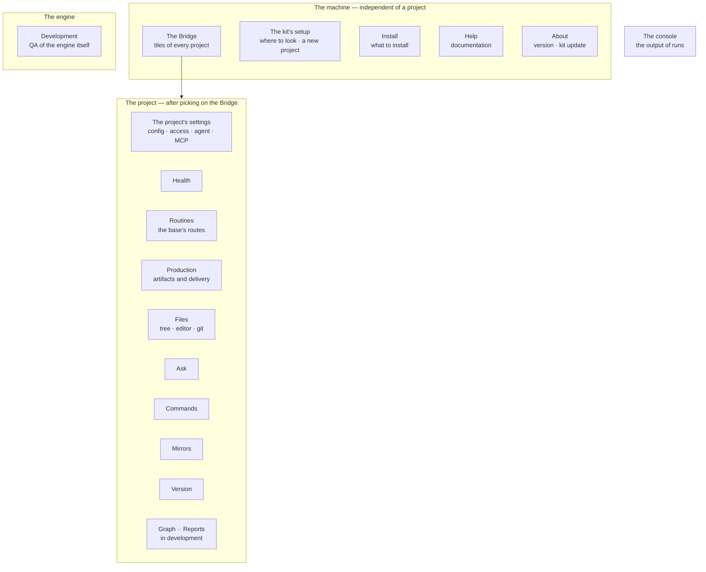
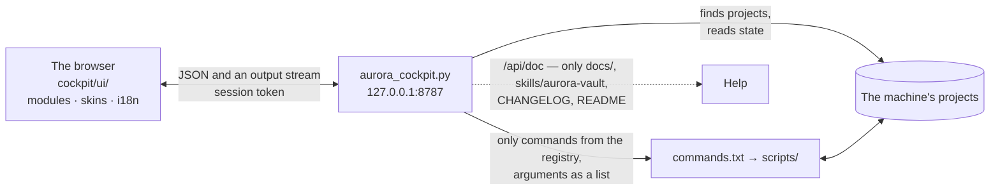

# The control panel (Aurora Cockpit)

A local panel with everything for everyday work with Aurora: every project on the machine, base health, running commands
and routes, a file editor, the knowledge graph, questions to the base, installing what is missing, updating the engine
and help. This document describes what it can do, how it is built and by which rules it is styled. Русская версия:
[../control-panel-ui-requirements.md](../control-panel-ui-requirements.md).

```bash
python3 aurora.py cockpit
```

The browser opens at `http://127.0.0.1:8787/?t=<token>`.

## 1. Principles

- **One window.** Help, commands, reports, install, update and the overview of projects — all inside one application;
  going to a project is routing, not a new window.
- **The engine is the source of truth.** The panel computes nothing itself: it calls commands and shows the output. Numbers
  come from `stats --json`, `lint`, `doctor`, `audit`. The logic stays in the kit.
- **Observation is safe, action needs confirmation.** A writing command is first shown as a preview (without `--apply`); the
  panel never adds `--apply` itself.
- **No secrets in the interface.** About tokens the panel knows only "filled" or "empty".
- **Offline.** The interface does not go to the network: fonts and libraries lie in `cockpit/vendor/`. Only `sync:*` and
  `ship:publish` use the network, and without a token their buttons are inactive with an explanation.
- **Density and speed.** There is one user, who is also the data owner and the one who presses "apply". They need density and
  answers to four questions without a terminal: what broke and how urgent it is; what must be done by hand and what a script
  will do; what is missing for things to work; which engine version is installed where.

## 2. Launch and finding projects

The kit and projects need not lie side by side. The list of folders to search is edited right in the panel ("The kit's
setup" → "Where the panel looks for projects") and stored in `~/.aurora/cockpit-roots.txt`; on the first launch the folder next
to the kit goes there. A new project can be deployed into any folder — its parent is added to the list by itself.

```bash
python3 cockpit/aurora_cockpit.py --port 9000             # another port
python3 cockpit/aurora_cockpit.py --add-root ~/work       # add a folder to the list
python3 cockpit/aurora_cockpit.py --roots ~/work ~/tmp    # only these folders, one-off
```

`⌘K` / `Ctrl+K` — the palette: commands, sections, projects. `Esc` — close.

## 3. Sections

The menu has three groups and the console. Section modules lie as folders in `cockpit/modules/`, the rest live in the core
(`cockpit/ui/`: `index.html`, `panel.js`, `panel.css`).



### The machine

| Section | What it shows and does |
|---|---|
| **The Bridge** | Tiles of every project on the machine: engine version, share of `knowledge`, `doctor` blockers, lint errors, branch and uncommitted changes; you can see where work is going and where it stopped. The aura colour is the severity: teal — in order, amber — worth a look, red — blockers |
| **The kit's setup** | Where the panel looks for projects; connecting a new project (the form asks the same as `aurora_setup.py` and writes with the same script); the whole config as text |
| **Install** | What is missing on the machine and in the project and which commands do not work without it; engine add-ons (Pydantic AI, graphify) — the current version against the latest in git |
| **Help** | Documentation with a table of contents: what to open on the left, the text on the right. It shows only files from `docs/`, `skills/aurora-vault`, `CHANGELOG.md`, `commands.txt`, `README.md` |
| **About** | The version, repository, licence, the latest releases and **updating the kit itself from the repository with a button** (a fast-forward only; it refuses on uncommitted edits). Seven clicks on the "About" menu item open the "Development" mode |

### The project

| Section | What it shows and does | Commands |
|---|---|---|
| **The project's settings** | Access (Confluence and Jira tokens — "filled / empty"), the config, artifact kinds, the agent's gateways and roles, MCP servers of the project and the machine (the machine's are visible but edited in the kit) | `agent:ping`, `agent:probe`, `kit:mcp` |
| **Health** | The composition of the base, trust, links, errors, mirror freshness and what is left for a human; every tile is clickable and leads to the command that deals with it. Also "Unfinished" productions | `kb:lint`, `kb:repair`, `kb:embed`, `kb:kind`, `ops:trace`, `ops:trace-table`, `ops:todo`, `ops:retrieval`, `make:spec-pack`, `sync:jira-status` |
| **Routines** | The base's maintenance routes: "Update the base", "Fix the base", "Rebuild the base from scratch". Steps go top to bottom; human steps are marked and not run; "Preview" passes the same route without writing. A stopped route resumes where it stood | — |
| **Production** | "Write an artifact" and "Hand over documents". A task is written in your own words: it understands `@path` (a project file or folder), `/skill` (the skill's method goes into the task), `@server` (an MCP is connected at once), attachments (kept for two weeks) | `agent:make`, `ship:publish` |
| **Files** | The project tree, a Markdown editor with tables, mermaid and formulas, "Show in folder", "Open with the system app", "Commit" and "Push" (git) | — |
| **Ask** | A question in your own words: the engine assembles context from cards, the model answers from them only; conversations are kept in `meta/ask/` and visible to everyone | `agent:ask` |
| **Commands** | The whole registry: executor, modifiers, version introduced, last run. Script commands are run; for procedure commands the description opens | the registry |
| **Mirrors** | The state of Confluence, Jira and sites, token presence, the sync → audit → drift chain, connecting source modules | `sync:audit`, `sync:diff`, `sync:jira-status`, `kit:remap-sources` |
| **Version** | The project's engine against the kit, an update preview, migration of a foreign project | `kit:update`, `kit:doctor` |
| **Graph** *(in development)* | Cards and the links between them: a way to reach a card, not a report. The neighbourhood of a named card, a click opens it in the editor. Analytics (communities, bridges, islands) belongs to `kb:map` | `kb:links`, `kb:map` |
| **Reports** *(in development)* | Dashboards from Jira and Confluence exports, including analyst efficiency | `ops:report` |

### The engine and the console

**Development** *(in development)* — the engine's own loop: scenario runs, change coverage, test cases (`dev:qa-*`). **The
console** — the streaming output of runs, the return code, history; a line's colour comes from the engine itself. A route's
run unfolds by steps, and the header shows the model, backend and speed.

Sections marked `dev: true` in the manifest are hidden until "Development" is opened.

## 4. The editor and committing

Documents are edited in the panel ("The project" → "Files"). The format stays Obsidian-compatible — whoever wants to can work
there. The editor **does not edit** what Aurora's rules forbid editing, and explains every ban in words:

- `Deliverables/released/` and the evidence part of `Raw/` (`contract`, `meetings`, `laws`, `customer`);
- the `Sources/` mirrors;
- `kind: document` cards and the whole `AuroraKnowledgeDB/` except `Decisions/`, `Questions/` and `meta/` (a card is derived
  from sources, and a hand edit disappears at the next build).

A ban "you cannot edit" ends with an action: a card has the **"Correct"** button (the `kb:correct` command). If a file changed
on disk while it was open (the agent appended, a sync brought something foreign), the divergence is not silently overwritten —
both versions are shown with a choice.

A dozen engine scripts refuse to work over an uncommitted tree, so "Commit" stands right there. The pre-commit ratchet judges
what is committed, not the whole base; "Commit anyway" lifts only it — nothing lifts the internal-names check.

A finished artifact opens in the editor by itself; publishing goes from there and first shows the **final text** — the body
up to the marker `<!-- ниже — производство, в чистовик не идёт -->`.

## 5. How it is built



- **The server** is `cockpit/aurora_cockpit.py`, standard library only. The interface core is one HTML file; sections are
  folders `cockpit/modules/<id>/` with a manifest, markup, a script and their own strings. A section appears in the menu by
  itself and loads on demand. The modules' contract — [cockpit/modules/README.md](../../cockpit/modules/README.md) (in Russian).
- **The interface is translated** by catalogues `cockpit/i18n/<lang>.json` (the core) and `modules/<id>/i18n/` (the
  sections): Russian and English. A string without a translation is shown in Russian, so completeness is checked by
  `kit:i18n --check`; `--new <code> <name>` creates a language.
- **Jobs** live in the panel's process: `/api/jobs` returns the running ones, so reloading the page neither hides a working
  command nor provokes a second route on top of it. The archive of recent runs is `.opencode/runs/` (outside git).
- **Data.** Where a command supports `--json` (`stats`), the panel takes it; the rest it parses by key lines (`ERROR:`,
  `WARN:`, `OK:`, "errors N", `MISSING`/`ORPHAN`).

## 6. Safety

- The server listens **only on `127.0.0.1`** and requires a session token issued at start. The token lives in the process's
  memory: restarted — the address changed.
- **Only commands from the registry** can be run; arguments go as a list, with no shell; a flag the command did not declare is
  rejected.
- A project is chosen from the discovered list, an arbitrary path is not accepted.
- Documents can be read only from `docs/`, `skills/aurora-vault`, `CHANGELOG.md`, `commands.txt`, `README.md`.
- A section's files (code, not project data) are served without a token so that relative imports inside a section work.
- The form neither accepts nor shows secrets.

## 7. Look and feel

Styling is moved out of the markup into **skins** — the files `cockpit/skins/*.css`: the panel sets the structure, a skin sets
the values. Put your own `.css` in — it is in the list; the name, description and core version (`for:`) come from the file's
header. A skin edits only tokens, it does not touch markup selectors; the theme (light/dark) works on top of a skin. The
contract and the token list — [cockpit/skins/README.md](../../cockpit/skins/README.md) (in Russian).

| Skin | Character |
|---|---|
| **Zine 2.0** (default) | dotted paper, ink frames, hard shadows, gold capital headings — [requirements](../skin-zine-requirements.md) (in Russian) |
| **Instruments** (Pribory) | a quiet bridge: a midnight background, hairlines, colour only on status; the densest |
| **Editorial** (Redakciya) | a magazine spread: warm paper, serifs, air; for long reading |
| **Contrast** | a black background, thick borders, a large type size; for projectors and weak sight |
| **Unicorn** | candy and rounded corners; AA contrast holds |

Three token layers: **palette** (the skin) → **meaning** (`--bg`, `--text`, `--tier-*`, the type scale) → **component**
(`--btn-*`, `--card-*`, `--chip-*`). A component reads only the third layer.

Colour carries meaning, not decoration: card states (`--tier-*`) must stay distinguishable by eye in any list, red is only for
errors and blockers, a project's "aura" on the Bridge is the severity of problems. Text contrast is not below WCAG AA,
animations are muted by `prefers-reduced-motion`, and on a narrow screen (from 320 px) the menu turns into a ribbon with
captions.

## 8. Non-functional requirements

- One HTML file and the standard library on the server; nothing needs building (`cockpit/vendor/README.md` explains why
  third-party libraries lie as ready builds and are not edited).
- Responsive from 320 px to desktop; tables and logs have their own horizontal scroll.
- Heavy commands run asynchronously, with an output stream; the dashboard from `stats --json` opens quickly.
- The panel is not in `engine_manifest.txt`: it lives only in the kit and is launched from there.
