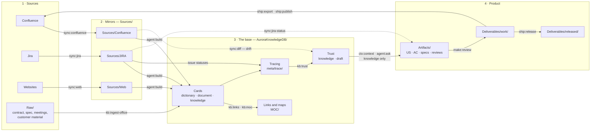
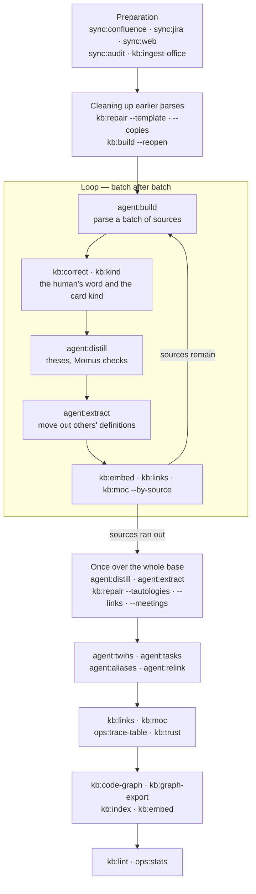
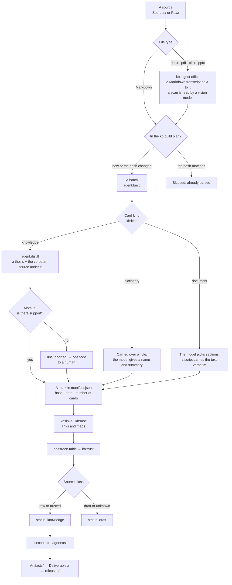
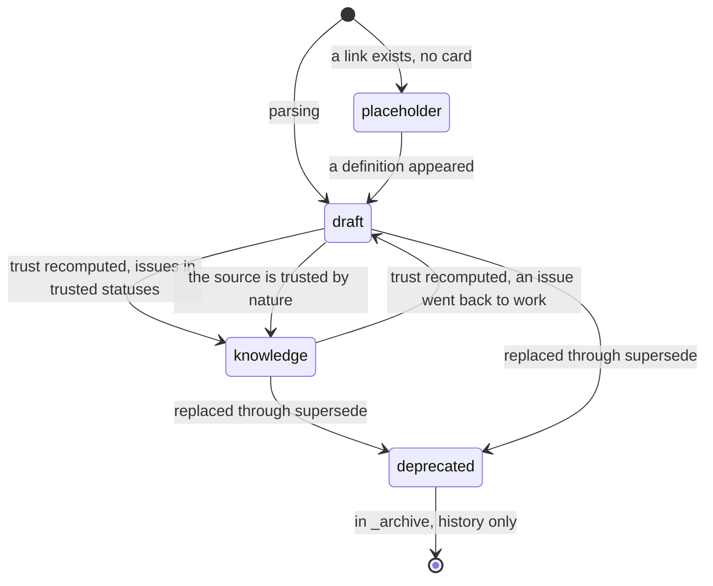

# The cycle and the path of a card

One Aurora lap: **source → mirror → card → trust → artifact → outward → feedback**. Here is the map of the whole
cycle, the path of one card step by step with the condition for the next step, the panel's routes and the working
rhythm. Every arrow is an engine command. Русская версия: [../lifecycle.md](../lifecycle.md).

The rules all this works by are in the [knowledge rules](knowledge-rules.md); the assistant's procedures are in
`skills/aurora-vault/references/` (in Russian).

## 1. The whole cycle

Two rules everything else grows from:

- **A mirror is deterministic.** The same source gives the same file byte for byte, otherwise the git diff stops being
  evidence and `sync:audit` cannot check the state.
- **Trust is computed.** It is given not by a human but by the status of linked issues and the source's origin.

## 2. The panel's routes

Routine work does not need to be typed as commands: the panel runs a **route** — a set of steps in order. A route
stops only if a step finishes with code 2 or higher; code 1 ("worked and found things to fix") is the normal state of
a living base. Scenarios lie in `cockpit/scenarios.txt` as plain text: add a line — a step appears. The "Preview"
button strips `--apply` from every step and shows the same route without writing.

| Route | Tab | What for | Where it looks |
|---|---|---|---|
| `update` — **Update the base** | routines | take the new from sources and bring it to knowledge | outward |
| `fix` — **Fix the base** | routines | put in order what exists: links, duplicates, maps, schema | inward, does not go to sources |
| `rebuild` — **Rebuild the base from scratch** | routines | wipe what will be rebuilt and build by the current rules; dangerous and rare | inward |
| `write` — **Write an artifact** | production | a story, AC or spec — from a question to the base to a finished file | forward |
| `deliver` — **Hand over documents** | production | assemble deliverables, check, export, freeze the delivered version | outward |

### The "Update the base" route

It goes while there is work (even twelve hours) and **commits every lap to git**: switch it off in the middle of
the night — what is parsed stays valid, nothing has to be redone. It used to be phases over the whole base, and a
stop in the middle left cards without kinds, theses and links.

"Fix the base" and "Rebuild" are assembled of the same steps; the full lists are in `cockpit/scenarios.txt`. Steps
done by a human are marked in routes and are not run.

### Routes on a schedule and from the terminal

The **Cron** section (the "Machine" group) puts routes and single commands on a timetable and chains them: "at 20:00
run 'Update the base' and 'Fix the base' in every project". The "Maintain all projects" button prepares exactly that
chain — the base routes except the rebuild from scratch. The panel server runs the chain, no page needs to be open,
but the panel itself must be running. Rules:

- chains run one at a time, the next one waits in the queue (bots are tasks of the same queue); a task that fires
  while it is still running does not start a second run — the history says "missed";
- projects go in the order they are named in the task's steps; "all projects" — in the panel's order;
- a route follows the same rules as the "Run" button: laps with a commit, stop on stall and failure, waiting for the
  network; a route stopped at night continues with "Resume route". A step has no time limit: a model thinking for
  long is not a reason to drop the work;
- a project busy with other work makes the step wait up to two hours, then the step is skipped;
- a project is the unit of a chain. A project step failed (the command crashed, gateways do not answer, the route did
  not move the base by a single commit) — the remaining steps of that project are deferred: "Fix" after an update
  that did not happen is pointless. The chain goes on to the next project and at the end comes back to the deferred
  ones once, continuing where they stopped. A second failure is the project's outcome;
- a stall at the tail while the base did change during the route is "partly", not a failure: the project is updated
  and its next steps run. A card the thesis step parked for a human (a dictionary longer than the window, with no
  boundaries found) is not counted as work left until it changes;
- the task can say "on failure — stop the chain": then it stops at the first failure;
- **a hang watchdog.** When a route or chain step is silent for longer than 5 minutes, the panel checks the connection
  to the model and to the project's Jira/Confluence. The step is taken down together with its child processes (the
  model adapter, git) and started again — at most twice; an abandoned `index.lock` is removed. This happens in two
  cases:
  - the connection was lost and came back, and within 5 minutes the step has not come alive — the answer to a
    request sent before the outage will not come;
  - the connection is fine, and the step has been silent for more than an hour — longer than any model request.

  Long model thinking with a live connection is left alone;
- **what runs — in the Console.** Above it are the chain, the routes and the commands of all projects; "Show"
  switches the output. The chain stream — a header for every item with its project, the output of its steps, waits and
  results — runs through all projects in turn. The Console, opened without its own output, attaches by itself to what
  is running;
- **the "bot" step** — a project's bot or "all enabled bots of the project". With "all projects" the chain runs the
  bots of all projects in turn, by the same project-as-unit rules as routes.
- a time missed while the panel was down is caught up no later than 15 minutes, otherwise the run is recorded as
  missed; if the panel restarts in the middle of a chain, the new one continues it;
- a writing command outside a route is committed to git right away.

The schedule lives in `~/.aurora/cron-tasks.json`, the history in `~/.aurora/cron-runs/`.

The same runner is available from the terminal: `python3 aurora.py route <project> <route> --apply` (without
`--apply` it behaves like "Preview").

## 3. The path of one card

The condition to go on, and the price of skipping each step.

| # | Step | Command | How the result is marked | Condition for the next step | Mandatory |
|---|---|---|---|---|---|
| 1 | Source mirror | `sync:confluence`, `sync:jira`, `sync:web` | a file in `Sources/`, an entry in `sync_state.md` / `update_log.md` | sync without errors, `sync:audit` shows no MISSING | **yes** |
| 2 | Own documents | put into `Raw/` by hand | nothing: `Raw/` is immutable by agreement | the file is in place and will not be edited | **yes** for contracts and meetings |
| 3 | Office formats | `kb:ingest-office` | a `.md` transcript next to the original | the transcript is readable, tables did not fall apart | yes, if the source is not Markdown |
| 4 | Parse plan | `kb:build` | writes nothing, reads `manifest.json` | the plan has non-empty batches | **yes** |
| 5 | Parsing | `agent:build` (or `kb:build` → assistant) | cards with `source:`, `built: machine`, `source_synced:` | the file is parsed **entirely** | **yes** |
| 6 | The parse mark | the parse itself (`kb:build --done`) | an entry in `manifest.json` | the mark is accepted — otherwise an error, it is checked against the base | **yes** |
| 7 | Kind and thesis | `kb:kind`, `agent:distill` | `kind:`, a thesis above "Source", `distilled:` | a thesis is written, Momus checked | **yes** for `knowledge` |
| 8 | Links and maps | `kb:links --cards`, `kb:moc` | `related:`, `MOC/` files | no abandoned cards | **yes**: a card without links is a lint error |
| 9 | Mechanics | `kb:lint`, `kb:repair` | a report, edits | no broken links, headers complete | yes before delivery |
| 10 | Trust | `ops:trace-table`, `kb:trust` | `status`, `trust`, `trust_basis`, `trust_checked` | you can see what to believe and why | **yes**: without it `knowledge` will not appear |
| 11 | Use | `ctx:context`, `agent:ask` | a pack with trust headers, `usage.log` | headers in place | **yes** for the model's work |
| 12 | Artifact | `agent:make`, `make:*` | a file in `Artifacts/`, `based_on` | `based_on` is filled in | **yes** |
| 13 | Review | `make:review`, `make:review-auto` | a report in `Artifacts/reviews/` | the remarks are handled | recommended |
| 14 | Delivery | `ship:export`, `ship:publish` | docx/pdf, a Confluence page | the document is proofread | by stage |
| 15 | Freezing | `ship:release --apply` | a snapshot in `Deliverables/released/`, a base commit | the document was handed to the customer | **yes** — otherwise you cannot prove what you delivered |
| 16 | Feedback | `sync:diff`, `sync:jira-status` | a report | drift appeared — go back to step 5 or 10 | **yes**, regularly |

## 4. Card statuses

- **`knowledge`** — a fact. All links are in trusted statuses, or the source is trusted by nature.
- **`draft`** — not yet confirmed: at least one issue in progress, or no links at all (the reason is in
  `trust_basis`, in words and with the issue key).
- **`placeholder`** — a stub: the name is taken by a link, no knowledge. Such cards are excluded from search,
  context and measurements.
- **`index`** — service: maps of content, `_index.md`. Navigation, not knowledge (not shown in the diagram: it is
  outside the status cycle).
- **`deprecated`** — replaced, lies in `_archive/`, answers only "how it used to be".

Old bases contain `imported`, `in-review`, `verified`, `accepted`: the engine reads them (`verified` counts as
trusted) but does not assign them; `kb:trust` moves a base to the new scale in one run.

## 5. Three marks that stop work from being done twice

| Mark | Where it lives | The question it answers | Who sets it |
|---|---|---|---|
| a page version / an issue's `updated` | `sync_state.md`, `update_log.md`; the cache `.aurora/cache/confluence_pages.json` | "download again?" | sync, automatically |
| the source's hash | `AuroraKnowledgeDB/meta/manifest.json` | "parse again?" | parsing, checked against the base |
| `source_synced` in a card | the card's header | "did the source change under already-parsed knowledge?" | parsing and `sync:diff` |

**The Confluence sync** takes the version number from the list of children, and a page with the same version, the
same converter, the same path and the file in place is not downloaded again. Once a week and with `--force` the sync
passes the mirror in full: editing an attachment does not always raise a page's version. If the converter changed —
raise `CONVERTER`, and the next sync passes everything.

## 6. What happens when something changes

| What changed | What the engine does |
|---|---|
| a source's text | returns it to the plan (`kb:build --reopen`), replaces in the card **only** the carried-over text, removes the thesis mark; `agent:distill` writes a new thesis, the previous goes to the footer with a date and a "what changed" line |
| an issue's status | rewrites nothing — changes the trust class at the nearest `kb:trust` |
| a card outgrew the model's window | the planner proposes boundaries, the engine cuts, the parts get linked, the original becomes a document map (`kb:split`) |
| a page moved | `kit:remap-sources` and `kb:repair --gone-sources` find it by `page_id` or document code |

## 7. The working rhythm

| When | What | Commands |
|---|---|---|
| every day, 10 minutes | the morning round | the "Update the base" route or `sync:*` → `sync:audit` → `sync:diff` → `ops:stats` |
| after every sync | trust | `ops:trace-table` → `kb:trust` (the route does it itself) |
| every night | maintenance without a human | the Cron section: "Update the base" and "Fix the base" in every project |
| weekly | hygiene | "Fix the base" → `ops:todo` → `kb:garden` |
| monthly | navigation and quality | `kb:moc --suggest`, `ops:search-quality`, `ops:gaps` |
| development is going on | tracing | `sync:jira-status` → `ops:trace` → `make:spec-pack` |
| an artifact is ready | outward | `make:review` → `ship:export` → `ship:publish` → `ship:release` |

## 8. Where it breaks most often

| Symptom | What happened | How to fix |
|---|---|---|
| the plan again has files that were parsed yesterday | parsing did not mark the source | `kb:dedupe`, then `kb:build` |
| a source is marked parsed, no cards | the mark was set without parsing | `kb:build --reopen --apply` |
| a source has one card for 60 KB of text | parsing broke off at the first sections | `kb:build --thin` |
| hundreds of broken links after parsing | links to cards that do not exist | `kb:repair --links`, then `--stubs` |
| one synonym on two cards | extraction handed out aliases generously | `kb:repair --aliases`, `agent:aliases` |
| the share of `knowledge` is low, the base is large | issues still in progress or no links found | tracing (`ops:trace-table`), not statuses; check `trust_statuses` in the config |
| a card says "source gone" | the page moved or was deleted | `kb:repair --gone-sources` |
| one entity lives as five cards | parsing did not see the base | `kb:twins`, `agent:twins`; a rebuild if needed |
| a card has claims without support | Momus found no support in the source | `ops:todo`; `agent:distill --recheck` will check again |
