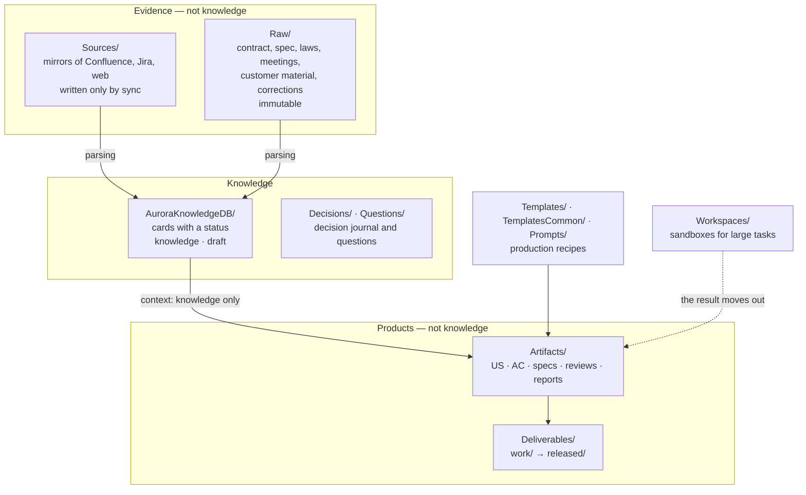

# 1. Framework overview

> **Who should read it:** everyone on the project — analysts, the product owner, developers.
>
> **In short:** project knowledge lives in git as Markdown cards. Every card has a trust status, and
> **the engine computes it** from the statuses of the Jira issues linked to the card's source. The
> assistant must respect that status: `knowledge` is a fact, `draft` is not, `deprecated` is history
> only. Decisions are kept in an immutable journal together with the rejected options.

## Why this is needed

We use AI to check and to produce analyst artifacts — stories, acceptance criteria, specifications.
Without an explicit trust model this breaks in three ways.

**"I wrote it, I believe it."** A draft story that reaches the base through a sync gets treated by the
assistant as truth — and it never finds mistakes in it.

**Lost history.** An approach changes, an old card is replaced by a new one — and six months later
nobody can say why the alternative was dropped.

**Silent rot.** Confirmed and stale knowledge lie mixed together, the assistant confidently answers
from the stale part, and trust in the base drops to zero after a couple of such cases.

Aurora closes all three with two mechanisms: **trust layers** (folders plus a card status that the
engine computes) and a **decision journal** — immutable Decision Records.

## Three principles

**An artifact is not knowledge.** The document we check or produce is the object of work. Knowledge is
only the cards of the base with a suitable status. The object is never handed to the assistant as a
fact, even if a copy of it sits in the Confluence mirror.

**Nothing is deleted.** Obsolete knowledge becomes `deprecated`, gets a link to its successor and moves
to the archive. Accepted decisions are not edited — only replaced by new ones.

**Trust is computed, not assigned.** A human does not "approve" cards or set their status. The engine
reads the statuses of the issues linked to the source and decides whether it is a fact or a draft; the
issue goes back to work — the card becomes a draft. In return the engine does not rewrite what it did
not write: a human's word arrives as a separate correction and ranks above the source.

## Project map: trust layers



| Folder | Role | Who writes |
|---|---|---|
| `Sources/` | mirrors of external systems: Confluence, Jira, web | sync only |
| `Raw/` | primary sources laid by hand: `contract/`, `laws/`, `customer/`, `meetings/`, `project/`, `examples/`, `corrections/` | a human; `contract`, `laws`, `customer`, `meetings` are immutable |
| `AuroraKnowledgeDB/` | knowledge cards: `Concepts/`, `Processes/`, `Glossary/`, `Systems/`, `Roles/`, `Statuses/`, `Reference/`, `Requirements/`, `Specs/`, `Questions/`, `Decisions/`, `MOC/` | the engine and the agent; humans edit `Decisions/`, `Questions/`, `meta/`, and the rest only through a correction (`kb:correct`) or the source — a hand edit of a card is erased by the next build |
| `Artifacts/` | what analysts and the agent produce: `us/`, `ac/`, `algorithms/`, `reviews/`, `reports/`… | analysts and the agent |
| `Deliverables/` | `work/` — drafts, `released/` — handed-over immutable snapshots, `_archive/` — storage | analysts; `released/` only by `ship:release` |
| `Workspaces/` | sandboxes for large tasks: selections, drafts, any auxiliary files | anyone |
| `Templates/`, `Prompts/`, `TemplatesCommon/` | document templates and prompts | the project keeps its own; the kit keeps the common templates |

The folder structure is **the same in every project** and fixed by the kit (`structure_dirs.txt`). A
project does not invent artifact types: anything non-standard goes to `Workspaces/<task>/`.

## The card

**The unit of the base is an entity, not a document.** If five documents talk about an analytical
balance, the base has one card "Analytical balance" that accumulates knowledge from all five. When
another entity is explained in passing inside a card, it is moved into its own card and a link is left
in its place.

Every card has a **kind**, which decides who may edit the body:

| Kind | What it is | Body |
|---|---|---|
| `dictionary` | dictionaries, reference lists, enumerations | carried over whole, the model does not touch it |
| `document` | contract, spec, regulation, printed form | verbatim, never changed |
| `knowledge` | everything else | the model writes a thesis; the verbatim source stays under it |

and a **status**:

| Status | Meaning | How the assistant treats it |
|---|---|---|
| `knowledge` | all linked issues are in trusted statuses, or the source is trusted by nature | a fact |
| `draft` | at least one issue is in progress, or there are no links at all | an idea, needs checking |
| `placeholder` | a stub: the concept is referenced, there is no knowledge yet | does not answer |
| `index` | maps of content, tables of contents | navigation, not knowledge |
| `deprecated` | replaced through `kb:supersede` | history; for "why" questions |

A card header (abridged):

```yaml
---
title: "Request status change algorithm"
type: process
kind: knowledge            # dictionary | document | knowledge
status: knowledge          # computed by the engine
trust: trusted             # source class: raw | trusted | draft | unknown
trust_basis: "all linked issues are in trusted statuses, e.g. PRJ-123 — «Closed»"
trust_checked: 2026-08-21
source: "Sources/Confluence/…"
related: ["[[Request]]"]
---
Thesis: the definition of the entity and the essential conditions, with links to other cards.

## Source (carried over verbatim)
…
```

The full schema is `skills/aurora-vault/references/frontmatter.md`; the rules are in the
[knowledge rules](../knowledge-rules.md).

## Where trust comes from

The engine computes the **source class** from scratch on every run:

| Class | When | Card status |
|---|---|---|
| `raw` | the source is trusted by nature: `Raw/`, a Confluence section ticked "trust", a web link ticked "trust", a reference branch of the wiki | `knowledge` |
| `trusted` | every link — issues and stories — is in a trusted status | `knowledge` |
| `draft` | at least one link is in a draft status | `draft` |
| `unknown` | no links | `draft` |

One issue in progress outweighs ten finished ones. Which Jira statuses count as trusted is set by the
project in `aurora.config.yaml` (`trust_statuses` and `assumption_statuses`). A low share of
`knowledge` is not an emergency: either issues are still in progress or no links were found, and the
second is cured by tracing (`ops:trace-table`), not by statuses.

## Who does what

```mermaid
flowchart LR
  subgraph SCRIPT["Script — mechanics"]
    S1["sync, lint, repair"]
    S2["parse plan, links, maps"]
    S3["tracing and trust"]
    S4["context pack"]
  end
  subgraph MODEL["Model — meaning"]
    M1["parse a source into cards"]
    M2["thesis, extracting entities"]
    M3["artifact draft"]
  end
  subgraph CHECK["Checking"]
    C1["Momus: support for every claim"]
    C2["Oracle: an engine command checks the fact"]
  end
  subgraph HUMAN["Human — responsibility"]
    H1["writes what the sources lack"]
    H2["resolves the disputed and the unsupported"]
    H3["presses Update and Fix"]
  end
  SCRIPT --> MODEL --> CHECK --> HUMAN
```



A human is left with exactly three things:

1. **Write what the sources do not contain**: decisions (DR), questions to the customer, own reference
   lists, and also corrections ("this card is wrong, in fact it is so"). Write into the subject
   section; no marking is needed.
2. **Resolve the disputed**: duplicates the machine did not dare to merge; cards without links to
   issues; claims Momus marked "no support"; contradictions between cards. The list with explanations
   is `ops:todo`.
3. **Press two buttons**: "Update the base" (take the new from the sources) and "Fix the base" (put
   in order what is there).

A human no longer approves cards, keeps a verification queue or sets owners and expiry dates. The
commands `kb:verify` and `kb:queue` are gone — a procedure that lost its meaning is more dangerous than
a missing one.

## The cycle of knowledge

Source → mirror → card → trust → artifact → outward → feedback. Every transition is an engine command
with the condition under which it is time to run it. The diagram and the path of one card step by step
are in the [Lifecycle](../lifecycle.md).

## Words you will meet

| Word | Meaning |
|---|---|
| **kit** | this repository: engine, skills, templates, panel; projects are deployed from it |
| **engine** | the scripts in the project's `.opencode/scripts/` (a copy from the kit) |
| **mirror** | an export of an external system into `Sources/`: a file per page or issue |
| **source** | the file a card was born from: a mirror or `Raw/` |
| **thesis** | the entity's definition written by the model; the verbatim source lies under it |
| **context pack** | a selection of cards for a topic, each with a trust header (`ctx:context`) |
| **Momus** | a second model that checks every claim of an answer for support in the source |
| **oracle** | an engine command that checks the goal was reached instead of the model's self-assessment |
| **route** | a set of panel steps run with one button ("Update the base", "Fix the base"…) |
| **the Bridge** | the panel's start screen: tiles of every project on the machine |
| **MOC** | maps of content: navigation across the base |
| **DR** | Decision Record — an immutable record of a decision with the rejected options |
| **placeholder** | a stub card: the name is taken by a link, no knowledge yet |
| **ratchet** | a pre-commit hook: the number of lint errors may only go down |

## What to read next

[Quick start](02-quickstart.md) — begin today. [Practice](04-practice.md) — "situation → command →
result". [Team rules](03-team-rules.md) — once the project has a second analyst.
