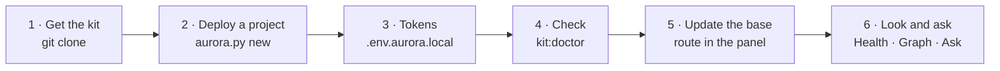

# 2. Quick start: a knowledge base in one day

> **Who should read it:** whoever opens the project for the first time — or deploys it.
>
> The full framework is a system of trust, decisions and tracing. It will not go away and it will
> grow. But to **begin** you need little: six steps, five rules, three commands, one habit.

## Why this matters to you personally

The assistant answers as well as its context is good.

**Without a base** every request starts from zero: it does not know your abbreviations, mixes up
statuses, invents algorithms. You spend time explaining — afresh every time.

**With a base** you get a selection of cards on the topic in seconds, each with a trust status and the
reason for it. The assistant speaks the project's language and relies on facts, not guesses.

## Six steps on day one



**1. Get the kit.** You need Python 3.9+ and git.

```bash
git clone https://github.com/<org>/aurora-studio.git
cd aurora-studio
```

No terminal: double-click `start-aurora.command` (macOS; the first time — right-click → "Open") or
`start-aurora.bat` (Windows). The file checks Python and git, offers to install what is missing and
opens the panel.

**2. Deploy a project.**

```bash
python3 aurora.py new /path/to/your-project
```

The command lays out the folders, copies the engine into `.aurora/`, asks for the settings (project
name and slug; Confluence — URL, space and root pages; Jira — URL, project key and JQL) and puts the
skills into the agent's shared folder (`~/.claude/skills`) so that `/aurora-vault` is found in any
conversation. The panel does the same: "The kit's setup" → "Connect a new project". Any answer can be
changed later — `python3 .aurora/scripts/aurora_setup.py` from the project, or "The project's
settings".

**3. Put the tokens in.** Copy `aurora.env.local.example` to `.env.aurora.local` next to
`aurora.config.yaml` and fill in `CONFLUENCE_PERSONAL_TOKEN` and `JIRA_PERSONAL_TOKEN`. The file is
git-ignored; secrets never go into git. The built-in agent's models are set up not here but once per kit,
in the panel's "Models" section — see [INSTALL](../INSTALL.md#the-built-in-agent).

**4. Check readiness.**

```bash
python3 aurora.py doctor /path/to/your-project
```

Or the "Install" section in the panel: it names what is missing and which commands do not work without it.

**5. Update the base.** Open the panel (`python3 aurora.py cockpit`), pick the project on the Bridge →
the routines section → the **"Update the base"** route. First "Preview" (the same route without
writing), then run. The route fetches the mirrors, parses the sources in batches, writes theses,
places links and computes trust. Every lap is committed to git; on a large project it takes hours — run
it overnight, you can stop it at any time.

**6. Look at the result.** "Health" — the composition of the base, the share of `knowledge`, errors,
what is left for a human; "Graph" — cards and the links between them; "Ask" — a question in your own
words, answered from the cards with a link for every claim.

## Five rules

**1. Work in `Workspaces/` and `Artifacts/`.** `Workspaces/<task>/` is your folder for a task: drafts,
selections, anything. `Artifacts/` holds results: stories, acceptance criteria, algorithms, reports.

**2. Do not touch `Sources/` and `Raw/` by hand.** `Sources/` is written by sync — your edits are
overwritten on the next run; edit in Confluence or Jira. `Raw/` is evidence: the spec, laws, meeting
minutes. It is immutable by definition (only `Raw/project/` and `Raw/examples/` are living and
hand-edited).

**3. Tell three states apart.**

| State | Statuses | What you may do |
|---|---|---|
| **Confirmed** | `knowledge` | it is a fact, the assistant relies on it |
| **Not confirmed** | `draft`, `placeholder` | you may read it, you may not build on it; the reason is in `trust_basis` |
| **Obsolete** | `deprecated` | history only, in the archive with a link to the replacement |

You do not set the status: the engine computes it from Jira issue statuses (`kb:trust`). A card cannot
be "confirmed", and the share of `knowledge` cannot be raised with statuses — only by tracing and by
issues moving.

**4. Delete nothing.** Obsolete knowledge is not erased but replaced: `kb:supersede` marks the old card
and rewrites the links to the successor.

**5. A card is wrong — do not edit it, write a correction.** A card is derived from sources and a hand
edit disappears at the next build. A correction lives in `Raw/corrections/` and is applied at every
build: `kb:correct --new "Request" --text "…"` (in the panel, the "Correct" button on an open card).
Your word gets the highest priority.

## Three commands for every day

**Before any serious question — assemble the context:**

```bash
python3 aurora.py context . "topic"
```

You get a selection of cards with trust headers. Paste it into the request instead of retelling the
project in your own words. If you need a ready answer, ask the base directly: `agent:ask` or the "Ask"
section in the panel — the model answers from the cards only and puts a link on every claim.

**After editing the base — check the mechanics:**

```bash
python3 aurora.py lint . --summary
```

Broken links, lost headers, stray secrets. Takes a second.

**Once a week — look at health and what is left:**

```bash
python3 aurora.py stats .
python3 .aurora/scripts/aurora_todo.py        # the same as the ops:todo command
```

How many cards, what share is `knowledge`, what is left for a human and why it is not a button.

Every command — and there are over ninety — is in the panel if the terminal is not your tool:
`python3 aurora.py cockpit`; the reference is [commands.md](../commands.md).

## One habit

**Learned something the base lacks — record it where the engine will pick it up.** Do not postpone it
"until there is time": in a week the knowledge is forgotten, in a month you will be asking the same
person again.

| What you learned | Where it goes |
|---|---|
| a decision was made | a Decision Record: `kb:decide <topic>` |
| we do not know, the customer must answer | a question: `kb:question <gist>`; the answer — `kb:answer Q-NNN` |
| a card says something wrong | a correction: `kb:correct` |
| a document appeared | put it in `Raw/` and run "Update the base" |

## What to postpone

| What | When it becomes needed |
|---|---|
| Decision Records | the first time you change a previously accepted approach |
| Requirements and tracing (REQ → SPEC → issue → acceptance) | when development starts on your documents |
| Rituals: a duty officer, the weekly clean-up | when the project has two analysts |
| Publishing to Confluence from git | when the base gets ahead of the showcase in freshness |
| Specifications and spec-pack | when an external contractor appears |
| The `kit:hooks` hook (ratchet) | as soon as the base stops being empty |

None of this is needed on day one. It is all already in the kit and switches on when it becomes needed.

## Where to look next

[Practice](04-practice.md) — the "situation → command" table. [Overview](01-overview.md) — why it is
built this way. [Looking after the base](05-gardening.md) — when there are many cards.
