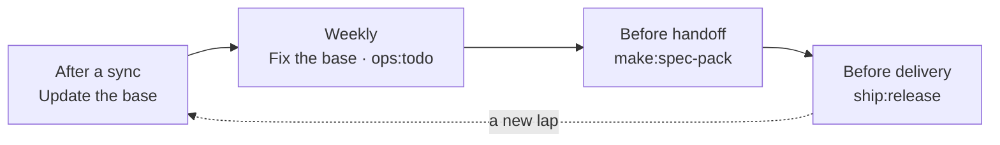

# 3. Team rules

> **Who should read it:** analysts working with the base. These are the rules that keep the base
> predictable when more than one person works with it.
>
> The principle everything rests on: **the engine computes trust, humans carry responsibility for the
> rest.** That is why there is no "card approval" in the rules — there is ownership of decisions,
> questions and disputed places.

## Roles

Aurora does not force you to split people into roles, but the tasks that stay with a human belong to
somebody. If the project has one analyst, every role is them; the rules are not cancelled by that —
they turn into a conversation with yourself half a year later.

| Role | Responsible for |
|---|---|
| **Duty officer** (in turns, for a week) | runs "Update the base" after a sync and "Fix the base" on Friday, works through `ops:todo`, hands out findings |
| **Section curator** | decides the disputed in their subject: duplicates, contradictions, claims "without support". One per section |
| **Decision author** | carries a Decision Record from proposal to acceptance |
| **Question owner** | carries a question to the customer (`owner` in the `Q-NNN` card): asked, reminded, recorded the answer |

Curators are naturally assigned like this:

| Section | Who leads |
|---|---|
| `Glossary`, business processes | business analyst |
| `Processes` (algorithms), `Systems`, `Statuses` | system analyst |
| `Requirements`, `Specs`, tracing | system analyst |
| product `Decisions`, `Questions` to the customer | product owner |

## Rituals

### Every day or after a sync → "Update the base"

The route fetches the mirrors, returns to the plan the sources that changed after parsing, rebuilds
theses, places links and recomputes trust. The duty officer does not "accept" the result: they look at
"Health" and at the route's summary. A source changed — the engine replaces only the carried-over text in
the card, removes the thesis mark and writes the thesis again; the previous thesis moves to the card's
footer with a date.

Before delivery, `ops:impact --explain <document>` and `sync:diff` are useful: they show which cards sit
under a document and which sources changed after parsing.

### An issue moved in Jira → nothing to do

Trust changes at the nearest `kb:trust` (the route runs it itself). An issue went back to work — the
card became `draft` and will not enter generation context packs; `trust_basis` says which issue and in
which status.

### Weekly, half an hour → "Fix the base" and `ops:todo`

"Fix the base" looks inward: links, duplicates, maps, tables of contents, the schema. After it,
`ops:todo` names what is left and explains why it is not a button. The duty officer hands the findings out:

- claims "without support" — to the section curator: check against the source, correct through
  `kb:correct`, or leave the mark;
- duplicates the model did not dare to merge, and contradictions (`agent:clashes`) — to the curator:
  who is right is decided by a human from the sources;
- cards without links to issues — tracing or a question to the team, but not a status change.

### Before handoff to development → `make:spec-pack`

The spec bundle is assembled by a script and checks readiness mechanically (Definition of Ready):
requirements are `agreed`, open questions (`Questions/` with status `open`/`asked` whose `blocks` names
this spec) do not block, the grounds are not drafts, every scenario has an acceptance criterion.
Violations do not interrupt the build but are printed and land in the "Handoff risks" section — the
contractor must see what the contract stands on. More in [SDD](06-sdd.md).

### Before delivery to the customer → `ship:release`

The handed-over version is frozen as a snapshot in `Deliverables/released/`, and the base is fixed with a
commit. The snapshot is immutable: it is the proof of "what we delivered".

## Decision Record rules

**When a DR is mandatory:** you chose between two or more options and the choice affects the system,
process or data; you change a previously accepted approach; you record an agreement with adjacent teams
that people will ask "why so" about.

**When it is not needed:** a fact from a primary source — the engine will parse it; an operational
decision without alternatives; cosmetics.

**Unshakable:**

1. An accepted or rejected DR is not edited. The only permitted edit is `status: superseded` and a link
   to the new one.
2. Rejected options are described with the reasons for refusal — so that a year later the answer to "why
   not X" reads without archaeology.
3. DRs are never deleted.
4. Accepting a DR, the author updates the affected cards (through `kb:supersede` if the current truth
   changes) and puts a link to the decision in them.

A DR is created by `kb:decide <topic>`; replacing an old record — `kb:supersede`. A **requirement** can
only be replaced with a delta description: `--changed` (what became different) and `--migration` (what
to do about what is already implemented under the old edition) — in half a year nobody will remember it.

## "Never" rules

1. **Do not edit `Sources/`** — the folder belongs to sync, edits are overwritten. Content is edited in
   Confluence or Jira.
2. **Do not edit cards by hand.** A card is derived from sources; the edit disappears at the next build.
   What is wrong goes through a `kb:correct` correction.
3. **Do not try to raise trust.** You cannot "approve" a card or rewrite `status` or `trust`. A low share
   of `knowledge` is cured by tracing and by issues moving.
4. **Do not delete knowledge.** Obsolete is `kb:supersede`: `deprecated`, the archive, a link to the successor.
5. **Do not put artifacts into `AuroraKnowledgeDB/`.** Stories, acceptance criteria and reports live in
   `Artifacts/`; knowledge returns to the base only through a source and parsing.
6. **Do not publish what the assistant produced without a human check.** A claim "without support" is not
   carried into a document even if it looks reasonable.
7. **Do not touch `Deliverables/released/` and the evidence part of `Raw/`** (`contract`, `laws`,
   `customer`, `meetings`).
8. **Do not create your own top-level folders.** The structure is fixed; anything non-standard goes to
   `Workspaces/<task>/`.
9. **Do not commit secrets.** Tokens and keys only in `.env.aurora.local`. The internal-names check
   (`commit-msg` in the kit) is never bypassed, and `--no-verify` does not suit it.

## Working in git

The base is part of the repository, so teamwork is an ordinary git process: branch → changes → pull
request → review. What gets reviewed is what people write: Decision Records, questions, corrections,
reference lists, artifacts. Reviewing a route's result line by line is impossible and unnecessary: every
lap is committed separately, and rollback is `git reset`.

Engine scripts refuse to write over an uncommitted tree, so commit your work before a route (the panel
does it with the "Commit" button). Install the ratchet — `kit:hooks`: the pre-commit hook does not let the
number of lint errors in what you commit grow, and does not demand fixing everything at once.

## Quality checklist: what a human writes

For a Decision Record, question, reference list and correction:

- [ ] one record — one thought; the title matches the content;
- [ ] the header is complete: `type`, `status`, dates and kind fields (`q_status`, `req_status`…) —
  `kb:lint` will tell you what is missing;
- [ ] `source` or `answer_source` points to a real primary source in `Raw/` or `Sources/`;
- [ ] every wiki link leads to an existing card;
- [ ] the record does not duplicate an existing one — you searched by title and by aliases;
- [ ] claims that depend on a choice link to a Decision Record;
- [ ] the file name passes the Windows, macOS and Linux rules (`kit:doctor` will check).

For an artifact before delivery:

- [ ] `based_on` lists the cards the document **cited**, not the whole context pack;
- [ ] "Clarifications", "Assumptions" and "In question" lie under the marker
  `<!-- ниже — производство, в чистовик не идёт -->` ("below — production, not for the final text");
- [ ] there are no claims without support (`unsupported` in the header is zero);
- [ ] `make:review` (or `make:review-auto`) has passed and the remarks are handled.
