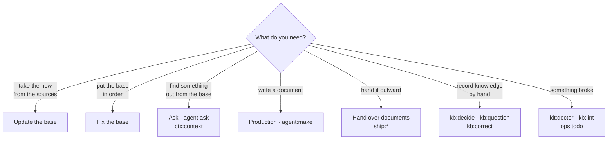

# 4. Practice: commands and prompts

> **Who should read it:** everyone who performs operations on the base.
>
> One command is run in three ways. **With a panel button** (`python3 aurora.py cockpit`) — the default
> path. **From the terminal** — `python3 aurora.py <verb> <project> [flags]` or a script from
> `.aurora/scripts/`. **Through the assistant** in the repository — `/aurora-vault <command>`: this is
> how procedure commands that need work with meaning are executed. The command name is the same
> everywhere: `kb:repair`, `ctx:context`, `agent:make`.

## How to choose a command

## Situation → command → result

### Sources and mirrors

| Situation | Command | Result |
|---|---|---|
| Fetch the fresh from Confluence / Jira / sites | `sync:confluence`, `sync:jira`, `sync:web` (or the "Update the base" route) | a mirror in `Sources/`; a repeated sync makes no noise in git |
| Mirror integrity is in doubt | `sync:audit` | `MISSING` / `ORPHAN` / `MOVED` / `COLLISION` / stale state |
| A source changed after the knowledge was built | `sync:diff` | drift: which cards rest on what changed |
| Issues get closed but the requirement does not | `sync:jira-status` | candidates for `implemented`, work without requirements, links by mention |
| A Confluence page moved | `kit:remap-sources`, `kb:repair --gone-sources` | cards' `source:` points to the new path |
| `Raw/` holds docx, pdf, xlsx, pptx | `kb:ingest-office` | Markdown transcripts next to the originals; a scan is read by a vision model |

### The knowledge base

| Situation | Command | Result |
|---|---|---|
| Parse the new into cards | `agent:build`, then `agent:distill`, `agent:extract` | cards, theses, extracted definitions |
| A law, regulation or spec was put into `Raw/` | `kb:ingest <path>` | cards linked to the primary source; a spec → `REQ` requirements with `tz_ref` |
| A meeting with the customer took place | `kb:ingest <transcript>` | a summary with quotes, candidates for decisions, requirements and facts |
| Compute trust | `ops:trace-table` → `kb:trust` | `status`, `trust_basis` on every card |
| A card is wrong | `kb:correct --new "Request" --text "…"` | a correction in `Raw/corrections/`, applied at every build |
| You need to ask the customer | `kb:question <gist>` | a `Q-NNN` card: to whom, what it blocks, the deadline |
| The answer came | `kb:answer Q-NNN` | the question is closed, the knowledge goes to a REQ / spec / DR |
| A decision was made or the approach changed | `kb:decide <topic>` | a Decision Record; the old one is marked `superseded` |
| A card is obsolete, a replacement exists | `kb:supersede <card>` | the old one to `_archive/`, incoming links rewritten |
| Two files speak about one thing | `kb:dedupe`, `kb:twins`, `agent:twins` | duplicates merged; the disputed are decided by the model from the text |
| A card grew bloated | `kb:split` | the parts are atomic cards, the original is a document map |
| Cards without entrances | `kb:links --cards`, `kb:moc` | `related:`, maps of content |

### Ask and assemble context

| Situation | Command | Result |
|---|---|---|
| You need verified context for a request | `ctx:context <topic>` | a selection of cards with trust headers — paste into any prompt |
| Ask the base in your own words | `agent:ask` (the "Ask" section) | an answer from the cards only, a link per claim, checked by Momus; the conversation is kept in `meta/ask/` |
| "Why did we choose X? Why not Y?" | `ctx:ask <question>` | an answer with quotes, including rejected and replaced decisions |
| Who relies on whom | `ops:impact <card>` | what depends; `--explain <document>` — what a document is built on |
| Connect the base to Claude Code, Cursor, OpenCode | `kit:mcp` | a ready connection line; the server only reads |

### Producing artifacts

| Situation | Command | Result |
|---|---|---|
| Write a story, criteria, spec, algorithm | `agent:make` ("Production" → type → task) | a file by the project's template; stages — enrichment from the base, a plan with questions to you, worker, critic, Momus |
| Find out which template and where | `make:kinds` | the registry of artifact kinds: template, folder, prompt, rules |
| Check the quality of a story or criteria | `make:review <object>` | a verdict and remarks with quotes of the cards the text contradicts |
| Check without a human, by a closed checklist | `make:review-auto` | three runs vote on each question, a script computes the score; `--page`, `--cql` |
| Assemble a spec from requirements | `make:spec <topic>` | `SPEC-NNN` with status `draft` and a full `based_on` |
| The spec is due to go to a contractor | `make:spec-pack <SPEC-NNN>` | a self-contained bundle: grounds, decisions, abbreviations, handoff risks |
| Check the contractor's implementation | `make:validate <SPEC> <object>` | covered / contradicts / not implemented, per scenario |
| Assemble an OPZ, PMI or user guide | `make:assemble <document>` | a document from the base by a template, `based_on` filled in |

### Outward

| Situation | Command | Result |
|---|---|---|
| An artifact is ready to publish | `ship:publish <file>` | a generated page in Confluence; the production kitchen (everything below the marker) does not go out |
| A document is needed in an office format | `ship:export <file>` | docx or pdf through pandoc |
| A version was handed to the customer | `ship:release <document>` | an immutable snapshot in `Deliverables/released/`, a base commit |
| Acceptance results and customer remarks | `ship:acceptance <object>` | a report in `Artifacts/acceptance/`, remarks sorted into defect / requirement / question / disagreement |
| Where tracing has gaps | `ops:trace` | spec item → requirement → spec → issue → criteria → acceptance |

### Health and maintenance

| Situation | Command | Result |
|---|---|---|
| The overall state of the base | `ops:stats` | a dashboard: composition, share of `knowledge`, risks |
| What is left for a human | `ops:todo` | a list that explains why it is not a button |
| Base mechanics drifted | `kb:repair` | broken links, homoglyphs, legacy headers; preview first |
| Meaning gaps | `ops:gaps` | a concept without a card, a link without a reference, lonely cards, a thesis behind its source |
| Does the base find itself | `ops:search-quality` | R@1, R@5, MRR; the difference from the last measurement |
| The card schema changed with a kit version | `kb:schema` | how many cards on which version and what the migration will do |
| Personal data | `kb:scrub` | find and cover with markers; mode — `privacy.scrub` in the config |
| File names fail on Windows or macOS | `kb:names` | mirror paths and card names brought to the strictest rules |
| Update the project's engine | `kit:update` | preview, then `--apply` |
| The Friday hygiene | "Fix the base", `kb:garden` | the stale, orphans, broken links, duplicates |
| I do not remember which commands exist | `kit:list` | the reference: modifiers, what executes it, since which version |

The full list with modifiers is [commands.md](../commands.md) or `python3 aurora.py list <project>`.

## The run rule

Engine commands fall into three categories, and you can tell by the flags.

**Observation** — `stats`, `lint`, `impact`, `trace`, `audit`, `diff`, `schema`, `scrub`, `doctor`. Run
freely, change nothing.

**Writing** — everything with `--apply`: `repair`, `supersede`, `index`, `release`, `update`, agent tasks.
Without the flag such a command makes a **preview** and shows what will happen. Always look at the
preview: a mass edit over the base is what you then sort out in `git diff` for hours. The panel does not
add `--apply` itself: first the preview, then your confirmation.

**Outward** — `sync:*`, `ship:publish`, `ship:export`. They need the network and a token and change
external systems. Tokens live in `.env.aurora.local` and do not reach git.

## The manual path: prompts

For work outside the repository — in a web chat or another tool — there are blanks in `Prompts/`. Each
header says which template to use and where to put the result.

| Prompt | Purpose |
|---|---|
| `US_create.md` | write a user story |
| `US_review_with_KB.md` | check a story or criteria with the base's context |
| `AC_new.md`, `AC_update.md` | write and refine acceptance criteria |
| `DR_create.md` | draft a Decision Record by the interview method |
| `SPEC_create.md` | a feature specification from requirements and knowledge |
| `meeting_ingest.md` | parse a meeting transcript |

The rule for the manual path is the same as for commands: **assemble the context first**
(`ctx:context <topic>`), do not feed the assistant Confluence pages as truth. The difference between "a
card with status `knowledge` and a basis" and "a page from the wiki" is the whole difference between a
fact and a rumour.

## What to do when a command complains

Engine scripts try to explain the reason instead of just failing. Common cases:

**"git-guard: N uncommitted files".** A mass write over a dirty tree makes rollback impossible. Commit
the current work (in the panel — "Commit") or, if you understand the risk, add `--allow-dirty`.

**"no token — set CONFLUENCE_PERSONAL_TOKEN".** Sync scripts go to Confluence and Jira directly; the MCP
in your editor does not help them. Copy the sample `aurora.env.local.example` to `.env.aurora.local` and
fill in the fields.

**The agent "did not answer" or the answer is empty.** `agent:ping` checks the gateway chain; `agent:probe`
distinguishes "no connection", "wrong key" and "no such model" and shows the gateway's model list.

**"top-level folders outside the schema".** Someone created their own folder. Move the content to
`Workspaces/<task>/`, or close the folder in `.gitignore` if it is service data, or declare it in the
config's `paths.extra_structure_dirs` (for this project only).

**A commit fails on the ratchet.** The number of lint errors in the commit grew above the baseline. Fix
(`kb:repair`) or, deliberately, `AURORA_SKIP_RATCHET=1` — it lifts only the ratchet; nothing lifts the
commit-message check.
