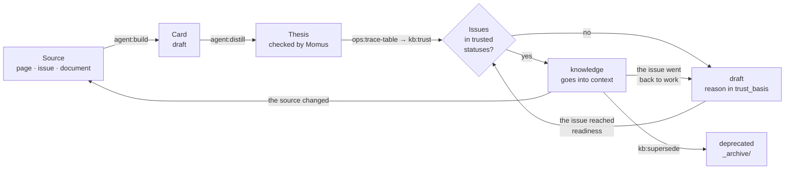

# 5. Looking after the base

> **Who should read it:** the duty officer and everyone who works through what is left after routes.
>
> The base is not a file warehouse but a garden. Knowledge arrives unchecked, matures along with the
> project's issues, bears fruit in artifacts and goes stale. The engine does almost all of the care; a
> human is left with what needs judgment.

The whole point in one sentence: **sources bring seeds, the engine plants them and computes what can be
believed, and once a week a human works through what the machine honestly called unresolvable.**

## How knowledge matures

The rules in two lines: a status is derived from the source and is not set by hand; the engine does not
rewrite what it did not write (the body of a dictionary and a document, the history footer, the previous
thesis). In detail — the [knowledge rules](../knowledge-rules.md).

## 1. Filling: how knowledge gets into the base

Nothing enters the base as "knowledge" at once. Any path produces `draft` cards until tracing proves
otherwise.

**Synchronisation.** The mirrors updated — the "Update the base" route parses the changed pages. Cards a
human wrote on are not overwritten: only the carried-over text is replaced, the thesis is written anew,
the old one goes to the footer.

**Documents.** Put a law, a regulation or a spec in `Raw/` — `kb:ingest` extracts cards (from a spec — item
by item, `REQ` requirements with `tz_ref`). The file stays in `Raw/` as evidence, and cards from `Raw/`
are trusted by definition: a signed customer document. docx/pdf/xlsx/pptx first become Markdown
transcripts (`kb:ingest-office`); a PDF scan is read by a vision model if one is configured.

**Meetings.** A transcript in `Raw/meetings/` yields a summary with quotes and candidates — decisions,
requirements, facts. A meeting neither gives nor takes away trust: a card from meetings alone is a draft,
marked "from a meeting" (`kb:repair --meetings`), so that what was said in conversation does not read as
written in a document.

**By hand.** If you know what the sources lack, do not create a card at random:

| What | How |
|---|---|
| a choice among options | a Decision Record: `kb:decide` |
| unknown, the customer is needed | a `Q-NNN` question: `kb:question`, the answer — `kb:answer` |
| a card is wrong | a correction: `kb:correct` — lives in `Raw/corrections/`, applied at every build |
| a domain reference list | a card in `Reference/` |
| a document | put it in `Raw/` and run "Update the base" |

## 2. Trust: what the engine does

After every sync (in a route — automatically):

1. `ops:trace-table` builds the "artifact ↔ issue" table: direct links (a matching number, an issue key in
   the text, `page_id`), links by code and indirect links up to two hops deep. Every link carries its proof.
2. `kb:trust` sets the class and status and writes `trust_basis` in words, with the issue key. One issue in
   progress outweighs ten finished ones.
3. A downgrade does not erase knowledge: the body stays, and the footer gets a line "class lowered on such
   a date, the issue went back to work".

Configured in `aurora.config.yaml`: `atlassian.jira.trust_statuses` and `assumption_statuses` (which issue
statuses count as trusted and which as draft), `verify.trusted_sources` and `verify.trusted_branches`
(trusted folders and reference wiki branches), the "trust" tick on a Confluence root page and on a web link.

## 3. What is left for a human

`ops:todo` is the only list. It names what is left and explains why it is not a button.

| Leftover | What to do |
|---|---|
| Claims "without support" (`unsupported:`) | Check against the source. True — leave it; wrong — a `kb:correct` correction; doubtful — `agent:distill --recheck`, Momus checks again |
| Contradictions between cards (`agent:clashes`) | Read both sides (the quotes are verbatim) and decide who is right from the sources |
| Duplicates the model did not dare to merge | Merge (`kb:dedupe --merge`) or separate the synonyms (`kb:repair --aliases`) |
| Cards without links to issues | Tracing or a question to the team. A status does not cure it |
| A disputed `kind` (dictionary or knowledge) | The `kind:` field in the correction's header |
| Unfinished productions | "Health" → "Unfinished": the engine does not clean them itself, it is a human's work |

**A correction and its ageing.** A correction is applied at **every** build — otherwise its priority over
Confluence would last until the next sync. If the source was updated later than the correction was
written, `kb:correct --check` asks a human; until answered, the correction keeps working. It can be
withdrawn with `--retire NAME --reason "…"`, and the card keeps `correction_retired`.

## 4. The weekly clean-up

"Fix the base" is a route that looks inward and does not go to the sources. It removes what accumulated
during parsing:

- broken links, homoglyphs (`АИС` in Latin and in Cyrillic), legacy fields, fields outside the schema;
- duplicates: the undisputed are merged by a rule, the rest by the model (`agent:twins`, `agent:aliases`);
- stubs and placeholders that hold nothing; cards built from a page template instead of knowledge;
- vanished sources (`--gone-sources`), titles instead of file names, tautologies in theses;
- maps of content, tables of contents, the artifact-code index, the graph, the semantic index;
- the card schema (`kb:schema`) and a quality review (`kb:map`: pairs about one thing, document-sized
  cards, islands and bridges).

At the end the route remembers the linter's residue, and "Fix" no longer calls you to what only hands
can fix.

Three more commands help to self-check the base:

| Command | What it shows |
|---|---|
| `ops:gaps` | meaning gaps: a concept is named but has no card; a link is named but not placed; lonely cards; a thesis behind its source; a vanished source |
| `ops:search-quality` | does the base find itself: a card's thesis as a question, the right answer is known by construction. R@1, R@5, MRR |
| `ops:retrieval` | which cards come first for analysts' real queries and what changed since last time |

## 5. Health in numbers

The "Health" section and `ops:stats` show: the composition of the base, the share of `knowledge` (without
placeholders and service files — "a measure that cannot reach a hundred tells nothing"), risks, links, lint
errors, mirror freshness and what is left for a human. `ops:stats --append-metrics` appends a line to
`meta/metrics.md` — the dynamics are visible from git.

**A low share of `knowledge` is not an emergency.** Either issues are still in progress or no links were
found. The second is cured by tracing, not by statuses.

## 6. Large operations

| When | What |
|---|---|
| The parsing rules changed, the base accumulated duplicates | The "Rebuild the base from scratch" route: `kb:reset` wipes what will be rebuilt (a card with a live `source:` and the `built: machine` mark), while cards of unknown origin **stay** — `--list-unknown` shows them, `--drop-unknown` wipes them. The run goes in laps, rollback is from git |
| Confluence pages moved | `kit:remap-sources`, then `kb:repair --gone-sources` |
| Card names changed | `kit:remap-sources`: the artifacts get their grounds back |
| An old base with `verified` and `imported` | `kb:trust` moves it to the new scale in one run; `kb:schema` migrates the headers |
| Personal data must be hidden | `kb:scrub` (mode `privacy.scrub`) |

## The rhythm of a week

| When | What | Who |
|---|---|---|
| Monday | "Update the base" | duty officer |
| Tuesday–Thursday | work through `ops:todo`: "without support", contradictions, questions to the customer | section curators |
| Friday | "Fix the base", `ops:todo`, `kb:garden` — half an hour | duty officer |
| Once per release | `kb:schema`, `ops:search-quality`, `tests/smoke_live.py <project>` | duty officer |

## Three rules that must not be broken

**Delete nothing.** Obsolete knowledge gets `deprecated` and moves to the archive with a link to the
replacement. Accepted decisions are not edited — only replaced.

**An artifact is not knowledge.** A story or a check report produced by the assistant does not enter the
base directly: first a review and publication, and only what is extracted from the published source returns to
the base through ordinary parsing.

**Trust is not set, it is computed.** If you want to raise the share of `knowledge`, move issues and build
tracing, do not edit headers.
