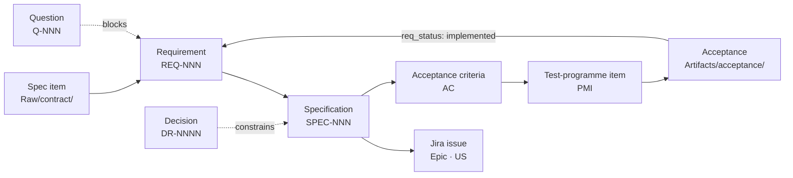
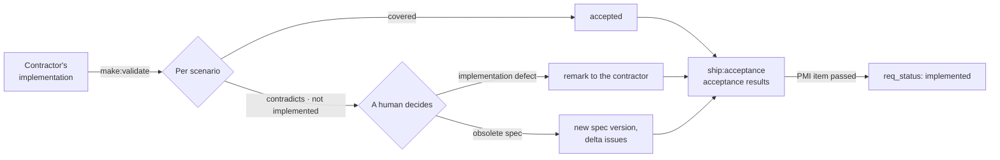

# 6. Spec-Driven Development

> **Who should read it:** analysts preparing features for handoff to development, and those who accept
> the result.
>
> **Premise:** development may live in another repository or with a contractor — the bridge is a
> self-contained spec bundle.

## The idea in one paragraph

A specification is not a description "about code" but an **executable contract**. It is written before
implementation, tasks are created from it, the result is checked against it, and a change of requirements
means a change of the spec, not a verbal agreement with a developer. The weak point of the approach is
garbage in: a spec written without confirmed context beautifully codifies misconceptions. The framework
closes exactly this: **a spec is assembled from `knowledge` cards** and carries the full list of grounds
in `based_on`. And specs, in turn, revive the base: knowledge stops lying around and starts compiling into
contracts.

## The tracing chain

The `ops:trace` command rebuilds the table `MOC/Трассировка-требований.md` from the `Requirements/` cards
(it is generated, nobody edits it by hand) and shows gaps: a spec item without coverage, a requirement
blocked by an open question (especially an overdue one), `implemented` without a passed PMI item,
`agreed` without Jira for over thirty days, `rejected` without a reason.

## The chain's objects

| Object | Where | Key fields | Lifecycle |
|---|---|---|---|
| **Requirement** | `AuroraKnowledgeDB/Requirements/REQ-NNN-….md` | `req_id`, `tz_ref`, `jira`, `acceptance`, `pmi`, `decisions` | `req_status`: `stated` → `agreed` → `implemented` or `rejected` |
| **Question** | `Questions/Q-NNN-….md` | `q_id`, `owner`, `asked_to`, `due`, `blocks`, `answer_source` | `q_status`: `open` → `asked` → `answered` or `closed-no-answer` |
| **Decision** | `Decisions/DR-NNNN-….md` | `date`, `supersedes` | `proposed` → `accepted` or `rejected` → `superseded` |
| **Specification** | `Specs/SPEC-NNN-….md` | `spec_id`, `implements`, `decisions`, `jira`, `based_on`, `applies_to` | `draft` → `knowledge`; once handed over by spec-pack — immutable for the release |
| **Acceptance** | `Artifacts/acceptance/….md` | `covers`, `verdict`, `protocol` | a report of a run, not knowledge |

Rules the engine checks:

- `rejected` requires a reason in the body (and a DR if the refusal is a team decision); `implemented`
  requires at least one `jira` entry and, in substance, a passed PMI item;
- `q_status: answered` requires `answered` and `answer_source` — a verbal answer is not an answer. The
  answer does not stay only in the question card: it goes into a REQ, spec or DR (`kb:answer`);
- `closed-no-answer` is allowed only together with a DR about the assumption — we work by the assumption
  and it is recorded;
- a requirement can be replaced through `kb:supersede` only with `--changed` and `--migration`.

## A spec as a knowledge card

Specs live in `Specs/` (template `Templates/spec_template.md`) and are assembled by `make:spec` from
requirements in `agreed`, `knowledge` cards and related DRs. The structure: Why (which requirements it
implements) → Boundaries → **Behaviour** (given / when / then scenarios, wording like "when <trigger>, the
system must <reaction>") → Data → Integrations → Constraints (links to decisions) → Non-functional
requirements → **Open questions** → Acceptance criteria.

Everything unclear goes to "Open questions" — inventing is forbidden. The engine recomputes the status
of a spec by the same rules as other cards (`draft` → `knowledge`).

## Definition of Ready — the handoff gate

A spec goes to development when:

1. all terms resolve to glossary and concept cards with status `knowledge`;
2. every implemented requirement is in `req_status: agreed`;
3. non-standard choices are recorded as decisions (`accepted`) and linked to the spec;
4. the "Open questions" section is empty: there are no `Questions/` cards with status `open` or `asked`
   whose `blocks` names this spec; a question is a blocker, not a note;
5. every scenario has a line in "Acceptance criteria";
6. `based_on` has no drafts — or they are explicitly marked as assumptions.

Items 2, 4 and 6 are checked mechanically by `make:spec-pack`. Violations do not interrupt the build but
are printed and land in the "Handoff risks" section: the contractor must see what the contract stands on
and not learn it at acceptance.

## The bridge to external development: spec-pack

`make:spec-pack SPEC-NNN` (with `--apply`) assembles one self-contained Markdown file — the main product
analysts hand over:

- header: spec version, date, base commit, DoR status, release, handoff risks;
- the whole spec;
- appendices: **the bodies of all grounding cards** with trust headers, related accepted DRs (replaced
  ones are allowed for "why", with a mark), the abbreviation reference;
- all internal links are resolved into anchors: the file reads without access to the base.

It can be given to a contractor, put in Confluence or passed to a coding agent as full context. It is
kept in `Deliverables/work/spec-packs/`; the fact of handoff is recorded by `ship:release` — an immutable
snapshot.

**The feedback rule:** developers' questions are not answered verbally. Every answer becomes a
clarification of the spec or requirement — a new version. Otherwise the contract drifts away from reality
and in a month nobody knows which version the code was written to.

## Checking the result and acceptance

`make:validate <SPEC> <object>` compares what arrived — an implementation description, test cases,
documentation, a change export — with the spec's scenarios: covered, contradicts, not implemented, not
verifiable. Every divergence is a fork for a human: an implementation defect or an obsolete spec; in the
second case — a new spec version, not a silent acceptance. `ship:acceptance` sorts the customer's
remarks on acceptance into four types: defect, new requirement, question, disagreement.

Issue statuses return into requirements through `sync:jira-status`: candidates for `implemented`, work
without requirements, links by mention. Which Jira statuses mean "done" and "cancelled" is set by the
project in `atlassian.jira.done_statuses` and `cancelled_statuses`.

## The change cycle

1. The customer changes a requirement — a meeting, a letter, a new edition of the spec → the REQ is clarified.
2. `ops:trace` and `ops:impact` show the affected specs and delivered documents.
3. The spec gets a new version; the old one stays valid for its release (`applies_to`).
4. Delta issues go to Jira, an updated spec-pack to the contractor.
5. Changing code or a story bypassing the spec is the same taboo as hand-editing a generated page in
   Confluence.

Releases are declared in `AuroraKnowledgeDB/meta/releases.md` (one line per release, a `current` marker);
a card without `applies_to` is valid for all releases. When knowledge changes from release to release, it
is **two cards** with mutual links, not `deprecated`.

## When to switch on

This is the second level. Switch it on when the team has mastered the basic cycle — context, trust, care —
and the first feature to be handed to development under a contract has appeared.

Commands: `make:spec`, `make:spec-pack`, `make:validate`, `ops:trace`, `ship:acceptance`. A manual prompt
for work outside the repository — `Prompts/SPEC_create.md`.
