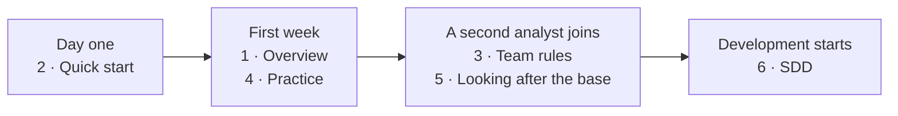

# Aurora Studio — documentation for people

A set to read with your eyes: what the framework is, why it exists, how to use it and how to look
after the base. Technical references sit next to it: commands — [commands.md](../commands.md),
internals — [architecture.md](../architecture.md), procedures for the assistant —
`skills/aurora-vault/references/` (in Russian), release history —
[CHANGELOG.md](../../../CHANGELOG.md) (in Russian).

The documents are current for kit **1.147.1**. Русская версия: [docs/readme/](../../readme/README.md).

| # | Document | For | About |
|---|---|---|---|
| 1 | [Overview](01-overview.md) | everyone on the project | why, three principles, trust layers, the card, who does what |
| 2 | [Quick start](02-quickstart.md) | a newcomer on day one | six steps, five rules, three commands, one habit |
| 3 | [Team rules](03-team-rules.md) | analysts | roles, rituals, Decision Record rules, "never" rules, checklist |
| 4 | [Practice: commands and prompts](04-practice.md) | everyone who works with the base | situation → command → result; the manual path through prompts |
| 5 | [Looking after the base](05-gardening.md) | the base's duty officer | how knowledge matures, what is left for a human, the weekly clean-up |
| 6 | [Spec-Driven Development](06-sdd.md) | analysts and contractors | a specification as an executable contract: from requirement to acceptance |

## In what order to read

**Day one:** "Quick start" — and get to work. The rest is not needed straight away.

**First week:** "Overview" and "Practice". By now you want to know where statuses come from.

**When a second analyst joins:** "Team rules" and "Looking after the base". Before that the rituals
are not needed — the base is small and you are alone in it.

**When development starts on your specs:** "Spec-Driven Development".

## What is not here

| What | Where |
|---|---|
| Installation, config, secrets, updates | [INSTALL.md](../INSTALL.md) |
| The whole knowledge model | [knowledge-rules.md](../knowledge-rules.md), [one-page summary](../knowledge-rules-tldr.md) |
| The cycle and the path of a card | [lifecycle.md](../lifecycle.md) |
| Command reference | [commands.md](../commands.md) or `python3 aurora.py list <project>` |
| The control panel | [control-panel.md](../control-panel.md) |
| Engine internals | [architecture.md](../architecture.md), [CONTRIBUTING.md](../CONTRIBUTING.md) |

The control panel with everything at once: `python3 aurora.py cockpit`.
