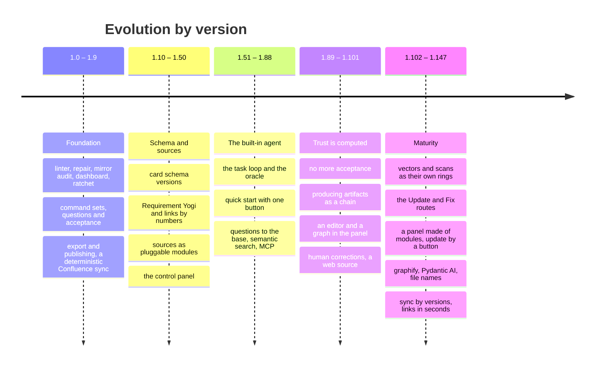

# Design decisions and roadmap

This records **why Aurora is built the way it is**, how it reached its present shape and what is not yet done. Every
decision rests on a fact from operation, not on a wish. The release history by number is in [CHANGELOG.md](../../CHANGELOG.md)
(in Russian); the engine's structure is in [architecture.md](architecture.md). Русская версия: [../roadmap.md](../roadmap.md).

## 1. What operation showed

By July 2026 the engine (version 1.2.0) was running on two live projects — a large one and a small one — and exposed three
systemic problems.

| Symptom | Large project | Small project |
|---|---|---|
| cards in the base | 1971 | 65 |
| cards without `status` (legacy) | 1114 | 0 |
| lint errors | 1046 (482 broken links) | 54 |
| homoglyph twins (`АИС` / `AИС`) | dozens of pairs | — |
| artifacts that ended up in knowledge | 130 | — |
| Confluence mirror divergence | missing 216, orphan 526, collision 3 | — |
| `build` had to be cut by hand | into phases | — |

Three conclusions that determined the design:

1. **Mechanics is for a script, judgment for the model.** A model walking thousands of files is expensive and produces
   errors. Every mass operation got a deterministic script with a preview; the agent receives its report and takes only
   decisions.
2. **The loop must close.** "Inward" (sync → parsing → cards) was worked out; "outward" (artifacts → Confluence, documents →
   docx) and feedback (drift, issue statuses) were not. The declared position "git is the truth, Confluence is the showcase"
   did not hold without `ship:`.
3. **Human acceptance does not scale.** Nobody will verify 1971 cards, and "raising the share with statuses" is meaningless.
   Trust had to be computed from what already exists in the project — from issue statuses.

## 2. Principles that are not up for discussion

| Principle | What follows |
|---|---|
| **Git is the source of truth, Confluence is the showcase** | The base lives in git as Markdown; Confluence is read and commented on, but the "truth" is not edited there |
| **An artifact is not knowledge** | What is produced is not served to the assistant as a fact; only cards are knowledge |
| **Trust is computed** (1.89) | A card's status is derived from the statuses of linked issues and the source's origin; there are no "accepted" steps, a human assigns no trust |
| **The unit of the base is an entity** (1.100.32) | Knowledge accumulates in one card from many sources; another's definition is moved into its own card |
| **Script, then model** | The model writes only through engine commands; a second model (Momus) checks its answer; reaching the goal is checked by an oracle command |
| **The engine does not rewrite another's work** | The body of a dictionary and a document, the history footer, the previous thesis are not overwritten |
| **The folder structure is fixed** | See below |
| **Nothing is deleted** | `deprecated` + archive + a link to the successor; Decision Records are immutable |
| **What is delivered is immutable** | `Deliverables/released/` and the evidence part of `Raw/` |
| **Deterministic mirrors** | One page — one file, otherwise the git diff is no evidence |
| **Standard library** | The engine has no runtime dependencies; the panel's third-party libraries lie as ready builds — works in a closed perimeter without internet and Node |
| **The kit is independent of projects** | No client names or addresses in skills, templates and defaults; live numbers and names do not reach public history |

### Why the folder structure is fixed

The structure is the same in every Aurora project. The top level and the structural second level (base sections, artifact
types, `Raw/` layers) are set by the kit in `structure_dirs.txt` and changed only by a release.

- A project does **not invent** its own artifact types: `create <unknown type>` refuses and offers a standard type or
  `Workspaces/<task>/`, where freedom is complete.
- A new type is needed seriously — it is a kit change: an edit of `structure_dirs.txt`, the tables in `SKILL.md` and
  `conventions.md` and a CHANGELOG entry, so that the type appears everywhere at once.
- `structure_dirs.txt` is the single source of truth: `install` and `update` read it, `doctor` checks the fact against it.
  The exception is folders closed by `.gitignore` and those declared by a project in `paths.extra_structure_dirs`.

The reason: an identical structure is a contract between projects. It gives portability of an analyst's skill, reusable prompts
and templates, working scripts and a meaningful `update`.

### Why there are many commands and nine sets

A flat list of twenty-five commands became unreadable already by version 1.3, and today there are over ninety. So a command's
name is `<set>:<action>`, and a set has its own rhythm and owner:

| Set | Meaning | Who and when |
|---|---|---|
| `kit:` | the engine's life in a project | a lead, rarely |
| `sync:` | mirrors of external systems | the duty officer, after a sync |
| `kb:` | extraction and the life of knowledge | daily |
| `ctx:` | using knowledge | daily |
| `make:` | producing artifacts | an analyst |
| `ship:` | outward | an analyst, at milestones |
| `ops:` | management and reporting | a lead, weekly |
| `agent:` | the built-in agent | routes and an analyst |
| `dev:` | QA of the engine itself | an engine developer |

Short names without a prefix remain aliases forever. Every command has an executor — a script, a model or both — and a version of
appearance; all of it is recorded in `commands.txt`.

## 3. How Aurora reached its present shape

Milestones:

| Version | What changed and why |
|---|---|
| 1.0.0 (21.07.2026) | The first release: the `aurora-vault` skill, trust layers, installation |
| 1.3.0 | The first wave of repair from operation: `kb:repair`, `kb:dedupe`, `sync:audit`, `ops:stats`, `kit:hooks`, command namespaces, `structure_dirs.txt` travels into the project |
| 1.4.0 | Questions to the customer (`Questions/`) and acceptance (`Artifacts/acceptance/`): the unknown and test results became objects |
| 1.5 – 1.6 | The "outward" cycle: `kb:ingest-office`, `ship:export`; a deterministic Confluence sync instead of a model-driven export |
| 1.8 – 1.9.x | `ctx:context --budget`, `make:spec-pack`, `ship:publish`, `kb:scrub`, `kit:list`, `sync:jira-status` |
| 1.28.0 | Sources became pluggable modules (`connectors/`) |
| 1.56.0 | The built-in agent: an analyst runs the base without leaving Aurora |
| 1.59.0 | "Quick start" is passed with one button |
| 1.63 – 1.68 | `agent:ask`, dependency-free semantic search, the base's MCP server |
| 1.89 – 1.90 | **Trust is computed; no more acceptance.** The `kb:verify` and `kb:queue` commands are removed |
| 1.95.0 | Producing artifacts as a chain: enrichment, a plan, worker, critic, Momus |
| 1.98.x | The file editor and the base graph in the panel |
| 1.99.x | Corrective artifacts: a human's word is truth of the highest priority |
| 1.101 – 1.104 | Web pages as a source; the vector ring and the scan-recognition ring |
| 1.117.0 | The "Update the base" route |
| 1.121 – 1.125 | The panel was taken apart into folder modules |
| 1.124.0 | Updating the kit from the panel with one button |
| 1.131.0 | The "Graph" section |
| 1.138 – 1.139 | graphify under the hood; every model call goes through Pydantic AI |
| 1.140.0 | File names by the strictest rules of Windows, macOS and Linux |
| 1.144 – 1.147 | A page template is not knowledge; the card kind by rule; sync by versions; repair of vanished sources |

## 4. What is not done yet

Checked against the command registry at version 1.147.1.

**Unfinished in the knowledge model** (per `накопление-знания.md`):

1. Rebuild the live bases by the new accumulation rules: duplicates accumulated by the old parsing are cheaper to rebuild than to
   merge one by one. The order is ready — the "Rebuild the base from scratch" route.
2. Check whether `kb:split` (cuts a bloated card by size) and `agent:extract` (moves out others' definitions) fight on a rebuilt
   base: a card from which definitions were moved may stop being "bloated".
3. Confirm the measure on a rebuilt base: `kb:twins` gives units of groups, not hundreds; `ops:search-quality` does not fall;
   the share of cards with a non-empty `based_on` grows.

**Ideas absent from the command registry:**

| Idea | What for |
|---|---|
| A "change" object | an additional agreement → a wave of edits in SPEC, US, PMI and the delivered; today `ops:impact` shows dependencies but does not drive the wave |
| `sync:all` and a schedule | running all mirrors on a schedule |
| `ship:respond` | triage of customer comments on generated pages |
| `kit:harvest` | returning to the kit templates and skills that took root in a project |
| `ops:onboard`, a `Workspaces/` archive | onboarding and tidying |
| `ops:releases` | the release registry `meta/releases.md` is read by `ctx:context` and the linter, but there is no command to create and run it |
| `doctor --repo` | the repository's weight: `node_modules`, `__pycache__`, `.DS_Store` |

**Engine QA.** The test cases and scenarios in `Development/QA/` lag behind the code: found and fixed defects must be closed by
checks. The condition: before writing a case, re-establish the cause of every finding — some defects used to be diagnosed by symptom,
and a case written for a wrong diagnosis is worse than none. Order: `dev:qa-cover` → re-check the diagnosis → an automatic test
where the behaviour reproduces in seconds, a case where it cannot → `dev:qa-check`.

## 5. Invariants the roadmap may not violate

1. An artifact is not knowledge.
2. Nothing is deleted (`kb:supersede`, `_archive/`).
3. Sync does not overwrite what a human rewrote; a divergence is drift.
4. Every card enters a prompt with a trust header and the basis.
5. What is delivered (`Deliverables/released/`, evidential `Raw/`) is immutable.
6. Diagrams are code (mermaid in a card).
7. The folder structure is fixed by the kit.
8. Mass mechanics is a script, not a model.
9. Trust is computed, not assigned.
