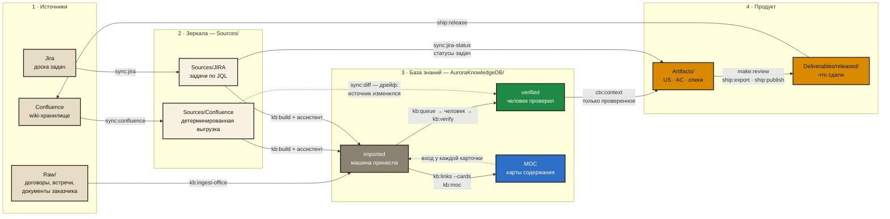
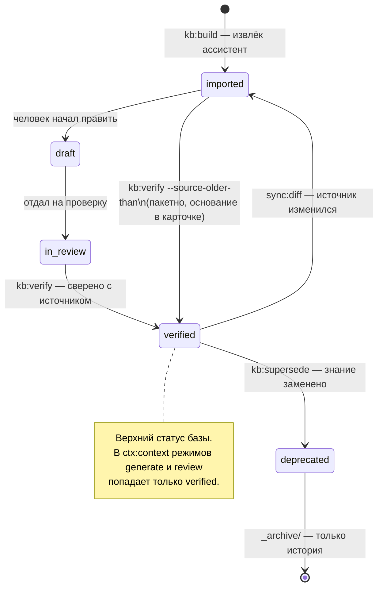

# Цикл работы с Aurora Studio

Один оборот: источник → зеркало → знание → доверие → артефакт → наружу → обратная связь.
Здесь — карта целиком и ритм работы. Путь одной карточки по шагам, с условиями перехода и
ценой пропуска каждого этапа, — в [card-path.md](card-path.md).
Каждая стрелка — команда движка, а не пожелание. Схема рендерится прямо на GitHub.

## Общий цикл

## Жизнь одной карточки

## Суточный ритм

| Когда | Что | Команды |
|---|---|---|
| каждый день, 10 минут | утренний обход | `sync:confluence` → `sync:jira` → `sync:audit` → `sync:diff` → `ops:stats` |
| после синка | пополнить базу | `kb:build --partition N` → ассистент → `kb:links --cards` → `kb:moc` → `kb:lint` |
| раз в неделю | верификация | `kb:queue` → человек → `kb:verify` |
| раз в месяц | навигация | `kb:moc --suggest` → правило в `moc_groups.txt` → `kb:moc --apply` |
| пятница, 30 минут | прополка | `kb:garden` → `kb:dedupe` → `kb:index` → `kb:schema` |
| когда идёт разработка | трассировка | `sync:jira-status` → `ops:trace` → `make:spec-pack` |
| когда артефакт готов | наружу | `make:review` → `ship:export` → `ship:publish` → `ship:release` |

Два правила, из которых вырастает всё остальное: **зеркало детерминировано** (один и тот
же источник даёт один и тот же файл — иначе git-diff перестаёт быть уликой) и **доверие
присваивает человек** (`verified` ставит тот, кто сверил карточку с источником и отвечает
за это).
