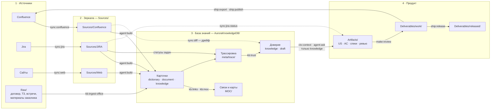
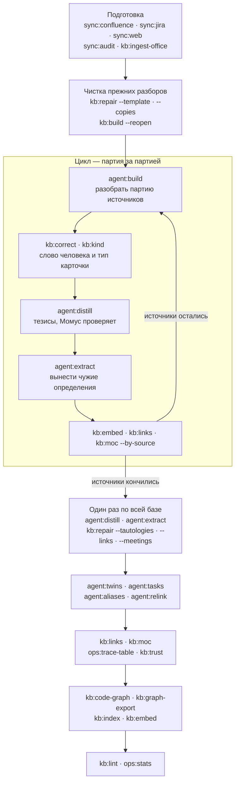
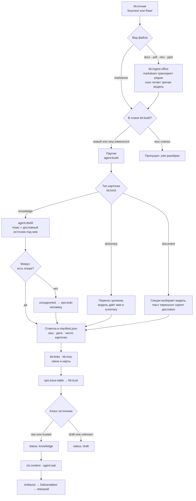
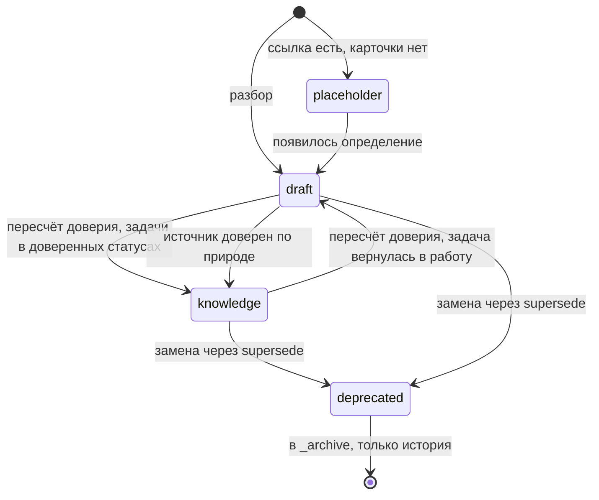

# Цикл и путь карточки

Один оборот Авроры: **источник → зеркало → карточка → доверие → артефакт → наружу → обратная
связь**. Здесь — карта цикла целиком, путь одной карточки по шагам с условием перехода к
следующему, маршруты панели и ритм работы. Каждая стрелка — команда движка.

Правила, по которым всё это работает, — в [правилах базы знаний](knowledge-rules.md); процедуры
для ассистента — в `skills/aurora-vault/references/`.

## 1. Цикл целиком

```mermaid
flowchart LR
  subgraph S["1 · Источники"]
    CONF["Confluence"]
    JIRA["Jira"]
    WEB["Сайты"]
    RAW["Raw/<br>договор, ТЗ, встречи,<br>материалы заказчика"]
  end

  subgraph M["2 · Зеркала — Sources/"]
    MC["Sources/Confluence"]
    MJ["Sources/JIRA"]
    MW["Sources/Web"]
  end

  subgraph K["3 · База знаний — AuroraKnowledgeDB/"]
    CARD["Карточки<br>dictionary · document · knowledge"]
    LINK["Связи и карты<br>MOC/"]
    TR["Трассировка<br>meta/trace/"]
    TRU["Доверие<br>knowledge · draft"]
  end

  subgraph P["4 · Продукт"]
    ART["Artifacts/<br>US · AC · спеки · ревью"]
    DEL["Deliverables/work/"]
    REL["Deliverables/released/"]
  end

  CONF -->|"sync:confluence"| MC
  JIRA -->|"sync:jira"| MJ
  WEB -->|"sync:web"| MW
  RAW -->|"kb:ingest-office"| CARD
  MC & MJ & MW -->|"agent:build"| CARD
  CARD -->|"kb:links · kb:moc"| LINK
  MJ -->|"статусы задач"| TR
  CARD --> TR
  TR -->|"kb:trust"| TRU
  TRU -->|"ctx:context · agent:ask<br>только knowledge"| ART
  ART -->|"make:review"| DEL
  DEL -->|"ship:export · ship:publish"| CONF
  DEL -->|"ship:release"| REL
  MC -.->|"sync:diff — дрейф"| TRU
  MJ -.->|"sync:jira-status"| ART
```

Два правила, из которых вырастает остальное:

- **Зеркало детерминировано.** Один и тот же источник даёт байт-в-байт один и тот же файл, иначе
  git-дифф перестаёт быть уликой, а `sync:audit` не может сверить состояние.
- **Доверие вычисляется.** Его даёт не человек, а статус связанных задач и происхождение
  источника.

## 2. Маршруты панели

Рутину не нужно набирать командами: панель проходит **маршрут** — набор шагов по порядку.
Маршрут останавливается, только если шаг завершился с кодом 2 и выше; код 1 («отработала и нашла,
что чинить») — нормальное состояние живой базы. Сценарии лежат в `cockpit/scenarios.txt`
обычным текстом: добавили строку — появился шаг. Кнопка «Посмотреть» снимает `--apply` со всех
шагов и показывает тот же маршрут без записи.

| Маршрут | Вкладка | Для чего | Куда смотрит |
|---|---|---|---|
| `update` — **Обновить базу** | «Быстрый старт» | взять новое из источников и довести до знания | наружу |
| `fix` — **Починить базу** | «Быстрый старт» | привести в порядок то, что уже есть: ссылки, двойники, карты, схема | внутрь, в источники не ходит |
| `rebuild` — **Пересобрать базу с нуля** | «Быстрый старт» | снести всё, что соберётся заново, и собрать по текущим правилам; опасно и редко | внутрь |
| `write` — **Написать артефакт** | «Продуктивность» | история, AC или спецификация — от вопроса к базе до готового файла | вперёд |
| `deliver` — **Сдать документы** | «Продуктивность» | собрать поставляемое, проверить, выгрузить, заморозить версию | наружу |

### Маршрут «Обновить базу»

Он идёт, пока есть работа (хоть двенадцать часов), и **фиксирует каждый оборот в git**: выключили
посреди ночи — разобранное осталось годным, переделывать не придётся. Раньше это были фазы по
всей базе, и остановка посередине оставляла карточки без типов, тезисов и связей.

```mermaid
flowchart TD
  A["Подготовка<br>sync:confluence · sync:jira · sync:web<br>sync:audit · kb:ingest-office"] --> B["Чистка прежних разборов<br>kb:repair --template · --copies<br>kb:build --reopen"]
  B --> C
  subgraph LOOP["Цикл — партия за партией"]
    C["agent:build<br>разобрать партию источников"] --> D["kb:correct · kb:kind<br>слово человека и тип карточки"]
    D --> E["agent:distill<br>тезисы, Момус проверяет"]
    E --> F["agent:extract<br>вынести чужие определения"]
    F --> G["kb:embed · kb:links · kb:moc --by-source"]
  end
  G -->|"источники остались"| C
  G -->|"источники кончились"| H
  H["Один раз по всей базе<br>agent:distill · agent:extract<br>kb:repair --tautologies · --links · --meetings"] --> I["agent:twins · agent:tasks<br>agent:aliases · agent:relink"]
  I --> J["kb:links · kb:moc<br>ops:trace-table · kb:trust"]
  J --> K["kb:code-graph · kb:graph-export<br>kb:index · kb:embed"]
  K --> L["kb:lint · ops:stats"]
```

«Починить базу» и «Пересобрать» собираются из тех же шагов; полные списки — в
`cockpit/scenarios.txt`. Шаги, которые делает человек, в маршрутах помечены и не запускаются.

**Дата обновления базы** — когда «Обновить базу» и следом «Починить базу» прошли целиком.
Одно «Обновить» без «Починить» дату не двигает: новое взято, но база не приведена в порядок.
Дату пишет сам маршрут в `AuroraKnowledgeDB/meta/kb_updated.json`, в тот же коммит, что и
свой итог, — так она общая для всей команды. Её видно на плитке проекта на Мостике, в
«Здоровье», «Спросить» и «Продуктивности»: на какой базе стоит ответ или документ. Журнал
запусков (`run_log.md`) — дело одной машины и в git не идёт.

### Маршрут по расписанию и из терминала

Раздел **Cron** (группа «Машина») ставит маршруты и отдельные команды на время и собирает из них
цепочки: «в 20:00 пройти „Обновить базу“ и „Починить базу“ во всех проектах». Кнопка
«Обслуживание всех проектов» заготовит именно такую цепочку — маршруты базы, кроме пересборки с
нуля. Цепочку ведёт сервер панели, страница для этого не нужна, но сама панель должна работать.
Правила:

- цепочки идут по одной, вторая ждёт в очереди (боты — тоже задания этой очереди); сработало
  задание, которое ещё идёт, — второй прогон не запускается, в истории — «пропущен запуск»;
- проекты идут в том порядке, в каком названы в шагах задания; «все проекты» — в порядке панели;
- маршрут идёт по тем же правилам, что кнопка «Пройти»: обороты с коммитом, остановка на застое
  и отказе, ожидание сети; остановленный ночью маршрут продолжается кнопкой «Продолжить маршрут».
  Срока у шага нет: долгое размышление модели — не повод бросать работу;
- проект занят другой работой — шаг ждёт до двух часов, потом пропускается;
- проект — единица цепочки. Шаг проекта не прошёл (команда упала, шлюзы не отвечают, маршрут не
  сдвинул базу ни на один коммит) — остальные шаги этого проекта откладываются: «Починить» после
  несостоявшегося «Обновить» бессмысленна. Цепочка идёт к следующему проекту, а в конце один раз
  возвращается к отложенным и продолжает с места остановки. Второй провал — итог проекта;
- застой на хвосте, когда база за маршрут менялась, — «частично», а не провал: проект обновлён, и
  его следующие шаги идут. Карточка, которую тезисы отложили человеку (словарь длиннее окна, а
  границ планировщик не нашёл), остатком работы не считается, пока её не изменят;
- в задании можно выбрать «при сбое — остановить цепочку»: тогда она встаёт на первом провале;
- **сторож зависаний.** Шаг маршрута или цепочки молчит дольше 5 минут — панель проверяет связь
  с моделью и с Jira/Confluence проекта. Шаг снимается вместе с дочерними процессами (адаптер
  модели, git) и запускается заново — без потолка, пока шаг не пройдёт или человек не прервёт;
  брошенный `index.lock` убирается.
  Это случается в двух случаях:
  - связь пропадала и вернулась, а шаг за 5 минут так и не ожил — ответа на запрос, ушедший
    до обрыва, не будет;
  - связь цела, а шаг молчит больше часа — это дольше любого запроса к модели.

  Долгое размышление модели при живой связи сторож не трогает: по пульсу шага он видит запрос
  к модели в его сроке или вызов, ждущий слот шлюза, — это работа, а не зависание;
- **маршрут доводит дело до конца.** Шаги маршрута и цепочки идут без потолков по времени. Кнопка
  одной команды живёт по-прежнему: у неё бюджет шага и срок запроса из раздела «Модели».
  - У шага нет бюджета: он идёт, пока не кончится его очередь.
  - Вызов модели не сдаётся по сроку, занятому слоту, обрыву связи или ошибке 5xx и ходит по
    кольцу шлюзов, пока не получит ответ.
  - Срок запроса — только страж зависшего соединения. Шлюзу, не уложившемуся в срок, следующая
    попытка даёт вдвое больше времени, а сам он уходит в конец кольца, но не в карантин.
  - Сеть маршрут ждёт, пока она не вернётся, а зависший шаг перезапускает без предела.

  Вызов сдаётся только там, где ожидание не поможет: сервер внятно отказал (400/401/404), запрос
  длиннее окна у всех шлюзов, модель три круга подряд отвечает пусто. Такой источник уходит в
  журнал сбоев, прогон идёт дальше.

  Ход виден по этапам: «▸ взят в работу», «↗ запрос → шлюз, модель, срок», «… жду слот», «⟳ не
  ответил — повторю со сроком вдвое больше», «✓ ответ за N мин, токены, скорость» — с именем
  источника и этапом (разбор, проверка критика, план, проверка Момуса);
- **что идёт — в Консоли.** Над ней — цепочка, маршруты и команды всех проектов, «Показать»
  переключает вывод. Поток цепочки — заголовок каждого пункта с проектом, вывод его шагов,
  ожидания и итоги — идёт по всем проектам подряд. Открытая без своего вывода Консоль сама
  подключается к тому, что идёт;
- **пульс шага — под Консолью.** Ответ модели приходит целиком, и шаг может молчать до срока
  запроса (обычно 20 минут). Строка пульса с крутящимся колесом показывает:
  - жив ли процесс;
  - когда была последняя строка;
  - сколько запросов к моделям в работе, самый долгий из них и его срок, на каком шлюзе и
    модели;
  - когда пришёл последний ответ и сколько было ответов и сбоев.

  Время проверки меняется на каждом опросе. Тон строки говорит, ждать или вмешаться:
  - «работает» и «ждёт ответа модели» — ждать;
  - «запрос дольше срока» — движок снимет запрос сам;
  - «молчит, запросов нет» — сторож снимет шаг (время до этого показано), команду без
    маршрута — «Прервать»;
  - «процесс не найден».

  Запросы движок пишет в папку прогона (`.aurora/runs/<прогон>/pulse-<pid>.json`), файл
  исчезает с концом процесса;
- **шаг «бот»** — бот проекта или «все включённые боты проекта». С «все проекты» цепочка по
  очереди запускает ботов всех проектов, по тем же правилам проекта-единицы, что и маршруты.
- время, пропущенное, пока панель не работала, догоняется не позже чем через 15 минут, иначе
  запуск записывается пропущенным; панель перезапустили посреди цепочки — новая продолжит её;
- пишущая команда вне маршрута фиксируется в git сразу.

Расписание хранится в `~/.aurora/cron-tasks.json`, история — в `~/.aurora/cron-runs/`.

Тот же исполнитель доступен из терминала: `python3 aurora.py route <проект> <маршрут> --apply`
(без `--apply` — как «Посмотреть»).

## 3. Путь одной карточки

Условие, при котором пора идти дальше, и цена пропуска каждого шага.

```mermaid
flowchart TD
  A["Источник<br>Sources/ или Raw/"] --> B{"Вид файла"}
  B -->|"docx · pdf · xlsx · pptx"| C["kb:ingest-office<br>markdown-транскрипт рядом<br>скан читает зрячая модель"]
  B -->|"markdown"| D
  C --> D{"В плане kb:build?"}
  D -->|"новый или хеш изменился"| E["Партия<br>agent:build"]
  D -->|"хеш совпал"| Z["Пропущен: уже разобран"]
  E --> F{"Тип карточки<br>kb:kind"}
  F -->|"dictionary"| G1["Перенос целиком,<br>модель даёт имя и summary"]
  F -->|"document"| G2["Секции выбирает модель,<br>текст переносит скрипт дословно"]
  F -->|"knowledge"| G3["agent:distill<br>тезис + дословный источник под ним"]
  G3 --> M{"Момус:<br>есть опора?"}
  M -->|"да"| H
  M -->|"нет"| U["unsupported: → ops:todo<br>человеку"]
  U --> H
  G1 --> H
  G2 --> H
  H["Отметка в manifest.json<br>хеш · дата · число карточек"] --> I["kb:links · kb:moc<br>связи и карты"]
  I --> J["ops:trace-table → kb:trust"]
  J --> K{"Класс источника"}
  K -->|"raw или trusted"| N["status: knowledge"]
  K -->|"draft или unknown"| O["status: draft"]
  N --> P["ctx:context · agent:ask"]
  P --> Q["Artifacts/ → Deliverables/ → released/"]
```

| # | Шаг | Команда | Чем отмечается результат | Условие следующего шага | Обязателен |
|---|---|---|---|---|---|
| 1 | Зеркало источника | `sync:confluence`, `sync:jira`, `sync:web` | файл в `Sources/`, запись в `sync_state.md` / `update_log.md` | синк без ошибок, `sync:audit` не показывает MISSING | **да** |
| 2 | Свои документы | положить в `Raw/` руками | ничего: `Raw/` неизменяем по договорённости | файл на месте и правиться не будет | **да** для договоров и встреч |
| 3 | Офисные форматы | `kb:ingest-office` | `.md`-транскрипт рядом с оригиналом | транскрипт читаем, таблицы не рассыпались | да, если исходник не markdown |
| 4 | План разбора | `kb:build` | ничего не пишет, читает `manifest.json` | в плане есть непустые партии | **да** |
| 5 | Разбор | `agent:build` (или `kb:build` → ассистент) | карточки со `source:`, `built: machine`, `source_synced:` | файл разобран **целиком** | **да** |
| 6 | Отметка о разборе | сам разбор (`kb:build --done`) | запись в `manifest.json` | отметка принята — иначе ошибка, она сверяется с базой | **да** |
| 7 | Тип и тезис | `kb:kind`, `agent:distill` | `kind:`, тезис над «Источником», `distilled:` | тезис написан, Момус проверил | **да** для `knowledge` |
| 8 | Связи и карты | `kb:links --cards`, `kb:moc` | `related:`, файлы `MOC/` | брошенных карточек нет | **да**: карточка без связей — ошибка линтера |
| 9 | Механика | `kb:lint`, `kb:repair` | отчёт, правки | битых ссылок нет, шапки полные | да перед сдачей |
| 10 | Доверие | `ops:trace-table`, `kb:trust` | `status`, `trust`, `trust_basis`, `trust_checked` | видно, чему верить и почему | **да**: без него `knowledge` не появится |
| 11 | Использование | `ctx:context`, `agent:ask` | пакет с шапками доверия, `usage.log` | шапки на месте | **да** для работы модели |
| 12 | Артефакт | `agent:make`, `make:*` | файл в `Artifacts/`, `based_on` | `based_on` заполнен | **да** |
| 13 | Ревью | `make:review`, `make:review-auto` | отчёт в `Artifacts/reviews/` | замечания разобраны | рекомендуется |
| 14 | Поставка | `ship:export`, `ship:publish` | docx/pdf, страница Confluence | документ вычитан | по этапам |
| 15 | Фиксация | `ship:release --apply` | снимок в `Deliverables/released/`, коммит базы | документ передан заказчику | **да** — иначе нечем доказать, что сдавали |
| 16 | Обратная связь | `sync:diff`, `sync:jira-status` | отчёт | появился дрейф — вернуться к шагу 5 или 10 | **да**, регулярно |

## 4. Статусы карточки

```mermaid
stateDiagram-v2
  [*] --> draft: разбор
  [*] --> placeholder: ссылка есть, карточки нет
  placeholder --> draft: появилось определение
  draft --> knowledge: пересчёт доверия, задачи в доверенных статусах
  draft --> knowledge: источник доверен по природе
  knowledge --> draft: пересчёт доверия, задача вернулась в работу
  knowledge --> deprecated: замена через supersede
  draft --> deprecated: замена через supersede
  deprecated --> [*]: в _archive, только история
```

- **`knowledge`** — факт. Все связи в доверенных статусах либо источник доверен по природе.
- **`draft`** — ещё не подтверждено: хоть одна задача в работе, либо связей нет вовсе (причина — в
  `trust_basis`, словами и с ключом задачи).
- **`placeholder`** — пустышка: имя занято ссылкой, знания нет. Из поиска, контекста и замеров
  такие карточки выведены.
- **`index`** — служебное: карты содержания, `_index.md`. Навигация, не знание (в диаграмме не
  показан: в цикл статусов не входит).
- **`deprecated`** — заменено, лежит в `_archive/`, отвечает только на «как было».

Старые базы содержат `imported`, `in-review`, `verified`, `accepted`: движок их читает
(`verified` считается доверенным), но не назначает; `kb:trust` переводит базу на новую шкалу за
один прогон.

## 5. Три отметки, которые не дают делать работу дважды

| Отметка | Где живёт | На какой вопрос отвечает | Кто ставит |
|---|---|---|---|
| версия страницы / `updated` задачи | `sync_state.md`, `update_log.md`; кэш `.aurora/cache/confluence_pages.json` | «качать ли заново» | синк, автоматически |
| хеш источника | `AuroraKnowledgeDB/meta/manifest.json` | «разбирать ли заново» | разбор, с проверкой по базе |
| `source_synced` в карточке | шапка карточки | «не изменился ли источник под уже разобранным знанием» | разбор и `sync:diff` |

**Синк Confluence** берёт номер версии из списка детей, и страница с прежней версией, тем же
конвертером, прежним путём и файлом на месте не качается заново. Раз в неделю и с `--force` синк
проходит зеркало полностью: правка вложения не всегда поднимает версию страницы. Изменили
конвертер — поднимите `CONVERTER`, и следующий синк пройдёт всё.

## 6. Что происходит, когда что-то меняется

| Изменилось | Что делает движок |
|---|---|
| текст источника | возвращает его в план (`kb:build --reopen`), заменяет в карточке **только** перенесённый текст, снимает отметку о тезисе; `agent:distill` пишет новый тезис, прежний уходит в подвал с датой и строкой «что изменилось» |
| статус задачи | ничего не переписывает — меняет класс доверия на ближайшем `kb:trust` |
| карточка переросла окно модели | планировщик предлагает границы, движок режет, части связываются, исходная становится картой документа (`kb:split`) |
| страница переехала | `kit:remap-sources` и `kb:repair --gone-sources` находят её по `page_id` или коду документа |

## 7. Ритм работы

| Когда | Что | Команды |
|---|---|---|
| каждый день, 10 минут | утренний обход | маршрут «Обновить базу» или `sync:*` → `sync:audit` → `sync:diff` → `ops:stats` |
| после каждого синка | доверие | `ops:trace-table` → `kb:trust` (маршрут делает сам) |
| каждую ночь | обслуживание без человека | раздел Cron: «Обновить базу» и «Починить базу» во всех проектах |
| раз в неделю | гигиена | «Починить базу» → `ops:todo` → `kb:garden` |
| раз в месяц | навигация и качество | `kb:moc --suggest`, `ops:search-quality`, `ops:gaps` |
| идёт разработка | трассировка | `sync:jira-status` → `ops:trace` → `make:spec-pack` |
| артефакт готов | наружу | `make:review` → `ship:export` → `ship:publish` → `ship:release` |

## 8. Где чаще всего рвётся

| Симптом | Что произошло | Чем чинить |
|---|---|---|
| в плане снова файлы, которые вчера разбирали | разбор не отметил источник | `kb:dedupe`, затем `kb:build` |
| источник отмечен разобранным, карточек нет | отметка ставилась без разбора | `kb:build --reopen --apply` |
| у источника одна карточка на 60 КБ текста | разбор оборвался на первых разделах | `kb:build --thin` |
| сотни битых ссылок после разбора | ссылки на карточки, которых нет | `kb:repair --links`, затем `--stubs` |
| один синоним у двух карточек | извлечение раздало алиасы щедро | `kb:repair --aliases`, `agent:aliases` |
| доля `knowledge` низкая, база большая | задачи ещё в работе или связей не нашлось | трассировка (`ops:trace-table`), а не статусы; проверить `trust_statuses` в конфиге |
| о карточке сказано «источник пропал» | страница переехала или удалена | `kb:repair --gone-sources` |
| одна сущность живёт пятью карточками | разбор не видел базу | `kb:twins`, `agent:twins`; при необходимости пересборка |
| в карточке утверждения без опоры | Момус не нашёл опору в источнике | `ops:todo`; `agent:distill --recheck` перепроверит |
