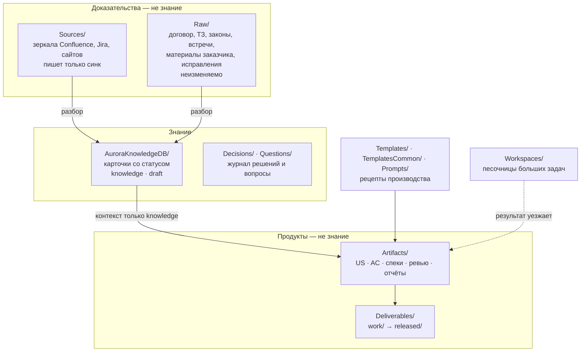

# 1. Обзор фреймворка

> **Кому читать:** всем участникам проекта — аналитикам, владельцу продукта, разработчикам.
>
> **Коротко:** знания проекта живут в git как markdown-карточки. У каждой карточки есть статус
> доверия, и **вычисляет его движок**: по статусам задач Jira, связанных с источником карточки.
> Ассистент обязан этот статус учитывать: `knowledge` — факт, `draft` — не факт, `deprecated` —
> только история. Решения фиксируются в неизменяемом журнале вместе с отклонёнными вариантами.

## Зачем это нужно

Мы используем ИИ, чтобы проверять и производить аналитические артефакты — истории, критерии
приёмки, спецификации. Без явной модели доверия это ломается тремя способами.

**«Сам написал — сам поверил».** Черновик истории, попавший в базу через синхронизацию,
ассистент начинает считать истиной — и не находит в нём ошибок.

**Потеря истории.** Подход поменялся, старую карточку заменили новой — и через полгода никто не
может ответить, почему отказались от альтернативы.

**Тихое устаревание.** Подтверждённое и протухшее лежат вперемешку, ассистент уверенно отвечает по
устаревшему, и доверие к базе падает до нуля за пару таких случаев.

Аврора закрывает всё три двумя механизмами: **слоями доверия** (папки плюс статус карточки,
который считает движок) и **журналом решений** — неизменяемыми Decision Records.

## Три принципа

**Артефакт ≠ знание.** Документ, который мы проверяем или производим, — объект работы. Знание —
только карточки базы с подходящим статусом. Объект никогда не подаётся ассистенту как факт, даже
если его копия лежит в зеркале Confluence.

**Ничего не удаляется.** Устаревшее знание получает `deprecated`, ссылку на преемника и уезжает в
архив. Принятые решения не редактируются — только заменяются новыми.

**Доверие вычисляется, а не присваивается.** Человек не «принимает» карточки и не ставит им
статус. Движок читает статусы задач, связанных с источником, и сам решает, факт это или
черновик; задача вернулась в работу — карточка стала черновиком. Взамен движок не переписывает
того, чего не писал: слово человека приходит отдельным исправлением и живёт выше источника.

## Карта проекта: слои доверия



| Папка | Роль | Кто пишет |
|---|---|---|
| `Sources/` | зеркала внешних систем: Confluence, Jira, сайты | только синхронизация |
| `Raw/` | первоисточники, положенные руками: `contract/`, `laws/`, `customer/`, `meetings/`, `project/`, `examples/`, `corrections/` | человек; `contract`, `laws`, `customer`, `meetings` неизменяемы |
| `AuroraKnowledgeDB/` | карточки знаний: `Concepts/`, `Processes/`, `Glossary/`, `Systems/`, `Roles/`, `Statuses/`, `Reference/`, `Requirements/`, `Specs/`, `Questions/`, `Decisions/`, `MOC/` | движок и агент; руками правят `Decisions/`, `Questions/`, `meta/`, а остальное — только через исправление (`kb:correct`) или источник: правку в карточке сотрёт следующая сборка |
| `Artifacts/` | то, что производят аналитик и агент: `us/`, `ac/`, `algorithms/`, `reviews/`, `reports/`… | аналитик и агент |
| `Deliverables/` | `work/` — рабочие версии, `released/` — переданные (неизменяемые снимки), `_archive/` — хранение | аналитик; `released/` только командой `ship:release` |
| `Workspaces/` | песочницы больших задач: подборки, черновики, любые вспомогательные файлы | кто угодно |
| `Templates/`, `Prompts/`, `TemplatesCommon/` | шаблоны документов и промпты | проект ведёт свои; общие шаблоны ведёт кит |

Структура папок **одинакова во всех проектах** и фиксируется китом (`structure_dirs.txt`). Новые
типы артефактов проект не придумывает: нестандартному место в `Workspaces/<задача>/`.

## Карточка

**Единица базы — сущность, а не документ.** Если про аналитический баланс говорят пять
документов, в базе одна карточка «Аналитический баланс», и она копит знание из всех пяти. Когда
внутри карточки попутно объясняется другая сущность, её выносят в собственную карточку, а на её
месте ставят ссылку.

У каждой карточки есть **тип** — он решает, кому позволено править тело:

| Тип | Что это | Тело |
|---|---|---|
| `dictionary` | словари, справочники, перечисления | переносится целиком, модель не трогает |
| `document` | договор, ТЗ, регламент, печатная форма | дословно, не меняется никогда |
| `knowledge` | всё остальное | модель пишет тезис, дословный источник остаётся под ним |

и **статус**:

| Статус | Что значит | Как ассистент относится |
|---|---|---|
| `knowledge` | все связанные задачи в доверенных статусах, либо источник доверен по природе | факт |
| `draft` | хоть одна задача в работе, либо связей нет вовсе | идея, нужна проверка |
| `placeholder` | пустышка: на понятие ссылаются, знания пока нет | не отвечает |
| `index` | карты содержания, оглавления | навигация, не знание |
| `deprecated` | заменено через `kb:supersede` | история; для «почему» |

Шапка карточки (сокращённо):

```yaml
---
title: "Алгоритм смены статусов заявки"
type: process
kind: knowledge            # dictionary | document | knowledge
status: knowledge          # считает движок
trust: trusted             # класс источника: raw | trusted | draft | unknown
trust_basis: "все связанные задачи в доверенных статусах, например PRJ-123 — «Закрыто»"
trust_checked: 2026-08-21
source: "Sources/Confluence/…"
related: ["[[Заявка]]"]
---
Тезис: определение сущности и существенные условия, со ссылками на другие карточки.

## Источник (перенесено дословно)
…
```

Полная схема — `skills/aurora-vault/references/frontmatter.md`, правила — в
[правилах базы знаний](../knowledge-rules.md).

## Откуда берётся доверие

Движок считает **класс источника** на каждом прогоне заново:

| Класс | Когда | Статус карточки |
|---|---|---|
| `raw` | источник доверен по природе: `Raw/`, раздел Confluence с галочкой «доверять», веб-ссылка с галочкой, справочная ветка вики | `knowledge` |
| `trusted` | все связи — задачи и истории — в доверенных статусах | `knowledge` |
| `draft` | хоть одна связь в статусе черновика | `draft` |
| `unknown` | связей нет | `draft` |

Одна задача в работе перевешивает десять готовых. Какие статусы Jira считать доверенными,
проект задаёт в `aurora.config.yaml` (`trust_statuses` и `assumption_statuses`). Низкая доля
`knowledge` — не авария: либо задачи ещё в работе, либо связей не нашлось, а второе лечится
трассировкой (`ops:trace-table`), а не статусами.

## Кто что делает

```mermaid
flowchart LR
  subgraph SCRIPT["Скрипт — механика"]
    S1["синк, линтер, ремонт"]
    S2["план разбора, ссылки, карты"]
    S3["трассировка и доверие"]
    S4["пакет контекста"]
  end
  subgraph MODEL["Модель — смысл"]
    M1["разбор источника на карточки"]
    M2["тезис, выделение сущностей"]
    M3["черновик артефакта"]
  end
  subgraph CHECK["Проверка"]
    C1["Момус: опора на каждое утверждение"]
    C2["Оракул: команда движка проверяет факт"]
  end
  subgraph HUMAN["Человек — ответственность"]
    H1["пишет то, чего нет в источниках"]
    H2["разбирает спорное и «без опоры»"]
    H3["нажимает «Обновить» и «Починить»"]
  end
  SCRIPT --> MODEL --> CHECK --> HUMAN
```



Что остаётся человеку — ровно три вещи:

1. **Писать то, чего нет в источниках**: решения (DR), вопросы заказчику, свои справочники, а также
   исправления («в карточке неверно, на самом деле так»). Писать в предметный раздел; помечать
   ничего не надо.
2. **Разбирать спорное**: двойников, которых машина не решилась слить; карточки без связей с
   задачами; утверждения, помеченные Момусом «без опоры»; противоречия между карточками. Список
   с объяснениями — `ops:todo`.
3. **Нажимать две кнопки**: «Обновить базу» (взять новое из источников) и «Починить базу»
   (привести в порядок то, что есть).

Не делает человек больше этого: не подтверждает карточки, не ведёт очередь верификации, не
проставляет владельцев и сроки годности. Команд `kb:verify` и `kb:queue` нет — процедура, потерявшая
смысл, опаснее отсутствующей.

## Круговорот знаний

Источник → зеркало → карточка → доверие → артефакт → наружу → обратная связь. Каждый переход —
команда движка с условием, при котором её пора запускать. Схема и путь одной карточки по шагам —
в [Цикле](../lifecycle.md).

## Слова, которые встретятся

| Слово | Значение |
|---|---|
| **кит** | этот репозиторий: движок, навыки, шаблоны, панель; из него развёртывают проекты |
| **движок** | скрипты в `.aurora/scripts/` проекта (копия из кита) |
| **зеркало** | выгрузка внешней системы в `Sources/`: файл на страницу или задачу |
| **источник** | файл, из которого родилась карточка: зеркало или `Raw/` |
| **тезис** | определение сущности, которое пишет модель; под ним лежит дословный источник |
| **пакет контекста** | подборка карточек под тему, каждая с шапкой доверия (`ctx:context`) |
| **Момус** | вторая модель, проверяющая каждое утверждение ответа на опору в источнике |
| **оракул** | команда движка, проверяющая достижение цели вместо самооценки модели |
| **маршрут** | набор шагов панели, проходящийся одной кнопкой («Обновить базу», «Починить базу» …) |
| **Мостик** | стартовый экран панели: плитки всех проектов машины |
| **MOC** | карты содержания: навигация по базе |
| **DR** | Decision Record — неизменяемая запись решения с отклонёнными вариантами |
| **пустышка** | карточка-заготовка: имя занято ссылкой, знания пока нет |
| **храповик** | хук pre-commit: число ошибок линтера может только снижаться |

## Что читать дальше

[Лёгкий старт](02-quickstart.md) — начать сегодня. [Практика](04-practice.md) — «ситуация →
команда → результат». [Регламент](03-team-rules.md) — когда в проекте появился второй аналитик.
