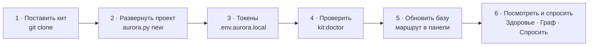

# 2. Лёгкий старт: база знаний за один день

> **Кому читать:** тому, кто открыл проект впервые — или разворачивает его сам.
>
> Полный фреймворк — это система доверия, решений и трассировки. Она никуда не денется и будет
> расти. Но чтобы **начать**, достаточно малого: шесть шагов, пять правил, три команды, одна
> привычка.

## Зачем это лично вам

Ассистент отвечает настолько хорошо, насколько хорош его контекст.

**Без базы** каждый запрос начинается с нуля: он не знает ваших сокращений, путает статусы,
выдумывает алгоритмы. Вы тратите время на объяснения — каждый раз заново.

**С базой** вы за секунды получаете подборку карточек по теме, у каждой — статус доверия и его
причина. Ассистент говорит на языке проекта и опирается на факты, а не на догадки.

## Шесть шагов первого дня



**1. Поставьте кит.** Нужны Python 3.9+ и git.

```bash
git clone https://github.com/<org>/aurora-studio.git
cd aurora-studio
```

Без терминала: дважды щёлкните `start-aurora.command` (macOS; при первом запуске — правой кнопкой
→ «Открыть») или `start-aurora.bat` (Windows). Файл проверит Python и git, предложит доустановить
недостающее и откроет панель.

**2. Разверните проект.**

```bash
python3 aurora.py new /path/to/your-project
```

Команда разложит папки, скопирует движок в `.aurora/`, спросит настройки (имя и slug проекта,
Confluence — адрес, пространство и корневые страницы, Jira — адрес, ключ проекта и JQL) и положит
навыки в общий каталог агента (`~/.claude/skills`), чтобы `/aurora-vault` находился в любом
диалоге. То же делает панель: «Настройка кита» → «Подключить новый проект». Любой ответ можно
поправить позже — `python3 .aurora/scripts/aurora_setup.py` из проекта или «Настройки проекта».

**3. Положите токены.** Скопируйте `aurora.env.local.example` в `.env.aurora.local` рядом с
`aurora.config.yaml` и заполните `CONFLUENCE_PERSONAL_TOKEN` и `JIRA_PERSONAL_TOKEN`. Файл закрыт
`.gitignore`; в git секреты не кладут никогда. Модели встроенного агента настраиваются не здесь, а
один раз на кит — в разделе панели «Модели», см. [INSTALL](../INSTALL.md#встроенный-агент).

**4. Проверьте готовность.**

```bash
python3 aurora.py doctor /path/to/your-project
```

Или раздел «Установка» в панели: он называет, чего не хватает и какие команды без этого не
работают.

**5. Обновите базу.** Откройте панель (`python3 aurora.py cockpit`), на Мостике выберите проект →
«Быстрый старт» → маршрут **«Обновить базу»**. Сначала «Посмотреть» (тот же маршрут без записи), потом
запуск. Маршрут заберёт зеркала, разберёт источники партиями, напишет тезисы, расставит связи и
посчитает доверие. Каждый оборот фиксируется в git; на большом проекте это часы — запускайте на
ночь, остановить можно в любой момент.

**6. Посмотрите, что получилось.** «Здоровье» — состав базы, доля `knowledge`, ошибки, остаток
человеку; «Граф» — карточки и связи между ними; «Спросить» — вопрос своими словами, ответ по
карточкам со ссылками.

## Пять правил

**1. Работайте в `Workspaces/` и `Artifacts/`.** `Workspaces/<задача>/` — ваша папка под задачу:
черновики, подборки, что угодно. `Artifacts/` — результаты: истории, критерии приёмки,
алгоритмы, отчёты.

**2. Не трогайте руками `Sources/` и `Raw/`.** `Sources/` пишет синхронизация — ваши правки
затрутся при следующем прогоне; правьте в Confluence или Jira. `Raw/` — доказательства: ТЗ,
законы, протоколы встреч. Они неизменны по определению (живые руками — только `Raw/project/` и
`Raw/examples/`).

**3. Различайте три состояния.**

| Состояние | Статусы | Что можно |
|---|---|---|
| **Подтверждено** | `knowledge` | это факт, на него опирается ассистент |
| **Не подтверждено** | `draft`, `placeholder` | читать можно, строить на нём — нельзя; причина — в `trust_basis` |
| **Устарело** | `deprecated` | только история, лежит в архиве со ссылкой на замену |

Статус не ставите вы: его считает движок по статусам задач Jira (`kb:trust`). «Подтвердить»
карточку нельзя, поднять долю `knowledge` статусами нельзя — только трассировкой и движением
задач.

**4. Ничего не удаляйте.** Устаревшее не стирается, а заменяется: `kb:supersede` пометит старую
карточку и перепишет ссылки на преемника.

**5. Карточка неверна — не правьте её, а напишите исправление.** Карточка выводится из
источников, и правка руками исчезнет при следующей сборке. Исправление живёт в `Raw/corrections/`
и применяется при каждой сборке: `kb:correct --new "Заявка" --text "…"` (в панели — кнопка
«Исправить» на открытой карточке). Ваше слово получает высший приоритет.

## Три команды на каждый день

**Перед любым серьёзным вопросом — соберите контекст:**

```bash
python3 aurora.py context . "тема"
```

Получите подборку карточек с шапками доверия. Её и вставляйте в запрос — вместо того, чтобы
пересказывать проект своими словами. Если нужен готовый ответ, спросите базу напрямую:
`agent:ask` или раздел «Спросить» в панели — модель ответит только по карточкам и поставит ссылку
на каждое утверждение.

**После правки базы — проверьте механику:**

```bash
python3 aurora.py lint . --summary
```

Битые ссылки, потерянные шапки, случайные секреты. Занимает секунду.

**Раз в неделю — посмотрите на здоровье и остаток:**

```bash
python3 aurora.py stats .
python3 .aurora/scripts/aurora_todo.py        # то же, что команда ops:todo
```

Сколько карточек, какая доля `knowledge`, что осталось человеку и почему это не кнопка.

Все команды — а их больше девяноста — есть в панели, если терминал не ваш инструмент:
`python3 aurora.py cockpit`; справочник — [commands.md](../commands.md).

## Одна привычка

**Узнали то, чего нет в базе, — зафиксируйте там, где это подхватит движок.** Не откладывайте «на
когда будет время»: через неделю знание забудется, а через месяц вы будете выяснять его заново у
того же человека.

| Что узнали | Куда |
|---|---|
| приняли решение | Decision Record: `kb:decide <тема>` |
| не знаем ответ, нужен заказчик | вопрос: `kb:question <суть>`; ответ — `kb:answer Q-NNN` |
| в карточке написано неверно | исправление: `kb:correct` |
| появился документ | положить в `Raw/` и запустить «Обновить базу» |

## Что отложить

| Что | Когда понадобится |
|---|---|
| Decision Records | когда впервые поменяете ранее принятый подход |
| Требования и трассировка (REQ → SPEC → задача → приёмка) | когда пойдёт разработка по вашим документам |
| Ритуалы: дежурный, еженедельная прополка | когда в проекте станет двое аналитиков |
| Публикация в Confluence из git | когда база обгонит витрину по актуальности |
| Спецификации и spec-pack | когда появится внешний подрядчик |
| Хук `kit:hooks` (храповик) | как только база перестанет быть пустой |

Ничего из этого не нужно в первый день. Всё это уже есть в ките и включится тогда, когда станет
нужным.

## Куда смотреть дальше

[Практика](04-practice.md) — таблица «ситуация → команда». [Обзор](01-overview.md) — зачем всё
устроено именно так. [Уход за базой](05-gardening.md) — когда карточек станет много.
