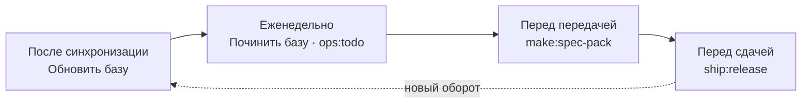

# 3. Регламент команды

> **Кому читать:** аналитикам, работающим с базой. Это правила, по которым база остаётся
> предсказуемой, когда с ней работает больше одного человека.
>
> Принцип, на котором всё держится: **доверие считает движок, ответственность за остальное
> несёт человек.** Поэтому в регламенте нет «приёмки карточек» — есть владение решениями,
> вопросами и спорными местами.

## Роли

Аврора не заставляет делить людей по ролям, но задачи, которые остаются человеку, кому-то
принадлежат. Если в проекте один аналитик, все роли — это он; регламент от этого не отменяется,
он превращается в разговор с собой через полгода.

| Роль | За что отвечает |
|---|---|
| **Дежурный по базе** (по очереди, на неделю) | запускает «Обновить базу» после синхронизации и «Починить базу» в пятницу, разбирает `ops:todo`, раздаёт находки |
| **Куратор раздела** | решает спорное в своём предмете: двойников, противоречия, утверждения «без опоры». Один на раздел |
| **Автор решения** | ведёт Decision Record от предложения до принятия |
| **Владелец вопроса** | ведёт вопрос заказчику (`owner` в карточке `Q-NNN`): задал, напомнил, зафиксировал ответ |

Кураторов естественно назначить так:

| Раздел | Кто ведёт |
|---|---|
| `Glossary`, бизнес-процессы | бизнес-аналитик |
| `Processes` (алгоритмы), `Systems`, `Statuses` | системный аналитик |
| `Requirements`, `Specs`, трассировка | системный аналитик |
| `Decisions` продуктовые, `Questions` к заказчику | владелец продукта |

## Ритуалы

### Каждый день или после синхронизации → «Обновить базу»

Маршрут забирает зеркала, возвращает в план источники, изменившиеся после разбора, пересобирает
тезисы, расставляет связи и пересчитывает доверие. Дежурный не «принимает» результат: он смотрит
на «Здоровье» и на итог маршрута. Источник изменился — движок заменяет в карточке только
перенесённый текст, снимает отметку о тезисе и пишет его заново; прежний тезис уходит в подвал
карточки с датой.

Перед сдачей полезно `ops:impact --explain <документ>` и `sync:diff`: они показывают, какие карточки
стоят под документом и какие источники изменились после разбора.

### Задача сдвинулась в Jira → ничего делать не надо

Доверие меняется на ближайшем `kb:trust` (маршрут делает его сам). Задача вернулась в работу —
карточка стала `draft` и в пакеты контекста для генерации не попадёт; в `trust_basis` написано,
какая именно задача и в каком статусе.

### Еженедельно, полчаса → «Починить базу» и `ops:todo`

«Починить базу» смотрит внутрь: ссылки, двойники, карты, оглавления, схема. После неё `ops:todo`
называет остаток и объясняет, почему это не кнопка. Дежурный разносит находки:

- утверждения «без опоры» — куратору раздела: сверить с источником, исправить через `kb:correct`
  либо оставить пометку;
- двойники, которых модель не решилась слить, и противоречия (`agent:clashes`) — куратору: кто
  прав, решает человек по источникам;
- карточки без связей с задачами — трассировка или вопрос команде, но не смена статуса.

### Перед передачей в разработку → `make:spec-pack`

Бандл спеки собирается скриптом и проверяет готовность механически (Definition of Ready):
требования в `agreed`, открытые вопросы (`Questions/` со статусом `open`/`asked`, у которых в
`blocks` эта спека) не блокируют, основания — не черновики, у каждого сценария есть критерий
приёмки. Нарушения не прерывают сборку, но печатаются и попадают в раздел «Риски передачи» —
подрядчик должен видеть, на чём построен контракт. Подробнее — [SDD](06-sdd.md).

### Перед сдачей заказчику → `ship:release`

Переданная версия замораживается снимком в `Deliverables/released/`, база фиксируется коммитом.
Снимок неизменяем: он — доказательство «что сдали».

## Правила Decision Records

**Когда DR обязателен:** выбирали из двух и более вариантов, и выбор влияет на систему, процесс
или данные; меняете ранее принятый подход; фиксируете договорённость со смежниками, о которой
будут спрашивать «почему так».

**Когда не нужен:** факт из первоисточника — его разберёт движок; оперативное решение без
альтернатив; косметика.

**Незыблемое:**

1. Принятый или отклонённый DR не редактируется. Единственная разрешённая правка — `status:
   superseded` и ссылка на новый.
2. Отклонённые варианты описываются с причинами отказа — так, чтобы через год ответ на «почему не
   X» читался без археологии.
3. DR не удаляются никогда.
4. Принимая DR, автор обновляет затронутые карточки (через `kb:supersede`, если меняется текущая
   истина) и ставит в них ссылку на решение.

Заводит DR команда `kb:decide <тема>`; замена старой записи — `kb:supersede`. Заменить **требование**
можно только с описанием дельты: `--changed` (что стало другим) и `--migration` (что делать с уже
реализованным по старой редакции) — через полгода никто этого не вспомнит.

## Правила «никогда»

1. **Не редактировать `Sources/`** — папка принадлежит синку, правки затрутся. Контент правится в
   Confluence или Jira.
2. **Не править карточки руками.** Карточка выводится из источников; правка исчезнет при следующей
   сборке. Неверное — через исправление `kb:correct`.
3. **Не пытаться поднять доверие.** Нельзя «принять» карточку, переписать `status` или `trust`.
   Низкая доля `knowledge` лечится трассировкой и движением задач.
4. **Не удалять знания.** Устаревшее — `kb:supersede`: `deprecated`, архив, ссылка на преемника.
5. **Не класть артефакты в `AuroraKnowledgeDB/`.** Истории, критерии приёмки и отчёты живут в
   `Artifacts/`; в базу знание возвращается только через источник и разбор.
6. **Не публиковать произведённое ассистентом без проверки человеком.** Утверждение «без опоры» в
   документ не переносят, даже если оно выглядит разумным.
7. **Не трогать `Deliverables/released/` и доказательную часть `Raw/`** (`contract`, `laws`,
   `customer`, `meetings`).
8. **Не заводить свои папки верхнего уровня.** Структура фиксирована; всё нестандартное — в
   `Workspaces/<задача>/`.
9. **Не коммитить секреты.** Токены и ключи — только в `.env.aurora.local`. Проверку внутренних
   названий (`commit-msg` в ките) не обходят никогда, а `--no-verify` для неё не годится.

## Работа в git

База — часть репозитория, поэтому командная работа — обычный git-процесс: ветка → изменения →
пул-реквест → ревью. Ревьюят то, что пишут люди: Decision Records, вопросы, исправления,
справочники, артефакты. Результат маршрутов проверять построчно невозможно и не нужно: каждый
оборот зафиксирован отдельным коммитом, а откат — `git reset`.

Скрипты движка отказываются писать по незакоммиченному дереву, поэтому перед маршрутом
фиксируйте свою работу (панель делает это кнопкой «Зафиксировать»). Поставьте храповик —
`kit:hooks`: хук pre-commit не даёт числу ошибок линтера расти в том, что вы коммитите, и не
требует чинить всё сразу.

## Чеклист качества: что пишет человек

Для Decision Record, вопроса, справочника и исправления:

- [ ] одна запись — одна мысль; заголовок совпадает с содержанием;
- [ ] шапка полная: `type`, `status`, даты и поля вида (`q_status`, `req_status`…) —
  `kb:lint` подскажет, чего не хватает;
- [ ] `source` или `answer_source` указывает на реальный первоисточник в `Raw/` или `Sources/`;
- [ ] все вики-ссылки ведут на существующие карточки;
- [ ] решение не дублирует существующее — искали по названию и по синонимам;
- [ ] утверждения, зависящие от выбора, ссылаются на Decision Record;
- [ ] имя файла проходит правила Windows, macOS и Linux (`kit:doctor` проверит).

Для артефакта перед сдачей:

- [ ] `based_on` перечисляет карточки, на которые документ **сослался**, а не весь пакет контекста;
- [ ] «Уточнения», «Допущения» и «Под вопросом» лежат под маркером
  `<!-- ниже — производство, в чистовик не идёт -->`;
- [ ] утверждений без опоры нет (`unsupported` в шапке равно нулю);
- [ ] `make:review` (или `make:review-auto`) пройден, замечания разобраны.
