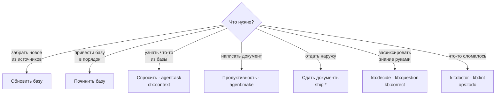

# 4. Практика: команды и промпты

> **Кому читать:** всем, кто выполняет операции с базой.
>
> Одна и та же команда запускается тремя способами. **Кнопкой в панели** (`python3 aurora.py
> cockpit`) — путь по умолчанию. **Из терминала** — `python3 aurora.py <глагол> <проект> [флаги]`
> или скрипт из `.aurora/scripts/`. **Через ассистента** в репозитории — `/aurora-vault <команда>`:
> так выполняются команды-процедуры, где нужна работа со смыслом. Имя команды везде одно:
> `kb:repair`, `ctx:context`, `agent:make`.

## Как выбрать команду

## Ситуация → команда → результат

### Источники и зеркала

| Ситуация | Команда | Результат |
|---|---|---|
| Забрать свежее из Confluence / Jira / сайтов | `sync:confluence`, `sync:jira`, `sync:web` (или маршрут «Обновить базу») | зеркало в `Sources/`; повторный синк не создаёт шума в git |
| Целостность зеркала под вопросом | `sync:audit` | `MISSING` / `ORPHAN` / `MOVED` / `COLLISION` / протухшее состояние |
| Источник изменился после того, как знание собрали | `sync:diff` | дрейф: какие карточки опираются на изменившееся |
| Задачи закрываются, а требования нет | `sync:jira-status` | кандидаты в `implemented`, работа без требований, связи по упоминаниям |
| Страница в Confluence переехала | `kit:remap-sources`, `kb:repair --gone-sources` | `source:` карточек указывает на новый путь |
| В `Raw/` лежит docx, pdf, xlsx, pptx | `kb:ingest-office` | markdown-транскрипты рядом с оригиналами; скан читает зрячая модель |

### База знаний

| Ситуация | Команда | Результат |
|---|---|---|
| Разобрать новое на карточки | `agent:build`, затем `agent:distill`, `agent:extract` | карточки, тезисы, вынесенные определения |
| Положили закон, регламент, ТЗ в `Raw/` | `kb:ingest <путь>` | карточки со ссылкой на первоисточник; ТЗ → требования `REQ` с `tz_ref` |
| Прошла встреча с заказчиком | `kb:ingest <транскрипт>` | резюме с цитатами, кандидаты в решения, требования и факты |
| Посчитать доверие | `ops:trace-table` → `kb:trust` | `status`, `trust_basis` у каждой карточки |
| Карточка неверна | `kb:correct --new "Заявка" --text "…"` | исправление в `Raw/corrections/`, применяется при каждой сборке |
| Нужно задать вопрос заказчику | `kb:question <суть>` | карточка `Q-NNN`: кому, что блокирует, срок |
| Пришёл ответ | `kb:answer Q-NNN` | вопрос закрыт, знание разнесено в REQ / спеку / DR |
| Приняли решение или сменили подход | `kb:decide <тема>` | Decision Record; старый помечен `superseded` |
| Карточка устарела, есть замена | `kb:supersede <карточка>` | старая в `_archive/`, входящие ссылки переписаны |
| Два файла говорят об одном | `kb:dedupe`, `kb:twins`, `agent:twins` | двойники слиты; спорные решает модель по тексту |
| Карточка раздулась | `kb:split` | части — атомарные карточки, исходная — карта документа |
| Карточки без входов | `kb:links --cards`, `kb:moc` | `related:`, карты содержания |

### Спросить и собрать контекст

| Ситуация | Команда | Результат |
|---|---|---|
| Нужен проверенный контекст для запроса | `ctx:context <тема>` | подборка карточек с шапками доверия — вставляется в любой промпт |
| Спросить базу своими словами | `agent:ask` (раздел «Спросить») | ответ только по карточкам, ссылка на каждое утверждение, проверка Момусом; разговор хранится в `meta/ask/` |
| «Почему выбрали X? Почему не Y?» | `ctx:ask <вопрос>` | ответ с цитатами, включая отклонённые и заменённые решения |
| Кто на кого опирается | `ops:impact <карточка>` | что зависит; `--explain <документ>` — на чём собран документ |
| Подключить базу к Claude Code, Cursor, OpenCode | `kit:mcp` | готовая строка подключения; сервер только читает |

### Производство артефактов

| Ситуация | Команда | Результат |
|---|---|---|
| Написать историю, критерии, спеку, алгоритм | `agent:make` («Продуктивность» → тип → задача) | файл по шаблону проекта; этапы — обогащение базой, план с вопросами к вам, воркер, критик, Момус |
| Узнать, по какому шаблону и куда | `make:kinds` | реестр видов артефактов: шаблон, папка, промпт, правила |
| Проверить качество истории или критериев | `make:review <объект>` | вердикт и замечания с цитатами карточек, которым текст противоречит |
| Проверить без человека, по закрытому чек-листу | `make:review-auto` | три прогона голосуют по каждому вопросу, оценку считает скрипт; `--page`, `--cql` |
| Собрать спецификацию из требований | `make:spec <тема>` | `SPEC-NNN` со статусом `draft` и полным `based_on` |
| Спеку пора отдать подрядчику | `make:spec-pack <SPEC-NNN>` | самодостаточный бандл: основания, решения, аббревиатуры, риски передачи |
| Сверить реализацию подрядчика | `make:validate <SPEC> <объект>` | покрыт / противоречит / не реализован по каждому сценарию |
| Собрать ОПЗ, ПМИ, РП | `make:assemble <документ>` | документ из базы по шаблону, `based_on` заполнен |

### Наружу

| Ситуация | Команда | Результат |
|---|---|---|
| Артефакт готов к публикации | `ship:publish <файл>` | generated-страница в Confluence; кухня производства (всё ниже маркера) не уходит |
| Документ нужен в офисном формате | `ship:export <файл>` | docx или pdf через pandoc |
| Версию передали заказчику | `ship:release <документ>` | неизменяемый снимок в `Deliverables/released/`, коммит базы |
| Результаты приёмки и замечания заказчика | `ship:acceptance <объект>` | отчёт в `Artifacts/acceptance/`, замечания разобраны на дефект / требование / вопрос / разночтение |
| Где разрывы в трассировке | `ops:trace` | пункт ТЗ → требование → спека → задача → критерии → приёмка |

### Здоровье и обслуживание

| Ситуация | Команда | Результат |
|---|---|---|
| Общее состояние базы | `ops:stats` | дашборд: состав, доля `knowledge`, риски |
| Что осталось человеку | `ops:todo` | список с объяснением, почему это не кнопка |
| Механика базы поехала | `kb:repair` | битые ссылки, гомоглифы, легаси-шапки; сначала предпросмотр |
| Смысловые дыры | `ops:gaps` | понятие без карточки, связь без ссылки, одинокие карточки, отставший тезис |
| Находит ли база сама себя | `ops:search-quality` | R@1, R@5, MRR; разница с прошлым замером |
| Схема карточки поменялась с версией кита | `kb:schema` | сколько карточек на какой версии и что сделает миграция |
| Персональные данные | `kb:scrub` | найти и закрыть маркерами; режим — `privacy.scrub` в конфиге |
| Имена файлов не проходят на Windows или macOS | `kb:names` | пути зеркала и имена карточек приведены к самым строгим правилам |
| Обновить движок проекта | `kit:update` | предпросмотр, затем `--apply` |
| Пятничная гигиена | «Починить базу», `kb:garden` | протухшее, сироты, битые ссылки, дубли |
| Не помню, какие вообще есть команды | `kit:list` | справочник: модификаторы, чем исполняется, с какой версии |

Полный список с модификаторами — [commands.md](../commands.md) или `python3 aurora.py list <проект>`.

## Правило запуска

Команды движка делятся на три категории, и это видно по флагам.

**Наблюдение** — `stats`, `lint`, `impact`, `trace`, `audit`, `diff`, `schema`, `scrub`, `doctor`.
Запускаются свободно, ничего не меняют.

**Запись** — всё, у чего есть `--apply`: `repair`, `supersede`, `index`, `release`, `update`, агентские
задачи. Без флага такая команда делает **предпросмотр** и показывает, что произойдёт. Смотрите
предпросмотр всегда: массовая правка по базе — это то, что потом разбирается в `git diff`
часами. Панель сама `--apply` не подставляет: сначала предпросмотр, потом подтверждение.

**Наружу** — `sync:*`, `ship:publish`, `ship:export`. Нужны сеть и токен, меняют внешние системы.
Токены живут в `.env.aurora.local`, в git не попадают.

## Ручной путь: промпты

Для работы вне репозитория — в веб-чате или другом инструменте — есть заготовки в `Prompts/`.
В шапке каждой указано, какой шаблон использовать и куда класть результат.

| Промпт | Назначение |
|---|---|
| `US_create.md` | написать пользовательскую историю |
| `US_review_with_KB.md` | проверка истории или критериев с контекстом базы |
| `AC_new.md`, `AC_update.md` | написать и доработать критерии приёмки |
| `DR_create.md` | оформление Decision Record интервью-методом |
| `SPEC_create.md` | спецификация фичи из требований и знаний |
| `meeting_ingest.md` | разбор расшифровки встречи |

Правило для ручного пути то же, что и для команд: **сначала соберите контекст**
(`ctx:context <тема>`), не скармливайте ассистенту страницы Confluence как истину. Разница между
«карточка со статусом `knowledge` и основанием» и «страница из вики» — это вся разница между
фактом и слухом.

## Что делать, когда команда ругается

Скрипты движка стараются объяснять причину, а не просто падать. Частые случаи:

**«git-guard: незакоммиченных файлов N».** Массовая запись по грязному дереву делает откат
невозможным. Закоммитьте текущее (в панели — «Зафиксировать») или, если понимаете риск, добавьте
`--allow-dirty`.

**«нет токена — задайте CONFLUENCE_PERSONAL_TOKEN».** Скрипты синка ходят в Confluence и Jira
напрямую, MCP в редакторе им не помогает. Скопируйте образец `aurora.env.local.example` в
`.env.aurora.local` и заполните поля.

**Агент «не отвечал» или ответ пустой.** `agent:ping` проверит цепочку шлюзов; `agent:probe`
различит «нет связи», «неверный ключ» и «нет такой модели» и покажет список моделей шлюза.

**«папки верхнего уровня вне схемы».** Кто-то завёл свою папку. Содержимое переносится в
`Workspaces/<задача>/`, либо папка закрывается `.gitignore`, если это служебное, либо объявляется в
`paths.extra_structure_dirs` конфига (только для этого проекта).

**Коммит падает на храповике.** Ошибок линтера в коммите стало больше базовой линии. Починить
(`kb:repair`) или, осознанно, `AURORA_SKIP_RATCHET=1` — он снимает только храповик; проверку
сообщений коммита не снимает ничего.
