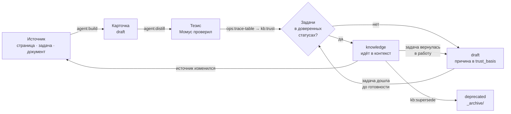

# 5. Уход за базой

> **Кому читать:** дежурному по базе и всем, кто разбирает остаток после маршрутов.
>
> База — не склад файлов, а сад. Знания приходят непроверенными, зреют вместе с задачами
> проекта, плодоносят в артефактах и устаревают. Почти весь уход делает движок; человеку остаётся
> то, что требует суждения.

Вся суть в одном предложении: **источники приносят семена, движок их высаживает и считает, чему
можно верить, а человек раз в неделю разбирает то, что машина честно назвала неразрешимым.**

## Как знание зреет

Правила в двух строках: статус выводится из источника и не ставится руками; движок не переписывает
того, чего не писал (тело словаря и документа, подвал истории, прежний тезис). Подробно —
[правила базы знаний](../knowledge-rules.md).

## 1. Наполнение: как знания попадают в базу

Ничто не попадает в базу сразу «знанием». Любой путь даёт карточки в статусе `draft`, пока
трассировка не докажет обратное.

**Синхронизация.** Зеркала обновились — маршрут «Обновить базу» разбирает изменившиеся страницы.
Карточки, на которых человек что-то написал, движок не затирает: заменяется только перенесённый
текст, а тезис пишется заново, прежний уходит в подвал.

**Документы.** Положили закон, регламент или ТЗ в `Raw/` — `kb:ingest` извлечёт карточки (из ТЗ — по
пунктам, требования `REQ` с `tz_ref`). Файл остаётся в `Raw/` как доказательство, а карточки из
`Raw/` доверены по определению: подписанный документ заказчика. docx/pdf/xlsx/pptx сначала
превращаются в markdown-транскрипты (`kb:ingest-office`); PDF-скан читает зрячая модель, если
она настроена.

**Встречи.** Транскрипт в `Raw/meetings/` даёт резюме с цитатами и кандидатов — решения,
требования, факты. Встреча доверия не даёт и не отнимает: карточка из одних встреч — черновик,
помечена «из встречи» (`kb:repair --meetings`), чтобы сказанное в разговоре не читалось записанным
в документе.

**Руками.** Знаете то, чего нет в источниках, — не заводите карточку наугад:

| Что | Как |
|---|---|
| выбор из вариантов | Decision Record: `kb:decide` |
| неизвестное, нужен заказчик | вопрос `Q-NNN`: `kb:question`, ответ — `kb:answer` |
| в карточке неверно | исправление: `kb:correct` — живёт в `Raw/corrections/`, применяется при каждой сборке |
| справочник домена | карточка в `Reference/` |
| документ | положить в `Raw/` и запустить «Обновить базу» |

## 2. Доверие: что делает движок

После каждого синка (в маршруте — автоматически):

1. `ops:trace-table` строит таблицу «артефакт ↔ задача»: прямые связи (совпавший номер, ключ
   задачи в тексте, `page_id`), ссылки по коду и косвенные связи глубиной до двух переходов. У
   каждой связи записано доказательство.
2. `kb:trust` проставляет класс и статус и пишет `trust_basis` словами, с ключом задачи. Одна
   задача в работе перевешивает десять готовых.
3. Понижение не стирает знание: тело остаётся, в подвале — строка «класс понижен такого-то числа,
   задача вернулась в работу».

Настройка — в `aurora.config.yaml`: `atlassian.jira.trust_statuses` и `assumption_statuses`
(какие статусы задач считать доверенными и какие — черновиком), `verify.trusted_sources` и
`verify.trusted_branches` (доверенные папки и справочные ветки вики), галочка «доверять» у
корневой страницы Confluence и у веб-ссылки.

## 3. Что остаётся человеку

`ops:todo` — единственный список. Он называет остаток и объясняет, почему это не кнопка.

| Остаток | Что сделать |
|---|---|
| Утверждения «без опоры» (`unsupported:`) | Сверить с источником. Верно — оставить; неверно — исправление `kb:correct`; сомнительно — `agent:distill --recheck`, Момус сверит ещё раз |
| Противоречия между карточками (`agent:clashes`) | Прочитать обе стороны (цитаты дословные) и решить, кто прав, по источникам |
| Двойники, которых модель не решилась слить | Слить (`kb:dedupe --merge`) или развести синонимы (`kb:repair --aliases`) |
| Карточки без связей с задачами | Трассировка или вопрос команде. Статусом не лечится |
| Спорный `kind` (словарь или знание) | Поле `kind:` в шапке исправления |
| Недописанные производства | «Здоровье» → «Незаконченные»: движок их не чистит сам, это работа человека |

**Исправление и его устаревание.** Исправление применяется при **каждой** сборке — иначе приоритет
над Confluence держался бы до следующего синка. Если источник обновился позже, чем написано
исправление, `kb:correct --check` спросит человека; пока не ответили, исправление продолжает
действовать. Снять его можно командой `--retire ИМЯ --reason «…»`, и на карточке останется
`correction_retired`.

## 4. Еженедельная уборка

«Починить базу» — маршрут, который смотрит внутрь и в источники не ходит. Он снимает то, что
накопилось в ходе разборов:

- битые ссылки, гомоглифы (`АИС` латиницей и кириллицей), легаси-поля, поля вне схемы;
- двойники: бесспорные сливает правило, остальные — модель (`agent:twins`, `agent:aliases`);
- заготовки и пустышки, которые ничего не держат; карточки по шаблону страницы вместо знания;
- пропавшие источники (`--gone-sources`), заголовки вместо имён файлов, тавтологии в тезисах;
- карты содержания, оглавления, индекс кодов артефактов, граф, семантический индекс;
- схему карточек (`kb:schema`) и ревизию качества (`kb:map`: пары об одном, карточки размером с
  документ, острова и мосты).

В конце маршрут запоминает остаток линтера, и «Починить» больше не зовёт к тому, что чинится
только руками.

Для самопроверки базы пригодны ещё три команды:

| Команда | Что показывает |
|---|---|
| `ops:gaps` | смысловые дыры: понятие названо, а карточки нет; связь названа, но не поставлена; одинокие карточки; тезис отстал от источника; источник исчез |
| `ops:search-quality` | находит ли база сама себя: тезис карточки как вопрос, правильный ответ известен по построению. R@1, R@5, MRR |
| `ops:retrieval` | какие карточки приходят первыми по реальным запросам аналитиков и что изменилось с прошлого раза |

## 5. Здоровье в числах

Раздел «Здоровье» и `ops:stats` показывают: состав базы, долю `knowledge` (без пустышек и служебных
файлов — «показатель, который не может дойти до ста, ничего не сообщает»), риски, связи, ошибки
линтера, свежесть зеркал и остаток человеку. `ops:stats --append-metrics` дописывает строку в
`meta/metrics.md` — динамику видно из git.

**Низкая доля `knowledge` — не авария.** Это либо задачи ещё в работе, либо связей не нашлось.
Второе лечится трассировкой, а не статусами.

## 6. Большие операции

| Когда | Что |
|---|---|
| Правила разбора изменились, база накопила двойников | Маршрут «Пересобрать базу с нуля»: `kb:reset` сносит то, что соберётся заново (карточку с живым `source:` и метку `built: machine`), а карточки неизвестного происхождения **остаются** — `--list-unknown` покажет, `--drop-unknown` снесёт. Прогон идёт циклами, откат — из git |
| Страницы Confluence переехали | `kit:remap-sources`, затем `kb:repair --gone-sources` |
| Имена карточек сменились | `kit:remap-sources`: артефактам возвращаются основания |
| Старая база с `verified` и `imported` | `kb:trust` переводит её на новую шкалу за один прогон; `kb:schema` мигрирует шапки |
| Нужно скрыть персональные данные | `kb:scrub` (режим `privacy.scrub`) |

## Ритм недели

| Когда | Что | Кто |
|---|---|---|
| Понедельник | «Обновить базу» | дежурный |
| Вторник–четверг | разбор `ops:todo`: «без опоры», противоречия, вопросы заказчику | кураторы разделов |
| Пятница | «Починить базу», `ops:todo`, `kb:garden` — полчаса | дежурный |
| Раз в релиз | `kb:schema`, `ops:search-quality`, `tests/smoke_live.py <проект>` | дежурный |

## Три правила, которые нельзя нарушать

**Ничего не удалять.** Устаревшее знание получает `deprecated` и уезжает в архив со ссылкой на
замену. Принятые решения не редактируются — только заменяются.

**Артефакт — не знание.** Произведённая ассистентом история или отчёт не попадает в базу
напрямую: сначала ревью и публикация, и только извлечённое из опубликованного источника вернётся
в базу обычным разбором.

**Доверие не ставится, а считается.** Хочется поднять долю `knowledge` — двигайте задачи и
стройте трассировку, а не правьте шапки.
