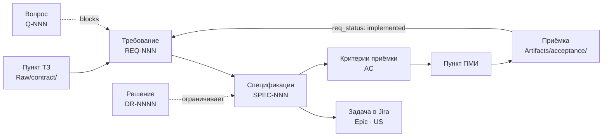
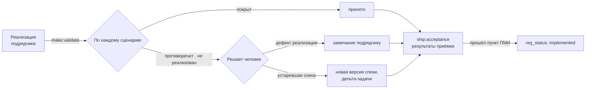

# 6. Spec-Driven Development

> **Кому читать:** аналитикам, готовящим фичи к передаче в разработку, и тем, кто принимает
> результат.
>
> **Предпосылка:** разработка может жить в другом репозитории или у подрядчика — мостом служит
> самодостаточный бандл спеки.

## Идея в одном абзаце

Спецификация — не описание «про код», а **исполняемый контракт**. Она пишется до реализации, из
неё создаются задачи, по ней проверяется результат, и изменение требований означает изменение
спеки, а не устную договорённость с разработчиком. Слабое место подхода — мусор на входе: спека,
написанная без подтверждённого контекста, красиво кодифицирует заблуждения. Фреймворк закрывает
именно это: **спека собирается из карточек `knowledge`** и несёт полный список оснований в
`based_on`. А спеки, в свою очередь, оживляют базу: знания перестают лежать и начинают
компилироваться в контракты.

## Цепочка трассировки

Команда `ops:trace` перестраивает таблицу `MOC/Трассировка-требований.md` из карточек
`Requirements/` (руками её не правят — она генерируется) и показывает разрывы: пункт ТЗ без
покрытия, требование, заблокированное открытым вопросом (особенно просроченным), `implemented`
без пройденного пункта ПМИ, `agreed` без Jira дольше тридцати дней, `rejected` без причины.

## Объекты цепочки

| Объект | Где | Ключевые поля | Жизненный цикл |
|---|---|---|---|
| **Требование** | `AuroraKnowledgeDB/Requirements/REQ-NNN-….md` | `req_id`, `tz_ref`, `jira`, `acceptance`, `pmi`, `decisions` | `req_status`: `stated` → `agreed` → `implemented` или `rejected` |
| **Вопрос** | `Questions/Q-NNN-….md` | `q_id`, `owner`, `asked_to`, `due`, `blocks`, `answer_source` | `q_status`: `open` → `asked` → `answered` или `closed-no-answer` |
| **Решение** | `Decisions/DR-NNNN-….md` | `date`, `supersedes` | `proposed` → `accepted` или `rejected` → `superseded` |
| **Спецификация** | `Specs/SPEC-NNN-….md` | `spec_id`, `implements`, `decisions`, `jira`, `based_on`, `applies_to` | `draft` → `knowledge`; передана spec-pack'ом — неизменна для релиза |
| **Приёмка** | `Artifacts/acceptance/….md` | `covers`, `verdict`, `protocol` | отчёт о прогоне, не знание |

Правила, которые движок проверяет:

- `rejected` требует причины в теле (и DR, если отказ — решение команды); `implemented` требует хотя
  бы одной записи `jira` и, по существу, пройденного пункта ПМИ;
- `q_status: answered` требует `answered` и `answer_source` — ответ «на словах» не ответ. Ответ не
  остаётся только в карточке вопроса: он идёт в REQ, спеку или DR (`kb:answer`);
- `closed-no-answer` допустим только вместе с DR о допущении — работаем по допущению, и это
  зафиксировано;
- заменить требование через `kb:supersede` можно только с `--changed` и `--migration`.

## Спека как карточка знаний

Спеки живут в `Specs/` (шаблон `Templates/spec_template.md`) и собираются командой `make:spec` из
требований в `agreed`, карточек `knowledge` и связанных DR. Структура: Зачем (какие требования
реализует) → Границы → **Поведение** (сценарии «дано / когда / тогда», формулировки вида «когда
<триггер>, система должна <реакция>») → Данные → Интеграции → Ограничения (ссылки на решения) →
Нефункциональные требования → **Открытые вопросы** → Критерии приёмки.

Всё неясное идёт в «Открытые вопросы» — выдумывать запрещено. Статус спеки движок пересчитывает по
тем же правилам, что у остальных карточек (`draft` → `knowledge`).

## Definition of Ready — гейт передачи

Спека уходит в разработку, когда:

1. все термины резолвятся в карточки глоссария и понятий со статусом `knowledge`;
2. все реализуемые требования — в `req_status: agreed`;
3. нестандартные выборы оформлены решениями (`accepted`) и связаны со спекой;
4. раздел «Открытые вопросы» пуст: нет карточек `Questions/` со статусом `open` или `asked`, у
   которых в `blocks` эта спека; вопрос это блокер, а не заметка;
5. у каждого сценария есть строка в «Критериях приёмки»;
6. в `based_on` нет черновиков — либо они явно помечены как допущения.

Пункты 2, 4 и 6 проверяет `make:spec-pack` механически. Нарушения не прерывают сборку, но
печатаются и попадают в раздел «Риски передачи»: подрядчик должен видеть, на чём построен
контракт, а не узнавать об этом на приёмке.

## Мост к внешней разработке: spec-pack

`make:spec-pack SPEC-NNN` (с `--apply`) собирает один самодостаточный markdown-файл — главный
передаваемый продукт аналитики:

- шапка: версия спеки, дата, коммит базы, статус DoR, релиз, риски передачи;
- спека целиком;
- приложения: **тела всех карточек-оснований** с шапками доверия, связанные принятые DR (для
  «почему» допустимы заменённые — с пометкой), справочник аббревиатур;
- все внутренние ссылки разрезолвлены в якоря: файл читается без доступа к базе.

Его можно отдать подрядчику, выложить в Confluence или передать кодинг-агенту как полный контекст.
Хранится в `Deliverables/work/spec-packs/`; факт передачи фиксирует `ship:release` — неизменяемым
снимком.

**Правило обратной связи:** вопросы разработчиков не отвечаются устно. Каждый ответ становится
уточнением спеки или требования — новой версией. Иначе контракт разъезжается с реальностью, и через
месяц никто не знает, по какой версии писался код.

## Проверка результата и приёмка

`make:validate <SPEC> <объект>` сверяет присланное — описание реализации, тест-кейсы, документацию,
экспорт изменений — со сценариями спеки: покрыт, противоречит, не реализован, не проверяемо.
Каждое расхождение — развилка для человека: дефект реализации или устаревшая спека; во втором
случае — новая версия спеки, а не молчаливое принятие. Замечания заказчика по приёмке
`ship:acceptance` разбирает на четыре типа: дефект, новое требование, вопрос, разночтение.

Статусы задач возвращаются в требования командой `sync:jira-status`: кандидаты в `implemented`,
работа без требований, связи по упоминаниям. Какие статусы Jira считать «сделано» и «отменено»,
проект задаёт в `atlassian.jira.done_statuses` и `cancelled_statuses`.

## Цикл изменений

1. Заказчик меняет требование — встреча, письмо, новая редакция ТЗ → уточняется REQ.
2. `ops:trace` и `ops:impact` показывают затронутые спеки и сданные документы.
3. Спека получает новую версию; старая остаётся верной для своего релиза (`applies_to`).
4. В Jira уходят задачи-дельты, подрядчику — обновлённый spec-pack.
5. Правка кода или истории в обход спеки — то же табу, что и ручная правка generated-страницы в
   Confluence.

Релизы объявляются в `AuroraKnowledgeDB/meta/releases.md` (одна строка на релиз, маркер
`current`); карточка без `applies_to` верна для всех релизов. Когда знание меняется от релиза к
релизу, это **две карточки** со взаимными ссылками, а не `deprecated`.

## Когда включать

Это второй уровень. Включайте, когда команда освоила базовый цикл — контекст, доверие, уход — и
появилась первая фича, передаваемая в разработку по контракту.

Команды: `make:spec`, `make:spec-pack`, `make:validate`, `ops:trace`, `ship:acceptance`. Ручной
промпт для работы вне репозитория — `Prompts/SPEC_create.md`.
