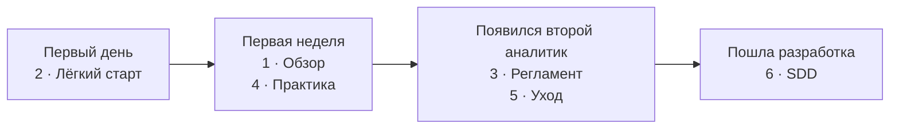

# Aurora Studio — документация для людей

Набор для чтения глазами: что за фреймворк, зачем он, как им пользоваться и как за базой
ухаживать. Технические справочники лежат рядом: команды — [commands.md](../commands.md),
устройство — [architecture.md](../architecture.md), процедуры для ассистента —
`skills/aurora-vault/references/`, история выпусков — [CHANGELOG.md](../../CHANGELOG.md).

Документы актуальны для kit **1.147.1**. English version: [docs/en/readme/](../en/readme/README.md).

| № | Документ | Кому | О чём |
|---|---|---|---|
| 1 | [Обзор фреймворка](01-overview.md) | всем участникам проекта | зачем это, три принципа, слои доверия, карточка, кто что делает |
| 2 | [Лёгкий старт](02-quickstart.md) | новичку в первый день | шесть шагов, пять правил, три команды, одна привычка |
| 3 | [Регламент команды](03-team-rules.md) | аналитикам | роли, ритуалы, правила Decision Records, правила «никогда», чеклист |
| 4 | [Практика: команды и промпты](04-practice.md) | всем, кто работает с базой | ситуация → команда → результат; ручной путь через промпты |
| 5 | [Уход за базой](05-gardening.md) | дежурному по базе | как знание зреет, что остаётся человеку, еженедельная уборка |
| 6 | [Spec-Driven Development](06-sdd.md) | аналитикам и подрядчикам | спецификация как исполняемый контракт: от требования до приёмки |

## В каком порядке читать

**Первый день:** «Лёгкий старт» — и работайте. Остальное понадобится не сразу.

**Первая неделя:** «Обзор» и «Практика». К этому моменту уже понятно, откуда берутся статусы.

**Когда в проекте появился второй аналитик:** «Регламент» и «Уход за базой». До этого ритуалы не
нужны — база маленькая, и вы в ней одни.

**Когда пошла разработка по вашим спекам:** «Spec-Driven Development».

## Чего здесь нет

| Что | Где |
|---|---|
| Установка, конфиг, секреты, обновление | [INSTALL.md](../INSTALL.md) |
| Правила модели знания целиком | [knowledge-rules.md](../knowledge-rules.md), [на одну страницу](../knowledge-rules-tldr.md) |
| Цикл и путь карточки | [lifecycle.md](../lifecycle.md) |
| Справочник команд | [commands.md](../commands.md) или `python3 aurora.py list <проект>` |
| Панель управления | [control-panel-ui-requirements.md](../control-panel-ui-requirements.md) |
| Устройство движка | [architecture.md](../architecture.md), [CONTRIBUTING.md](../CONTRIBUTING.md) |

Панель управления со всем сразу — `python3 aurora.py cockpit`.
