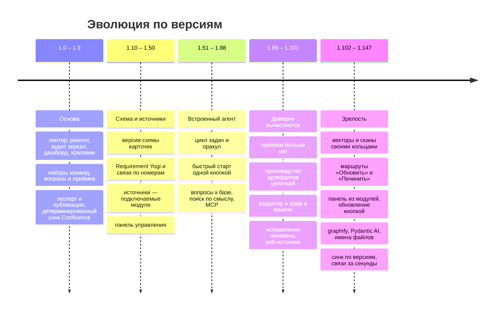

# Решения и дорожная карта

Здесь записано, **почему Аврора устроена так, как устроена**, как она дошла до нынешнего вида и
что ещё не сделано. Каждое решение опирается на факт из эксплуатации, а не на пожелание. Историю
выпусков по номерам — в [CHANGELOG.md](../CHANGELOG.md); устройство движка — в
[architecture.md](architecture.md). English version: [en/roadmap.md](en/roadmap.md).

## 1. Что показала эксплуатация

К июлю 2026 движок (версия 1.2.0) работал на двух живых проектах — большом и небольшом — и выявил
три системных проблемы.

| Симптом | Большой проект | Небольшой проект |
|---|---|---|
| карточек в базе | 1971 | 65 |
| карточек без `status` (легаси) | 1114 | 0 |
| ошибок линтера | 1046 (482 битые ссылки) | 54 |
| двойники-гомоглифы (`АИС` / `AИС`) | десятки пар | — |
| артефакты, попавшие в знания | 130 | — |
| расхождение зеркала Confluence | missing 216, orphan 526, collision 3 | — |
| `build` пришлось резать руками | на фазы | — |

Три вывода, которые определили дизайн:

1. **Механику делает скрипт, суждение — модель.** Массовый обход тысяч файлов моделью дорог и
   порождает ошибки. У каждой массовой операции появился детерминированный скрипт с предпросмотром;
   агент получает его отчёт и принимает только решения.
2. **Круг должен замкнуться.** «Внутрь» (синк → разбор → карточки) было проработано; «наружу»
   (артефакты → Confluence, документы → docx) и обратная связь (дрейф, статусы задач) — нет. Заявленная
   позиция «git — истина, Confluence — витрина» без `ship:` не выполнялась.
3. **Приёмку человеком не масштабировать.** Верифицировать 1971 карточку никто не будет, а
   «поднять долю статусами» бессмысленно. Доверие надо вычислять из того, что уже есть в проекте, —
   из статусов задач.

## 2. Принципы, которые не обсуждаются

| Принцип | Что из него следует |
|---|---|
| **Git — источник правды, Confluence — витрина** | База живёт в git как markdown; Confluence читают и комментируют, но не правят «истину» |
| **Артефакт ≠ знание** | Произведённое не подаётся ассистенту как факт; знанием бывают только карточки |
| **Доверие вычисляется** (1.89) | Статус карточки выводится из статусов связанных задач и происхождения источника; ступеней «принято» нет, человек доверия не присваивает |
| **Единица базы — сущность** (1.100.32) | Знание копится в одной карточке из многих источников; чужое определение выносится в свою карточку |
| **Скрипт, потом модель** | Модель пишет только через команды движка; её ответ проверяет вторая модель (Момус); достижение цели — команда-оракул |
| **Движок не переписывает чужого** | Тело словаря и документа, подвал истории, прежний тезис не затираются |
| **Структура папок фиксирована** | См. ниже |
| **Ничего не удаляется** | `deprecated` + архив + ссылка на преемника; Decision Records неизменяемы |
| **Поставленное неизменяемо** | `Deliverables/released/` и доказательная часть `Raw/` |
| **Детерминированные зеркала** | Одна страница — один файл, иначе git-дифф не улика |
| **Стандартная библиотека** | У движка нет зависимостей времени выполнения; сторонние библиотеки панели лежат готовыми сборками — работает в закрытом контуре без интернета и Node |
| **Кит независим от проектов** | Ни имён клиентов, ни адресов в навыках, шаблонах и значениях по умолчанию; живые числа и имена не уходят в открытую историю |

### Почему структура папок фиксирована

Структура одинакова во всех проектах Авроры. Верхний уровень и структурный второй (разделы базы,
типы артефактов, слои `Raw/`) задаёт кит в `structure_dirs.txt` и меняет только релизом.

- Проект **не придумывает** свои типы артефактов: `create <неизвестный тип>` отказывает и предлагает
  стандартный тип или `Workspaces/<задача>/`, где свобода полная.
- Нужен новый тип всерьёз — это изменение кита: правка `structure_dirs.txt`, таблиц в `SKILL.md` и
  `conventions.md` и запись в CHANGELOG, чтобы тип появился сразу везде.
- `structure_dirs.txt` — единственный источник правды: `install` и `update` читают его, `doctor` сверяет
  с ним факт. Исключение — папки, закрытые `.gitignore`, и объявленные проектом в
  `paths.extra_structure_dirs`.

Причина: одинаковая структура — контракт между проектами. Она даёт переносимость навыка аналитика,
переиспользуемые промпты и шаблоны, работающие скрипты и осмысленный `update`.

### Почему команд много, а наборов девять

Плоский список из двадцати пяти команд стал нечитаем уже к версии 1.3, а сегодня их больше девяноста.
Поэтому имя команды — `<набор>:<действие>`, а у набора свой ритм и свой владелец:

| Набор | Смысл | Кто и когда |
|---|---|---|
| `kit:` | жизнь движка в проекте | лид, редко |
| `sync:` | зеркала внешних систем | дежурный, после синка |
| `kb:` | извлечение и жизнь знания | ежедневно |
| `ctx:` | использование знаний | ежедневно |
| `make:` | производство артефактов | аналитик |
| `ship:` | наружу | аналитик, по вехам |
| `ops:` | управление и отчётность | лид, еженедельно |
| `agent:` | встроенный агент | маршруты и аналитик |
| `dev:` | QA самого движка | разработчик движка |

Короткие имена без префикса остаются алиасами навсегда. У каждой команды есть исполнитель — скрипт,
модель или обе — и версия появления; всё это записано в `commands.txt`.

## 3. Как Аврора дошла до нынешнего вида

Опорные точки:

| Версия | Что изменилось и почему |
|---|---|
| 1.0.0 (21.07.2026) | Первый выпуск: скилл `aurora-vault`, слои доверия, установка |
| 1.3.0 | Первая волна ремонта по эксплуатации: `kb:repair`, `kb:dedupe`, `sync:audit`, `ops:stats`, `kit:hooks`, неймспейсы команд, `structure_dirs.txt` едет в проект |
| 1.4.0 | Вопросы к заказчику (`Questions/`) и приёмка (`Artifacts/acceptance/`): незнание и результат испытаний стали объектами |
| 1.5 – 1.6 | Цикл «наружу»: `kb:ingest-office`, `ship:export`; детерминированный синк Confluence вместо выгрузки моделью |
| 1.8 – 1.9.x | `ctx:context --budget`, `make:spec-pack`, `ship:publish`, `kb:scrub`, `kit:list`, `sync:jira-status` |
| 1.28.0 | Источники стали подключаемыми модулями (`connectors/`) |
| 1.56.0 | Встроенный агент: аналитик ведёт базу, не выходя из Авроры |
| 1.59.0 | «Быстрый старт» проходится одной кнопкой |
| 1.63 – 1.68 | `agent:ask`, поиск по смыслу без зависимостей, MCP-сервер базы |
| 1.89 – 1.90 | **Доверие вычисляется; приёмки больше нет.** Команды `kb:verify` и `kb:queue` удалены |
| 1.95.0 | Производство артефактов цепочкой: обогащение, план, воркер, критик, Момус |
| 1.98.x | Редактор файлов и граф базы в панели |
| 1.99.x | Корректирующие артефакты: слово человека — правда с высшим приоритетом |
| 1.101 – 1.104 | Веб-страницы как источник; кольцо векторов и кольцо распознавания сканов |
| 1.117.0 | Маршрут «Обновить базу» |
| 1.121 – 1.125 | Панель разобрана на модули-папки |
| 1.124.0 | Обновление кита из панели одной кнопкой |
| 1.131.0 | Раздел «Граф» |
| 1.138 – 1.139 | graphify под капотом; каждый вызов модели идёт через Pydantic AI |
| 1.140.0 | Имена файлов по самым строгим правилам Windows, macOS и Linux |
| 1.144 – 1.147 | Шаблон страницы — не знание; тип карточки по правилу; синк по версиям; ремонт пропавших источников |

## 4. Что ещё не сделано

Проверено по реестру команд на версии 1.147.1.

**Незавершённое в модели знания** (по `накопление-знания.md`):

1. Пересобрать живые базы по новым правилам накопления: дубли, накопленные прежним разбором,
   дешевле собрать заново, чем сводить поштучно. Порядок готов — маршрут «Пересобрать базу с нуля».
2. Проверить, не спорят ли `kb:split` (режет раздутую карточку по размеру) и `agent:extract`
   (выносит чужие определения) на пересобранной базе: карточка, из которой вынесли определения, может
   перестать быть «раздутой».
3. Подтвердить меру на пересобранной базе: `kb:twins` даёт единицы групп, а не сотни;
   `ops:search-quality` не падает; доля карточек с непустым `based_on` растёт.

**Идеи, которых нет в реестре команд:**

| Идея | Зачем |
|---|---|
| Объект «изменение» | допсоглашение → волна правок в SPEC, US, ПМИ и сданное; сейчас `ops:impact` показывает зависимости, но волну не ведёт |
| `sync:all` и расписание | прогон всех зеркал по расписанию |
| `ship:respond` | триаж комментариев заказчика на generated-страницах |
| `kit:harvest` | возврат в кит шаблонов и навыков, прижившихся в проекте |
| `ops:onboard`, архив `Workspaces/` | онбординг и уборка |
| `ops:releases` | реестр релизов `meta/releases.md` читают `ctx:context` и линтер, но заводить и вести его команды нет |
| `doctor --repo` | вес репозитория: `node_modules`, `__pycache__`, `.DS_Store` |

**QA движка.** Тест-кейсы и сценарии в `Development/QA/` отстают от кода: найденные и исправленные
дефекты надо закрыть проверками. Условие: прежде чем писать кейс, для каждой находки заново
установить причину — часть дефектов прежде была диагностирована по симптому, и кейс под неверный диагноз
хуже отсутствующего. Порядок: `dev:qa-cover` → перепроверить диагноз → автотест там, где поведение
воспроизводится за секунды, кейс — где нельзя → `dev:qa-check`.

## 5. Инварианты, которые дорожная карта не вправе нарушить

1. Артефакт ≠ знание.
2. Ничего не удаляется (`kb:supersede`, `_archive/`).
3. Синк не перезаписывает переписанное человеком; расхождение — это дрейф.
4. Каждая карточка входит в промпт с шапкой доверия и основанием.
5. Поставленное (`Deliverables/released/`, доказательный `Raw/`) неизменяемо.
6. Схемы — как код (mermaid в карточке).
7. Структура папок фиксирована китом.
8. Массовая механика — скрипт, а не модель.
9. Доверие вычисляется, а не присваивается.
