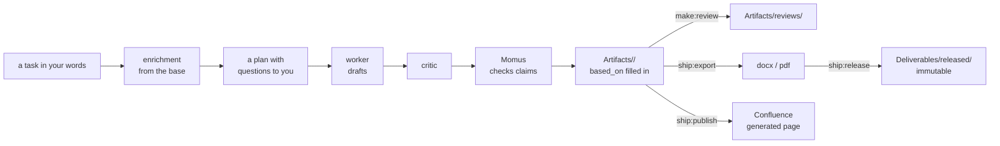

# Artifacts and deliverables

[Wiki home](README.md) · related: [Asking the base](Asking-the-Base.md) · [Trust](Trust.md) · commands:
[practice](../docs/en/readme/04-practice.md#producing-artifacts)

An **artifact** is a document an analyst or the agent produces — a user story, acceptance criteria, an algorithm, a
specification, a review. It lives in `Artifacts/<type>/` and **is never knowledge**: it is not read back as a fact.
Only cards are. A **deliverable** is an artifact that has been assembled and handed outward.

## Producing

| Do | Command | Notes |
|---|---|---|
| Write a story, criteria, an algorithm, a spec | `agent:make` (panel: **Production** → type → task) | stages are marked in the file header, so after an interruption it resumes from the same point |
| Find out which template and where | `make:kinds` | the project's registry of artifact kinds: template, folder, prompt, "no technologies" rule, the final-text boundary |
| Assemble a spec from requirements | `make:spec <topic>` | `SPEC-NNN`, status `draft`, a full `based_on` |
| Hand a spec to a contractor | `make:spec-pack <SPEC-NNN>` | a self-contained bundle: grounds, decisions, abbreviations, handoff risks |
| Check the contractor's implementation | `make:validate <SPEC> <object>` | covered / contradicts / not implemented, per scenario |
| Assemble an OPZ, PMI or user guide | `make:assemble <document>` | a document from the base by a template |

Write the task in your own words; it understands `@path`, `/skill`, `@server` and attachments (kept for two weeks).
Every artifact carries **`based_on`** — the cards it stands on — so you can see what to revisit when knowledge changes
(`ops:impact --explain <document>`).

## Reviewing

| Do | Command |
|---|---|
| Check a story or criteria against the base | `make:review <object>` — a verdict and remarks that quote the cards the text contradicts |
| Check without a human, by a closed checklist | `make:review-auto` — three model runs vote on each question, a script computes the score; `--page`, `--cql`, a batch mode |

## Going outward

| Do | Command | Result |
|---|---|---|
| Office format | `ship:export <file>` | docx or pdf through `pandoc` (needs it installed) |
| Publish | `ship:publish <file>` | a *generated* page in Confluence; the production kitchen — everything below the marker — does not go out |
| Freeze what was delivered | `ship:release <document>` | an immutable snapshot in `Deliverables/released/` and a commit of the base |
| Acceptance | `ship:acceptance <object>` | a report; customer remarks sorted into defect / requirement / question / disagreement |

**`released/` is immutable.** The panel's editor opens it read-only. Without freezing you cannot prove what you
delivered. Drafts live in `Deliverables/work/`; delivery packages and versions taken off work — in
`Deliverables/_archive/`.

## Tracing

`ops:trace` follows a chain from the customer's spec item → requirement → specification → Jira issue → criteria →
acceptance, and shows where it is broken. `sync:jira-status` suggests which requirements are `implemented` from issue
statuses. → [Daily work](Daily-Work.md)
