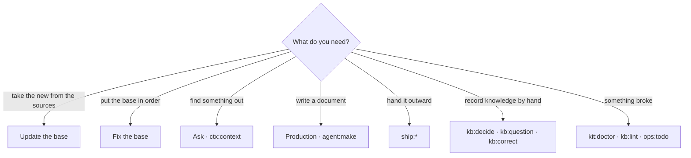

# Daily work

[Wiki home](README.md) · related: [The cycle](The-Cycle.md) · [Troubleshooting](Troubleshooting.md) · the full table:
[Practice: situation → command](../docs/en/readme/04-practice.md) · every command: [command reference](../docs/en/commands.md)

One command can be run three ways, and the name is the same everywhere (`kb:repair`, `ctx:context`, `agent:make`):

1. **a panel button** — the default path;
2. **the terminal** — `python3 aurora.py <verb> <project> [flags]`, or a script from `.opencode/scripts/`;
3. **the assistant** — `/aurora-vault <command>`, for procedure commands that need meaning.

## The rhythm

| When | What | How |
|---|---|---|
| every day, ten minutes | take the new, see what drifted | **Update the base** → `sync:audit` → `sync:diff` → `ops:stats` |
| after every sync | trust | `ops:trace-table` → `kb:trust` (the route does it itself) |
| weekly | hygiene | **Fix the base** → `ops:todo` → `kb:garden` |
| monthly | navigation and quality | `kb:moc --suggest`, `ops:search-quality`, `ops:gaps` |
| development is going on | tracing | `sync:jira-status` → `ops:trace` → `make:spec-pack` |
| an artifact is ready | outward | `make:review` → `ship:export` → `ship:publish` → `ship:release` |

## The three kinds of command

| Kind | Examples | Rule |
|---|---|---|
| **Observation** | `ops:stats`, `kb:lint`, `ops:impact`, `ops:trace`, `sync:audit`, `sync:diff`, `kb:schema`, `kb:scrub`, `kit:doctor` | run freely: they change nothing |
| **Writing** | everything with `--apply`: `kb:repair`, `kb:supersede`, `kb:index`, `ship:release`, `kit:update`, agent tasks | without the flag you get a **preview** — always read it: a mass edit is what you sort out in `git diff` for hours |
| **Outward** | `sync:*`, `ship:publish`, `ship:export` | need the network and a token; change external systems |

## Which command, when

## What a human actually does

Almost nothing of what used to be manual: you do not approve cards, set trust or fix links by hand. What remains:

- **write what the sources lack** — Decision Records (`kb:decide`), questions to the customer (`kb:question`, closed by
  `kb:answer`), your own reference lists, corrections (`kb:correct`) when a card is wrong;
- **resolve the disputed** — duplicates the machine did not dare merge, cards without links to issues, claims Momus marked
  "no support" (`ops:todo` lists them with the reason it is not a button);
- **press two buttons** — Update and Fix.

## Handy one-liners

| Situation | Command |
|---|---|
| A card is wrong | `kb:correct --new "Request" --text "…"` — a correction in `Raw/corrections/`, applied at every build |
| Two files say one thing | `kb:dedupe`, `kb:twins`, `agent:twins` |
| A card grew bloated | `kb:split` |
| A card is obsolete, a replacement exists | `kb:supersede <card>` |
| Who relies on this card | `ops:impact <card>` |
| The card schema changed with a kit version | `kb:schema` |
| File names fail on Windows or macOS | `kb:names` |
| Update a project's engine | `kit:update` (preview), then `--apply` |
| I do not remember which commands exist | `kit:list` |
