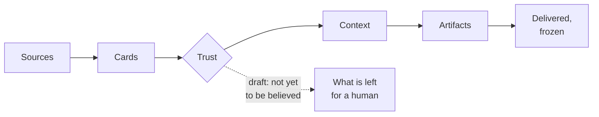

# Aurora Studio Wiki

**English** · [Русский](ru/README.md)

A knowledge base about Aurora itself: short pages that each answer one question in a screen or two and point to the
full document in [`docs/`](../docs/README.md) when you need depth. Read it on GitHub as it is — every link works in the
repository view.

> **One sentence.** Aurora turns the documents a project piles up (Confluence, Jira, contracts, meetings) into a base of
> Markdown cards where every card says how far it can be trusted, and produces analyst artifacts from that base
> without letting a model invent facts.

## Start here

| I want to… | Read |
|---|---|
| install it and see it work | [Getting started](Getting-Started.md) |
| understand the idea in five minutes | [The cycle](The-Cycle.md) → [The card](The-Card.md) → [Trust](Trust.md) |
| know which command to run | [Daily work](Daily-Work.md) |
| find out why something broke | [Troubleshooting](Troubleshooting.md) · [FAQ](FAQ.md) |
| look up a word | [Glossary](Glossary.md) |

## Concepts

| Page | Answers |
|---|---|
| [The cycle](The-Cycle.md) | What happens from a source to a delivered document, and which two buttons drive it |
| [The card](The-Card.md) | What a card is, its kinds and statuses, what is allowed to rewrite it |
| [Trust](Trust.md) | How a card becomes `knowledge` or `draft`, and why nobody approves anything |
| [Sources and mirrors](Sources-and-Mirrors.md) | How Confluence, Jira, sites and `Raw/` get into the project |
| [The agent](The-Agent.md) | The built-in agent: gateways, roles, Momus, limits |

## Using it

| Page | Answers |
|---|---|
| [Asking the base](Asking-the-Base.md) | Questions in your own words, context packs, search |
| [Assistants, MCP and skills](Assistants-MCP-and-Skills.md) | Giving the base to Claude Code, Cursor, OpenCode |
| [Artifacts and deliverables](Artifacts-and-Deliverables.md) | Writing, reviewing, exporting, publishing, freezing |
| [The control panel](The-Control-Panel.md) | A tour of the local web panel |
| [Daily work](Daily-Work.md) | The working rhythm and the situation → command map |

## Practicalities

| Page | Answers |
|---|---|
| [Troubleshooting](Troubleshooting.md) | Typical errors and what to do |
| [Windows and macOS](Windows-and-macOS.md) | What behaves differently, file names, launch files |
| [FAQ](FAQ.md) | Short answers |
| [Glossary](Glossary.md) | The words Aurora uses |
| [Contributing](Contributing.md) | Tests, releases, how to add a command, a skin, a language |

## About this wiki

The pages live in [`wiki/`](.) of the repository and are reviewed like code: a change that alters behaviour updates its
page in the same pull request. Russian pages are in [`wiki/ru/`](ru/README.md) and cover the same set. The test suite
checks that every link resolves, that both languages have the same pages, and that every page is reachable from here.
When the repository's GitHub Wiki is switched on, the workflow
[`wiki-sync`](../.github/workflows/wiki-sync.yml) publishes these pages there as well — the repository stays the single
source of truth.

Full documentation: [docs/README.md](../docs/README.md) · command reference: [commands.md](../docs/en/commands.md).
