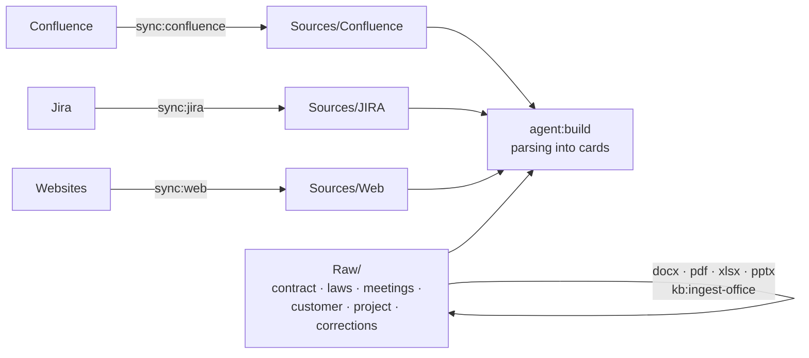

# Sources and mirrors

[Wiki home](README.md) · related: [The cycle](The-Cycle.md) · [Troubleshooting](Troubleshooting.md) · full text:
[source modules](../docs/en/connectors.md)

Aurora never reads Confluence or Jira while it builds cards. It first makes a **mirror** — a deterministic copy in
`Sources/` — and builds from that. Your own evidence lives in `Raw/`.

## Mirrors: deterministic, incremental, never edited by hand

- **The same source gives the same file, byte for byte.** Otherwise `git diff` stops being evidence and `sync:audit`
  cannot check the state. A repeated sync makes no noise in git.
- **Incremental.** A Confluence page with the same version, converter and path, and the file in place, is not
  downloaded again; once a week and with `--force` the mirror is passed in full.
- **Written only by sync.** Do not edit `Sources/` — the next sync would overwrite you; put your own words into
  `Raw/corrections/` (`kb:correct`) instead.
- **A failed sync keeps what it did not reach.** If the server timed out halfway, the pages the walk did not visit stay
  in the state, and `--prune` refuses to delete when the export had errors or the "extra" share is large.

## The bundled modules

| Module | Kind | Role | Mirror | Command |
|---|---|---|---|---|
| `confluence-dc` | wiki: folders repeat the page tree, a page with children → folder + `index.md` | documents | `Sources/Confluence/` | `sync:confluence` |
| `jira-dc` | board: a file per issue, the key is the name | tasks | `Sources/JIRA/` | `sync:jira` |
| `web` | board: a file per saved page | documents (trust per link) | `Sources/Web/` | `sync:web` |

More products (Notion, SharePoint, Confluence Cloud, YouTrack, GitLab Issues) are added as a folder in `connectors/`
with a `connector.json`; see [source modules](../docs/en/connectors.md).

## Settings and secrets

| What | Where |
|---|---|
| base URLs, spaces, `sync_roots` (page ids to walk from), project key, JQL | `aurora.config.yaml` (committed) |
| `CONFLUENCE_PERSONAL_TOKEN`, `JIRA_PERSONAL_TOKEN` (or user + password) | `.env.aurora.local` (git-ignored) |

Sync scripts talk to Confluence and Jira directly over REST. The Atlassian MCP in your editor does not help them: it
does not hand out its credentials. Check a token: `python3 .aurora/scripts/jira_export.py --limit 1`.

## Checking a mirror

| Command | Finds |
|---|---|
| `sync:audit` | `MISSING`, `ORPHAN`, `MOVED`, `COLLISION`, stale state, foreign files |
| `sync:diff` | drift — a source changed after the knowledge was built on it |
| `sync:jira-status` | issues closed while the requirement is not; work without requirements; links by mention |
| `kit:remap-sources`, `kb:repair --gone-sources` | a page moved: cards' `source:` follows it by `page_id` or document code |

## `Raw/` is evidence

Contracts, laws, meeting transcripts and customer material go into `Raw/{laws,contract,customer,project,meetings,
examples,corrections}`. By agreement it is **immutable** and counts as trusted without proof. Office formats are turned
into Markdown transcripts next to the original by `kb:ingest-office`; a scan is read by a vision model if one is
configured (there is deliberately no default model for scans — a guessed name gives a coherent fabrication).
