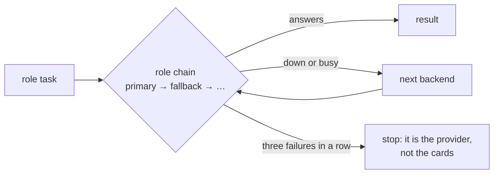

# The agent

[Wiki home](README.md) · related: [Trust](Trust.md) · [Asking the base](Asking-the-Base.md) · setup:
[INSTALL — the built-in agent](../docs/en/INSTALL.md#the-built-in-agent) · design: [architecture §4](../docs/en/architecture.md)

The built-in agent does the work that needs meaning — parsing sources into cards, writing theses, extracting
definitions, answering questions, producing artifacts. **Script first, model second:** mass operations (lint, repair,
dedupe, sync, trust, links) are deterministic scripts with a dry-run; the model only judges, and it writes only through
whitelisted engine commands.

Without configured models everything that does not need them still works.

## Roles and chains

A **provider** is any OpenAI-compatible API (a corporate gateway, cloud, local `llama.cpp` or vLLM). A **backend** is
"provider + model" in a role. Each role has its own **chain** of backends: a call goes to the first; an unavailable or
busy one is skipped, a recovered one is picked up on the next request.

| Role | Does |
|---|---|
| `worker` | routine steps: parsing, theses |
| `planner` | boundaries and plans |
| `critic` | checks a decision before it is written |
| `qa` | **Momus** — checks every claim of an answer against the source |

Reasoning ("thinking") can be switched off per role, but never for `qa` and the critic.

## Momus

A second model that reads the agent's output and the source and marks every claim either **supported** (with a quote) or
**"no support"**. Claims without support are listed for a human (`ops:todo`) and are not carried into documents.
`agent:distill --recheck` checks them again.

## One setup per kit

Models are set up **once per kit** — the panel's **"Models"** section, the file `<kit>/local/models.json`; every
project uses it, none has its own. First the **providers** (URL, key, width), then in the LLM, OCR and embeddings
tabs the **roles**, each with a chain of "provider + model" backends: the first is the primary, "+" adds a fallback,
the order changes by dragging, a fallback can be switched off. A provider can be added right from a role. Details —
[INSTALL](../docs/en/INSTALL.md#models--one-setup-per-kit).

## OCR and embeddings — the same pattern

Semantic search (`kb:embed`) and scan recognition (`kb:ingest-office`) have the same roles and chains. An
embeddings fallback uses only the same model: vectors of different models do not compare. All texts go to the
providers of the setup: if your perimeter forbids sending materials out, do not switch on semantics and scans.

## Checking the chain

| Command | Shows |
|---|---|
| `agent:ping` | every backend of the LLM chains by a live request: roles, speed; an empty answer counts as a refusal |
| `agent:probe` | "no connection", "wrong key" or "no such model"; the model list; `--why` — which layer of the request is rejected |
| `agent:width` | how many simultaneous requests each provider holds |
| `agent:pydantic` | what goes to the gateway through Pydantic AI and whether the installed version is compatible |

## Safety properties

- **One writer per project.** A writing agent run takes a lock in the project; a second one is refused with the holder's
  pid and start time. A run killed with Ctrl+C does not lock the base.
- **A checkpoint first.** Before a writing run the agent commits the current state; no git → it refuses to write.
- **A failure on one card does not stop the run;** three in a row do.
