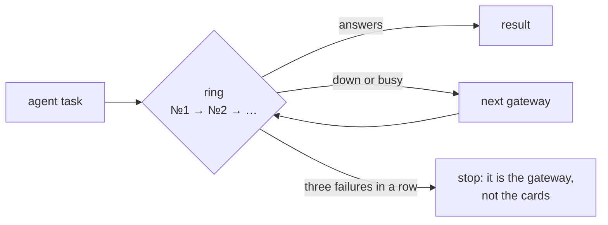

# The agent

[Wiki home](README.md) · related: [Trust](Trust.md) · [Asking the base](Asking-the-Base.md) · setup:
[INSTALL — the built-in agent](../docs/en/INSTALL.md#the-built-in-agent) · design: [architecture §4](../docs/en/architecture.md)

The built-in agent does the work that needs meaning — parsing sources into cards, writing theses, extracting
definitions, answering questions, producing artifacts. **Script first, model second:** mass operations (lint, repair,
dedupe, sync, trust, links) are deterministic scripts with a dry-run; the model only judges, and it writes only through
whitelisted engine commands.

Without a configured gateway everything that does not need a model still works.

## Gateways and roles

A **backend** is any OpenAI-compatible gateway (corporate, cloud, local `llama.cpp` or vLLM). Backends are numbered and
form a **ring**: a call goes to the first; an unavailable or busy one is skipped, a recovered one is picked up on the
next request.



| Role | Does |
|---|---|
| `worker` | routine steps: parsing, theses |
| `planner` | boundaries and plans |
| `critic` | checks a decision before it is written |
| `qa` | **Momus** — checks every claim of an answer against the source |

Reasoning ("thinking") can be switched off per role, but never for `qa` and the critic.

## Momus

A second model that reads the agent's output and the source and marks every claim either **supported** (with a quote) or
**"no support"**. Claims without support are listed for a human (`ops:todo`) and are not carried into documents.
`agent:distill --recheck` checks them again.

## Settings in one place

Set in `.env.aurora.local` (project) or the kit's own file (shared); priority **environment > project > kit**:

```bash
AURORA_AGENT_BACKEND_1_URL=https://llm.example.com/v1
AURORA_AGENT_BACKEND_1_KEY=<key>
AURORA_AGENT_BACKEND_1_MODEL_WORKER=<model for routine steps>
AURORA_AGENT_BACKEND_1_MODEL_QA=<Momus model>
AURORA_AGENT_BACKEND_2_URL=http://<local-server>:8081/v1      # a spare
AURORA_AGENT_BACKEND_2_MODEL=<one model for all roles>
```

Per-gateway knobs (`…_CONTEXT`, `…_PARALLEL`, `…_FALLBACK`, `…_WIDTH`, `…_TEMPLATE_KWARGS`) and run-wide ones
(`AURORA_AGENT_PARALLEL`, `AURORA_AGENT_THINKING`, `AURORA_AGENT_BUDGET_MIN`, `AURORA_AGENT_REQUEST_TIMEOUT`) are
listed in the [INSTALL table](../docs/en/INSTALL.md#llm-gateways). The panel's **Project settings** has the same form.

## Vectors and scans have their own rings

Semantic search (`kb:embed`) and scan recognition (`kb:ingest-office`) use their own models (`AURORA_EMBED_*`,
`AURORA_OCR_*`). The chat, vector and recognition rings are independent. All texts go to the same gateway as the agent:
if your perimeter forbids sending materials out, do not switch on semantics and scans.

## Checking the chain

| Command | Shows |
|---|---|
| `agent:ping` | every backend by a live request: roles, speed; an empty answer counts as a refusal |
| `agent:probe` | "no connection", "wrong key" or "no such model"; the model list; `--why` — which layer of the request is rejected |
| `agent:width` | how many simultaneous requests each gateway holds |
| `agent:pydantic` | what goes to the gateway through Pydantic AI and whether the installed version is compatible |

## Safety properties

- **One writer per project.** A writing agent run takes a lock in the project; a second one is refused with the holder's
  pid and start time. A run killed with Ctrl+C does not lock the base.
- **A checkpoint first.** Before a writing run the agent commits the current state; no git → it refuses to write.
- **A failure on one card does not stop the run;** three in a row do.
