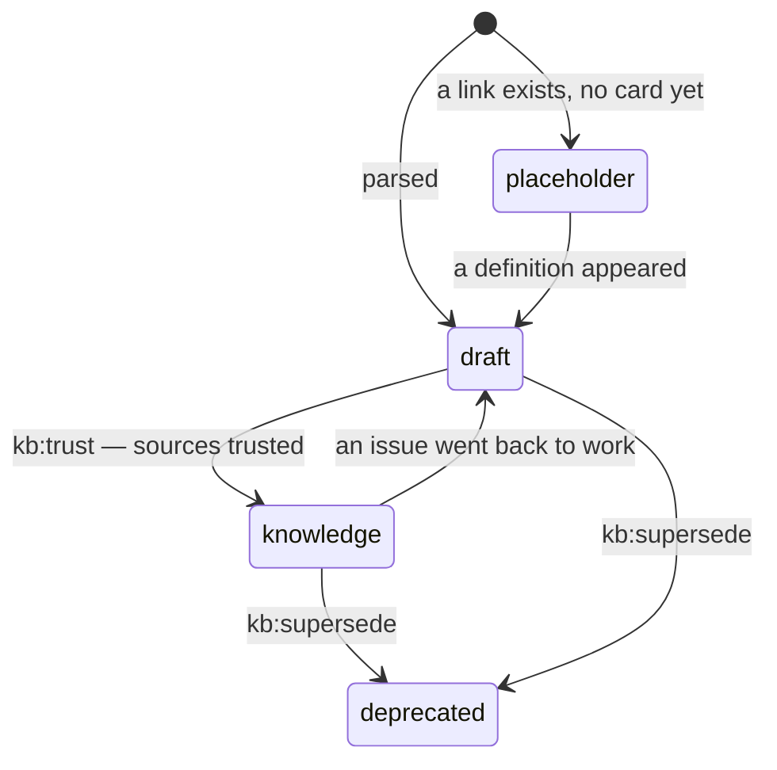

# The card

[Wiki home](README.md) · related: [Trust](Trust.md) · [Glossary](Glossary.md) · full rules: [knowledge rules](../docs/en/knowledge-rules.md)

A **card** is one Markdown file in `AuroraKnowledgeDB/` that holds the knowledge about **one entity** — a concept, a
process, a system, a role, a status, a requirement. It is not a summary of a document: five documents about one subject
feed one card, and a side explanation inside a card is moved out into its own card and left as a link.

## Anatomy

```markdown
---
title: "Refund"
aliases: ["Return of payment"]
type: concept
status: draft
kind: knowledge
sources:
  - "Sources/Confluence/Payments/Refund.md"
built: machine
created: 2026-09-01
updated: 2026-09-01
related: ["Payment", "Chargeback"]
---

A refund returns money to the payer within ten days of a request. …   ← the thesis, written by the model

## Source (carried over verbatim)

…the original text, moved by a script, never retold…

## Change history

- 2026-09-01: card created
```

| Part | Meaning |
|---|---|
| `title`, `aliases` | The name and the other names that lead to the card; links use the file name |
| `type` | The kind of thing, tied to the section folder: `Concepts` → `concept`, `Processes` → `process`, `Glossary` → `glossary`, `Systems` → `system`, `Roles` → `role`, `Statuses` → `status-model`, `Reference` → `reference`, `Requirements` → `requirement`, `Specs` → `spec`, `Decisions` → `decision`, `Questions` → `question` |
| `status` | The trust class — see below. Computed by the engine, not typed by a human |
| `kind` | Who is allowed to touch the body — see below |
| `sources` | Where the knowledge came from (a mirror path or a `Raw/` file) |
| `built: machine` | The engine's mark. Its **absence** means "origin unknown", not "written by a human" |
| `related`, `[[links]]` | The card's links: a card without any is a lint error |
| thesis + "Source" + history | The thesis is a short claim; the verbatim source sits under it; the history footer is never overwritten |

## Three kinds — the kind decides who edits the body

| `kind` | What it is | Who writes the body |
|---|---|---|
| `dictionary` | A reference list, carried over whole | nobody retells it; the model gives only a name and a summary |
| `document` | Verbatim text of a document | a script carries it; never rewritten |
| `knowledge` | An entity the model has understood | the model writes a **thesis**, the verbatim source goes under it, Momus checks the thesis |

The kind is stronger than the status: a trusted dictionary still must not be retold.

## Five statuses

| `status` | Meaning |
|---|---|
| `knowledge` | A fact: every linked Jira issue is in a trusted status, or the source is a signed document in `Raw/` |
| `draft` | Not yet confirmed — enters context only with a loud header and a stated reason |
| `placeholder` | A stub: a link names the concept but there is no knowledge yet; excluded from search and context |
| `index` | Service cards: maps of content and tables |
| `deprecated` | Replaced; kept for history in `_archive/` |



## Rules worth remembering

- **A card is an entity.** If you find two cards about one thing, `kb:twins` / `agent:twins` bring them together —
  the model decides, not a human.
- **Links are mandatory.** A card nobody can reach is on disk but not in the base (`kb:links --cards`, `kb:moc`).
- **The engine does not rewrite what it did not write.** Dictionary and document bodies, the history footer and the
  previous thesis are kept.
- **File names must pass on Windows, macOS and Linux** — no `< > : " / \ | ? *`, not `CON`/`NUL`, up to 255 bytes. The
  check is `kit:doctor`; the fix is `kb:names`. → [Windows and macOS](Windows-and-macOS.md)

Deeper: [knowledge rules](../docs/en/knowledge-rules.md) · [one-page summary](../docs/en/knowledge-rules-tldr.md) ·
[the path of one card](../docs/en/lifecycle.md#3-the-path-of-one-card).
