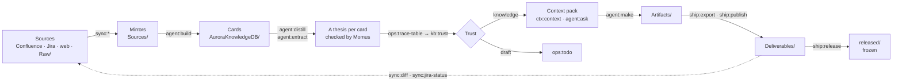

# The cycle

[Wiki home](README.md) · next: [The card](The-Card.md) · full map: [lifecycle](../docs/en/lifecycle.md)

One Aurora lap: **source → mirror → card → trust → artifact → outward → feedback**. Every arrow is a named engine
command, not a wish.

## Two buttons

The routine work is two routes in the panel's **Routines** section. A route stops only when a step ends with code 2 or
higher; code 1 ("worked and found things to fix") is the normal state of a living base.

| Button | Looks | Does |
|---|---|---|
| **Update the base** | outward | syncs the mirrors, parses sources in batches, writes theses, extracts others' definitions, links, computes trust, commits every lap |
| **Fix the base** | inward | repairs links, merges duplicates, rebuilds maps and tables of contents, checks the schema, reviews quality; never goes to the sources |

There is a third, dangerous and rare: **Rebuild the base from scratch**. "Preview" runs any route without writing.

**A run is cut into complete laps.** Every lap adds finished knowledge, not stubs: parse a batch, write theses, link,
count trust, commit — and again. Switch it off in the middle of the night and what was parsed stays valid. (It used to
run phases over the whole base, and a stop in the middle left cards without kinds, theses and links.)

## Three marks that stop work from being done twice

| Mark | Question it answers |
|---|---|
| a page version / an issue's `updated` (in the sync state) | "download again?" |
| the source's hash (`meta/manifest.json`) | "parse again?" |
| `source_synced` in a card | "did the source change under already-parsed knowledge?" |

## What happens when something changes

| What changed | What the engine does |
|---|---|
| a source's text | returns it to the plan, replaces in the card **only** the carried-over text, writes a new thesis; the previous one goes into the history |
| an issue's status | rewrites nothing; changes the trust class at the nearest `kb:trust` |
| a card outgrew the model's window | the planner proposes boundaries, the engine cuts, the parts get linked, the original becomes a document map |
| a page moved | `kit:remap-sources` and `kb:repair --gone-sources` find it by `page_id` or document code |

## The working rhythm

| When | What |
|---|---|
| every day, ten minutes | "Update the base", then `sync:audit` → `sync:diff` → `ops:stats` |
| weekly | "Fix the base" → `ops:todo` → `kb:garden` |
| monthly | `kb:moc --suggest`, `ops:search-quality`, `ops:gaps` |
| an artifact is ready | `make:review` → `ship:export` → `ship:publish` → `ship:release` |

Deeper: [the path of one card, step by step](../docs/en/lifecycle.md#3-the-path-of-one-card) ·
[where it breaks most often](../docs/en/lifecycle.md#8-where-it-breaks-most-often).
