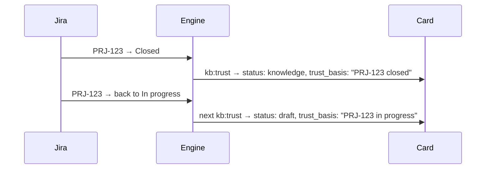

# Trust

[Wiki home](README.md) · related: [The card](The-Card.md) · [Asking the base](Asking-the-Base.md) · full rules:
[knowledge rules](../docs/en/knowledge-rules.md)

**Trust is computed, never assigned.** Nobody "approves" a card. A card's status follows from facts the engine can
check: the statuses of the Jira issues behind its source, and where the source lives.

## How a card becomes `knowledge`

A card's source — a Confluence page, a file in `Raw/` — gets a **class**; the card inherits it.

| The source is… | The class is… |
|---|---|
| a signed document in `Raw/` (contract, law, customer material) | trusted |
| a Confluence section ticked "trust" in the import settings (logical model, data formats), or listed as a trusted branch | trusted |
| a reference list | trusted |
| a page linked to Jira issues | trusted **only if every linked issue is in a trusted status** (`trust_statuses`) — the weakest link decides |
| an algorithm, a contract, a form | by the stories they implement, one hop at a time |
| anything else, or no links found | draft |

Trusted source → `status: knowledge`. Otherwise `status: draft`, and the card says **why** in `trust_basis`
("PRJ-123 is in progress").

Nothing is rewritten when a status changes — only the trust class, at the nearest `kb:trust`. The route
"Update the base" runs `ops:trace-table` and `kb:trust` itself.

## The two lists in the config

`aurora.config.yaml` → `atlassian.jira`:

- `trust_statuses` — issue statuses that make a linked card `knowledge`;
- `assumption_statuses` — statuses that keep it `draft`.

An empty list means the defaults. Tuning them is the most common reason a base looks "less trusted" than it should.

## What the trust header looks like in an answer

Every card enters a context pack with a **trust header and a basis** — not the bare word "draft" but "PRJ-123 in
progress". The agent's answer is then checked by **Momus**: every claim has either a quote that supports it or the
mark "no support". A claim without support is not carried into a document even if it looks reasonable — that is how a
guess becomes a requirement. → [The agent](The-Agent.md)

## Frequently misunderstood

- **A low share of `knowledge` is not an emergency.** Either the issues are still in progress, or no links to them were
  found. The second is cured by tracing (`ops:trace-table`), not by changing statuses.
- **A draft is not forbidden, it is labelled.** In generation mode a pack contains only trusted knowledge; in other modes
  drafts come with a loud header. While the share of `knowledge` is below the `bootstrap` threshold, drafts are admitted
  with that header so a young base is still usable.
- **An artifact is never knowledge.** A document the model produced is stored in `Artifacts/` and is never read back as a
  fact; only cards are. That is what stops a model-written draft from becoming "truth" on the next run.
- **What a human does:** writes what the sources lack (decisions, questions to the customer, own reference lists),
  resolves the disputed (duplicates the machine did not dare merge, claims Momus marked "no support") — and does not
  assign trust.

Related commands: `ops:trace-table`, `kb:trust`, `ops:trace`, `sync:jira-status`, `ops:todo` — see
[Daily work](Daily-Work.md).
