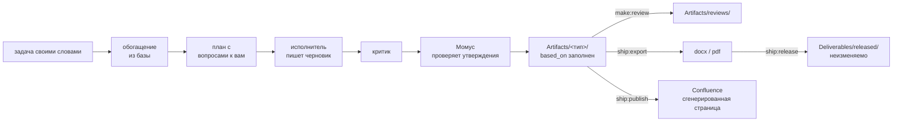

# Артефакты и поставка

[Wiki](README.md) · см. также: [Спросить базу](Asking-the-Base.md) · [Доверие](Trust.md) · команды:
[практика](../../docs/readme/04-practice.md#производство-артефактов)

**Артефакт** — документ, который делает аналитик или агент: пользовательская история, критерии приёмки, алгоритм,
спецификация, рецензия. Он лежит в `Artifacts/<тип>/` и **никогда не становится знанием**: его не читают обратно как факт.
Фактом бывают только карточки. **Поставка** — артефакт, который собран и передан наружу.

## Произвести

| Что сделать | Команда | Примечания |
|---|---|---|
| Написать историю, критерии, алгоритм, спецификацию | `agent:make` (панель: **Производство** → тип → задача) | этапы отмечаются в шапке файла, поэтому после обрыва работа продолжается с того же места |
| Узнать, какой шаблон и куда | `make:kinds` | реестр видов артефактов проекта: шаблон, папка, промпт, правило «без технологий», граница итогового текста |
| Собрать спецификацию из требований | `make:spec <тема>` | `SPEC-NNN`, статус `draft`, полный `based_on` |
| Передать спецификацию подрядчику | `make:spec-pack <SPEC-NNN>` | самодостаточный пакет: основания, решения, аббревиатуры, риски передачи |
| Проверить реализацию подрядчика | `make:validate <SPEC> <объект>` | покрыто / противоречит / не реализовано — по сценариям |
| Собрать ОПЗ, ПМИ или руководство пользователя | `make:assemble <документ>` | документ из базы по шаблону |

Задачу пишите своими словами; понимаются `@путь`, `/скилл`, `@сервер` и вложения (хранятся две недели). У каждого артефакта
есть **`based_on`** — карточки, на которых он стоит, — поэтому видно, что пересмотреть, когда знание изменилось
(`ops:impact --explain <документ>`).

## Проверить

| Что сделать | Команда |
|---|---|
| Сверить историю или критерии с базой | `make:review <объект>` — вердикт и замечания с цитатами карточек, которым текст противоречит |
| Проверить без человека по закрытому чек-листу | `make:review-auto` — три прогона модели голосуют по каждому вопросу, счёт считает скрипт; есть `--page`, `--cql`, пакетный режим |

## Наружу

| Что сделать | Команда | Результат |
|---|---|---|
| Офисный формат | `ship:export <файл>` | docx или pdf через `pandoc` (должен быть установлен) |
| Опубликовать | `ship:publish <файл>` | *сгенерированная* страница в Confluence; производственная кухня — всё ниже маркера — наружу не уходит |
| Заморозить сданное | `ship:release <документ>` | неизменяемый снимок в `Deliverables/released/` и коммит базы |
| Приёмка | `ship:acceptance <объект>` | отчёт; замечания заказчика разложены на дефект / требование / вопрос / несогласие |

**`released/` неизменяема.** Редактор панели открывает её только для чтения. Без заморозки нельзя доказать, что именно вы
сдали. Черновики лежат в `Deliverables/work/`; пакеты поставки и снятые с работы версии — в `Deliverables/_archive/`.

## Трассировка

`ops:trace` идёт по цепочке от пункта ТЗ заказчика → требование → спецификация → задача Jira → критерии → приёмка и
показывает, где она порвана. `sync:jira-status` по статусам задач предлагает, какие требования стали `implemented`.
→ [Повседневная работа](Daily-Work.md)
