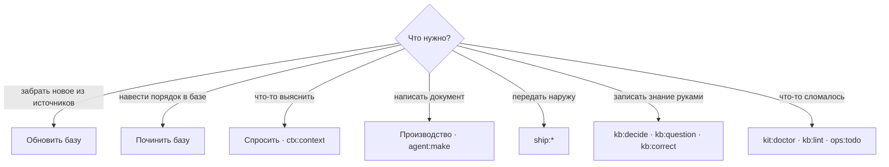

# Повседневная работа

[Wiki](README.md) · см. также: [Цикл](The-Cycle.md) · [Если что-то не так](Troubleshooting.md) · полная таблица:
[Практика: ситуация → команда](../../docs/readme/04-practice.md) · все команды: [справочник команд](../../docs/commands.md)

Одну и ту же команду можно запустить тремя способами, и имя везде одно (`kb:repair`, `ctx:context`, `agent:make`):

1. **кнопка в панели** — путь по умолчанию;
2. **терминал** — `python3 aurora.py <глагол> <проект> [флаги]` или скрипт из `.aurora/scripts/`;
3. **ассистент** — `/aurora-vault <команда>`, для процедур, где нужен смысл.

## Ритм

| Когда | Что | Как |
|---|---|---|
| каждый день, десять минут | забрать новое, увидеть, что разошлось | **Обновить базу** → `sync:audit` → `sync:diff` → `ops:stats` |
| после каждой синхронизации | доверие | `ops:trace-table` → `kb:trust` (маршрут делает это сам) |
| раз в неделю | гигиена | **Починить базу** → `ops:todo` → `kb:garden` |
| раз в месяц | навигация и качество | `kb:moc --suggest`, `ops:search-quality`, `ops:gaps` |
| идёт разработка | трассировка | `sync:jira-status` → `ops:trace` → `make:spec-pack` |
| артефакт готов | наружу | `make:review` → `ship:export` → `ship:publish` → `ship:release` |

## Три вида команд

| Вид | Примеры | Правило |
|---|---|---|
| **Наблюдение** | `ops:stats`, `kb:lint`, `ops:impact`, `ops:trace`, `sync:audit`, `sync:diff`, `kb:schema`, `kb:scrub`, `kit:doctor` | запускайте свободно: они ничего не меняют |
| **Запись** | всё с `--apply`: `kb:repair`, `kb:supersede`, `kb:index`, `ship:release`, `kit:update`, задачи агента | без флага вы получаете **предпросмотр** — читайте его всегда: массовая правка — то, что потом часами разбирают в `git diff` |
| **Наружу** | `sync:*`, `ship:publish`, `ship:export` | нужны сеть и токен; меняют внешние системы |

## Какую команду, когда

## Что человек делает на самом деле

Почти ничего из того, что раньше делалось руками: вы не утверждаете карточки, не выставляете доверие и не правите связи
вручную. Остаётся:

- **написать то, чего нет в источниках** — Decision Records (`kb:decide`), вопросы заказчику (`kb:question`, закрываются
  `kb:answer`), собственные справочные списки, поправки (`kb:correct`), когда карточка неверна;
- **разобрать спорное** — дубли, которые машина не решилась склеить, карточки без связей с задачами, утверждения, которые
  Момус пометил «без опоры» (`ops:todo` перечисляет их с причиной, по которой это не кнопка);
- **нажать две кнопки** — «Обновить» и «Починить».

## Короткие рецепты

| Ситуация | Команда |
|---|---|
| Карточка неверна | `kb:correct --new "Запрос" --text "…"` — поправка в `Raw/corrections/`, применяется при каждой сборке |
| Два файла говорят одно | `kb:dedupe`, `kb:twins`, `agent:twins` |
| Карточка раздулась | `kb:split` |
| Карточка устарела, есть замена | `kb:supersede <карточка>` |
| Кто опирается на эту карточку | `ops:impact <карточка>` |
| Схема карточки изменилась с версией кита | `kb:schema` |
| Имена файлов не проходят на Windows или macOS | `kb:names` |
| Обновить движок проекта | `kit:update` (предпросмотр), затем `--apply` |
| Не помню, какие бывают команды | `kit:list` |
