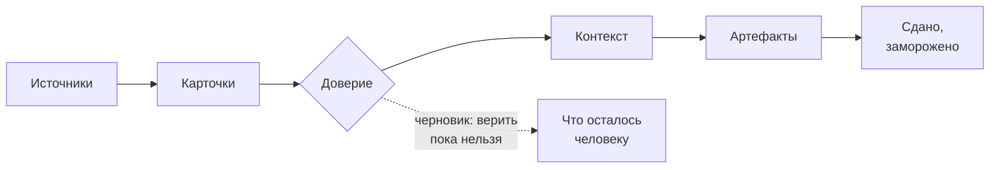

# Wiki Aurora Studio

[English](../README.md) · **Русский**

База знаний о самой Авроре: короткие страницы, каждая отвечает на один вопрос за экран-два и отсылает к полному
документу в [`docs/`](../../docs/README.md), когда нужна глубина. Читайте прямо на GitHub — все ссылки работают в
просмотре репозитория.

> **В одной фразе.** Аврора превращает документы, которые копятся в проекте (Confluence, Jira, договоры, встречи), в базу
> Markdown-карточек, где каждая карточка говорит, насколько ей можно верить, и делает из этой базы артефакты аналитика,
> не давая модели выдумывать факты.

## С чего начать

| Я хочу… | Читать |
|---|---|
| поставить и увидеть работу | [Быстрый старт](Getting-Started.md) |
| понять идею за пять минут | [Цикл](The-Cycle.md) → [Карточка](The-Card.md) → [Доверие](Trust.md) |
| знать, какую команду запустить | [Повседневная работа](Daily-Work.md) |
| выяснить, почему сломалось | [Если что-то не так](Troubleshooting.md) · [Частые вопросы](FAQ.md) |
| посмотреть слово | [Словарь](Glossary.md) |

## Понятия

| Страница | Отвечает |
|---|---|
| [Цикл](The-Cycle.md) | Что происходит от источника до сданного документа и какие две кнопки этим управляют |
| [Карточка](The-Card.md) | Что такое карточка, её типы и статусы, кому можно её переписывать |
| [Доверие](Trust.md) | Как карточка становится `knowledge` или `draft` и почему никто ничего не утверждает |
| [Источники и зеркала](Sources-and-Mirrors.md) | Как Confluence, Jira, сайты и `Raw/` попадают в проект |
| [Агент](The-Agent.md) | Встроенный агент: шлюзы, роли, Момус, ограничения |

## Как пользоваться

| Страница | Отвечает |
|---|---|
| [Спросить базу](Asking-the-Base.md) | Вопросы своими словами, пакеты контекста, поиск |
| [Ассистенты, MCP и скиллы](Assistants-MCP-and-Skills.md) | Как отдать базу Claude Code, Cursor, OpenCode |
| [Артефакты и поставка](Artifacts-and-Deliverables.md) | Написать, проверить, выгрузить, опубликовать, заморозить |
| [Панель управления](The-Control-Panel.md) | Обзор локальной веб-панели |
| [Повседневная работа](Daily-Work.md) | Рабочий ритм и карта «ситуация → команда» |

## На практике

| Страница | Отвечает |
|---|---|
| [Если что-то не так](Troubleshooting.md) | Типовые ошибки и что делать |
| [Windows и macOS](Windows-and-macOS.md) | Что ведёт себя иначе, имена файлов, файлы запуска |
| [Частые вопросы](FAQ.md) | Короткие ответы |
| [Словарь](Glossary.md) | Слова, которыми говорит Аврора |
| [Участие в разработке](Contributing.md) | Тесты, выпуски, как добавить команду, скин, язык |

## Об этой wiki

Страницы лежат в [`wiki/`](..) репозитория и ревьюятся как код: изменение, меняющее поведение, обновляет свою страницу в
том же pull request. Английские страницы — в [`wiki/`](../README.md), русские — здесь, набор один и тот же. Тесты
проверяют, что все ссылки ведут куда надо, что в обоих языках одни и те же страницы и что каждая страница достижима
отсюда. Когда у репозитория включена GitHub Wiki, workflow [`wiki-sync`](../../.github/workflows/wiki-sync.yml)
публикует эти страницы и там — источником истины остаётся репозиторий.

Вся документация: [docs/README.md](../../docs/README.md) · справочник команд: [commands.md](../../docs/commands.md).
