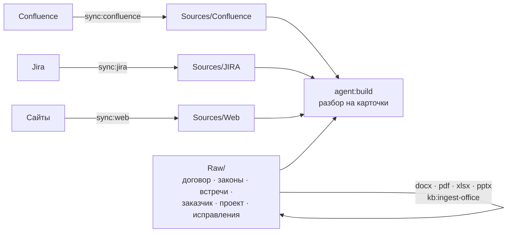

# Источники и зеркала

[Wiki](README.md) · см. также: [Цикл](The-Cycle.md) · [Если что-то не так](Troubleshooting.md) · полный текст:
[модули источников](../../docs/connectors.md)

Аврора никогда не читает Confluence или Jira, пока строит карточки. Сначала она делает **зеркало** — детерминированную
копию в `Sources/` — и строит из неё. Ваши собственные доказательства лежат в `Raw/`.

## Зеркала: детерминированные, инкрементальные, руками не правятся

- **Один источник даёт один и тот же файл, байт в байт.** Иначе `git diff` перестаёт быть доказательством, а `sync:audit` не
  может сверить состояние. Повторный синк не создаёт шума в git.
- **Инкрементальные.** Страница Confluence с той же версией, конвертером и путём и файлом на месте не скачивается заново; раз
  в неделю и с `--force` зеркало проходится целиком.
- **Пишет только синк.** `Sources/` не правят — следующий синк перезапишет; свои слова кладите в `Raw/corrections/`
  (`kb:correct`).
- **Синк со сбоями хранит то, до чего не дошёл.** Если сервер ответил таймаутами посреди обхода, непосещённые страницы
  остаются в состоянии, а `--prune` отказывается удалять, когда в выгрузке были ошибки или «лишнего» много.

## Встроенные модули

| Модуль | Вид | Роль | Зеркало | Команда |
|---|---|---|---|---|
| `confluence-dc` | wiki: папки повторяют дерево страниц, страница с детьми → папка + `index.md` | документы | `Sources/Confluence/` | `sync:confluence` |
| `jira-dc` | board: файл на задачу, имя — ключ | задачи | `Sources/JIRA/` | `sync:jira` |
| `web` | board: файл на сохранённую страницу | документы (доверие по ссылке) | `Sources/Web/` | `sync:web` |

Другие продукты (Notion, SharePoint, Confluence Cloud, YouTrack, GitLab Issues) добавляются папкой в `connectors/` с
`connector.json`; см. [модули источников](../../docs/connectors.md).

## Настройки и секреты

| Что | Где |
|---|---|
| адреса, пространства, `sync_roots` (с каких страниц идти), ключ проекта, JQL | `aurora.config.yaml` (в git) |
| `CONFLUENCE_PERSONAL_TOKEN`, `JIRA_PERSONAL_TOKEN` (или пользователь + пароль) | `.env.aurora.local` (вне git) |

Скрипты синка ходят в Confluence и Jira напрямую по REST. MCP Atlassian в вашем редакторе им не помогает: он не отдаёт свои
учётные данные. Проверить токен: `python3 .opencode/scripts/jira_export.py --limit 1`.

## Как проверить зеркало

| Команда | Находит |
|---|---|
| `sync:audit` | `MISSING`, `ORPHAN`, `MOVED`, `COLLISION`, устаревшее состояние, чужие файлы |
| `sync:diff` | дрейф — источник изменился после того, как на нём построили знание |
| `sync:jira-status` | задачи закрыты, а требование нет; работа без требований; связи по упоминанию |
| `kit:remap-sources`, `kb:repair --gone-sources` | страница переехала: `source:` карточек следует за ней по `page_id` или коду документа |

## `Raw/` — это доказательства

Договоры, законы, стенограммы встреч и материалы заказчика кладут в `Raw/{laws,contract,customer,project,meetings,
examples,corrections}`. По договорённости он **неизменяем** и считается доверенным без доказательств. Офисные форматы
превращаются в Markdown-расшифровки рядом с оригиналом командой `kb:ingest-office`; скан читает зрячая модель, если она
настроена (модели для сканов по умолчанию нарочно нет — угаданное имя даёт связную выдумку).
