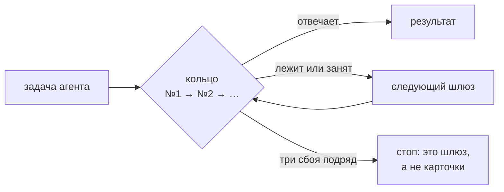

# Агент

[Wiki](README.md) · см. также: [Доверие](Trust.md) · [Спросить базу](Asking-the-Base.md) · настройка:
[INSTALL — встроенный агент](../../docs/INSTALL.md) · устройство: [architecture, раздел 4](../../docs/architecture.md)

Встроенный агент делает работу, которой нужен смысл: разбирает источники на карточки, пишет тезисы, выносит определения,
отвечает на вопросы, производит артефакты. **Сначала скрипт, потом модель:** массовые операции (линт, ремонт, поиск
двойников, синк, доверие, связи) — детерминированные скрипты с dry-run; модель только судит и пишет лишь через команды
движка из белого списка.

Без настроенного шлюза всё, что не требует модели, продолжает работать.

## Шлюзы и роли

**Бэкенд** — любой OpenAI-совместимый шлюз (корпоративный, облачный, локальный `llama.cpp` или vLLM). Бэкенды пронумерованы
и образуют **кольцо**: вызов идёт с первого; недоступный или занятый пропускается, ожившего подхватывают со следующего
запроса.



| Роль | Делает |
|---|---|
| `worker` | рутинные шаги: разбор, тезисы |
| `planner` | границы и планы |
| `critic` | проверяет решение до записи |
| `qa` | **Момус** — сверяет каждое утверждение ответа с источником |

Рассуждения («thinking») можно отключить по ролям, но никогда — для `qa` и критика.

## Момус

Вторая модель, которая читает вывод агента и источник и помечает каждое утверждение либо **с опорой** (с цитатой), либо
**«без опоры»**. Утверждения без опоры попадают в список человеку (`ops:todo`) и не переносятся в документы.
`agent:distill --recheck` проверяет их заново.

## Настройки в одном месте

Задаются в `.env.aurora.local` (проект) или в файле самого кита (общий); приоритет **окружение > проект > кит**:

```bash
AURORA_AGENT_BACKEND_1_URL=https://llm.example.com/v1
AURORA_AGENT_BACKEND_1_KEY=<ключ>
AURORA_AGENT_BACKEND_1_MODEL_WORKER=<модель для рутинных шагов>
AURORA_AGENT_BACKEND_1_MODEL_QA=<модель Момуса>
AURORA_AGENT_BACKEND_2_URL=http://<локальный-сервер>:8081/v1      # запасной
AURORA_AGENT_BACKEND_2_MODEL=<одна модель на все роли>
```

Настройки шлюза (`…_CONTEXT`, `…_PARALLEL`, `…_FALLBACK`, `…_WIDTH`, `…_TEMPLATE_KWARGS`) и прогона в целом
(`AURORA_AGENT_PARALLEL`, `AURORA_AGENT_THINKING`, `AURORA_AGENT_BUDGET_MIN`, `AURORA_AGENT_REQUEST_TIMEOUT`) перечислены в
[таблице INSTALL](../../docs/INSTALL.md). Та же форма есть в разделе панели **Настройки проекта**.

## У векторов и сканов свои кольца

Семантический поиск (`kb:embed`) и распознавание сканов (`kb:ingest-office`) используют свои модели (`AURORA_EMBED_*`,
`AURORA_OCR_*`). Кольца чата, векторов и распознавания независимы. Все тексты уходят на тот же шлюз, что и у агента: если
контур запрещает отправлять материалы наружу, не включайте семантику и сканы.

## Проверка цепочки

| Команда | Показывает |
|---|---|
| `agent:ping` | каждый бэкенд живым запросом: роли, скорость; пустой ответ считается отказом |
| `agent:probe` | «нет связи», «ключ не тот» или «нет такой модели»; список моделей; `--why` — какой слой запроса шлюз не принимает |
| `agent:width` | сколько одновременных запросов держит каждый шлюз |
| `agent:pydantic` | что уходит в шлюз через Pydantic AI и прошла ли установленная версия проверку совместимости |

## Свойства безопасности

- **Один пишущий на проект.** Пишущий прогон агента берёт замок в проекте; второй получает отказ с pid держателя и временем
  старта. Прогон, убитый по Ctrl+C, базу не запирает.
- **Сначала чекпойнт.** Перед пишущим прогоном агент фиксирует текущее состояние; нет git — писать откажется.
- **Сбой на одной карточке прогон не останавливает;** три подряд — останавливают.
