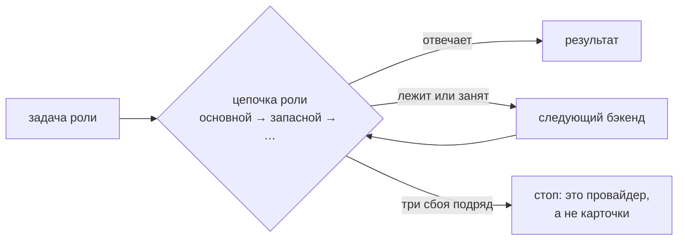

# Агент

[Wiki](README.md) · см. также: [Доверие](Trust.md) · [Спросить базу](Asking-the-Base.md) · настройка:
[INSTALL — встроенный агент](../../docs/INSTALL.md) · устройство: [architecture, раздел 4](../../docs/architecture.md)

Встроенный агент делает работу, которой нужен смысл: разбирает источники на карточки, пишет тезисы, выносит определения,
отвечает на вопросы, производит артефакты. **Сначала скрипт, потом модель:** массовые операции (линт, ремонт, поиск
двойников, синк, доверие, связи) — детерминированные скрипты с dry-run; модель только судит и пишет лишь через команды
движка из белого списка.

Без настроенных моделей всё, что их не требует, продолжает работать.

## Роли и цепочки

**Провайдер** — любой OpenAI-совместимый API (корпоративный шлюз, облако, локальный `llama.cpp` или vLLM). **Бэкенд** —
«провайдер + модель» в роли. У каждой роли своя **цепочка** бэкендов: вызов идёт с первого; недоступный или занятый
пропускается, ожившего подхватывают со следующего запроса.

| Роль | Делает |
|---|---|
| `worker` | рутинные шаги: разбор, тезисы |
| `planner` | границы и планы |
| `critic` | проверяет решение до записи |
| `qa` | **Момус** — сверяет каждое утверждение ответа с источником |

Рассуждения («thinking») можно отключить по ролям, но никогда — для `qa` и критика.

## Момус

Вторая модель, которая читает вывод агента и источник и помечает каждое утверждение либо **с опорой** (с цитатой), либо
**«без опоры»**. Утверждения без опоры попадают в список человеку (`ops:todo`) и не переносятся в документы.
`agent:distill --recheck` проверяет их заново.

## Настройка одна на кит

Модели настраиваются **один раз на кит** — раздел панели **«Модели»**, файл `<кит>/local/models.json`; все проекты
работают ею, своей у проекта нет. Сначала **провайдеры** (адрес, ключ, ширина), потом во вкладках LLM, OCR и
эмбеддингов — **роли**, и у каждой цепочка бэкендов «провайдер + модель»: первый основной, «+» добавляет запасной,
порядок меняется перетаскиванием, запасной можно выключить. Провайдера можно завести прямо из роли. Подробно —
[INSTALL](../../docs/INSTALL.md#встроенный-агент).

## OCR и эмбеддинги — тот же порядок

Семантический поиск (`kb:embed`) и распознавание сканов (`kb:ingest-office`) — те же роли и цепочки. Запасной
эмбеддингов — только той же модели: векторы разных моделей несравнимы. Все тексты уходят провайдерам из настройки:
если контур запрещает отправлять материалы наружу, не включайте семантику и сканы.

## Проверка цепочки

| Команда | Показывает |
|---|---|
| `agent:ping` | каждый бэкенд цепочек LLM живым запросом: роли, скорость; пустой ответ считается отказом |
| `agent:probe` | «нет связи», «ключ не тот» или «нет такой модели»; список моделей; `--why` — какой слой запроса шлюз не принимает |
| `agent:width` | сколько одновременных запросов держит каждый провайдер |
| `agent:pydantic` | что уходит в шлюз через Pydantic AI и прошла ли установленная версия проверку совместимости |

## Свойства безопасности

- **Один пишущий на проект.** Пишущий прогон агента берёт замок в проекте; второй получает отказ с pid держателя и временем
  старта. Прогон, убитый по Ctrl+C, базу не запирает.
- **Сначала чекпойнт.** Перед пишущим прогоном агент фиксирует текущее состояние; нет git — писать откажется.
- **Сбой на одной карточке прогон не останавливает;** три подряд — останавливают.
